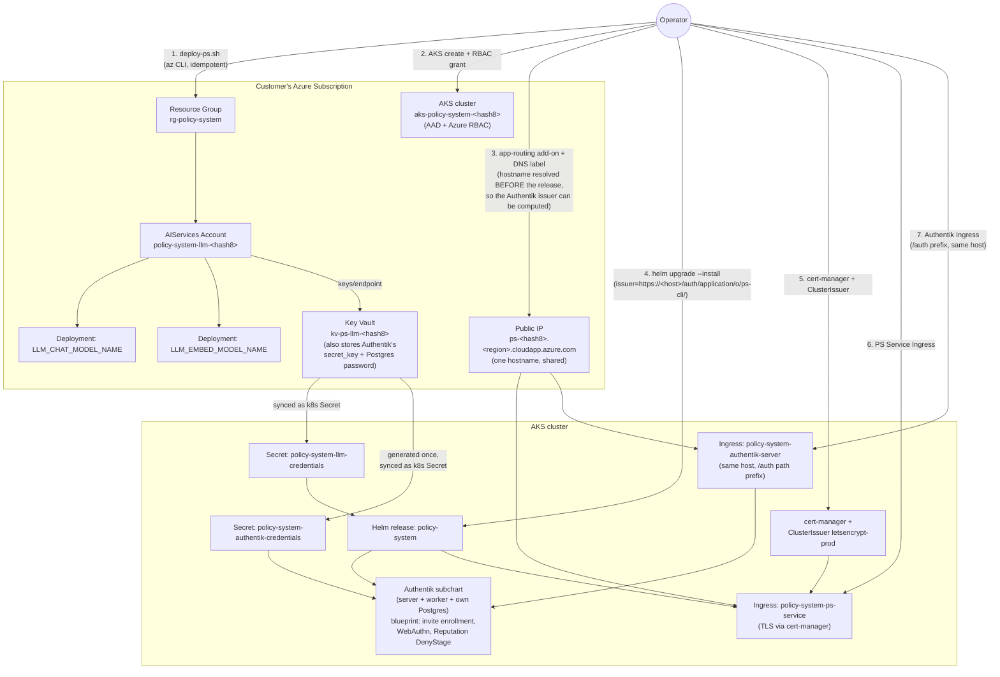

<!-- © 2026 Cartman ApS. All rights reserved. -->
# Policy System - Customer-Managed Azure Production Deployment - Architecture

**Status:** Shipped
**Container:** Deployment Tooling (`scripts/`, `charts/policy-system`)

---

## Table of Contents

1. [Overview](#overview)
2. [Threat Model & Scope](#threat-model--scope)
3. [Flow](#flow)
4. [Components](#components)
   - [deploy-ps.sh](#deploy-pssh)
     - [Configuration](#configuration)
     - [Authentik](#authentik)
     - [AKS cluster](#aks-cluster)
     - [Helm release and chart hardening profile](#helm-release-and-chart-hardening-profile)
     - [Public exposure and TLS](#public-exposure-and-tls)
     - [`--rotate-key`](#--rotate-key)
     - [`--rotate-authentik-secrets`](#--rotate-authentik-secrets)
5. [Naming & Idempotency](#naming--idempotency)
6. [Region Selection & Quota](#region-selection--quota)
7. [Security & Permission Model](#security--permission-model)
8. [Out of Scope](#out-of-scope)
9. [Open Risks & Follow-ups](#open-risks--follow-ups)

---

## Overview

`docs/architecture/customer-azure-llm-bootstrap.md` describes the Local Test path: a single
evaluator standing up just the LLM backend (`scripts/deploy-llm.sh`) for a local `kind` cluster.
This document describes the separate, production/customer-tenant path: `scripts/deploy-ps.sh`,
which provisions a **complete**, internet-reachable Policy System deployment in a customer's own
Azure subscription — the LLM backend, a bundled Authentik instance PS-Cli and PS Service
authenticate through (invite-only local-account signup by default, zero Entra app registrations
required — see [Authentik](#authentik)), an AKS cluster, the Helm release itself, and public HTTPS
exposure with a Let's Encrypt certificate. It is a new sibling script, not a wrapper around
`deploy-llm.sh` — it
carries its own copy of the LLM-provisioning logic (region/capacity/quota/account/deployment/
vault/secrets), with six numeric-correctness bugfixes baked in that are deliberately not ported
back into `deploy-llm.sh` (see [Region Selection & Quota](#region-selection--quota)). Both
scripts remain real, independently useful, and continue to serve their own distinct paths — see
`customer-azure-llm-bootstrap.md`'s own "See also" note.

Like `deploy-llm.sh`, `deploy-ps.sh` is a single idempotent Bash script run locally under the
evaluator/operator's own `az` CLI session, against their own subscription — no CI/CD pipeline,
no template repo, no persisted state beyond what already exists in Azure and the target AKS
cluster.

---

## Threat Model & Scope

The trust boundary is still the deploying operator's own machine and Azure subscription — the
same single-identity, no-service-principal model `customer-azure-llm-bootstrap.md` establishes
(no non-interactive/service-principal auth branch; explicitly out of scope for this script too).
What's different from the Local Test path is the blast radius and the audience of what gets
created:

- The result is a real, internet-facing HTTPS endpoint (public DNS label, Let's Encrypt
  certificate, an Ingress), not a `kind` cluster on the operator's own laptop. Once provisioned,
  PS Service is reachable by anyone who can resolve the hostname, gated by the OIDC bearer-token
  validation PS Service itself already enforces (issue #58) — this script's job is standing the
  endpoint up correctly (real audience/scopes wiring, a real TLS certificate), not adding a new
  authorization layer of its own.
- The AKS cluster is hardened relative to a bare cluster: Entra ID (AAD) integrated
  authentication, Azure RBAC authorization, local (certificate-based) Kubernetes accounts
  disabled, and Azure CNI network policy enabled — see [Security & Permission
  Model](#security--permission-model).
- The subscription-scope preflight (Owner/Contributor) and the user-only identity model are
  unchanged accepted tradeoffs, same as `deploy-llm.sh` — a genuinely least-privilege custom RBAC
  role and managed-identity auth remain open follow-ons, not resolved here (see [Open
  Risks](#open-risks--follow-ups)).

---

## Flow

---

## Components

### deploy-ps.sh

Bash script (`scripts/deploy-ps.sh`) wrapping `az`, `kubectl`, and `helm`. `main()`'s
provisioning order, each step create-if-absent unless noted:

1. **Load and validate configuration** (`load_config`, `prompt_for_tls_contact_email`,
   `validate_config`) from `scripts/ps-defaults.conf` (see [Configuration](#configuration)).
2. **Compute deterministic resource names** (see [Naming & Idempotency](#naming--idempotency))
   and **show a confirmation table** (`print_confirmation_table`) listing every resource type
   before anything is created; `Proceed with these values? [Y/n]` (`confirm_or_exit`) — `N` exits
   0 with no Azure calls beyond `az account show`, `--yes` skips the prompt.
3. **RBAC preflight** (`rbac_preflight`) — read-only `az role assignment list` for the signed-in
   user at subscription scope, requiring `Owner` or `Contributor`; fails with an actionable fix
   command before touching anything else. User-only, no service-principal branch (reuses
   `deploy-llm.sh`'s own identity pattern).
4. **Resource-provider registration** (`ensure_providers_registered`) — registers and polls all
   nine namespaces in `REQUIRED_PROVIDERS` (`Microsoft.CognitiveServices`,
   `Microsoft.ContainerService`, `Microsoft.KeyVault`, `Microsoft.Network`, `Microsoft.Compute`,
   `Microsoft.ManagedIdentity`, `Microsoft.OperationsManagement`, `Microsoft.OperationalInsights`,
   `Microsoft.Insights`) to `Registered` before any dependent resource is created — a fresh
   subscription has only `Microsoft.Authorization` registered by default.
5. **Region selection, capacity, and quota** (`select_region`, `validate_capacity_range`,
   `check_quota`) — see [Region Selection & Quota](#region-selection--quota).
6. **Core LLM resources** (`ensure_resource_group`, `ensure_account`, `ensure_deployment` ×2,
   `ensure_keyvault`, `grant_keyvault_access`, `write_secret_if_changed` ×3) — resource group,
   `AIServices` account (kind `AIServices`, SKU `S0`), the two model deployments, an
   access-policy-based Key Vault, and the three `AZURE-API-BASE`/`AZURE-API-KEY`/
   `AZURE-API-VERSION` secrets. Own copy of this chain, not shared with/sourced from
   `deploy-llm.sh` — see [Overview](#overview).
7. **AKS node VM-size and quota preflight** (`check_aks_vm_size`) — see [AKS
   cluster](#aks-cluster).
8. **AKS cluster** — see [below](#aks-cluster).
9. **LLM secret sync into the cluster** (`ensure_llm_secret`) — the same three LLM credentials,
   already in Key Vault, written into the cluster as the `policy-system-llm-credentials`
   Kubernetes Secret (underscore-keyed), same idiom as `sync-llm-secrets-to-kind.sh`.
10. **Authentik's own secrets** (`ensure_authentik_secrets`) — see [Authentik](#authentik).
11. **Public hostname resolution** (`ensure_approuting`, `fetch_ingress_public_ip`,
    `ensure_dns_label`) — moved ahead of the Helm release (issue #129; previously ran after it,
    see [Public exposure and TLS](#public-exposure-and-tls)) because Authentik's OIDC issuer URL
    is a path under this same, single hostname and must exist before `ensure_release` computes it.
12. **Helm release** — see [below](#helm-release-and-chart-hardening-profile).
13. **cert-manager, `ClusterIssuer`, and both Ingresses** — see [Public exposure and
    TLS](#public-exposure-and-tls); these remain *after* the Helm release, unlike step 11, since
    nothing about them gates the issuer value.
14. **Provisioning summary** (`print_provisioning_summary`) — names which secrets exist (never
    their values) and prints the resulting `https://<hostname>` URL.

### Configuration

`scripts/ps-defaults.conf` is a checked-in, no-secrets, evaluator-tunable defaults file — the
production-path counterpart to `scripts/llm-defaults.conf`, but a separate file, not a shared
one, because the two scripts' default SKUs genuinely differ (see [Region Selection &
Quota](#region-selection--quota)):

- `LLM_REGION_CANDIDATES` — ordered EU region candidate list
- `LLM_CHAT_MODEL_NAME` / `LLM_CHAT_MODEL_SKU` / `LLM_CHAT_MODEL_CAPACITY`
- `LLM_EMBED_MODEL_NAME` / `LLM_EMBED_MODEL_SKU` / `LLM_EMBED_MODEL_CAPACITY`
- `TLS_CONTACT_EMAIL` — Let's Encrypt registration contact; if left blank, `deploy-ps.sh` prompts
  for it interactively before validating the rest of the config (`prompt_for_tls_contact_email`)

Unlike `llm-defaults.conf`, both model SKUs are evaluator-tunable fields here (validated
non-empty by `validate_config`), not hardcoded literals — the spike this script is built from
found that different SKUs have non-zero default quota on a fresh subscription than
`deploy-llm.sh`'s hardcoded choice.

### Authentik

Production auth no longer requires any Entra app registration. Instead, `deploy-ps.sh` bundles
[Authentik](https://goauthentik.io) (MIT-licensed) as PS Service's fixed, self-hosted identity
broker, active only in the production Helm profile (`authentik.enabled: false` in `values.yaml`,
`true` in `values-prod.yaml` — the same leaf-value gating mechanism every other profile-specific
chart feature uses; there is no `.Values.profile` conditional anywhere in this chart). Default
signup is invite-only local Authentik accounts — zero open self-registration, zero admin-consent
step, zero Entra tenant dependency. A documented, low-key path to federate the bundled Authentik
to a customer's own Entra tenant instead still exists — see
`docs/artifacts/idp-configuration-contract.md`'s "optional: federate to Microsoft Entra ID"
appendix (`#129 AC-BI-006`; AC-BI-\* numbering is per-issue, not global, so this is unrelated to
any `AC-BI-006` used elsewhere in this repo) — and requires no `psService.auth.*` value change at
all, since federation is configured entirely on Authentik's own side (a Source object).

**Bundled as a real Helm chart dependency**, not flat vendored templates — `Chart.yaml` declares
`authentik` (chart `authentik`, `https://charts.goauthentik.io`, pinned `2026.8.3`, `condition:
authentik.enabled`), fetched via `helm dependency build` (wired into `.insitu.yml` and
`on_semver.yml` ahead of every lint/unittest/package step). Authentik's own bundled Bitnami
Postgres dependency is left off (`authentik.postgresql.enabled: false`); this chart hand-rolls
Authentik's Postgres instead — `authentik-postgres-{storageclass,pvc,networkpolicy,deployment,
service}.yaml` — mirroring FalkorDB's own durable-storage pattern exactly: `Premium_LRS`,
`reclaimPolicy: Retain`, and a `NetworkPolicy` restricting ingress on port 5432 to Authentik's own
server/worker pods only (`app.kubernetes.io/name: authentik`, `component: server|worker`), never
opened to `ps-service` or any other pod. The chart only ever *consumes* Authentik's credentials via
`authentik.existingSecret.secretName` — it never generates that Secret itself; `deploy-ps.sh` owns
provisioning it (see below).

**Setup-time fixes are one declarative Authentik blueprint** (`charts/policy-system/files/
authentik-blueprint.yaml`, mounted via a ConfigMap Authentik auto-discovers and auto-applies at
startup/on change — a native Authentik feature, no custom code), covering:

- A **Brand patch** pointing `flow_device_code` at Authentik's shipped default authentication
  flow — without it, PS-Cli's device-code `verification_uri` 404s (the silent-404 gap #128's
  spike flagged).
- **One fixed OAuth2 Provider** (`client_id: ps-cli`) and Application (`slug: ps-cli`) — not two
  Entra-style app registrations; Authentik's `aud` claim is always the bare Provider client ID, so
  `psService.auth.audience` and `psService.auth.cliClientId` are both the same fixed literal.
  `access_code_validity` is set to `minutes=5` (widening the `minutes=1` default, per #128's
  60-second device-code-window finding). Scope mappings include `offline_access` explicitly — a
  blueprint-created Provider gets no scope mappings by default, and PS-Cli's device flow always
  requests `offline_access` for its refresh token.
- An **invite-gated Enrollment flow**: Invitation stage (`continue_flow_without_invitation:
  false` — no invite code, registration is rejected identically whether the code is missing,
  garbage, expired, or already redeemed) → Prompt (username/name/email/password) → User Write →
  WebAuthn (passkey) → User Login. The identification stage is additionally patched to accept a
  WebAuthn assertion directly at login, so an enrolled passkey genuinely replaces password entry
  rather than only supplementing it as a second factor.
- A **Reputation-Policy Deny stage** — see the AC-BI-012 write-up below.

**Dual-purpose, single-hostname Ingress, not a second hostname.** Authentik gets its own Ingress
object (`ensure_authentik_ingress`, chart Service `policy-system-authentik-server`), but it routes
`/auth`-path traffic on the *same* hostname/Ingress/certificate PS Service's own Ingress already
resolves and provisions — it carries no `tls:` block or cert-manager annotation of its own, since
nginx-ingress applies whichever Ingress object's certificate to every Ingress for the same host.
A design that instead gave Authentik its **own** hostname was considered and rejected (issue #129's
Critique stage, finding F1): a single Azure Public IP has exactly one `dnsSettings.domainNameLabel`,
so a second `ensure_dns_label` call for a second hostname would have stolen PS Service's own label
rather than adding a genuine second one. Authentik has supported non-root subpath serving
(`AUTHENTIK_WEB__PATH=/auth/`) since v2024.12, which is what makes the shared-hostname design
possible — a future change should not reintroduce a dual-hostname design believing subpath serving
is unsupported. Because Authentik's issuer is now a path under PS Service's own hostname, the
hostname/DNS-label resolution step had to move earlier in `main()` — see [above](#deploy-pssh).

**Secret provisioning and rotation.** `ensure_authentik_secrets` generates (once — Authentik's
Django `secret_key` and its own Postgres password have no external source of truth to re-derive
from `--set` the way the LLM API key does) a `secret_key` and Postgres password, stores them in the
*same* Key Vault the LLM secrets already use (`llm_keyvault_name` — no new vault), and syncs all of
`AUTHENTIK_SECRET_KEY`/`AUTHENTIK_POSTGRESQL__{HOST,PORT,NAME,USER,PASSWORD}` into the
`policy-system-authentik-credentials` Kubernetes Secret — Authentik's own `existingSecret` wiring
is all-or-nothing (setting it makes the chart's separate non-secret `postgresql.host/port/...`
values fields fully inert), so every key the server/worker Deployments need lives in this one
Secret, never a plain env var. Never logged, matching AC-BI-010's existing LLM/FalkorDB secret
convention. Rotation is `scripts/deploy-ps.sh --rotate-authentik-secrets` — see
[below](#--rotate-authentik-secrets).

**`#129 AC-BI-011` (audit log retention; AC-BI-\* numbering is per-issue, not global — this is
unrelated to the earlier, different `AC-BI-011` used elsewhere in this document).** Authentik's
built-in Events system captures logins, invite-code generation, and invite-code redemption
automatically — no new code. This blueprint does not set an explicit `event_retention`, so the
deployment runs on Authentik's own shipped default (`days=365`, configured under System Settings)
— a default, not a value independently tuned for this deployment. A future slice wanting a
shorter/longer retention would add an explicit `event_retention` setting to this same blueprint.

**`#129 AC-BI-012` (repeated failed logins — confirmed, not assumed).** A dedicated
`authentik_stages_deny.denystage` (`ps-login-reputation-deny-stage`) is bound into
`default-authentication-flow` at order 25 — between the shipped password stage (order 20) and MFA
validation (order 30) — with a Reputation Policy PolicyBinding (`threshold: -5`, `check_ip: true`,
`check_username: true`) gating its inclusion. This is **not a per-account lockout**: `check_ip:
true` means traffic sharing an IP with a failing account also degrades that IP's own reputation
score, regardless of username, so the effect can be shared-IP-wide, not scoped to one account
alone. Live-proven (a fresh `kind` cluster, not merely rendered): 9 wrong-password attempts against
one account dropped its score to the configured threshold (`-5`); a subsequent login attempt for
that account — even with the *correct* password — was met with the Deny stage's message ("Too many
failed sign-in attempts for this account. Please wait a few minutes and try again."), while a
different, never-failed account logging in from a separate source IP completed normally,
confirming the mechanism denies/degrades rather than blanket-locking the whole system.

### AKS cluster

Before creating the cluster, `check_aks_vm_size` runs a preflight against the fixed node shape
this script always requests — `AKS_NODE_VM_SIZE="Standard_D4as_v7"`, `AKS_NODE_COUNT=2` (not
evaluator-tunable):

- **Allowlist** (`vm_size_allowed`/`vm_size_restricted`) — `az vm list-skus --size
  Standard_D4as_v7 --all` for the target region; fails if any entry's `restrictions[]` marks the
  size `NotAvailableForSubscription`, or restricts the region specifically.
- **vCPU quota** (`vm_family_quota_sufficient`) — `az vm list-usage`; fails unless
  `standardDASv7Family`'s remaining quota covers `AKS_NODE_COUNT × AKS_NODE_VM_SIZE_VCPUS` (2 × 4
  = 8 vCPUs).

Both checks fail with the actual restriction reason / quota numbers shown, before `az aks create`
is ever called. **This mechanism has no precedent in the exploratory spike this script is built
from** — it is new design against documented `az` CLI surfaces, not yet empirically verified
against a live subscription the way the rest of this script's Azure interactions are (see [Open
Risks](#open-risks--follow-ups)).

`ensure_aks_cluster` then creates the cluster (if absent) with `--enable-aad
--enable-azure-rbac --disable-local-accounts --network-plugin azure --network-policy azure
--tier free --node-os-upgrade-channel SecurityPatch`. `--network-plugin azure` must accompany
`--network-policy azure` — omitting it fails `az aks create` outright. `grant_aks_rbac_access`
then grants the deploying identity the built-in "Azure Kubernetes Service RBAC Cluster Admin"
role, scoped to this cluster's own resource ID only (never the subscription root) — without it,
the `--enable-azure-rbac` cluster rejects every subsequent `kubectl`/`helm` call regardless of
the operator's subscription-level Owner/Contributor role. `ensure_aks_credentials` then points
the local `kubectl`/`helm` at the cluster.

### Helm release and chart hardening profile

`ensure_release` runs `helm upgrade --install policy-system oci://ghcr.io/mindovermachine-dev/
charts/policy-system -f charts/policy-system/values-prod.yaml`, resolving the chart's own
production values file directly (`VALUES_PROD_FILE`, no locally-copied duplicate that could
drift), plus five explicit `--set` overrides: `llm.existingSecret`, `psService.auth.issuer`
(`https://<hostname>/auth/application/o/ps-cli/` — the [Authentik](#authentik) blueprint's fixed
Application slug under PS Service's own resolved hostname, never an Entra URL),
`psService.auth.audience` and `psService.auth.cliClientId` (both the same fixed literal, `ps-cli`
— Authentik's `aud` claim is always the bare OAuth2 Provider client ID, so there is no
Entra-style API-app-vs-CLI-app split to compute here), and `psService.auth.scopes` (the fixed
literal `openid profile email offline_access`, matching the blueprint's own scope mappings — not
derived from any live API call). Unlike the removed Entra flow, none of these four values are
fetched from an external API at deploy time; they are fixed script constants, computed once the
hostname resolves. A rerun compares these same five fields, extracted from `helm get values -o
json`, against the desired values — not the whole values object, which would also echo back
`values-prod.yaml`'s own `falkordb.*`/`llm.provider` fields this script never sets and would
permanently defeat no-op detection. An unchanged rerun makes no `helm upgrade` call at all.

Because the release is always installed with `-f values-prod.yaml`, it always carries that
values file's own hardening profile: the durable, `Premium_LRS`/`Retain` FalkorDB `StorageClass`
(`falkordb.persistence.durableStorageClass.enabled: true`) and the unconditional FalkorDB
`NetworkPolicy` restricting ingress to `ps-service` pods only — chart features that exist
independently of this script (rendered by the chart itself) but are only active in the profile
`deploy-ps.sh` deploys, not the Local Test path's default `values.yaml`.

### Public exposure and TLS

`ensure_approuting` enables the AKS application-routing add-on (a managed NGINX ingress
controller) if not already on. `fetch_ingress_public_ip` polls the add-on's own `nginx` Service
in the `app-routing-system` namespace for its LoadBalancer IP, `fetch_public_ip_resource_id`
resolves that IP's Azure resource ID (it lives in the AKS-managed node resource group, not
`rg-policy-system`), and `ensure_dns_label` sets Azure's own public-IP DNS label (`dns_label`,
see [Naming](#naming--idempotency)) — giving a `<label>.<region>.cloudapp.azure.com` hostname
with no customer-owned domain or DNS zone required. Since issue #129, this hostname-resolution
block runs *before* the Helm release (previously after) — see [Authentik](#authentik) for why:
Authentik's issuer is a path under this same hostname, so it must exist first.

`ensure_cert_manager` then installs cert-manager itself via its own published OCI chart
(`oci://quay.io/jetstack/charts/cert-manager`, namespace `cert-manager`) if absent, and — only on
a fresh install — waits (`kubectl wait --for=condition=Available`) for its controller, webhook,
and cainjector deployments to report `Available` before returning. The AKS application-routing
add-on does **not** bundle cert-manager; without this step there is nothing to issue a
certificate. `ensure_cluster_issuer` creates the `letsencrypt-prod` `ClusterIssuer` — solving
ACME HTTP-01 through the app-routing add-on's own ingress class
(`webapprouting.kubernetes.azure.com`) — strictly after cert-manager is confirmed `Available`;
applying it immediately after a fresh cert-manager install can otherwise fail webhook admission.

`ensure_ps_service_ingress` creates the TLS-terminated `Ingress` for PS Service itself
(`policy-system-ps-service`, matching the chart's own rendered Service name), annotated with the
`ClusterIssuer` above and a `tls:` block naming the resolved hostname. `ensure_authentik_ingress`
then creates a *second* Ingress object for the exact same hostname (`policy-system-authentik-
server`, `/auth` path prefix, no `tls:`/cert-manager annotation of its own — see
[Authentik](#authentik) for why a second Ingress object does not mean a second hostname or a
second certificate).

### `--rotate-key`

`scripts/deploy-ps.sh --rotate-key` branches immediately after flag parsing (`rotate_key_main`),
before config validation, the confirmation table, RBAC preflight, or any region/quota/AKS/Helm
step — none of those matter for rotating an already-provisioned account's key. It requires a
prior successful deploy (`require_account_exists`/`require_keyvault_exists` fail clearly
otherwise), compares the currently-stored `AZURE-API-KEY` secret against the account's live
`key2` to determine the active slot (`active_key_slot`), regenerates the other, inactive slot
(`az cognitiveservices account keys regenerate`), and writes the new value back to Key Vault —
carried over near-verbatim from `deploy-llm.sh`'s own proven `--rotate-key` implementation. Never
prints a key value, old or new.

### `--rotate-authentik-secrets`

`scripts/deploy-ps.sh --rotate-authentik-secrets` (`#129 AC-BI-009`'s rotation half) branches the
same way `--rotate-key` does — before config validation, the confirmation table, or any
region/quota/AKS/Helm step. It requires a prior successful deploy
(`require_authentik_secrets_exist`/`require_aks_cluster_exists` fail clearly otherwise) and
regenerates both of Authentik's own secrets, but not the same way:

- The **Postgres password** is changed live, in-database (`kubectl exec` a `psql ALTER USER ...
  WITH PASSWORD ...` against the running Postgres pod's local unix socket), never by restarting
  the Postgres `Deployment` — the plain `postgres` Docker image only ever reads
  `POSTGRES_PASSWORD` on a genuinely empty data directory (first-ever init), so a restart alone
  would silently desync the rotated Secret value from the database's real, unchanged password and
  lock Authentik out of its own DB on its own next restart.
- The **Django `secret_key`** is regenerated and written straight into the Kubernetes Secret (no
  external system to keep in sync), but rotating it invalidates every existing Authentik session,
  and the server/worker pods cache their whole config at process start (`envFrom: secretRef`,
  never re-read) — so, unlike `--rotate-key`'s LLM-key rotation (which touches only Key Vault, no
  cluster write, no restart), this rotation explicitly `kubectl rollout restart`s both the
  Authentik server and worker `Deployment`s after re-syncing the Secret.

Never prints a secret value, old or new.

---

## Naming & Idempotency

Every name is deterministic — computed from the subscription ID via `subscription_hash8`
(`scripts/lib/deploy-llm-common.sh`, first 8 hex characters of `sha256(subscription-id)`) — so a
rerun against the same subscription always computes the same names and finds what a prior run
already created.

| Resource | Name pattern | Function | Shared with `deploy-llm.sh`? |
| --- | --- | --- | --- |
| Resource group | `rg-policy-system` | `RESOURCE_GROUP_NAME` constant | Yes — renamed from `rg-policy-system-llm` for this issue; both scripts now target the same group |
| `AIServices` account | `policy-system-llm-<hash8>` | `llm_account_name` | Yes — same function, same computed name for a given subscription |
| Key Vault | `kv-ps-llm-<hash8>` | `llm_keyvault_name` | Yes — same function, same computed name |
| AKS cluster | `aks-policy-system-<hash8>` | `aks_cluster_name` | No — new in this script |
| Public DNS label | `ps-<hash8>` | `dns_label` | No — new in this script |

`aks_cluster_name`/`dns_label` were added to the existing, shared
`scripts/lib/deploy-llm-common.sh` rather than a new lib — one naming lib, one
`RESOURCE_GROUP_NAME`, sourced by both scripts. Because the resource-group, account, and Key
Vault naming functions are shared, running both scripts against the *same* subscription resolves
to the *same* resource group, `AIServices` account, and Key Vault (see [Open
Risks](#open-risks--follow-ups)).

---

## Region Selection & Quota

Same four EU-only candidate regions as `deploy-llm.sh` (`swedencentral`, `francecentral`,
`westeurope`, `germanywestcentral`), validated by `validate_region_candidates` against that fixed
allowlist. `select_region` probes each in configured order via `az cognitiveservices model list`
and picks the first where both configured models are `GenerallyAvailable` at the configured SKU;
`validate_capacity_range` then checks the configured capacities against that region's live
reported min/max.

`deploy-ps.sh` carries its own copy of this logic with six numeric-correctness fixes found
during the exploratory spike that are not present in `deploy-llm.sh`:

1. **Null capacity minimum** — `model_capacity_range` coalesces a `null` `capacity.minimum` (SKUs
   with no enforced floor, e.g. `DataZoneStandard`) to `0` instead of crashing bash arithmetic on
   the literal string `"null"`.
2. **Real quota-usage key** — `quota_usage_key` builds the actual `az cognitiveservices usage
   list` entry key (`OpenAI.<Sku>.<ModelName>`, e.g. `OpenAI.DataZoneStandard.gpt-5.4-mini`)
   instead of `deploy-llm.sh`'s uncorrected literal `"chat"`/`"embed"` keys, which never match any
   real entry.
3. **Empty usage list is not a hard fail** — `model_usage_entry_exists` skips (with a printed
   note) the quota check for a model/SKU Azure reports no usage entry for at all, rather than
   reading that as zero remaining quota.
4. **Float-safe quota arithmetic** — `model_remaining_quota` computes `limit - currentValue` in
   `jq` (with `floor`), since Azure reports these as floats bash's `$(( ))` cannot parse.
5. **No false quota failure on rerun** — `check_quota` skips a model's quota check entirely once
   its deployment already exists (`deployment_exists`), since an existing deployment's own
   capacity already counts against `currentValue`, which would otherwise make an unchanged rerun
   read as "0 remaining."
6. **`--model-version` is resolved and passed** — `model_version` reads `.model.version` from the
   already-fetched `model list` response and feeds it into `ensure_deployment`'s
   `--model-version` flag, which Azure's `account deployment create` now hard-requires.

**Quota is pooled per subscription/data-zone, not per region** — switching candidate regions
cannot work around exhausted quota; a quota failure is a hard stop with a message to request an
increase, and no other region is tried in response to it (region fallback happens only on a
model-*availability* failure).

---

## Security & Permission Model

- **RBAC preflight is read-only**, same posture as `deploy-llm.sh` — the script never grants
  subscription-scope roles itself; it stops and tells the operator what's missing.
- **No CI/CD identity, no stored long-lived credentials.** Everything runs under the operator's
  own interactive `az login` session. No service-principal branch exists (§0.5 of this issue's
  implementation plan) — deferred as a follow-on, same as `deploy-llm.sh`.
- **AKS is AAD- and Azure-RBAC-integrated**, with local (certificate-based) Kubernetes accounts
  disabled (`--disable-local-accounts`) — cluster access is gated through Entra identities, not a
  shared cluster-admin certificate.
- **The AKS RBAC grant is cluster-scoped, not subscription-scoped** — the deploying identity gets
  "Azure Kubernetes Service RBAC Cluster Admin" only at this specific cluster's resource ID.
- **Azure CNI network policy is enabled at the cluster level** (`--network-policy azure`), and
  the chart's own `NetworkPolicy` restricts both FalkorDB ingress (to `ps-service` pods only) and
  Authentik's Postgres ingress (to Authentik's own server/worker pods only, port 5432 —
  `#129 AC-BI-008`) — the cluster flag alone creates no restriction by itself; the chart resources
  are the actual enforcement.
- **Key Vault uses access-policy authorization** (matching `deploy-llm.sh`'s reference vault),
  granting the deploying identity `get/list/set` on secrets, scoped to that vault only — the same
  vault now also stores Authentik's `secret_key` and Postgres password (`#129 AC-BI-010`), not a
  separate one.
- **Invite-code generation is admin-only, not any-authenticated-user** (`#129 AC-BI-007`) —
  enforced entirely by Authentik's own built-in RBAC on the Invitation-object API/UI, with no
  custom authorization code in this chart or script; the deploying operator is the only account
  with admin rights immediately after install.
- **Public exposure is real** — unlike the Local Test path, this script's endpoint is reachable
  over the public internet once DNS propagates, secured by a genuine Let's Encrypt certificate
  and PS Service's own existing OIDC bearer-token validation (issue #58), not by network
  isolation.
- **Key rotation is manual, not automatic** — `--rotate-key`/`--rotate-authentik-secrets` on
  demand, same hygiene-tool posture as `deploy-llm.sh`; nothing rotates on a schedule.
- **Secrets are never logged.** Raw API key/token, Authentik `secret_key`, and Postgres password
  values are only ever compared or forwarded to `az`/`kubectl`, never printed — the closing
  summary names secret *identifiers* only, and the HTTPS URL, never a value.

---

## Out of Scope

- **No service-principal/non-interactive auth branch** — user-only identity resolution, same as
  `deploy-llm.sh`; tracked as a follow-on, not implemented here.
- **No least-privilege custom RBAC role** — the subscription-scope Owner/Contributor preflight is
  an accepted tradeoff, not a production-grade least-privilege design.
- **No automated teardown.** Cleanup remains a documented, not scripted, set of commands.
- **No multi-region/multi-cluster/HA topology** — one fixed 2-node AKS cluster shape
  (`Standard_D4as_v7`) per subscription, not evaluator-tunable.
- **No chart version pinning by this script** — `CHART_REF` tracks no explicit `--version`; a
  chart release landing between runs is picked up on the next `helm upgrade --install`.

---

## Open Risks & Follow-ups

- **AC-BI-011's AKS VM-size/quota preflight mechanism (`check_aks_vm_size`) is new design, not
  empirically verified against a live subscription** — unlike every other Azure interaction in
  this script, the exploratory spike this script is built from left this specific check
  undischarged (documented there as a manual step). Re-verification against a real subscription
  is recommended before relying on it at the same confidence level as the rest of this script.
- **Running `deploy-llm.sh` and `deploy-ps.sh` against the same subscription targets the same
  resource group, `AIServices` account, and Key Vault** — both scripts share `RESOURCE_GROUP_NAME`
  and the `llm_account_name`/`llm_keyvault_name` naming functions in
  `scripts/lib/deploy-llm-common.sh`. This is not a defect in either script individually, but an
  operator moving from evaluating locally (Local Test path) to a production deployment in the
  *same* subscription should be aware the LLM backend resources are reused, not duplicated.
  Whether that reuse is desirable or should be forced apart (e.g. a distinguishing name segment)
  has not been decided.
- **No live-Azure re-verification of AC-BI-017's full TLS chain by this script's own test
  suite** — the unauthenticated-401 half is proven by PS Service's existing OIDC test suite
  (issue #58), and the Ingress/TLS manifest shape is proven locally, but the live "a real
  certificate is issued and `/health` returns 200" claim is evidenced only by a one-time
  empirical run during this script's development, not re-exercised automatically on every change.
- **Depends on the same open items `customer-azure-llm-bootstrap.md` already tracks** for the
  shared LLM-provisioning half: quota-exhaustion has no automated remedy beyond detection, and a
  subscription lacking access to all four candidate regions is not yet handled with a specific
  remedy.
- **Real AKS production resource-footprint numbers for the bundled Authentik (server + worker +
  Postgres) alongside FalkorDB/PS Service/LLM workloads on the existing 2-node `Standard_D4as_v7`
  shape are still not measured.** This is a carry-over from #128's own spike, not a new gap
  introduced here: #128's own `AC-BI-011` ("deployment footprint") was explicitly left
  "not covered by this run" — its go/no-go comment named it "the one number still needed before
  final sign-off," and #129 did not close it either. A live dev AKS cluster
  (`aks-policy-system-4cda1ab1`/`rg-policy-system`) already exists and could be used directly for
  a follow-up measurement session.
- **`docs/artifacts/installation-guide.md` and `docs/artifacts/operations-guide.md` now describe a
  stale default flow** — both still document the two-Entra-app-registration setup this issue
  removed from `deploy-ps.sh`'s default path. Per this issue's own Critique-stage resolution
  (`CHANGES.md` row OQ-5), fixing those two docs was deliberately kept out of #129's own scope
  rather than silently expanded into it; a follow-up issue filing their update is recommended
  before an operator following either doc hits an app-registration step that the default flow no
  longer performs.
- **Single-use invite links are consumed by the first request that resolves them, not only by the
  intended user's own completed enrollment** — confirmed live during this issue's own end-to-end
  verification, where an exploratory `curl` probe (no persisted session) silently burned a
  single-use invite without ever completing the enrollment flow. This is Authentik's own designed
  `Invitation` semantics, not a defect, but it means distributing an invite link through a channel
  that auto-previews/prefetches URLs (some chat clients' link-unfurling bots, some email security
  scanners) risks invalidating the invite before the real recipient ever clicks it. No mitigation
  is implemented; operators choosing a distribution channel for invite links should be aware of
  this.
