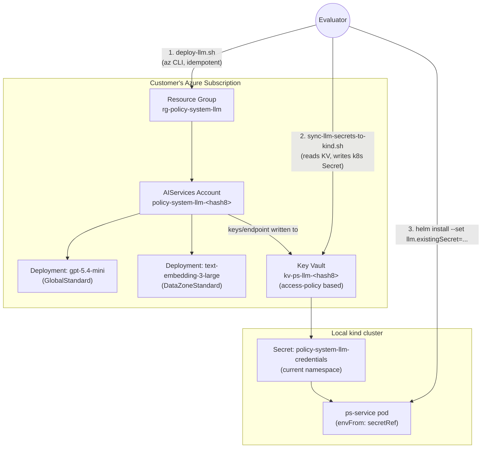

<!-- © 2026 Cartman ApS. All rights reserved. -->
# Policy System - Customer-Managed Azure LLM Bootstrap - Architecture

**Status:** Shipped
**Container:** Deployment Tooling (`scripts/`, `charts/policy-system`)

---

## Table of Contents

1. [Overview](#overview)
2. [Threat Model & Scope](#threat-model--scope)
3. [Flow](#flow)
4. [Components](#components)
   - [deploy-llm.sh](#deploy-llmsh)
     - [Configuration](#configuration)
   - [sync-llm-secrets-to-kind.sh](#sync-llm-secrets-to-kindsh)
   - [Helm chart changes](#helm-chart-changes)
5. [Naming & Idempotency](#naming--idempotency)
6. [Region Selection & Quota](#region-selection--quota)
7. [Security & Permission Model](#security--permission-model)
8. [Credential & Secret Flow](#credential--secret-flow)
9. [Out of Scope](#out-of-scope)
10. [Open Risks & Follow-ups](#open-risks--follow-ups)

---

## Overview

Customers evaluating Policy System must stand up their own Azure-hosted LLMs in a subscription of their choosing — Policy System does not operate a shared/multi-tenant LLM backend on customers' behalf. Today, `ps-service`'s `llm_interface` resolves credentials via LiteLLM's own Azure provider env vars (`AZURE_API_KEY`/`AZURE_API_BASE`/`AZURE_API_VERSION`); getting those set up currently requires manually clicking through the Azure Portal to create a Cognitive Services account, model deployments, and a Key Vault, then hand-copying keys into a `kubectl create secret` command.

This capability replaces that manual process with two idempotent scripts an evaluator runs against their own Azure subscription and their own local `kind` cluster:

- **`scripts/deploy-llm.sh`** — provisions the Azure-side resources (resource group, `AIServices` account, two model deployments, Key Vault) and stores the resulting credentials in that Key Vault.
- **`scripts/sync-llm-secrets-to-kind.sh`** — reads those credentials back out of Key Vault and writes them into the active `kind` cluster as a Kubernetes Secret, ready for `charts/policy-system` to consume.

No CI/CD pipeline and no separate template repo are involved — both scripts run locally under the evaluator's own `az` CLI session, against their own subscription, with no persisted state beyond what already exists in Azure and the kind cluster.

This design intentionally mirrors an existing hand-built reference deployment (`policy-system-ingestion` / `rg-policy-system-ingestion` / `kv-psi-pjosemomcujec` in the `Cosmos4Biz-NONPRD` subscription) rather than inventing a new resource shape — the scripts automate what was previously done by hand for that resource.

---

## Threat Model & Scope

This design assumes a single trusted evaluator operating on their own machine, against their own Azure subscription and their own local `kind` cluster. It is explicitly **not** the design for a shared or production deployment.

- The evaluator's laptop and Azure subscription are the trust boundary — there is no other party sharing the `kind` cluster or the subscription to defend against. In-cluster access controls (Secret-scoped RBAC, file-mounted vs. env-var credentials) would add process without addressing a real actor, so they're intentionally not implemented here.
- Auth to the AIServices account uses a static API key over a public endpoint, and the preflight check accepts subscription-scope Owner/Contributor rather than a least-privilege custom role. Both are accepted tradeoffs for evaluator convenience, not production-grade choices. A customer-facing production deployment needs a separate design covering managed identity/Entra ID auth, private networking, least-privilege RBAC, secret lifecycle policy, and audit logging (tracked in [Open Risks & Follow-ups](#open-risks--follow-ups)).
- The one control kept in scope regardless of trust model is key rotation, since a leaked or stale static key is a real failure mode even for a single evaluator (see [Security & Permission Model](#security--permission-model)).

---

## Flow

---

## Components

### deploy-llm.sh

Bash script wrapping the `az` CLI. Responsibilities, in order:

1. **Load and validate configuration** from the checked-in defaults file, `scripts/llm-defaults.conf` (see [Configuration](#configuration)), and compute the two subscription-hash-derived resource names. Validation happens before anything is shown or deployed, and fails with a specific "which field, which file line, what's wrong" message rather than surfacing as an opaque `az` error later:
   - Each region in the candidate list must be one of the four vetted EU regions (see [Region Selection & Quota](#region-selection--quota)) — rejects typos and any non-EU region outright, rather than silently passing an invalid or non-EU value through to `az`.
   - Chat/embedding model names must be non-empty.
   - Chat/embedding capacities must be positive integers.
2. **Show a confirmation table** of every resolved value (region, resource group, account name, both model deployments with SKU/capacity, Key Vault name) and prompt `Proceed with these values? [Y/n]`. On `N`, the script prints the path to `scripts/llm-defaults.conf` and exits without changing anything — the evaluator edits the file and re-runs. A `--yes` flag skips the prompt for unattended use.
3. **Preflight permission check** (read-only) — `az role assignment list` for the signed-in principal at subscription scope, checking for `Owner` or `Contributor`. Fails fast with an actionable message (which role is missing, an example `az role assignment create` for an admin to run) rather than failing partway through resource creation. No elevation/role-granting logic — the script assumes the evaluator already has sufficient rights.
4. **Resource group** — create-if-absent, fixed deterministic name (see [Naming & Idempotency](#naming--idempotency)).
5. **Region selection** — probe the configured EU-only candidate region list for live model availability (see [Region Selection & Quota](#region-selection--quota)), select the first that satisfies both required models. The same `az cognitiveservices model list` call used to check availability also returns each SKU's allowed capacity range, so the configured chat/embedding capacities are validated against Azure's own reported min/max for that model+SKU+region here too — a capacity outside the allowed range fails with the actual allowed range shown, rather than failing later as an opaque deployment error.
6. **`AIServices` account** — create-if-absent, kind `AIServices`, SKU `S0`, public network access enabled, custom subdomain set, matching the reference deployment.
7. **Model deployments** — create-if-absent, using the configured model names/capacities:
   - chat model (default `gpt-5.4-mini`), SKU `GlobalStandard`, capacity (default `1000`)
   - embedding model (default `text-embedding-3-large`), SKU `DataZoneStandard`, capacity (default `350`)
8. **Key Vault** — create-if-absent, `standard` SKU, **access-policy based** (`enableRbacAuthorization: false`, matching the reference vault, not the newer RBAC-authorization model), granting the deploying identity `get/list/set` on secrets.
9. **Write secrets** — set three secrets on the vault, matching the reference naming convention:
   - `AZURE-API-BASE` — the account's endpoint
   - `AZURE-API-KEY` — one of the account's API keys
   - `AZURE-API-VERSION` — fixed literal `"preview"`, matching the reference vault's value (not derived from the deployment)

Every creation step checks for existing state first (`az ... show` before `az ... create`), so the script is safely re-runnable — a second run against the same subscription and the same defaults file computes the same names, finds everything already in place, and no-ops.

**Key rotation (`--rotate-key`).** A separate mode, not part of the create/no-op flow above. Azure Cognitive Services accounts expose two key slots (`key1`/`key2`); `deploy-llm.sh --rotate-key` regenerates the currently-inactive slot (`az cognitiveservices account keys regenerate --key-name ...`), writes it to `AZURE-API-KEY` in Key Vault, and flips which slot is considered active on the next rotation — so the previously-active key keeps working until the evaluator rotates again, giving zero-downtime rotation on demand. It does not run on a schedule and does not touch any other resource; re-run `sync-llm-secrets-to-kind.sh` afterward to push the rotated key into the cluster.

### Configuration

`scripts/llm-defaults.conf` is a checked-in, versioned file holding the values an evaluator might reasonably want to tune, so they live in one readable place instead of being buried as hardcoded variables inside the script. It contains no secrets — only the region candidate list, model names, and capacities — and is deliberately **not** named `*.env`, to avoid any confusion with this repo's existing `.env`/`.env.example` convention, which is reserved for actual credentials and is git-ignored. `llm-defaults.conf` is meant to be committed and shared.

- EU region candidate list (ordered)
- Chat model name + capacity
- Embedding model name + capacity

It is the single source of truth for these values — the confirmation table in step 2 always reflects what's currently in the file, and there is no separate runtime-only override state to drift out of sync with it. Resource names (resource group, account, Key Vault) are **not** in this file — they're computed (see [Naming & Idempotency](#naming--idempotency)) since hand-editing them would break the deterministic-rerun guarantee.

Every value read from this file is validated before use — both syntactically (step 1) and, for model capacity, semantically against Azure's own live-reported allowed range (step 5) — so a hand-edited mistake in the file surfaces as an immediate, specific error rather than a confusing failure partway through deployment.

### sync-llm-secrets-to-kind.sh

Bash script wrapping `az keyvault secret show` and `kubectl`. Responsibilities:

1. **kind context guard** — verify `kubectl config current-context` matches `kind-*` before writing anything; abort with a clear error otherwise (protects against writing Azure credentials into the wrong cluster if the evaluator has multiple kube contexts configured).
2. **Read secrets** from the same deterministically-named Key Vault `deploy-llm.sh` created.
3. **Write a Kubernetes Secret**, hardcoded name `policy-system-llm-credentials`, in the current context's active namespace (not a hardcoded namespace — matches how `helm install`/`upgrade` is documented today, with no `--namespace` flag), with keys renamed from the Key Vault's dash convention to the underscore convention `charts/policy-system` expects:
   - `AZURE_API_KEY`, `AZURE_API_BASE`, `AZURE_API_VERSION`

Uses `kubectl create secret generic ... --dry-run=client -o yaml | kubectl apply -f -` (or equivalent) so reruns update the Secret in place rather than failing on "already exists."

### Helm chart changes

`charts/policy-system`:

- `values.yaml` — default `llm.provider` changes from `ollama` to `azure`. The `ollama` provider path is **kept**, not removed, to allow evaluating it later; only the default flips.
- `templates/secret.yaml` — add a `fail()` guard: when `llm.provider == "azure"` and neither `llm.existingSecret` nor `llm.azure.apiKey`/`llm.azure.apiBase` are set, fail the template render with a clear message pointing at this doc / the two scripts, instead of silently rendering a Secret with empty credential values (today's behavior, which surfaces as an opaque LiteLLM auth failure at pod runtime instead of a clear error at `helm install` time).
- Evaluators point the chart at the synced secret via the chart's existing (untouched) `existingSecret` mechanism: `helm install ... --set llm.provider=azure --set llm.existingSecret=policy-system-llm-credentials`.

This is a breaking change to the chart's default behavior for anyone running a bare `helm install`/`upgrade` with no `--set` flags — they will move from the (untested) Ollama path to requiring a working Azure setup. The repo's release tooling (`scripts/release/`) computes version bumps and release notes automatically from conventional commit headers, so this needs no manual Chart.yaml edit or CHANGELOG entry — only that the implementing commit(s) carry the `!` breaking marker (as this issue's title already does), which drives an automatic major bump and generated GitHub Release notes.

---

## Naming & Idempotency

Resource group names are unique only within a subscription, so the resource group uses a fixed literal name with no suffix. The Cognitive Services account's custom subdomain and the Key Vault name are both globally unique across all of Azure, so both need a collision-resistant suffix. All names are **deterministic** — computed from the subscription ID, not randomly generated or persisted to local state — so a rerun in the same subscription always computes the same names and the existence checks in step 2–6 of `deploy-llm.sh` find what a prior run already created.

Suffix: first 8 hex characters of `sha256(subscription-id)`.

| Resource | Name pattern | Example shape |
|---|---|---|
| Resource group | `rg-policy-system-llm` | fixed, no suffix |
| `AIServices` account | `policy-system-llm-<hash8>` | `policy-system-llm-3f9a2b1c` |
| Key Vault | `kv-ps-llm-<hash8>` | `kv-ps-llm-3f9a2b1c` (18 chars, well under the 24-char cap) |
| kind Secret | `policy-system-llm-credentials` | fixed literal, no suffix (single-tenant local cluster, no collision risk) |

---

## Region Selection & Quota

Candidate regions, checked in order, **EU member states only** (no US regions, to keep evaluator deployments EU-resident by default): `swedencentral`, `francecentral`, `westeurope`, `germanywestcentral`. All four were verified live to offer both `gpt-5.4-mini` and `text-embedding-3-large` as GA models with the exact SKUs the reference deployment uses (`GlobalStandard` for chat, `DataZoneStandard` for embeddings). `swedencentral` is checked first, matching the reference deployment.

For each candidate region, the script queries `az cognitiveservices model list --location <region>` and picks the first region where both models are listed as `GenerallyAvailable` with the required SKU.

**Quota is a separate, non-regional concern.** Azure OpenAI quota for these SKUs is pooled globally per subscription (`GlobalStandard`, `scopeType: "Global"`) or per data zone (`DataZoneStandard`, `scopeType: "DataZone"`, e.g. `eur`) — not per individual region. Switching candidate regions therefore cannot work around exhausted quota. If `az cognitiveservices usage list --location <region>` shows insufficient remaining quota against the required capacity (`1000` for the chat deployment, `350` for the embedding deployment), the script treats this as a **hard stop** with a message directing the evaluator to request a quota increase — it does not attempt further regions in response to a quota failure (only in response to a model-availability failure).

---

## Security & Permission Model

- **Preflight check is read-only.** The script only inspects role assignments; it never grants roles, creates service principals, or otherwise elevates access. If the signed-in identity lacks sufficient rights, the script stops before creating anything and tells the evaluator what's missing.
- **No CI/CD identity, no stored long-lived credentials.** Everything runs under the evaluator's own interactive `az login` session in their own subscription. There is no service principal secret, no OIDC federation setup, and no pipeline — removing an entire class of credential-management problems that coordinating deployment via CI/CD into an arbitrary customer subscription would otherwise introduce.
- **Key Vault uses access-policy authorization** (matching the reference vault), not RBAC — the deploying identity is granted `get/list/set` on secrets, scoped to that vault only.
- **kind-context guard** in the sync script prevents accidentally writing Azure credentials into a non-kind (e.g. production) kubectl context.
- **`AZURE_API_VERSION`'s value (`"preview"`) is not a secret** in the sensitive sense (it's an API version alias, not a credential) but is stored and synced alongside the two real secrets for consistency with the reference deployment and because LiteLLM's default behavior without it is unverified. This overrides #103's deferral of "`AZURE_API_VERSION` support/passthrough" (scoped there as app-level configurability, deferred until a customer hits an actual API version deprecation): this design doesn't add that configurability surface, it just captures the fixed literal the reference deployment already pins so evaluators get parity with a known-working setup, not a new tunable.
- **Key rotation is manual, not automatic.** `deploy-llm.sh --rotate-key` lets an evaluator rotate the static API key on demand (alternating `key1`/`key2`, see [deploy-llm.sh](#deploy-llmsh)); nothing rotates it on a schedule or expires it. This is a hygiene tool, not a rotation policy.
- **The static API key over a public endpoint, and the subscription-scope Owner/Contributor preflight check, are accepted tradeoffs for the single-evaluator scope of this design, not gaps** — see [Threat Model & Scope](#threat-model--scope). They are not carried forward as-is into a production deployment design.

An Azure `Microsoft.Authorization/checkAccess`-based fine-grained capability check was evaluated and rejected: it is an undocumented, preview-only, portal-internal API with no published request schema (confirmed by trial against the live API — several required fields, including a `Subject` object, are not documented in public ARM/`az` references) and no stability guarantee. A role-assignment-based check against public, documented `az` commands was chosen instead, trading exact-action precision for stability and supportability.

---

## Credential & Secret Flow

LiteLLM (used by `ps_service.llm_interface.client`) resolves Azure credentials itself from provider env vars — application code never handles them directly. The naming convention differs between Key Vault (which disallows underscores in secret names) and Kubernetes/env vars (which use LiteLLM's expected underscore names):

| Key Vault secret (dashes) | Kubernetes Secret key / env var (underscores) | Value |
|---|---|---|
| `AZURE-API-BASE` | `AZURE_API_BASE` | AIServices account endpoint |
| `AZURE-API-KEY` | `AZURE_API_KEY` | AIServices account API key |
| `AZURE-API-VERSION` | `AZURE_API_VERSION` | fixed literal `"preview"` |

The Kubernetes Secret is consumed via `envFrom: secretRef` in `ps-service-deployment.yaml`, which passes through every key in the referenced Secret as an env var — this is why the chart needs no template changes to support the version pin once the Secret contains all three keys; the existing `existingSecret` mechanism naturally carries `AZURE_API_VERSION` through even though the chart's own self-rendered Secret (`templates/secret.yaml`) currently only sets `AZURE_API_KEY`/`AZURE_API_BASE`.

---

## Out of Scope

- **No CI/CD pipeline, no separate `ps-gitops` template repo** — superseded by the two-script, run-locally design.
- **No teardown script.** Cleanup is documented (not scripted) as `az group delete --name rg-policy-system-llm --yes`, plus `az keyvault purge --name kv-ps-llm-<hash8>` to clear the vault's soft-delete retention (Key Vault soft-delete is on by default; without purging, a delete-then-redeploy cycle against the same deterministic vault name will fail).
- **No automated permission elevation.** The preflight check is diagnostic only.
- **No cost estimation/warning** before deployment.
- **No support for non-EU regions.**

---

## Open Risks & Follow-ups

- **This design's security tradeoffs are scoped to a single evaluator and don't carry forward to production.** Static API key over a public endpoint, subscription-scope Owner/Contributor for the preflight check, and credentials landing as plaintext env vars in the pod are accepted here (see [Threat Model & Scope](#threat-model--scope)) because the trust boundary is the evaluator's own laptop and subscription. A production deployment design is a separate piece of work and needs to cover: managed identity/Entra ID auth in place of static keys, private networking instead of a public endpoint, a least-privilege custom RBAC role instead of Owner/Contributor, and a secret lifecycle/rotation policy instead of the manual `--rotate-key` escape hatch.
- **Ollama is kept in the chart but is effectively untested** — the default flip to Azure reflects that Policy System evaluation currently depends on a working Azure LLM; Ollama remains available for future testing but isn't a supported fallback today.
- **Quota exhaustion has no automated remedy** — an evaluator hitting subscription-wide quota limits must request an increase from Azure directly; the script can only detect and report this, not resolve it.
- **A generic evaluator's subscription might genuinely lack access to any of the four candidate regions** (e.g. an unusual Azure Policy restricting allowed regions) — not yet handled; the script would report "no candidate region has both models available" without a specific remedy beyond checking Azure Policy.
- **The default-provider change is a breaking change** for any existing chart consumer relying on the implicit Ollama default; handled by the repo's automated, commit-header-driven version bump (tracked as part of implementation, not this doc — see [Helm chart changes](#helm-chart-changes)).
- **Depends on #103** (`psService.llmModel`/`llmEmbedModel` chart override keys). `scripts/llm-defaults.conf` here is evaluator-tunable, including chat/embedding model names — but `ps-service-deployment.yaml` today hardcodes `PS_LLMINTERFACE_MODEL`/`PS_LLMINTERFACE_EMBED_MODEL` per provider. Without #103's override keys, an evaluator who edits `llm-defaults.conf`'s model name gets a deployment `deploy-llm.sh` happily creates under Azure but that `ps-service` never calls, since the chart still passes the old hardcoded name — the same class of opaque runtime failure this design exists to eliminate, just for model name instead of credentials. #103 should land before or alongside this work.
