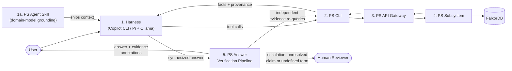

<!-- © 2026 Cartman ApS. All rights reserved. -->
# Policy System — Prototype Architecture

**Status:** Draft

---

## Purpose

This document defines the component architecture for the Policy System in
**learning/prototype mode**. It is deliberately scoped: it is not a
re-architecture of the c4b platform, and it is not the production system
architecture. It names the minimum set of components needed to realize the
five [primary use cases](ps-primary-use-cases.md) such that further
prototyping lands learnings in the right component.

## Primary Components

| # | Component | Role | Use cases served |
|---|-----------|------|------------------|
| 1 | **Harness** | The user's interaction point: VS Code with Copilot CLI, or Pi with a local model via Ollama. The agent in the harness owns question synthesis, narration, and — in prototype mode — the heavy lifting of regulation preparation. | UC-3 (front-end), UC-1 (workbench) |
| 1a | **PS Agent Skill** | A harness-side artifact: shipped context that grounds the harness agent in the conceptual model — node labels, relationship types and directions, ID conventions, canonical query shapes, and the two-layer content model. Contains no retrieval logic; it pushes work into the CLI's deterministic surface. | UC-1, UC-3 |
| 2 | **PS CLI** | The tool surface the harness agent calls to interact with the Policy System. Stable, deterministic tool semantics — an agent can plan around it. Learns from the c4b CLI. | All five |
| 3 | **PS API Gateway** | The routing boundary into the subsystem. Learns from c4b. | All five |
| 4 | **PS Subsystem** (incl. FalkorDB) | The knowledge graph and its query/load capabilities: regulation loading, question answering with provenance, governance of internal regulations and P/S/C content. | UC-2, UC-3, UC-4, UC-5 |
| 5 | **PS Answer Verification Pipeline** | Routes a question by term-coverage and structural shape, verifies a harness-synthesized (or decomposed-and-composed) answer against subsystem-returned facts and hard rules, and returns the answer annotated with its evidence — not an autonomous compliance verdict. Escalates to human review where a claim can't be resolved. Not yet built — see AD-7. | UC-3, UC-4, UC-5 |

## Key Architectural Decisions

**AD-1: The subsystem only ever holds approved content.**
UC-1 (preparation) is realized in prototype mode as a harness-driven workflow:
an agent session (Claude / Kimi K3 in VS Code) performs LLM-assisted extraction,
and the human curates — the same method proven in the graph-ingestion spikes
for CRA, NIS2, and GDPR. Draft/prepared content lives outside the deployed
subsystem (files in the workspace); only approved content crosses into the
graph via UC-2. Consequence: the RegulationGraph has no content lifecycle
states for the regulatory layer, unlike the Policy/Standard/Control layer
which carries `draft → approved → deprecated`.

**AD-2: The subsystem returns facts with provenance; the harness owns answers.**
The PS subsystem is a faithful fact-retrieval capability, not a chat product.
Synthesis, narration, and honest "I don't have that data" behavior belong to
the agent in the harness. This separation is the lesson of the query spikes:
deterministic retrieval inside the system boundary, LLM judgment outside it.

**AD-3: Deterministic retrieval surface where possible.**
The query spikes established that template-based and pre-compiled catalog
queries (approaches 1 and D) are correct and free, while freehand agentic
Cypher generation fails in known ways. The subsystem's query interface should
prefer deterministic, cataloged query shapes; novel/open questions fall
through to the harness agent reasoning over tool results.

**AD-4: EU regulation knowledge is vendor-concentrated during prototyping.**
EU regulations are not customer-unique, so extraction expertise concentrating
with the vendor is acceptable now. Generalizing UC-1 to arbitrary customer
regulations is a deferred risk, not a current requirement.

**AD-5: Cross-regulation capability convergence is deferred.**
Handled at extraction time in spikes; near-zero duplicate pressure observed.
A sub-optimization to revisit in later prototypes, not a component now.

**AD-6: The harness agent is grounded by a shipped skill, not by rediscovery.**
The query spikes' most validated finding is that grounding location matters
more than model capability: schema-in-system-prompt eliminated the ID-pattern
and relationship-direction Cypher failures entirely. The PS Agent Skill
(1a) carries that grounding. Its content split is deliberate: the skill holds
the **model** (durable, slow-changing — node labels, relationship directions,
ID conventions, routing patterns) **and canonical semantic definitions**
(durable boundary rules — what counts as "overdue," "stale," "blast radius" —
which a schema alone does not encode); the **data** (which regulations are
loaded, which capabilities exist) is introspected at runtime via CLI commands,
so content updates never stale the skill.

*Revision note (2026-08-09, `skill-transfer` spike):* AD-6 held fully for
grounding *shape* — 100% dev-set correct-or-correctly-refused, zero
Cypher-shape errors across 108 runs. It did not hold unrevised for grounding
*semantic boundaries*: held-out accuracy (81.5%) clustered its failures in
boundary/exclusion definitions the skill left to per-agent judgment (e.g.
whether an overdue-review chain counts as "stale"). The skill must carry
these definitions explicitly, not just schema knowledge — see the
`ps-domain` skill's Canonical Definitions section. See
`spikes/skill-transfer/RUNBOOK.md` for the full evidence.

**AD-7: Answers are routed by term-coverage and structural risk, then
verified against independently re-derived evidence — producing an
evidence-annotated answer, not an autonomous compliance decision.**
AD-2 draws the boundary between deterministic retrieval (inside the
subsystem) and LLM judgment (outside it, in the harness). That boundary
covers *retrieval* correctness but leaves *answer* correctness — whether the
harness's synthesized answer is fully supported by what was actually
retrieved — unverified. The PS Answer Verification Pipeline (component 5)
closes that gap, but does not do it by having a model arbitrate a verdict:
non-determinism in judgment is not a defect specific to answering, it
applies to any LLM call including a judge call, so the design's job is to
route as much of the check as possible to deterministic mechanisms and
reserve model judgment only for what's genuinely irreplaceable — and to
default to showing evidence rather than asserting authority wherever
verification can't clear that bar.

The pipeline is two phases, not one, because not every failure kind is
visible before an answer exists. **Phase A (Stages 1–2, pre-answer)**
predicts risk from the question text alone and drives routing. **Phase B
(Stage 4, post-answer)** checks a drafted or composed answer against
evidence and catches kinds Phase A cannot see by construction — a
question's text alone doesn't reveal whether the agent will build a bad
query, over-extend a true fact's scope, or apply an unwritten composition
rule between two individually-defined terms. Stage 4 is not a thin backstop
behind Phase A; roughly half of the failure kinds this design targets are
only catchable there.

**Stage 1 — term-coverage check (deterministic, Phase A).** Extract the
domain terms a question turns on, including which canonical entity-type it
asks about (e.g. "chain" vs. "control" — recorded for Stage 4's granularity
check below), and match vocabulary terms against a per-term alias table
derived from `ps-domain-concepts.md` and the skill's Canonical Definitions
section (not a generic thesaurus — domain terms that sound like synonyms
are often deliberately distinct, e.g. "overdue" vs. "stale," see AD-6's
revision note). Three outcomes per term: **exact match** (defined,
proceed); **alias/near-match** (defined but phrased differently — surface
the matched definition explicitly to composition, and require the fitness
gate to confirm that specific definition, not a looser reading, was
applied); **no match** (undefined vocabulary — do not attempt full
synthesis). This stage catches undefined *vocabulary* specifically. It does
**not** catch two related but distinct problems, both of which only show up
once an answer exists to check: an undefined *interaction* between two
individually-defined terms (e.g. does an "overdue" bucket implicitly
exclude "deprecated" entries — both terms defined, the composition rule
between them is not; Stage 4's rule checks own this), or a claim whose
*scope* exceeds what retrieved evidence supports even though every
individual fact cited is real (Stage 4's scope-match check owns this).

**Stage 2 — structural risk classification (deterministic).**
Count-shaped questions require a tool-computed number at the fitness gate,
never a hand-tally. Multi-part/exhaustive-enumeration-shaped questions
require decomposition into sub-claims, each checked for presence before
composing. These two checks, plus stage 1, replace routing by
author-assigned difficulty tier (E/M/H) — a retroactive tally across
`cli-tool-semantics`' two dev runs and `skill-transfer`'s held-out run
(33 failure instances, no new runs needed) found tier predicts almost
nothing on its own; failure *kind* does. See
`spikes/compliance-decision-pipeline/README.md` for the full tally.

**Stage 3 — routing.** Routing consults Stage 1–2's mechanical checks
*and* the question's semantic type, classified against a measured
reliability table (8 types, built by reading actual question text rather
than difficulty tier — see `spikes/compliance-decision-pipeline/README.md`
for the full table and methodology). Single-fact lookups, cross-entity
comparisons, and gap/refusal checks measure ~90–100% reliable and are
answered directly once term coverage and structural checks pass.
Enumeration, count, and chain-trace questions measure 75–84% reliable, each
with one known specific trigger already covered by Stages 1–2/4 (a status
term needing the alias table, a number needing tool computation, a
hypothetical-chain claim needing scope-match). Two types have no known
trigger-based fix and are routed differently: **open recommendation/
critique questions measure ~50% reliable on every tool surface tested** —
a genuine reasoning ceiling, not a retrieval artifact — and default to
decomposition or evidence-only rather than full synthesis. **Status/
compliance-judgment questions measure 56% overall but 20% specifically on
the CLI path** (vs. 83% on raw Cypher) — a strong signal this is a
fixable summarization gap, not a ceiling, and a concrete case for a
future tool-computed-verdict mechanism analogous to `row_count`. Where
decomposition is needed (multi-part, an alias/near-match term, no
single-shot canonical path, or one of the two low-reliability types), the
question is broken into sub-questions, each routed recursively; if every
sub-question resolves via a reliable path, the sub-answers are composed —
and the *composed* answer must also clear the fitness gate, since most
observed completeness failures had correct sub-facts dropped during
composition, not retrieval. If decomposition can't be reliably achieved, or
a term has no match at Stage 1, the system does not attempt full
synthesis: it refuses (naming the specific reason) or falls back to
evidence-only — raw retrieved facts with a hedged, **calibrated**
disclaimer stating the type's actual measured reliability and its source,
not generic AI-uncertainty language, so a hedge only appears where the
data says one is warranted and states why. This is the deliberate product
posture: decision support with a visible evidence trail, not an autonomous
compliance verdict. Phase A routing a question to the direct-answer path
is not a reliability guarantee on its own — Stage 4 still applies, and is
where the failure kinds Phase A cannot see get caught.

**Stage 4 — fitness gate (hybrid, applied uniformly to every answer,
canonical or composed; Phase B, post-answer).**
- **Rule checks** — deterministic, formalized `SKILL.md` rules (e.g. rule
  3: account for every row returned; rule 5: cite real IDs) and the
  Known-Gaps Registry. Also the owner of undefined-*interaction* failures
  Stage 1 cannot see (the overdue/deprecated composition-rule example
  above), and of output-format compliance (real IDs in canonical form,
  required structure present) — not left to the agent to self-apply from
  prose either way.
- **Evidence grounding — existence.** Does the claim cite a fact the
  subsystem actually returns. Deterministic, and must re-query
  independently of whatever path produced the original answer — reusing
  the original query only re-confirms a possible original mistake instead
  of catching it (the lesson of `cli-tool-semantics`' SWE-M1/RM-E1
  query-construction misses).
- **Evidence grounding — scope match.** A stricter, separate check: does
  every regulation/entity/unit *named in the claim* appear in the specific
  evidence retrieved for it, at the same specificity — not just "does some
  related fact exist somewhere." Existence-checking alone passes a claim
  like "this capability weakens GDPR and NIS2 duties too" as long as the
  capability itself is real; scope-match is what catches the claim
  over-extending past what was actually retrieved. Also cross-checks the
  answer's stated entity-type/unit against the one Stage 1 recorded from
  the question, catching granularity mismatches (e.g. answering in
  "controls" when the question asked about "chains").
- **Semantic similarity** — statistical drift detection against a
  reference, not model-judged.
- **LLM judge** — reserved for the narrow residual of claims none of the
  above resolve, after term-coverage and structural routing have already
  removed most of what would otherwise reach it. Run as an ensemble, not a
  single call, with inter-run agreement recorded, not assumed.
- **Human review** — the escalation path when the judge and the
  deterministic signals disagree, or when a claim resolves by none of them.

**Stage 5 — continuous audit and mechanism growth (lagged, out-of-band).**
Stages 1–4 are a closed set of specific catches, each built for a
previously-observed failure shape. That set is necessarily incomplete — a
genuinely new failure kind that trips none of them passes Stage 4 clean and
is delivered as verified. Two ways to handle that: a universal (not
residual) judge pass would catch it live, at the cost of reintroducing
per-answer model non-determinism everywhere — exactly what Stages 1–4 exist
to route around. The chosen tradeoff is **lagged**: accept that a new
failure kind ships un-caught until the next audit cycle, in exchange for
keeping the per-answer path deterministic-first, and pair that with an
explicit active-learning loop so the gap shrinks over time instead of
sitting static. This loop formalizes, as a recurring process, what this
spike's own scoping did once by hand against already-graded transcripts:

1. **Sample** — periodically pull a batch of pipeline-verified
   (non-escalated) answers. Risk-weighted, not uniform: prioritize Stage 1
   alias/near-match flags, comparison/relation-shaped claims, and
   decomposed-and-composed answers (the largest historical failure
   concentration — completeness failures at composition, 16 of 33 known
   instances). A smaller random baseline sample covers shapes not yet
   hypothesized at all.
2. **Audit** — human review (not a model call — the goal is catching what
   models miss) checks each sampled answer against independently
   re-derived evidence and rules.
3. **Classify** — anything wrong found: an existing taxonomy kind an
   existing mechanism should have caught but didn't (fix/extend it), or a
   genuinely new kind?
4. **Promote** — a new kind is classified the same way every Stage 4
   mechanism already was: reduces to a structured, recomputable graph
   check → new deterministic Stage 4 sub-check; irreducibly a judgment
   call → named explicitly in the judge's brief and the human-review
   trigger criteria, so future instances of that shape get escalated even
   without a deterministic check.
5. **Regression-check** — any new or modified mechanism is validated
   against the full set of previously-confirmed cases before deployment —
   same must-flag/must-not-false-flag discipline already used for the
   alias table and scope-match.
6. **Version** — the failure-kind taxonomy and its mechanism set are a
   versioned, growing artifact, not a fixed list; each promotion is logged
   with what was found and why.

The taxonomy behind Stages 1–5 was cross-checked against the broader
RAG/QA-evaluation literature (Barnett et al.'s seven canonical RAG failure
points, RAGAS's evaluation metrics, LLM-as-judge reliability research) —
convergent validation for several kinds, two adjustments folded in above,
and one confirmed literature-backed risk for the judge stage specifically
(citation "authority bias"). Full notes and sources:
`spikes/compliance-decision-pipeline/RESEARCH.md`.

**Output contract: the system never returns just an answer.** Every
response is exactly three blocks — (A) an explicit confidence statement,
always present, derived from the type-reliability table and Stage 4's gate
result, never silence-implies-confidence; (B) the answer itself, a real
claim, a hedged draft, or an explicit "not determinable," never presented
as more certain than (A) states; (C) verification data, always populated,
carrying both `source_ref` provenance (verifies against the original
regulation text) and the concrete structured values the claim is built
from — not a citation alone, which would force the user back to the
regulation text to catch a summarization or comparison error the raw
values would surface immediately. "Full answer," "evidence-only," and
"refuse" are not separate output modes; they're what (A) and (B) contain
in different cases, always alongside a populated (C). (A)'s stated
confidence deliberately calibrates how much scrutiny (C) is worth —
loudest on the lowest-reliability types, quiet where a hedge would be
noise — which makes a user checking (C) a second, complementary answer to
Stage 5's lagged audit for novel failure modes: live and full-coverage in
principle, at the cost of only working when someone actually looks, and
weakest exactly where (A) says not to worry — which is why Stage 5 remains
necessary rather than superseded. Full mechanism and worked example:
`spikes/compliance-decision-pipeline/README.md`, "Output posture."

This does not relitigate AD-2's split; it extends it by making "the harness
owns answers" a checked, evidence-backed claim rather than a trusted one,
while keeping the system's authority claims no larger than what's actually
been verified.

*To be validated by:* `spikes/compliance-decision-pipeline` (not yet
built — proposed 2026-08-09; design derived across a single working
session from `cli-tool-semantics`' dev-v2b grading, see that spike's
RUNBOOK.md for the originating evidence).

## Deliberately Excluded (prototype mode)

| Candidate | Why excluded |
|---|---|
| LogEngine / observability stack | Real eventually; in prototype mode the harness terminal plus subsystem logs suffice. |
| Content repository service | The git-repo-of-JSON content supply chain lives outside the running system; it is a supply-chain artifact, not a component. |
| Vendor-side runtime | Decided earlier: nothing runs on the vendor side. |
| Multi-tenancy anything | The product is single-tenant, customer-deployed. |

## Mapping: Spike Learnings → Components

| Spike artifact | Lands in |
|---|---|
| graph-ingestion 1–3 (chunker, extractor, loader, methodology docs) | Harness workflow (UC-1) + PS CLI / Subsystem load path (UC-2) |
| query1: template router, golden answers, direction-correction, union-of-N | PS Subsystem query capability (UC-3) |
| query2: Candidate D catalog, resolver, staleness | PS Subsystem query capability (UC-3) |
| query3: approach 5 scope clarification | Harness behavior (UC-3) |
| Helvex synthetic P/S/C layer | Test data for UC-3/UC-5 prototyping |

---

*End of Document*
