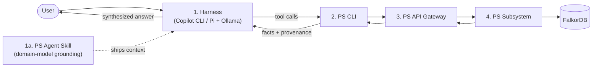

<!-- © 2026 Cartman ApS. All rights reserved. -->
# Policy System — Prototype Architecture

**Status:** Draft

---

## Purpose

This document defines the component architecture for the Policy System in
**learning/prototype mode**. It is deliberately scoped: it is not a
re-architecture of the c4b platform, and it is not the production system
architecture. It names the minimum set of components needed to realize the
five [primary use cases](ps-primary-use-cases.md) such that further
prototyping lands learnings in the right component.

## Primary Components

| # | Component | Role | Use cases served |
|---|-----------|------|------------------|
| 1 | **Harness** | The user's interaction point: VS Code with Copilot CLI, or Pi with a local model via Ollama. The agent in the harness owns question synthesis, narration, and — in prototype mode — the heavy lifting of regulation preparation. | UC-3 (front-end), UC-1 (workbench) |
| 1a | **PS Agent Skill** | A harness-side artifact: shipped context that grounds the harness agent in the conceptual model — node labels, relationship types and directions, ID conventions, canonical query shapes, and the two-layer content model. Contains no retrieval logic; it pushes work into the CLI's deterministic surface. | UC-1, UC-3 |
| 2 | **PS CLI** | The tool surface the harness agent calls to interact with the Policy System. Stable, deterministic tool semantics — an agent can plan around it. Learns from the c4b CLI. | All five |
| 3 | **PS API Gateway** | The routing boundary into the subsystem. Learns from c4b. | All five |
| 4 | **PS Subsystem** (incl. FalkorDB) | The knowledge graph and its query/load capabilities: regulation loading, question answering with provenance, governance of internal regulations and P/S/C content. | UC-2, UC-3, UC-4, UC-5 |

## Key Architectural Decisions

**AD-1: The subsystem only ever holds approved content.**
UC-1 (preparation) is realized in prototype mode as a harness-driven workflow:
an agent session (Claude / Kimi K3 in VS Code) performs LLM-assisted extraction,
and the human curates — the same method proven in the graph-ingestion spikes
for CRA, NIS2, and GDPR. Draft/prepared content lives outside the deployed
subsystem (files in the workspace); only approved content crosses into the
graph via UC-2. Consequence: the RegulationGraph has no content lifecycle
states for the regulatory layer, unlike the Policy/Standard/Control layer
which carries `draft → approved → deprecated`.

**AD-2: The subsystem returns facts with provenance; the harness owns answers.**
The PS subsystem is a faithful fact-retrieval capability, not a chat product.
Synthesis, narration, and honest "I don't have that data" behavior belong to
the agent in the harness. This separation is the lesson of the query spikes:
deterministic retrieval inside the system boundary, LLM judgment outside it.

**AD-3: Deterministic retrieval surface where possible.**
The query spikes established that template-based and pre-compiled catalog
queries (approaches 1 and D) are correct and free, while freehand agentic
Cypher generation fails in known ways. The subsystem's query interface should
prefer deterministic, cataloged query shapes; novel/open questions fall
through to the harness agent reasoning over tool results.

**AD-4: EU regulation knowledge is vendor-concentrated during prototyping.**
EU regulations are not customer-unique, so extraction expertise concentrating
with the vendor is acceptable now. Generalizing UC-1 to arbitrary customer
regulations is a deferred risk, not a current requirement.

**AD-5: Cross-regulation capability convergence is deferred.**
Handled at extraction time in spikes; near-zero duplicate pressure observed.
A sub-optimization to revisit in later prototypes, not a component now.

**AD-6: The harness agent is grounded by a shipped skill, not by rediscovery.**
The query spikes' most validated finding is that grounding location matters
more than model capability: schema-in-system-prompt eliminated the ID-pattern
and relationship-direction Cypher failures entirely. The PS Agent Skill
(1a) carries that grounding. Its content split is deliberate: the skill holds
the **model** (durable, slow-changing — node labels, relationship directions,
ID conventions, routing patterns) **and canonical semantic definitions**
(durable boundary rules — what counts as "overdue," "stale," "blast radius" —
which a schema alone does not encode); the **data** (which regulations are
loaded, which capabilities exist) is introspected at runtime via CLI commands,
so content updates never stale the skill.

*Revision note (2026-08-09, `skill-transfer` spike):* AD-6 held fully for
grounding *shape* — 100% dev-set correct-or-correctly-refused, zero
Cypher-shape errors across 108 runs. It did not hold unrevised for grounding
*semantic boundaries*: held-out accuracy (81.5%) clustered its failures in
boundary/exclusion definitions the skill left to per-agent judgment (e.g.
whether an overdue-review chain counts as "stale"). The skill must carry
these definitions explicitly, not just schema knowledge — see the
`ps-domain` skill's Canonical Definitions section. See
`spikes/skill-transfer/RUNBOOK.md` for the full evidence.

## Deliberately Excluded (prototype mode)

| Candidate | Why excluded |
|---|---|
| LogEngine / observability stack | Real eventually; in prototype mode the harness terminal plus subsystem logs suffice. |
| Content repository service | The git-repo-of-JSON content supply chain lives outside the running system; it is a supply-chain artifact, not a component. |
| Vendor-side runtime | Decided earlier: nothing runs on the vendor side. |
| Multi-tenancy anything | The product is single-tenant, customer-deployed. |

## Mapping: Spike Learnings → Components

| Spike artifact | Lands in |
|---|---|
| graph-ingestion 1–3 (chunker, extractor, loader, methodology docs) | Harness workflow (UC-1) + PS CLI / Subsystem load path (UC-2) |
| query1: template router, golden answers, direction-correction, union-of-N | PS Subsystem query capability (UC-3) |
| query2: Candidate D catalog, resolver, staleness | PS Subsystem query capability (UC-3) |
| query3: approach 5 scope clarification | Harness behavior (UC-3) |
| Helvex synthetic P/S/C layer | Test data for UC-3/UC-5 prototyping |

---

*End of Document*
