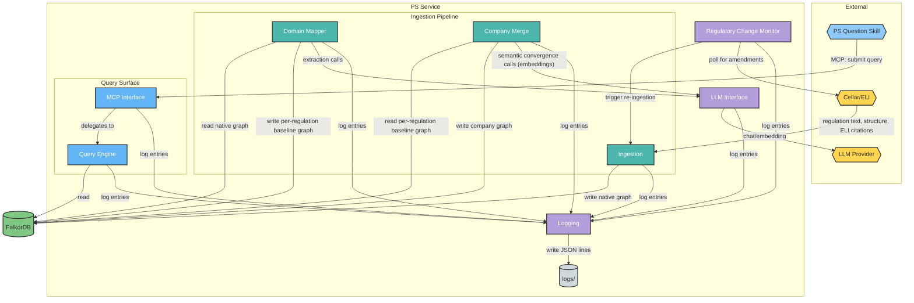
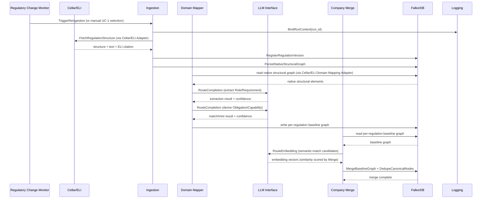
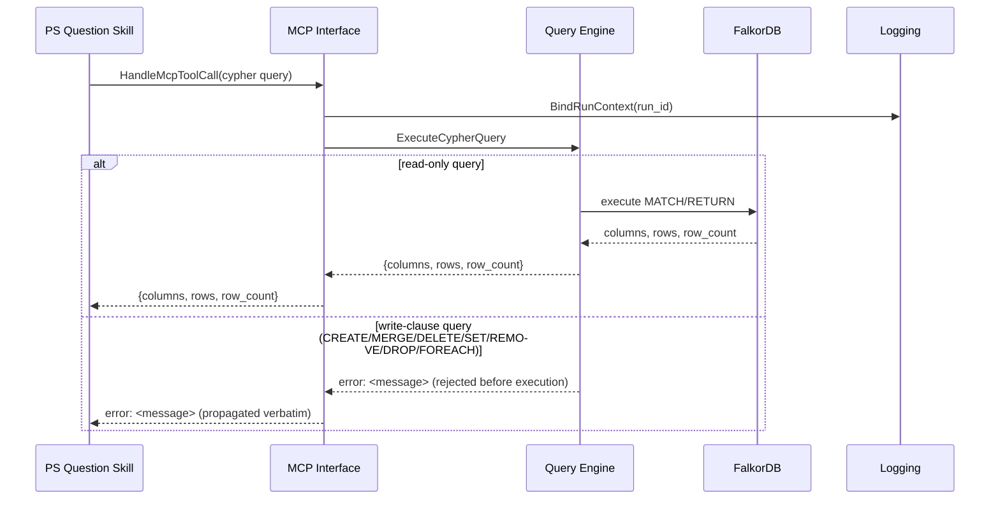

<!-- © 2026 Cartman ApS. All rights reserved. -->
# Policy System - Container - PS Service Architecture

**Status:** Draft
**Container:** PS Service

<!--
  Prerequisite note: this document was written without an approved IUD or
  Domain Terms artifact (neither exists in this repo yet), and against
  Draft-status Solution Architecture, Domain Concepts, and URS. Reconcile
  against those artifacts if/when they're created or approved.
-->

---

## Table of Contents

1. [Overview](#overview)
2. [C4 Component Level](#c4-component-level)
   - [C4 Component Diagram](#c4-component-diagram)
   - [C4 Component Overview](#c4-component-overview)
   - [Domain Concepts to Component Mapping](#domain-concepts-to-component-mapping)
3. [Components](#components)
   - [Ingestion](#ingestion)
   - [Domain Mapper](#domain-mapper)
   - [Company Merge](#company-merge)
   - [Query Engine](#query-engine)
   - [MCP Interface](#mcp-interface)
   - [Regulatory Change Monitor](#regulatory-change-monitor)
   - [LLM Interface](#llm-interface)
   - [Logging](#logging)
   - [Dependency Health](#dependency-health)
   - [Process Harness](#process-harness)
4. [Use Case Coverage Mapping](#use-case-coverage-mapping)
5. [NFR Implementation](#nfr-implementation)
6. [Implementation Guide](#implementation-guide)

---

## Overview

PS Service is the Policy System's backend container: it ingests EU regulations, maps them into the PS Conceptual Model (`ps-domain-concepts.md`) compliance graph, merges them into a company's single-tenant graph, and serves read-only queries back to consuming clients.

### Container Purpose

- Ingest EU regulation structure/text from Cellar/ELI (replacing PDF extraction as the source of truth)
- Map ingested regulatory content into the PS Conceptual Model — external regulations through Role/Requirement/Obligation/Capability; internal regulations (Business SoPs) continuing through Policy/Standard/Control via their own paired adapter
- Merge per-regulation baselines into a single-tenant compliance graph, with cross-regulation canonical convergence (Obligation/Capability/Policy reuse)
- Serve read-only Cypher queries to consuming clients via MCP (MCP Interface), with guarded execution owned by Query Engine — MCP Interface is currently the only access path; no direct/REST query path exists yet
- Detect regulatory amendments and re-trigger ingestion for the affected regulation

### Container Architectural Pattern

Pipeline + query-surface split, not a layered web-app architecture:

- **Ingestion pipeline** (sequential, per-regulation): Ingestion → Domain Mapper → Company Merge
- **Query surface** (parallel, stateless, read-only): Query Engine, fronted by MCP Interface for the PS Question Skill client
- **Support**: Regulatory Change Monitor (triggers the pipeline), LLM Interface (shared infra used by Domain Mapper and Company Merge today), Logging (shared infra used by every component for structured/semantic debug logging)

A thin REST entry-point layer routes external requests to these components but is not itself a named component in the Solution Architecture's Component Breakdown, so it isn't documented as one here — see [Implementation Guide](#implementation-guide).

**Domain Path:** `ps.service`

---

## C4 Component Level

### C4 Component Diagram

**Diagram Legend:**
- **Hexagon shapes (yellow/blue):** External systems and clients
- **Cylinder (green):** Data store
- **Teal:** Ingestion pipeline components
- **Blue:** Query surface components
- **Purple:** Support components

### C4 Component Overview

| Component name | Domain Path | Key responsibilities |
|---|---|---|
| Ingestion | `ps.service.ingestion` | Fetch regulation structure/text via a pluggable Ingestion Adapter (Cellar/ELI first); register Regulation bibliographic metadata; persist the source's native structural graph to FalkorDB |
| Domain Mapper | `ps.service.domainmapper` | Read a source's native structural graph via a paired Domain Mapping Adapter; LLM-driven extraction of Role/Requirement; derive Obligation/Capability |
| Company Merge | `ps.service.companymerge` | Merge per-regulation baseline graphs into the single-tenant graph; dedupe canonical nodes |
| Query Engine | `ps.service.queryengine` | Execute read-only Cypher queries against the graph |
| MCP Interface | `ps.service.mcpinterface` | Expose Query Engine to PS Question Skill via MCP |
| Regulatory Change Monitor | `ps.service.changemonitor` | Poll Cellar/ELI for amendments; trigger re-ingestion |
| LLM Interface | `ps.service.llminterface` | Route chat/embedding requests to the configured LLM Provider via LiteLLM |
| Logging | `ps.service.logging` | Provide structured, semantic logging for every component; write JSON entries to file; bind a correlation (run) ID at primary-use-case entry points |
| Dependency Health | `ps.service.dependencyhealth` | Process-wide registry of whether FalkorDB, LLM Interface, and Cellar/ELI were reachable on their most recent real call; fed by those components' own exception handling, read by Process Harness for `/ready` |
| Process Harness | `ps.service.main` | Expose `/health` (liveness) and `/ready` (readiness); probe FalkorDB, LLM Interface, and Cellar/ELI once at startup; the process composition root (`load_config()`, `uvicorn.run()`) |

### Domain Concepts to Component Mapping

| Domain Concept | Component Name | Domain Path | Implementation Notes |
|---|---|---|---|
| Regulation | Ingestion | `ps.service.ingestion` | Bibliographic metadata (`title`, `jurisdiction`, `effective_date`, `version`) is direct Cellar/ELI structural data — no LLM extraction needed to create this node. For a Directive source (e.g. NIS2), `effective_date` is the Member-State transposition deadline, not the Directive's own EU-level entry-into-force date — the transposition deadline is the point the Directive's obligations actually bind affected entities, which is what this field represents for a Regulation source too |
| Native structural elements (adapter-defined, e.g. TITLE/CHAPTER/SECTION/ARTICLE/PARAGRAPH for Cellar/ELI) | Ingestion (write, via source-specific Ingestion Adapter) + Domain Mapper (read, via paired Domain Mapping Adapter) | `ps.service.ingestion`, `ps.service.domainmapper` | Not a fixed, project-wide domain concept — each source's Ingestion Adapter persists its own native hierarchy as-is; only its paired Domain Mapping Adapter knows how to read that shape. A new regulatory source (e.g. SOX, HIPAA) means adding a new matched adapter pair, not extending a shared schema |
| Role | Domain Mapper | `ps.service.domainmapper` | LLM-extracted from the native structural graph via the Domain Mapping Adapter; `DEFINES` edge with `source_ref` |
| Requirement | Domain Mapper | `ps.service.domainmapper` | LLM-extracted; `EXPRESSES` edge with `source_ref` |
| Obligation | Domain Mapper (mint/match) + Company Merge (cross-regulation dedup) | `ps.service.domainmapper`, `ps.service.companymerge` | Domain Mapper matches/mints per-regulation; Company Merge resolves canonical convergence across regulations — an exact canonical-identity match, or a semantic-equivalence match (via LLM Interface's `RouteEmbedding` action) for differently-worded content expressing the same duty |
| Capability | Domain Mapper (mint/match) + Company Merge (cross-regulation dedup) | `ps.service.domainmapper`, `ps.service.companymerge` | Same split as Obligation |
| Policy | Domain Mapper (mint/match, internal sources only) + Company Merge (cross-source dedup) | `ps.service.domainmapper`, `ps.service.companymerge` | External-source regulations stop at Capability — Policy is only mint/matched here for `source_type: internal`, via that source's Domain Mapping Adapter, linked from Capability via `GOVERNED_BY`. Human-authored Policy (via Policy Editor, outside this container) is the other origin; canonical identity derived from the Policy's own `title` alone applies either way, with the same exact-or-semantic convergence matching as Obligation/Capability |
| Standard | Domain Mapper (internal sources only) | `ps.service.domainmapper` | Only mint/matched for `source_type: internal`, via `SUPPORTED_BY` from its parent Policy. Weak-entity identity derived from its Policy + version — scoped to exactly one Policy, no cross-source dedup needed |
| Control | Domain Mapper (internal sources only) | `ps.service.domainmapper` | Only mint/matched for `source_type: internal`, via `IMPLEMENTED_BY` from its parent Standard. Weak-entity identity derived from its Standard + type — scoped to exactly one Standard, no cross-source dedup needed |

**Not implemented by any PS Service component:** `PracticeArea`, `RiskPath` — these are Governance-layer concepts authored by policy managers through the Policy Editor client, which is a separate, not-yet-designed container per the Solution Architecture doc. This document does not invent a mapping for them.

---

## Components

### Ingestion

#### Domain Concepts

##### Regulation

###### Constraints

| Constraint | Description |
|---|---|
| Read-only once created | Regulations are never modified in place; a new version supersedes the old via `SUPERSEDED_BY` (see [Regulatory Change Monitor](#regulatory-change-monitor)) |
| Natural-key identity | `{SHORT}-{VERSION}` (e.g. `CRA-1.0`) — no separate surrogate key |

###### Attributes

| Attribute | Description | Type | Min | Max | Rules |
|---|---|---|---|---|---|
| `id` | Same as Identity | string | — | — | Required |
| `title` | Regulation title | string | — | — | Required |
| `source_type` | `external` or `internal` | enum | — | — | Required |
| `jurisdiction` | Jurisdiction or org-unit scope | string | — | — | Required in practice for `external` |
| `effective_date` | ISO 8601 date | date | — | — | Required |
| `version` | Version string | string | — | — | Required |
| `status` | `active` \| `superseded` \| `vacated` | enum | — | — | Required |

##### Native Structural Graph (adapter-defined)

###### Constraints

| Constraint | Description |
|---|---|
| Source-native shape, not a fixed schema | Each Ingestion Adapter persists whatever hierarchy its source actually has (e.g. Cellar/ELI: TITLE/CHAPTER/SECTION/ARTICLE/PARAGRAPH/ANNEX/RECITAL) — no generic/common node schema is imposed across sources |
| One FalkorDB graph per regulation | The Cellar/ELI Adapter persists each regulation's native structural graph into its own FalkorDB graph, named `{short_name}_native` (e.g. `cra_native`) — not a shared graph across regulations. Avoids one regulation's re-ingest/reset affecting another's data; other adapters may choose differently, this isn't a project-wide requirement |
| Implicit contract with Domain Mapper | The shape an Ingestion Adapter writes is only ever read by its paired Domain Mapping Adapter (see [Domain Mapper](#domain-mapper)) — adapter pairs are added and changed together |
| Contract is unenforced | Nothing (shared schema, contract test, or otherwise) currently catches drift between an Ingestion Adapter's output shape and its paired Domain Mapping Adapter's expected input shape — the "changed together" discipline above is process-only, not enforced |
| Anchored to Regulation | Every native structural node links back to its Regulation node (directly or transitively) so the full verbatim text stays traceable after Domain Mapper's extraction pass |

###### Attributes (Cellar/ELI Adapter)

| Attribute | Description | Type | Min | Max | Rules |
|---|---|---|---|---|---|
| `element_type` | `TITLE` \| `CHAPTER` \| `SECTION` \| `ARTICLE` \| `PARAGRAPH` \| `ANNEX` \| `RECITAL` | enum | — | — | Required; Cellar/ELI-specific — other adapters define their own vocabulary. `TITLE` is walked but not minted as its own node by the shipped Cellar/ELI Adapter (a `TITLE`-shaped element is a transparent pass-through container — its children attach to the current parent); no CRA/GDPR/NIS2 document exercises `TITLE`-level markup, so this is untested rather than a deliberate design choice for a source that does use it |
| `text` | Verbatim text of this structural element | string | — | — | Required |
| `citation_ref` | ELI citation identifying this element | string | — | — | Required; used as `source_ref` by Domain Mapper's extraction edges |
| `order` | Position among siblings | integer | — | — | Required |

#### Kind

| Kind | Framework | Language | Project Pattern | Namespace Pattern |
|---|---|---|---|---|
| Internal component (Python package) | None | Python 3.14 | `ps-service/src/ps_service/ingestion/`, adapters under `ps-service/src/ps_service/ingestion/adapters/` | `ps_service.ingestion`, `ps_service.ingestion.adapters` |

**Implementation Guidance:**
- Stateless — no persistent state of its own beyond what it writes to FalkorDB via `RegisterRegulationVersion` and `PersistNativeStructuralGraph`.
- Source-specific fetch/persist logic lives behind an Ingestion Adapter interface (`ps_service.ingestion.adapters.base`), one concrete adapter per regulatory source. The Cellar/ELI Adapter is the only implementation for this walking skeleton; adding SOX/HIPAA/FDA later means adding a new adapter, not modifying Ingestion's core.
- An Ingestion Adapter's output shape is an implicit contract with its paired Domain Mapping Adapter (see [Domain Mapper](#domain-mapper)) — not enforced by a shared schema, so the two must be reviewed/changed together.
- Retry policy for Cellar/ELI fetch failures is deliberately not built into this component — `FetchRegulationStructure` fails clearly and lets the caller (manual UC-1 trigger, or Regulatory Change Monitor's next poll cycle) decide whether to retry.
- No feed-integrity/authenticity verification (e.g. signing) is designed for Cellar/ELI responses beyond transport-level TLS — full trust is placed in Cellar/ELI's own content integrity.
- Pagination/chunking strategy for very large regulations is an L2 implementation concern, not decided here.

#### Implementation Registration

| Path | Purpose | Implements |
|---|---|---|
| `ps-service/src/ps_service/ingestion/__init__.py` | Package front door, re-exports `ingest_regulation` | — |
| `ps-service/src/ps_service/ingestion/pipeline.py` | `ingest_regulation()` — the primary-use-case entry point (fetch → register → persist → verify, one `bind_run_context()` run per call) | FetchRegulationStructure, RegisterRegulationVersion, PersistNativeStructuralGraph |
| `ps-service/src/ps_service/ingestion/models.py` | `RegulationMetadata`, `StructuralNode`, `StructuralEdge`, `FetchedRegulationStructure`, `ReachabilityCount`, `IngestResult` | — |
| `ps-service/src/ps_service/ingestion/errors.py` | `IngestionPersistenceError`, `IngestionConfigurationError` | — |
| `ps-service/src/ps_service/ingestion/graph_writer.py` | `register_regulation_version`, `persist_native_structural_graph`, `verify_structural_graph_reachable` | RegisterRegulationVersion, PersistNativeStructuralGraph |
| `ps-service/src/ps_service/ingestion/falkordb_client.py` | `connect`/`connect_from_config`, `check_connectivity`, `select_graph`, `native_graph_name`, `GraphHandle` Protocol | CheckConnectivity (FalkorDB) |
| `ps-service/src/ps_service/ingestion/adapters/base.py` | `IngestionAdapter` Protocol | — |
| `ps-service/src/ps_service/ingestion/adapters/errors.py` | `CellarFetchError`, `CellarParseError` | — |
| `ps-service/src/ps_service/ingestion/adapters/cellar_eli/adapter.py` | `CellarEliAdapter` — the Cellar/ELI `IngestionAdapter` implementation, CELEX-identifier-driven (ELI URI as a literal identifier is not currently supported — no verified live HTTP path resolves one to Cellar content without an unbuilt SPARQL-based resolution step) | FetchRegulationStructure |
| `ps-service/src/ps_service/ingestion/adapters/cellar_eli/fetch.py` | `fetch_xhtml` — live Cellar/ELI HTTP fetch by CELEX, injectable transport; `check_connectivity` — bare-domain reachability probe, independent of any CELEX identifier | FetchRegulationStructure, CheckConnectivity (Cellar/ELI) |
| `ps-service/src/ps_service/ingestion/adapters/cellar_eli/metadata.py` | `extract_metadata` — bibliographic metadata extraction, incl. AC-007's transposition-deadline convention | — |
| `ps-service/src/ps_service/ingestion/adapters/cellar_eli/structure.py` | `parse_structure` — native ELI structural graph parsing | — |

#### Actions

| Action | Purpose | Authentication Required | Authorization Scope | Pre-conditions | Post-conditions | Side Effects | External Dependencies | Processing Time (SLA) | Idempotent | Error Handling Strategy |
|---|---|---|---|---|---|---|---|---|---|---|
| FetchRegulationStructure | Fetch a regulation's document structure and verbatim text from Cellar/ELI by ELI citation, via the Cellar/ELI Ingestion Adapter | No (deferred — see SA Risks & Concerns) | n/a (deferred) | ELI identifier is known/selected | Structural text held in memory, ready for `PersistNativeStructuralGraph`; no graph writes yet | None (read-only against Cellar/ELI) | Cellar/ELI | Best-effort; no target set | Yes | Return a clear fetch error if the ELI reference doesn't resolve or Cellar/ELI is unreachable; no partial state |
| RegisterRegulationVersion | Create/update the Regulation node's bibliographic metadata directly from Cellar/ELI's structured metadata | No (deferred) | n/a (deferred) | FetchRegulationStructure succeeded | Regulation node exists with `status: active`; prior version's `SUPERSEDED_BY` set if this is a new version | Writes to FalkorDB | FalkorDB | < 2s | Yes (same id+version → no duplicate) | Reject with a clear error if required properties are missing from Cellar/ELI metadata; no partial node |
| PersistNativeStructuralGraph | Persist the fetched structure as native structural nodes (shape defined by the Cellar/ELI Adapter), linked to the Regulation node | No (deferred) | n/a (deferred) | RegisterRegulationVersion succeeded | Native structural graph exists in FalkorDB, anchored to the Regulation node; every element retains verbatim text and its ELI `citation_ref` | Writes to FalkorDB | FalkorDB | Not yet set — bounded by document size | Yes (structural nodes keyed by Regulation id+version + `citation_ref`; re-persisting an already-registered version is a no-op) | Abort with no partial write if structure can't be fully persisted; surface a clear error |
| CheckConnectivity (FalkorDB) | Confirm FalkorDB is reachable — Process Harness's `/ready` startup probe (issue #22) | No (internal call) | n/a | None | Records the outcome in Dependency Health | `list_graphs()` round-trip — no write | FalkorDB | Cheapest real round-trip available; no target set | Yes | Raises `FalkorDBConnectionError` on failure, wrapping the underlying cause |

`RegisterRegulationVersion`/`PersistNativeStructuralGraph`'s actual FalkorDB write calls (`graph_writer.py`) also record their outcome in Dependency Health on every real call (issue #22) — not just this dedicated startup probe — so a write failure mid-run marks FalkorDB unhealthy immediately, and a later successful write self-heals it, both independent of `/ready`'s one-time startup check.

---

### Domain Mapper

#### Domain Concepts

##### Role

###### Constraints

| Constraint | Description |
|---|---|
| Immutable once created | Stable reference data that Obligations attach to |
| Regulation-scoped identity | Distinct nodes per defining regulation, even for semantically similar roles across regulations |

###### Attributes

| Attribute | Description | Type | Min | Max | Rules |
|---|---|---|---|---|---|
| `name` | Role name | string | — | — | Required |
| `description` | Free-text description | string | — | — | Optional |
| `confidence` | Extraction confidence | float | 0.0 | 1.0 | Required, always recorded |

##### Requirement

###### Constraints

| Constraint | Description |
|---|---|
| Read-only once created | Only deprecated when superseded by a new regulation version |
| Paragraph-level granularity | One Requirement per independently-bundled duty, not per article |

###### Attributes

| Attribute | Description | Type | Min | Max | Rules |
|---|---|---|---|---|---|
| `text` | Requirement text | string | — | — | Required |
| `type` | `requirement` \| `prohibition` \| `recommendation` | enum | — | — | Required |
| `status` | `active` \| `deprecated` | enum | — | — | Optional |
| `confidence` | Extraction confidence | float | 0.0 | 1.0 | Required, always recorded |

##### Obligation / Capability / Policy

See [Domain Concepts to Component Mapping](#domain-concepts-to-component-mapping) — Domain Mapper performs the per-source match/mint step for Obligation/Capability always, and for Policy only when `source_type: internal`; full attribute tables are documented once, under [Company Merge](#company-merge), which owns cross-source convergence for all three.

##### Standard

Only mint/matched for `source_type: internal` — see [Domain Concepts to Component Mapping](#domain-concepts-to-component-mapping). Per [`ps-domain-concepts.md`](../artifacts/ps-domain-concepts.md#standard), a Standard's other origin (human-authored, once its Policy is human-authored) lies outside this container.

###### Constraints

| Constraint | Description |
|---|---|
| Weak-entity identity | `std_{POLICY}_{VERSION}` — derived from the Policy it supports plus version; scoped to exactly one Policy, so no cross-source dedup is needed |

###### Attributes

| Attribute | Description | Type | Min | Max | Rules |
|---|---|---|---|---|---|
| `title` | Standard title | string | — | — | Required |
| `description` | Free-text description | string | — | — | Optional |
| `implementation_status` | `draft` \| `implemented` \| `reviewed` \| `deprecated` | enum | — | — | Required |
| `version` | Version identifier | string | — | — | Optional |
| `confidence` | Extraction confidence | float | 0.0 | 1.0 | Required whenever Domain Mapper mints/matches this Standard (i.e. always, for the internal-source path this component implements) |

##### Control

Only mint/matched for `source_type: internal` — see [Domain Concepts to Component Mapping](#domain-concepts-to-component-mapping). Per [`ps-domain-concepts.md`](../artifacts/ps-domain-concepts.md#control), operational fields below are never populated on mint — they stay null until engineering teams fill them in during actual implementation/testing.

###### Constraints

| Constraint | Description |
|---|---|
| Weak-entity identity | `ctrl_{STANDARD}_{TYPE}` — derived from the Standard it verifies plus control type; scoped to exactly one Standard, so no cross-source dedup is needed |

###### Attributes

| Attribute | Description | Type | Min | Max | Rules |
|---|---|---|---|---|---|
| `type` | `automated` \| `manual` | enum | — | — | Required |
| `title` | Control title | string | — | — | Required |
| `description` | Free-text description | string | — | — | Optional |
| `implementation_status` | `planned` \| `implemented` \| `reviewed` \| `deprecated` | enum | — | — | Required |
| `execution_frequency` | Re-verification cadence | string | — | — | Optional; never set by Domain Mapper on mint |
| `last_test_date` | Last verification date | date (ISO 8601) | — | — | Optional; never set by Domain Mapper on mint |
| `next_review_date` | Next scheduled verification | date (ISO 8601) | — | — | Optional; never set by Domain Mapper on mint |
| `evidence_ref` | Opaque pointer into an external evidence/audit store (out of scope for this document) | string | — | — | Optional; never set by Domain Mapper on mint |
| `confidence` | Extraction confidence | float | 0.0 | 1.0 | Required whenever Domain Mapper mints/matches this Control (i.e. always, for the internal-source path this component implements) |

#### Kind

| Kind | Framework | Language | Project Pattern | Namespace Pattern |
|---|---|---|---|---|
| Internal component (Python package) | None (calls LLM Interface) | Python 3.14 | `ps-service/src/ps_service/domain_mapper/`, adapters under `ps-service/src/ps_service/domain_mapper/adapters/` | `ps_service.domain_mapper`, `ps_service.domain_mapper.adapters` |

**Implementation Guidance:**
- LLM-extraction results always carry a `confidence` score — never dropped, even for low-confidence extractions (confidence review is a downstream/governance concern, not this component's job to gate).
- Reads the native structural graph (see [Ingestion](#ingestion)) through a Domain Mapping Adapter (`ps_service.domain_mapper.adapters.base`), one per regulatory source, paired 1:1 with that source's Ingestion Adapter. The Cellar/ELI Domain Mapping Adapter is the only implementation for this walking skeleton.
- A Domain Mapping Adapter's expected input shape must track its paired Ingestion Adapter's output shape exactly — the two are reviewed/changed together, never independently.
- How far an adapter extracts down the compliance spine is adapter-specific: the Cellar/ELI adapter (`source_type: external`) stops at Capability. An internal-source adapter (paired with an internal-source Ingestion Adapter reading Business SoPs — not yet implemented in this walking skeleton) continues through Policy/Standard/Control via `GOVERNED_BY`/`SUPPORTED_BY`/`IMPLEMENTED_BY`, gated on `Regulation.source_type == internal`. See [`ps-domain-concepts.md`](../artifacts/ps-domain-concepts.md#document-purpose) for the canonical dual-origin model this reflects.
- Everything this component writes (Role/Requirement/Obligation/Capability, and Policy/Standard/Control for internal sources) lands in a distinct **per-regulation baseline graph space** in FalkorDB — never directly in the company's merged single-tenant graph. [Company Merge](#company-merge) is the only component that reads this space and merges its contents into the company graph.
- LLM-extraction currently treats the native structural graph's source text as trusted input to the extraction prompt — no mitigation for adversarial content in that text is designed yet; see Solution Architecture Risks & Concerns.
- LLM extraction is not guaranteed deterministic (see Actions below) — a retried run after a partial failure could reword the same source text differently, producing a different content-hash identity for what is semantically the same Role/Requirement/Obligation, rather than being caught as a duplicate; not yet mitigated.

#### Implementation Registration

| Path | Purpose | Implements |
|---|---|---|
| `ps-service/src/ps_service/domain_mapper/__init__.py` | Package front door, re-exports `extract_roles_and_requirements`, `derive_obligations_and_capabilities` | — |
| `ps-service/src/ps_service/domain_mapper/errors.py` | `DomainMapperExtractionError`, `DomainMapperDerivationError`, `DomainMapperPersistenceError`, `DomainMapperConfigurationError` | — |
| `ps-service/src/ps_service/domain_mapper/models.py` | `ExtractionUnit`, `RequirementCandidate`, `ExtractionResult`, `RoleRequirements`, `ObligationAssignment`, `CapabilityDecision`, `DerivationResult`, plus the internal node/edge shapes `graph_writer.py` persists | — |
| `ps-service/src/ps_service/domain_mapper/identity.py` | `role_id`, `requirement_id`, `obligation_id`, `capability_id` — pure functions implementing `ps-domain-concepts.md`'s canonical identity formulas, including the collision-aware, duty-text-only `obligation_id()` | — |
| `ps-service/src/ps_service/domain_mapper/prompts.py` | System prompts and response-parsing helpers for all three LLM calls (extraction, obligation derivation, capability derivation) | ExtractRolesAndRequirements, DeriveObligationsAndCapabilities |
| `ps-service/src/ps_service/domain_mapper/extraction.py` | `extract_roles_and_requirements()` — reads native units via the Domain Mapping Adapter, calls the LLM per unit, canonicalizes Roles, builds the Requirement graph with collision disambiguation, persists via `graph_writer.py` | ExtractRolesAndRequirements |
| `ps-service/src/ps_service/domain_mapper/derivation.py` | `derive_obligations_and_capabilities()` — reads Requirements back from the baseline graph by Role, runs the whole-run collision-aware Obligation mint/match, then whole-run Capability mint/match, persists via `graph_writer.py` | DeriveObligationsAndCapabilities |
| `ps-service/src/ps_service/domain_mapper/graph_writer.py` | `persist_role_and_requirement_graph` (validate-then-write, mirrors #14's B1 fix), `persist_obligation_and_capability_graph` | ExtractRolesAndRequirements, DeriveObligationsAndCapabilities |
| `ps-service/src/ps_service/domain_mapper/falkordb_client.py` | `connect`/`connect_from_config`, `check_connectivity`, `select_graph`, `native_graph_name`, `baseline_graph_name`, `GraphHandle` Protocol | CheckConnectivity (FalkorDB) |
| `ps-service/src/ps_service/domain_mapper/adapters/base.py` | `DomainMappingAdapter` Protocol | — |
| `ps-service/src/ps_service/domain_mapper/adapters/cellar_eli.py` | `CellarEliDomainMappingAdapter` — reads a regulation's native structural graph (`{short}_native`), paired 1:1 with #14's Cellar/ELI Ingestion Adapter, returns ordered `ExtractionUnit`s (one per `PARAGRAPH`, or per whole `ARTICLE` when it has none) | ExtractRolesAndRequirements |

#### Actions

| Action | Purpose | Authentication Required | Authorization Scope | Pre-conditions | Post-conditions | Side Effects | External Dependencies | Processing Time (SLA) | Idempotent | Error Handling Strategy |
|---|---|---|---|---|---|---|---|---|---|---|
| ExtractRolesAndRequirements | Read the native structural graph via the paired Domain Mapping Adapter; LLM-driven extraction of Role/Requirement, with `DEFINES`/`EXPRESSES` edges carrying `source_ref` (the native graph's `citation_ref`) | No (deferred) | n/a (deferred) | `PersistNativeStructuralGraph` completed for this regulation | Role/Requirement nodes exist with confidence scores and provenance edges | Reads + writes FalkorDB; calls LLM Interface | LLM Interface, FalkorDB | Not yet set — bounded by LLM latency | No (LLM extraction is not guaranteed deterministic) | Low-confidence extractions are recorded, not dropped |
| DeriveObligationsAndCapabilities | Match/mint Obligation per Requirement (`SATISFIED_BY`), with `HAS` set from its Role; match/mint Capability per Obligation (`REQUIRES`) | No (deferred) | n/a (deferred) | ExtractRolesAndRequirements completed | Every Requirement has ≥1 `SATISFIED_BY`; every Obligation has ≥1 `REQUIRES` | Writes to FalkorDB; calls LLM Interface | LLM Interface, FalkorDB | Not yet set | No | A Requirement that can't be matched/satisfied is surfaced, not silently skipped |
| DeriveGovernanceArtifacts | For `source_type: internal` only, via the internal-source Domain Mapping Adapter: match/mint Policy per Capability (`GOVERNED_BY`), Standard per Policy (`SUPPORTED_BY`), Control per Standard (`IMPLEMENTED_BY`) | No (deferred) | n/a (deferred) | DeriveObligationsAndCapabilities completed AND `Regulation.source_type == internal` | Every internal-source Capability has ≥1 `GOVERNED_BY`; every such Policy has ≥1 `SUPPORTED_BY`; every such Standard has ≥1 `IMPLEMENTED_BY` | Writes to FalkorDB; calls LLM Interface | LLM Interface, FalkorDB | Not yet set — bounded by LLM latency | No (LLM extraction is not guaranteed deterministic) | A Capability that can't be matched/satisfied by a Policy is surfaced, not silently skipped; not run at all for `source_type: external` |

---

### Company Merge

#### Domain Concepts

##### Obligation

###### Constraints

| Constraint | Description |
|---|---|
| Canonical, regulation-independent identity | `obl_{slug}_{hash}` derived from duty statement only — enables reuse across regulations |
| No `source_ref` | Provenance is recoverable transitively via `SATISFIED_BY` → `EXPRESSES`; never duplicated onto this node |

###### Attributes

| Attribute | Description | Type | Min | Max | Rules |
|---|---|---|---|---|---|
| `text` | Canonical duty statement | string | — | — | Required |
| `confidence` | Match/mint confidence | float | 0.0 | 1.0 | Required, always recorded |

##### Capability

###### Constraints

| Constraint | Description |
|---|---|
| Canonical, regulation-independent identity | `cap_{slug}_{hash}` derived from `name` alone — deliberately excludes the requiring Obligation, so equivalent capabilities converge across obligations instead of fragmenting |

###### Attributes

| Attribute | Description | Type | Min | Max | Rules |
|---|---|---|---|---|---|
| `name` | Capability name | string | — | — | Required |
| `description` | Free-text description | string | — | — | Optional |
| `type` | e.g. `technical`, `organizational` | string | — | — | Optional |
| `status` | `active` \| `deprecated` | enum | — | — | Optional |
| `confidence` | Match/mint confidence | float | 0.0 | 1.0 | Required, always recorded |

##### Policy

###### Constraints

| Constraint | Description |
|---|---|
| Canonical, source-independent identity | `pol_{slug}_{hash}` derived from the Policy's own `title` alone — enables convergence across internal sources, deliberately not derived from a governed Capability |

###### Attributes

| Attribute | Description | Type | Min | Max | Rules |
|---|---|---|---|---|---|
| `title` | Policy title | string | — | — | Required |
| `description` | Free-text description | string | — | — | Optional |
| `owner_id` | Owning policy manager/team | string | — | — | Optional |
| `status` | `draft` \| `approved` \| `deprecated` | enum | — | — | Required |
| `version` | Version identifier | string | — | — | Optional |
| `confidence` | Extraction confidence | float | 0.0 | 1.0 | Present only when this Policy is internal-SoP-derived (Domain Mapper's mint/match decision); absent on human-authored (Policy Editor) instances |

#### Kind

| Kind | Framework | Language | Project Pattern | Namespace Pattern |
|---|---|---|---|---|
| Internal component (Python package) | None (calls LLM Interface) | Python 3.14 | `ps-service/src/ps_service/company_merge/` | `ps_service.company_merge` |

**Implementation Guidance:**
- Add/merge-only — per UC-1, adding a regulation never modifies or deletes existing customer data.
- Convergence matching is two-tier: canonical-identity equality first, then a semantic-equivalence check (via LLM Interface's `RouteEmbedding` action — cosine similarity over embeddings) for content that doesn't hash-match but expresses the same duty/capability/policy. Unlike Domain Mapper's chat-driven decisions, the embedding computation itself is deterministic for a fixed model/input; the similarity-threshold decision is still a judgment call that can land wrong near the boundary, which is why a low-confidence result is surfaced rather than silently resolved either way — see Actions below.
- On a confirmed match (exact identity, or a confident semantic match), the existing canonical node's properties are never overwritten — it wins on any disagreement (e.g. `confidence`, `description`); the incoming duplicate is dropped and only its edges are rewired onto the canonical node, consistent with add/merge-only.
- No resolution workflow is defined for a surfaced low-confidence semantic-match — whether ingestion stays blocked until manual review, and where/how that review happens, is not yet designed.

#### Implementation Registration

| Path | Purpose | Implements |
|---|---|---|
| `ps-service/src/ps_service/company_merge/__init__.py` | Package front door, re-exports `merge_baseline_graph` (the one public action this component exposes) | — |
| `ps-service/src/ps_service/company_merge/errors.py` | `CompanyMergeConfigurationError`, `CompanyMergePersistenceError`, `CompanyMergeValidationError` | — |
| `ps-service/src/ps_service/company_merge/models.py` | `BaselineNode`, `ProvenanceEdge`, `BareEdge`, `BaselineGraph`, `ExistingCanonicalNode`, `NearMissPair`, `CanonicalResolution`, `SemanticMatchResult`, `DedupResult`, `MergeResult` — plain frozen dataclasses, internal pipeline plumbing | — |
| `ps-service/src/ps_service/company_merge/similarity.py` | `cosine_similarity` — pure function scoring an incoming node's embedding against a candidate's embedding | — |
| `ps-service/src/ps_service/company_merge/falkordb_client.py` | `connect`/`connect_from_config`, `check_connectivity`, `select_graph`, `single_tenant_graph_name`, `GraphHandle` Protocol | CheckConnectivity (FalkorDB) |
| `ps-service/src/ps_service/company_merge/graph_reader.py` | `read_baseline_graph` — reads a complete `{short}_baseline` graph (Regulation/Role/Requirement/Obligation/Capability and their edges) back into a `BaselineGraph`, read-only | MergeBaselineGraph |
| `ps-service/src/ps_service/company_merge/graph_writer.py` | `persist_role_and_requirement_passthrough`, `persist_canonical_nodes`, `backfill_canonical_embeddings`, `persist_rewired_edges` — writes to the single-tenant graph | MergeBaselineGraph, DedupeCanonicalNodes |
| `ps-service/src/ps_service/company_merge/dedup.py` | `read_existing_canonical_index`, `resolve_exact_match`, `find_best_semantic_match`, `dedupe_canonical_nodes` — exact-key and semantic-match convergence resolution for Obligation/Capability | DedupeCanonicalNodes |
| `ps-service/src/ps_service/company_merge/merge.py` | `merge_baseline_graph` — top-level orchestration wiring `graph_reader`, `dedup` (both kinds), and `graph_writer` together | MergeBaselineGraph |

#### Actions

| Action | Purpose | Authentication Required | Authorization Scope | Pre-conditions | Post-conditions | Side Effects | External Dependencies | Processing Time (SLA) | Idempotent | Error Handling Strategy |
|---|---|---|---|---|---|---|---|---|---|---|
| MergeBaselineGraph | Read a regulation's baseline graph from its per-regulation graph space and merge it into the company's single-tenant graph | No (deferred) | n/a (deferred) | DeriveObligationsAndCapabilities completed AND (`Regulation.source_type == external` OR DeriveGovernanceArtifacts completed) | All baseline nodes/edges exist in the company graph; existing canonical nodes' properties untouched | Reads + writes FalkorDB | FalkorDB | Not yet set — bounded by DedupeCanonicalNodes's semantic-match latency (no longer a fixed target now that convergence isn't identity-only) | Yes | Abort with no partial write only when the semantic-match step can't confidently decide whether an incoming node is the same canonical concept as an existing one; surface for manual resolution. A confirmed match (exact identity, or a confident semantic match) never aborts |
| DedupeCanonicalNodes | Resolve Obligation/Capability/Policy convergence — merge onto an existing canonical node instead of duplicating, whether matched by exact canonical identity or by semantic equivalence (Policy applies only to internal-SoP-derived instances; human-authored Policy is out of this container's scope) | No (deferred) | n/a (deferred) | Runs as part of MergeBaselineGraph | No duplicate Obligation/Capability/Policy for the same canonical concept; incoming edges rewired to the canonical node; canonical node's own properties unchanged | Writes to FalkorDB (edge rewiring); calls LLM Interface's `RouteEmbedding` action for semantic-match candidates | LLM Interface, FalkorDB | Bounded by LLM latency for semantic-match calls; canonical-identity lookups remain fast | Yes (embedding computation is deterministic for a fixed model/input, unlike Domain Mapper's chat-driven decisions; a fixed candidate set re-run against the same canonical set yields the same match/no-match outcome) | Same as MergeBaselineGraph — a low-confidence semantic-match candidate is surfaced, not silently merged or silently dropped |

---

### Query Engine

#### Domain Concepts

None — reads across all concepts, owns none.

#### Kind

| Kind | Framework | Language | Project Pattern | Namespace Pattern |
|---|---|---|---|---|
| Internal component (Python package) | None | Python 3.14 | `ps-service/src/ps_service/query_engine/` | `ps_service.query_engine` |

**Implementation Guidance:**
- Read-only enforcement (rejecting write clauses) happens once, here — MCP Interface delegates rather than reimplementing the guard.
- No query timeout or result-size cap is enforced here — acceptable while FalkorDB is only reachable locally. This becomes a real resource-exhaustion risk once it's reachable indirectly through a network-facing MCP Interface — see [MCP Interface](#mcp-interface) for the corresponding authentication gap and remote-deployment trigger.
- **Known implementation gap:** MCP Interface calls this component's guard/execution logic out-of-process, via `subprocess`, rather than in-process. The guard/execution logic itself now lives here, under `ps_service/query_engine/`, as this document assigns it; having MCP Interface call it in-process (not via `subprocess`) remains outstanding work.

#### Implementation Registration

| Path | Purpose | Implements |
|---|---|---|
| `ps-service/src/ps_service/query_engine/__init__.py` | Package front door, re-exports `execute_cypher_query`, `QueryResult`, `WriteClauseRejectedError`, `QueryEngineExecutionError` | — |
| `ps-service/src/ps_service/query_engine/errors.py` | `WriteClauseRejectedError`, `QueryEngineExecutionError` | — |
| `ps-service/src/ps_service/query_engine/models.py` | `QueryResult(columns, rows, row_count)` — the generic tabular-result envelope | — |
| `ps-service/src/ps_service/query_engine/falkordb_client.py` | `connect`/`connect_from_config`/`select_graph`, `GraphHandle`/`GraphQueryResult` Protocols | — |
| `ps-service/src/ps_service/query_engine/cypher_query.py` | `_WRITE_CLAUSE` guard, `is_write_clause`, `execute_cypher_query` — the guard/execution core | `ExecuteCypherQuery` |
| `ps-service/src/ps_service/query_engine/cypher_cli.py` | Dev CLI wrapper (`build_parser`/`main`), delegates guard+execution to `cypher_query.py` | `ExecuteCypherQuery` |

#### Actions

| Action | Purpose | Authentication Required | Authorization Scope | Pre-conditions | Post-conditions | Side Effects | External Dependencies | Processing Time (SLA) | Idempotent | Error Handling Strategy |
|---|---|---|---|---|---|---|---|---|---|---|
| ExecuteCypherQuery | Execute a read-only Cypher query against the graph; returns raw tabular results — whether they carry provenance (`source_ref`, node IDs, etc.) depends on what the caller's `RETURN` clause selects, not on any enrichment this action performs | No (internal call — not directly network-reachable; see MCP Interface for the network-facing auth decision) | Read-only enforced at execution: `CREATE`/`MERGE`/`DELETE`/`SET`/`REMOVE`/`DROP`/`FOREACH` are rejected before execution | Query is syntactically valid Cypher | On success: `{columns: [...], rows: [...], row_count: N}`. On rejection or failure: an `error: <message>` string; a rejected write-clause query is never sent to FalkorDB | None | FalkorDB | < 2s (draft target, not load-tested); no query timeout or result-size cap defined yet — an open risk once reachable over the network rather than only locally (see Implementation Guidance) | Yes | Write-clause queries rejected with `error: <message>` before execution, not a stack trace; FalkorDB errors surfaced verbatim as `error: <exception message>` |

---

### MCP Interface

#### Domain Concepts

None — transport layer; it may serve read-only reference content (e.g. the domain schema itself) as an MCP resource, but owns no domain concept node or edge.

#### Kind

| Kind | Framework | Language | Project Pattern | Namespace Pattern |
|---|---|---|---|---|
| Internal component (Python package) | `mcp` SDK | Python 3.14 | `ps-service/src/ps_service/mcp_interface/` | `ps_service.mcp_interface` |

**Implementation Guidance:**
- Seeded from the existing `tools/graph-query/{mcp_server.py, ps.py}` prototype, which is a local dev tool (talks directly to a local FalkorDB) and is not itself part of this container's documented interface. Delegates to Query Engine for execution — do not re-implement the write-clause guard here.
- **GetDomainConcepts** is served via MCP's Resources primitive (`resources/list`/`resources/read`), not the `cypher` tool — a different MCP mechanism for "fetch this content" vs. "execute this query." It returns `ps-domain-concepts.md` verbatim, deliberately with no derived/restructured schema representation of its own — a second copy of the same facts would just be another thing to keep in sync, the same duplication risk already avoided elsewhere in this document. This becomes necessary, not optional, once client and service no longer share a machine: the `policy-question` skill's current grounding step ("read `docs/artifacts/ps-domain-concepts.md` locally") has no equivalent for a remote client and needs to become "fetch this resource over MCP" instead — that's a follow-up change to the skill itself, out of scope for this document.
- **Transport:** the prototype uses MCP's stdio transport — a locally-spawned child process, which is only appropriate when the client (Claude Desktop) and PS Service run on the same machine, the setup validated so far. Once PS Service is deployed as a remote backend, this component must instead speak a network-reachable MCP transport (Streamable HTTP, MCP's current recommended remote transport), hosted within the same process/container as the REST entry-point layer (`ps_service/api/`) rather than as a separate network service — see [Implementation Guide](#implementation-guide). No specific web framework is committed for this yet; that choice belongs to L2/implementation, not this document.
- **Authentication is explicitly open, not resolved:** deferred while PS Service and its clients run on the same local machine (one trust boundary already covers both), but this must be decided before any remote deployment. Combined with Query Engine's lack of a query timeout/result-size cap (see [Query Engine](#query-engine)), a network-reachable MCP Interface without auth is an unbounded, unauthenticated Cypher endpoint — do not treat the current "No (deferred)" as safe-by-default once remote hosting is in scope.

#### Implementation Registration

| Path | Purpose | Implements |
|---|---|---|
| `ps-service/src/ps_service/mcp_interface/__init__.py` | Package marker | — |
| `ps-service/src/ps_service/mcp_interface/mcp_server.py` | MCP stdio server wrapping guarded Cypher execution — implemented; transport needs updating for remote deployment (see Implementation Guidance above) | `HandleMcpToolCall` |
| `ps-service/src/ps_service/query_engine/cypher_cli.py` | Guard/execution logic, relocated to `query_engine/` (see [Query Engine](#query-engine)'s Implementation Registration); `mcp_server.py` subprocesses this file | `ExecuteCypherQuery` (see Query Engine) |

#### Actions

| Action | Purpose | Authentication Required | Authorization Scope | Pre-conditions | Post-conditions | Side Effects | External Dependencies | Processing Time (SLA) | Idempotent | Error Handling Strategy |
|---|---|---|---|---|---|---|---|---|---|---|
| HandleMcpToolCall | Accept an MCP `cypher` tool call from PS Question Skill, delegate to Query Engine, return results over MCP | No (deferred — safe while client and service share a machine; must be decided before remote deployment, see Implementation Guidance) | Same read-only enforcement as Query Engine (delegated, not reimplemented) | MCP client is connected (today: a locally-spawned stdio process; a remote transport's connection semantics are not yet defined) | Returns Query Engine's `{columns, rows, row_count}` or `error: <message>` result unmodified | None | Query Engine (internal call) | Bounded by Query Engine's SLA plus MCP transport overhead | Yes | Propagate Query Engine's error result verbatim; do not reinterpret or mask it |
| GetDomainConcepts | Serve `ps-domain-concepts.md`'s current content as an MCP resource, so a client without local repo access (e.g. Claude Desktop connected to a remote PS Service) can ground itself in the canonical schema/vocabulary instead of assuming a local file path | No (deferred — same posture as HandleMcpToolCall; static, read-only reference content) | Read-only; serves static repo content, not graph data | `docs/artifacts/ps-domain-concepts.md` exists and is readable by the running process | Returns the file's current content verbatim, addressed by a stable MCP resource URI | None | Local filesystem (the repo's own `docs/artifacts/`, not FalkorDB) | < 100ms (static file read) | Yes | A missing/unreadable file surfaces a clear MCP resource-read error, not a stack trace |

---

### Regulatory Change Monitor

#### Domain Concepts

None new — maintains `Regulation.SUPERSEDED_BY`, documented under [Ingestion](#ingestion).

#### Kind

| Kind | Framework | Language | Project Pattern | Namespace Pattern |
|---|---|---|---|---|
| Internal component (Python package) | None | Python 3.14 | `ps-service/src/ps_service/change_monitor/` | `ps_service.change_monitor` |

**Implementation Guidance:**
- Delta report shape/mechanism is under exploration (per Solution Architecture) — do not assume a shape here that the SA doc doesn't already commit to.
- Amendment detection is assumed to rely on Cellar/ELI's consolidated-version linkage (`cdm:consolidated_by`/`work_related_to` between a regulation's CELEX-numbered expressions) — this has not been verified against a live Cellar SPARQL query. Confirm this mechanism actually surfaces new consolidated versions before implementing `PollForAmendments` against it.

#### Implementation Registration

| Path | Purpose | Implements |
|---|---|---|
| `ps-service/src/ps_service/change_monitor/__init__.py` | Package marker (scaffold only — no logic yet) | — |

#### Actions

| Action | Purpose | Authentication Required | Authorization Scope | Pre-conditions | Post-conditions | Side Effects | External Dependencies | Processing Time (SLA) | Idempotent | Error Handling Strategy |
|---|---|---|---|---|---|---|---|---|---|---|
| PollForAmendments | Periodically poll Cellar/ELI for amendments to tracked regulations | No (deferred) | n/a (deferred) | ≥1 Regulation node with `status: active` exists | New-version detected for the tracked Regulation (version comparison against Cellar/ELI's reported version) — required, gates `TriggerReingestion`. A delta report of affected content is also produced as a secondary output (shape under exploration — does not block triggering) | None (read-only against Cellar/ELI) | Cellar/ELI, FalkorDB (read) | Polling interval not yet decided | Yes | A failed poll retries next cycle; does not block other regulations |
| TriggerReingestion | For an amended regulation, trigger a new Ingestion → Domain Mapper → Company Merge cycle; set `SUPERSEDED_BY` once the new version registers | No (deferred) | n/a (deferred) | PollForAmendments detected a real new ELI version | New Regulation version exists; `SUPERSEDED_BY` links old → new; new baseline merged per add/merge-only rule | Triggers Ingestion/Domain Mapper/Company Merge | Ingestion, Domain Mapper, Company Merge (internal calls) | Not yet set | Yes (re-triggering an already-processed version is a no-op) | A failed cycle leaves the prior version's status untouched — never record supersession without a landed replacement |

---

### LLM Interface

#### Domain Concepts

None — shared infrastructure utility.

#### Kind

| Kind | Framework | Language | Project Pattern | Namespace Pattern |
|---|---|---|---|---|
| Internal component (Python package) | LiteLLM | Python 3.14 | `ps-service/src/ps_service/llm_interface/` | `ps_service.llm_interface` |

**Implementation Guidance:** Provider-agnostic — abstracts provider-specific credentials/config away from consuming components: Domain Mapper (chat, for extraction) and Company Merge (embeddings, for semantic-equivalence matching) today; potentially Query Engine/Regulatory Change Monitor later, per Solution Architecture. Credential/config storage and rotation for the configured LLM Provider is not addressed by this document — an open item, deferred to L2.

#### Implementation Registration

| Path | Purpose | Implements |
|---|---|---|
| `ps-service/src/ps_service/llm_interface/__init__.py` | Package front door — re-exports only | — |
| `ps-service/src/ps_service/llm_interface/client.py` | `CompletionCaller`/`EmbeddingCaller` DI seams; `default_completion_caller`/`default_embedding_caller`, the real `litellm.completion`/`litellm.embedding` callers | — |
| `ps-service/src/ps_service/llm_interface/completion.py` | `route_completion` | RouteCompletion |
| `ps-service/src/ps_service/llm_interface/embedding.py` | `route_embedding` | RouteEmbedding |
| `ps-service/src/ps_service/llm_interface/connectivity.py` | `check_connectivity` | CheckConnectivity |
| `ps-service/src/ps_service/llm_interface/models.py` | `ChatMessage`, `CompletionResult`, `EmbeddingResult` | — |
| `ps-service/src/ps_service/llm_interface/errors.py` | `LlmProviderError` | — |
| `ps-service/src/ps_service/llm_interface/_logging_support.py` | Shared `_log` helper for `route_completion`/`route_embedding` | — |

#### Actions

| Action | Purpose | Authentication Required | Authorization Scope | Pre-conditions | Post-conditions | Side Effects | External Dependencies | Processing Time (SLA) | Idempotent | Error Handling Strategy |
|---|---|---|---|---|---|---|---|---|---|---|
| RouteCompletion | Route a chat completion request from a consuming component to the configured LLM Provider via LiteLLM | No (internal call) | n/a | LLM Provider is configured (LiteLLM routing config present) | None beyond returning the completion | Network call to LLM Provider; potential cost/quota consumption | LLM Provider (via LiteLLM) | Bounded by provider latency; no target set | No (chat completions are not guaranteed deterministic) | Provider errors (rate limit, timeout, auth failure) surface as a typed error to the caller; retry policy is provider-config-driven, not hardcoded |
| RouteEmbedding | Route an embedding request from a consuming component to the configured LLM Provider via LiteLLM | No (internal call) | n/a | LLM Provider is configured (LiteLLM routing config present) | None beyond returning the embedding vector | Network call to LLM Provider; potential cost/quota consumption | LLM Provider (via LiteLLM) | Bounded by provider latency; no target set | Yes (embeddings are deterministic for a fixed model/input, unlike chat completions) | Provider errors (rate limit, timeout, auth failure) surface as a typed error to the caller; retry policy is provider-config-driven, not hardcoded |
| CheckConnectivity | Confirm the configured LLM Provider is reachable for both completion and embedding — Process Harness's `/ready` startup probe (issue #22) | No (internal call) | n/a | `PS_LLMINTERFACE_MODEL`/`PS_LLMINTERFACE_EMBED_MODEL` are expected to be configured — raises if either is unset, treating LLM Interface as hard-required regardless of those fields' own optionality elsewhere | Records the outcome in Dependency Health | One real (minimal) completion call and one real (minimal) embedding call; potential cost/quota consumption | LLM Provider (via LiteLLM) | Bounded by provider latency; no target set | No | Raises `LlmProviderError` for an unconfigured model or a failed call; never called on every `/ready` poll — see Process Harness |

---

### Logging

#### Domain Concepts

None — shared infrastructure utility.

#### Kind

| Kind | Framework | Language | Project Pattern | Namespace Pattern |
|---|---|---|---|---|
| Internal component (Python package) | structlog | Python 3.14 | `ps-service/src/ps_service/logging/` | `ps_service.logging` |

**Implementation Guidance:**
- Correlation ID (`run_id`) is bound only at primary-use-case entry points — Ingestion's trigger (UC-1/UC-2) and MCP Interface's `HandleMcpToolCall` (query path) — not at every internal call; it then propagates automatically to all downstream log entries within that run.
- Structured fields follow a documented convention (component, action, entity_id(s), outcome, duration_ms), not an enforced schema — **whether to formalize this into an enforced event catalog later is under exploration**.
- Default sink is a git-tracked `logs/` folder at repo root (directory tracked, file contents gitignored), file name `ps-service.jsonl`; the location is configurable via the `PS_LOGGING_DIR` environment variable, overriding the repo-root default — **log rotation is under exploration**.
- **Multi-process write safety is under exploration** — fine for the single-process walking skeleton, needs revisiting if PS Service's REST API later runs multi-worker — no constraint currently prevents that layer from doing so before this is resolved.
- A log write failure never propagates back to the calling component — logging must not break the pipeline it's observing.
- Current logging is operational/pipeline tracing, not a tamper-evident record of caller identity or access — a distinct security-audit logging mechanism is not yet designed.

#### Implementation Registration

| Path | Purpose | Implements |
|---|---|---|
| `ps-service/src/ps_service/logging/errors.py` | Component-specific exception types (`LoggingConfigurationError`, `LoggingLifecycleError`) — implemented | — |
| `ps-service/src/ps_service/logging/models.py` | Log entry record shape and JSON serialization — implemented | EmitLogEntry (record shape) |
| `ps-service/src/ps_service/logging/run_context.py` | Correlation-ID bind/unbind for a call chain — implemented | BindRunContext |
| `ps-service/src/ps_service/logging/emitter.py` | Non-blocking write path, including the write-failure fallback — implemented | EmitLogEntry (write path) |
| `ps-service/src/ps_service/logging/facade.py` | Process-wide entry point and default sink resolution — implemented | EmitLogEntry (public API), BindRunContext (via re-export) |
| `ps-service/src/ps_service/logging/__init__.py` | Package front door — re-exports only | — |

**Caller wiring status:** `BindRunContext` is implemented and tested but not yet called by any real caller — Ingestion's trigger (UC-1/UC-2) and MCP Interface's `HandleMcpToolCall` do not yet invoke it. End-to-end `run_id` correlation across a full pipeline/query run is therefore not yet live, even though the component itself is complete. This is a deliberate scope boundary (issue #20 scoped only the Logging component's own actions), not an oversight — wiring the two call sites is a follow-up.

#### Actions

| Action | Purpose | Authentication Required | Authorization Scope | Pre-conditions | Post-conditions | Side Effects | External Dependencies | Processing Time (SLA) | Idempotent | Error Handling Strategy |
|---|---|---|---|---|---|---|---|---|---|---|
| BindRunContext | Generate (or accept) a run ID and bind it so all subsequent log entries in this call chain include it | No (internal call) | n/a | Called at a primary-use-case entry point | `run_id` bound for the current call chain | None | None | < 1ms | Yes | n/a |
| EmitLogEntry | Accept structured fields from a calling component and write a JSON entry to the active log file | No (internal call) | n/a | Logging initialized at process start | Entry appended to the active log file | Writes to file under `logs/` | Local filesystem | < 10ms, non-blocking | Yes (each entry independent) | Write failure falls back to stderr, never raised to the caller |

---

### Dependency Health

#### Domain Concepts

None — shared infrastructure utility.

#### Kind

| Kind | Framework | Language | Project Pattern | Namespace Pattern |
|---|---|---|---|---|
| Internal component (Python package) | None | Python 3.14 | `ps-service/src/ps_service/dependency_health/` | `ps_service.dependency_health` |

**Implementation Guidance:**
- A process-wide registry (issue #22), not `app.state` — most callers that need to record an outcome (Ingestion's `graph_writer`/`falkordb_client`, the Cellar/ELI Adapter, LLM Interface) run outside any FastAPI request/app context and have no `app.state` to write into. Process Harness reads this registry for `/ready`; it does not own it.
- Adds no probing of its own. It only records outcomes the calling component's own real-traffic exception handling already observes (a real FalkorDB write, a real LLM Provider call, a real Cellar/ELI fetch) — never issues its own health-check calls.
- A dependency with no recorded outcome yet is treated as healthy — matters only before any real call or startup probe has run.
- Self-heals: the next successful call for a dependency clears its unhealthy state, with no restart required.

#### Implementation Registration

| Path | Purpose | Implements |
|---|---|---|
| `ps-service/src/ps_service/dependency_health/registry.py` | The registry itself | MarkDependencyHealthy, MarkDependencyUnhealthy, IsDependencyHealthy |
| `ps-service/src/ps_service/dependency_health/__init__.py` | Package front door — re-exports only | — |

#### Actions

| Action | Purpose | Authentication Required | Authorization Scope | Pre-conditions | Post-conditions | Side Effects | External Dependencies | Processing Time (SLA) | Idempotent | Error Handling Strategy |
|---|---|---|---|---|---|---|---|---|---|---|
| MarkDependencyHealthy | Record that a named dependency's most recent call succeeded | No (internal call) | n/a | None | That dependency reads as healthy | None | None | < 1ms | Yes | n/a |
| MarkDependencyUnhealthy | Record that a named dependency's most recent call failed | No (internal call) | n/a | None | That dependency reads as unhealthy until the next MarkDependencyHealthy | None | None | < 1ms | Yes | n/a |
| IsDependencyHealthy | Report whether one (or every) named dependency's most recent recorded outcome was a success | No (internal call) | n/a | None | None | None | None | < 1ms | Yes | n/a |

---

### Process Harness

#### Domain Concepts

None — shared infrastructure utility; the process composition root.

#### Kind

| Kind | Framework | Language | Project Pattern | Namespace Pattern |
|---|---|---|---|---|
| Internal component (Python module) | FastAPI, uvicorn | Python 3.14 | `ps-service/src/ps_service/main.py`, `ps-service/src/ps_service/__main__.py` | `ps_service.main` |

**Implementation Guidance:**
- Deliberately decoupled from `ps_service/api/`'s REST layer and from Domain Mapper, Company Merge, Query Engine, MCP Interface, and Regulatory Change Monitor — it has no readiness relationship with any of them. Its only cross-component relationship is the three startup dependency probes below (issue #22); `load_config()`/`ServiceConfig` (Configuration) and Logging are its other two collaborators.
- `CheckLiveness` (`/health`) must never depend on startup progress or any external dependency — a dependency outage must never fail liveness, or an orchestrator would restart an otherwise-healthy process for a problem restarting it cannot fix.
- `CheckReadiness` (`/ready`) has two independent gates: a one-time startup probe of FalkorDB, LLM Interface, and Cellar/ELI (each via that component's own `CheckConnectivity`/`check_connectivity`), run once during process startup and never re-run on a schedule; and Dependency Health's live signal, updated by those same components' real-traffic exception handling as it happens. Both must hold for `/ready` to report ready. The live gate is what lets a mid-run dependency failure flip `/ready` back to not-ready, and a later success self-heal it, without a restart — the startup-only gate alone could never do that.
- No per-poll re-probing: `/ready` never itself re-calls any `check_connectivity` function. Re-probing on every poll was rejected for LLM Interface (real API spend/quota consumption per poll) and considered unnecessary for Cellar/ELI and FalkorDB once the live gate already reflects real traffic.

#### Implementation Registration

| Path | Purpose | Implements |
|---|---|---|
| `ps-service/src/ps_service/main.py` | `create_app`, `lifespan`, `/health`, `/ready`, `main()` | CheckLiveness, CheckReadiness |
| `ps-service/src/ps_service/__main__.py` | Thin `uv run python -m ps_service` entrypoint — dispatches to `main.main()`, no logic of its own | — |

#### Actions

| Action | Purpose | Authentication Required | Authorization Scope | Pre-conditions | Post-conditions | Side Effects | External Dependencies | Processing Time (SLA) | Idempotent | Error Handling Strategy |
|---|---|---|---|---|---|---|---|---|---|---|
| CheckLiveness | Report whether the process itself is alive and accepting connections | No | n/a | None | None | None | None | < 10ms | Yes | n/a — cannot itself fail short of the process being unresponsive |
| CheckReadiness | Report whether this instance should receive traffic: startup dependency probes succeeded AND every dependency currently reads healthy | No | n/a | None | None | None | None | < 10ms | Yes | Never raises; an unreachable dependency is reported via `not_ready`, not an error response |

---

## Action Sequence Diagrams

### Ingestion pipeline — happy path (UC-1)

*Every action below may also emit a log entry to Logging; only the run-ID binding is diagrammed, to keep the flow focused on business data.*

### Query path — happy path and error scenario

*Every action below may also emit a log entry to Logging; only the run-ID binding is diagrammed, to keep the flow focused on business data.*

---

## Use Case Coverage Mapping

| Use Case | Components | Coverage Notes |
|---|---|---|
| UC-1: Select and add a regulation to the system | Ingestion, Domain Mapper, Company Merge | Fully covered by this container's ingestion pipeline |
| UC-2: Govern internal regulations | Ingestion, Domain Mapper, Company Merge | Same pipeline as UC-1 (`source_type: internal`), but via an internal-source adapter pair that continues past Capability through Policy/Standard/Control (`DeriveGovernanceArtifacts`) — external regulations never reach this step. **Inherited gap from Solution Architecture, not resolved here:** no human role/component is confirmed as the one who triggers ingestion of internal regulations |
| Govern policy/standard/control content (not yet defined in `ps-primary-use-cases.md`) | **Not covered by this container** | Belongs to Policy Editor (separate, not-yet-designed container per Solution Architecture) |
| UC-3: Ask compliance questions (query regulations and policies) | MCP Interface (delegates to Query Engine) | Fully covered for the validated setup (client and service on one machine, MCP stdio transport). Remote deployment — the stated production target — additionally requires the transport, authentication, and resource-bounding work flagged under [MCP Interface](#mcp-interface) |
| UC-4: Automatically detect and absorb a regulatory amendment | Regulatory Change Monitor (triggers), Ingestion, Domain Mapper, Company Merge | Covered by RCM's poll/trigger cycle plus the same ingestion pipeline as UC-1. Amendment-detection mechanism against Cellar/ELI is unverified — see [Regulatory Change Monitor](#regulatory-change-monitor)'s Implementation Guidance |

---

## NFR Implementation

The Solution Architecture's own NFR Realization table is currently an unpopulated placeholder — no NFRs have been decided at the container level yet for this container to implement. This section is deferred until that upstream table is filled in; it should not be populated speculatively ahead of it.

---

## Implementation Guide

Implementation details (packages, middleware, configuration, testing infrastructure) live in the project's L2 coding standards — [`docs/coding-standards/level2-python-instructions.md`](../coding-standards/level2-python-instructions.md) — not here. This document records WHAT components exist and HOW they interact; the L2 doc records HOW to build them.

The REST entry-point layer (`ps-service/src/ps_service/api/`) that routes external PS-Cli/Policy Editor requests to these components is implementation wiring, not a named component — see [Container Architectural Pattern](#container-architectural-pattern). Once MCP Interface is deployed remotely, its network transport is expected to be hosted within this same process rather than as a separate service — see [MCP Interface](#mcp-interface).

---

*End of Document*
