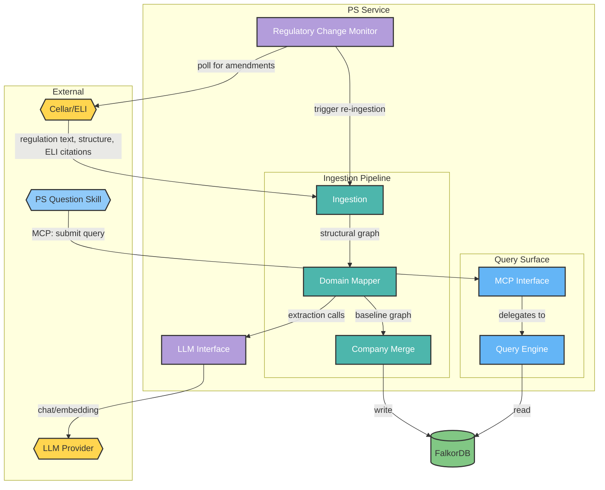
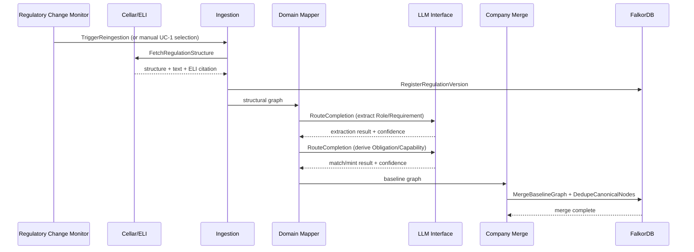
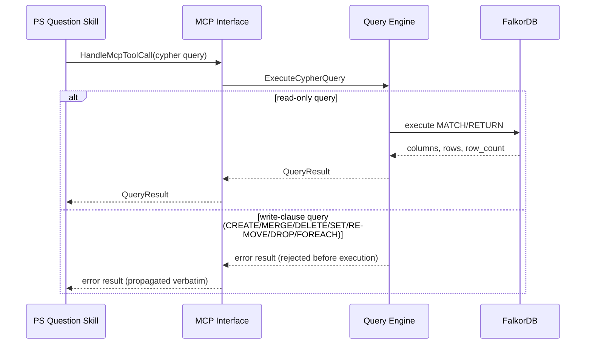

<!-- © 2026 Cartman ApS. All rights reserved. -->
# Policy System - Container - PS Service Architecture

**Status:** Draft
**Container:** PS Service

<!--
  Prerequisite note: this document was written without an approved IUD or
  Domain Terms artifact (neither exists in this repo yet), and against
  Draft-status Solution Architecture, Domain Concepts, and URS. Reconcile
  against those artifacts if/when they're created or approved.
-->

---

## Table of Contents

1. [Overview](#overview)
2. [C4 Component Level](#c4-component-level)
   - [C4 Component Diagram](#c4-component-diagram)
   - [C4 Component Overview](#c4-component-overview)
   - [Domain Concepts to Component Mapping](#domain-concepts-to-component-mapping)
3. [Components](#components)
   - [Ingestion](#ingestion)
   - [Domain Mapper](#domain-mapper)
   - [Company Merge](#company-merge)
   - [Query Engine](#query-engine)
   - [MCP Interface](#mcp-interface)
   - [Regulatory Change Monitor](#regulatory-change-monitor)
   - [LLM Interface](#llm-interface)
4. [Use Case Coverage Mapping](#use-case-coverage-mapping)
5. [NFR Implementation](#nfr-implementation)
6. [Implementation Guide](#implementation-guide)

---

## Overview

PS Service is the Policy System's backend container: it ingests EU regulations, maps them into the PS Conceptual Model compliance graph, merges them into a company's single-tenant graph, and serves read-only queries back to consuming clients.

### Container Purpose

- Ingest EU regulation structure/text from Cellar/ELI (replacing PDF extraction as the source of truth)
- Map ingested regulatory content into the PS Conceptual Model (Regulation/Role/Requirement/Obligation/Capability)
- Merge per-regulation baselines into a single-tenant compliance graph, with cross-regulation canonical convergence (Obligation/Capability reuse)
- Serve read-only Cypher queries to consuming clients, both directly (Query Engine) and via MCP (MCP Interface)
- Detect regulatory amendments and re-trigger ingestion for the affected regulation

### Container Architectural Pattern

Pipeline + query-surface split, not a layered web-app architecture:

- **Ingestion pipeline** (sequential, per-regulation): Ingestion → Domain Mapper → Company Merge
- **Query surface** (parallel, stateless, read-only): Query Engine, fronted by MCP Interface for the PS Question Skill client
- **Support**: Regulatory Change Monitor (triggers the pipeline), LLM Interface (shared infra used by Domain Mapper today)

A thin REST entry-point layer routes external requests to these components but is not itself a named component in the Solution Architecture's Component Breakdown, so it isn't documented as one here — see [Implementation Guide](#implementation-guide).

**Domain Path:** `ps.service`

---

## C4 Component Level

### C4 Component Diagram

**Diagram Legend:**
- **Hexagon shapes (yellow/blue):** External systems and clients
- **Cylinder (green):** Data store
- **Teal:** Ingestion pipeline components
- **Blue:** Query surface components
- **Purple:** Support components

### C4 Component Overview

| Component name | Domain Path | Key responsibilities |
|---|---|---|
| Ingestion | `ps.service.ingestion` | Fetch regulation structure/text from Cellar/ELI; register Regulation bibliographic metadata |
| Domain Mapper | `ps.service.domainmapper` | LLM-driven extraction of Role/Requirement; derive Obligation/Capability |
| Company Merge | `ps.service.companymerge` | Merge per-regulation baseline graphs into the single-tenant graph; dedupe canonical nodes |
| Query Engine | `ps.service.queryengine` | Execute read-only Cypher queries against the graph |
| MCP Interface | `ps.service.mcpinterface` | Expose Query Engine to PS Question Skill via MCP |
| Regulatory Change Monitor | `ps.service.changemonitor` | Poll Cellar/ELI for amendments; trigger re-ingestion |
| LLM Interface | `ps.service.llminterface` | Route chat/embedding requests to the configured LLM Provider via LiteLLM |

### Domain Concepts to Component Mapping

| Domain Concept | Component Name | Domain Path | Implementation Notes |
|---|---|---|---|
| Regulation | Ingestion | `ps.service.ingestion` | Bibliographic metadata (`title`, `jurisdiction`, `effective_date`, `version`) is direct Cellar/ELI structural data — no LLM extraction needed to create this node |
| Role | Domain Mapper | `ps.service.domainmapper` | LLM-extracted from Ingestion's structural output; `DEFINES` edge with `source_ref` |
| Requirement | Domain Mapper | `ps.service.domainmapper` | LLM-extracted; `EXPRESSES` edge with `source_ref` |
| Obligation | Domain Mapper (mint/match) + Company Merge (cross-regulation dedup) | `ps.service.domainmapper`, `ps.service.companymerge` | Domain Mapper matches/mints per-regulation; Company Merge resolves canonical convergence across regulations via the content-hash identity |
| Capability | Domain Mapper (mint/match) + Company Merge (cross-regulation dedup) | `ps.service.domainmapper`, `ps.service.companymerge` | Same split as Obligation |

**Not implemented by any PS Service component:** `Policy`, `Standard`, `Control`, `PracticeArea`, `RiskPath` — these are Governance-layer concepts authored by policy managers through the Policy Editor client, which is a separate, not-yet-designed container per the Solution Architecture doc. This document does not invent a mapping for them.

---

## Components

### Ingestion

#### Domain Concepts

##### Regulation

###### Constraints

| Constraint | Description |
|---|---|
| Read-only once created | Regulations are never modified in place; a new version supersedes the old via `SUPERSEDED_BY` (see [Regulatory Change Monitor](#regulatory-change-monitor)) |
| Natural-key identity | `{SHORT}-{VERSION}` (e.g. `CRA-1.0`) — no separate surrogate key |

###### Attributes

| Attribute | Description | Type | Min | Max | Rules |
|---|---|---|---|---|---|
| `id` | Same as Identity | string | — | — | Required |
| `title` | Regulation title | string | — | — | Required |
| `source_type` | `external` or `internal` | enum | — | — | Required |
| `jurisdiction` | Jurisdiction or org-unit scope | string | — | — | Required in practice for `external` |
| `effective_date` | ISO 8601 date | date | — | — | Required |
| `version` | Version string | string | — | — | Required |
| `status` | `active` \| `superseded` \| `vacated` | enum | — | — | Required |

#### Kind

| Kind | Framework | Language | Project Pattern | Namespace Pattern |
|---|---|---|---|---|
| Internal component (Python package) | None | Python 3.14 | `ps-service/src/ps_service/ingestion/` | `ps_service.ingestion` |

**Implementation Guidance:** Stateless — no persistent state of its own beyond what it writes to FalkorDB via `RegisterRegulationVersion`.

#### Implementation Registration

| Path | Purpose | Implements |
|---|---|---|
| `ps-service/src/ps_service/ingestion/__init__.py` | Package marker (scaffold only — no logic yet) | — |

#### Actions

| Action | Purpose | Authentication Required | Authorization Scope | Pre-conditions | Post-conditions | Side Effects | External Dependencies | Processing Time (SLA) | Idempotent | Error Handling Strategy |
|---|---|---|---|---|---|---|---|---|---|---|
| FetchRegulationStructure | Fetch a regulation's document structure (TITLE/CHAPTER/SECTION/ARTICLE/PARAGRAPH) and verbatim text from Cellar/ELI by ELI citation | No (deferred — see SA Risks & Concerns) | n/a (deferred) | ELI identifier is known/selected | Structural text staged for Domain Mapper; no graph writes yet | None (read-only against Cellar/ELI) | Cellar/ELI | Best-effort; no target set | Yes | Return a clear fetch error if the ELI reference doesn't resolve or Cellar/ELI is unreachable; no partial state |
| RegisterRegulationVersion | Create/update the Regulation node's bibliographic metadata directly from Cellar/ELI's structured metadata | No (deferred) | n/a (deferred) | FetchRegulationStructure succeeded | Regulation node exists with `status: active`; prior version's `SUPERSEDED_BY` set if this is a new version | Writes to FalkorDB | FalkorDB | < 2s | Yes (same id+version → no duplicate) | Reject with a clear error if required properties are missing from Cellar/ELI metadata; no partial node |

---

### Domain Mapper

#### Domain Concepts

##### Role

###### Constraints

| Constraint | Description |
|---|---|
| Immutable once created | Stable reference data that Obligations attach to |
| Regulation-scoped identity | Distinct nodes per defining regulation, even for semantically similar roles across regulations |

###### Attributes

| Attribute | Description | Type | Min | Max | Rules |
|---|---|---|---|---|---|
| `name` | Role name | string | — | — | Required |
| `description` | Free-text description | string | — | — | Optional |
| `confidence` | Extraction confidence | float | 0.0 | 1.0 | Required, always recorded |

##### Requirement

###### Constraints

| Constraint | Description |
|---|---|
| Read-only once created | Only deprecated when superseded by a new regulation version |
| Paragraph-level granularity | One Requirement per independently-bundled duty, not per article |

###### Attributes

| Attribute | Description | Type | Min | Max | Rules |
|---|---|---|---|---|---|
| `text` | Requirement text | string | — | — | Required |
| `type` | `requirement` \| `prohibition` \| `recommendation` | enum | — | — | Required |
| `status` | `active` \| `deprecated` | enum | — | — | Optional |
| `confidence` | Extraction confidence | float | 0.0 | 1.0 | Required, always recorded |

##### Obligation / Capability

See [Domain Concepts to Component Mapping](#domain-concepts-to-component-mapping) — Domain Mapper performs the per-regulation match/mint step; full attribute tables are documented once, under [Company Merge](#company-merge), which owns cross-regulation convergence for both.

#### Kind

| Kind | Framework | Language | Project Pattern | Namespace Pattern |
|---|---|---|---|---|
| Internal component (Python package) | None (calls LLM Interface) | Python 3.14 | `ps-service/src/ps_service/domain_mapper/` | `ps_service.domain_mapper` |

**Implementation Guidance:** LLM-extraction results always carry a `confidence` score — never dropped, even for low-confidence extractions (confidence review is a downstream/governance concern, not this component's job to gate).

#### Implementation Registration

| Path | Purpose | Implements |
|---|---|---|
| `ps-service/src/ps_service/domain_mapper/__init__.py` | Package marker (scaffold only — no logic yet) | — |

#### Actions

| Action | Purpose | Authentication Required | Authorization Scope | Pre-conditions | Post-conditions | Side Effects | External Dependencies | Processing Time (SLA) | Idempotent | Error Handling Strategy |
|---|---|---|---|---|---|---|---|---|---|---|
| ExtractRolesAndRequirements | LLM-driven extraction of Role/Requirement from structural text, with `DEFINES`/`EXPRESSES` edges carrying `source_ref` | No (deferred) | n/a (deferred) | `RegisterRegulationVersion` completed for this regulation | Role/Requirement nodes exist with confidence scores and provenance edges | Writes to FalkorDB; calls LLM Interface | LLM Interface, FalkorDB | Not yet set — bounded by LLM latency | No (LLM extraction is not guaranteed deterministic) | Low-confidence extractions are recorded, not dropped |
| DeriveObligationsAndCapabilities | Match/mint Obligation per Requirement (`HAS`/`SATISFIED_BY`); match/mint Capability per Obligation (`REQUIRES`) | No (deferred) | n/a (deferred) | ExtractRolesAndRequirements completed | Every Requirement has ≥1 `SATISFIED_BY`; every Obligation has ≥1 `REQUIRES` | Writes to FalkorDB; calls LLM Interface | LLM Interface, FalkorDB | Not yet set | No | A Requirement that can't be matched/satisfied is surfaced, not silently skipped |

---

### Company Merge

#### Domain Concepts

##### Obligation

###### Constraints

| Constraint | Description |
|---|---|
| Canonical, regulation-independent identity | `obl_{slug}_{hash}` derived from duty statement only — enables reuse across regulations |
| No `source_ref` | Provenance is recoverable transitively via `SATISFIED_BY` → `EXPRESSES`; never duplicated onto this node |

###### Attributes

| Attribute | Description | Type | Min | Max | Rules |
|---|---|---|---|---|---|
| `text` | Canonical duty statement | string | — | — | Required |
| `confidence` | Match/mint confidence | float | 0.0 | 1.0 | Required, always recorded |

##### Capability

###### Constraints

| Constraint | Description |
|---|---|
| Canonical, regulation-independent identity | `cap_{slug}_{hash}` derived from `name` alone — deliberately excludes the requiring Obligation, so equivalent capabilities converge across obligations instead of fragmenting |

###### Attributes

| Attribute | Description | Type | Min | Max | Rules |
|---|---|---|---|---|---|
| `name` | Capability name | string | — | — | Required |
| `description` | Free-text description | string | — | — | Optional |
| `type` | e.g. `technical`, `organizational` | string | — | — | Optional |
| `status` | `active` \| `deprecated` | enum | — | — | Optional |
| `confidence` | Match/mint confidence | float | 0.0 | 1.0 | Required, always recorded |

#### Kind

| Kind | Framework | Language | Project Pattern | Namespace Pattern |
|---|---|---|---|---|
| Internal component (Python package) | None | Python 3.14 | `ps-service/src/ps_service/company_merge/` | `ps_service.company_merge` |

**Implementation Guidance:** Add/merge-only — per UC-1, adding a regulation never modifies or deletes existing customer data.

#### Implementation Registration

| Path | Purpose | Implements |
|---|---|---|
| `ps-service/src/ps_service/company_merge/__init__.py` | Package marker (scaffold only — no logic yet) | — |

#### Actions

| Action | Purpose | Authentication Required | Authorization Scope | Pre-conditions | Post-conditions | Side Effects | External Dependencies | Processing Time (SLA) | Idempotent | Error Handling Strategy |
|---|---|---|---|---|---|---|---|---|---|---|
| MergeBaselineGraph | Merge a regulation's baseline graph into the company's single-tenant graph | No (deferred) | n/a (deferred) | DeriveObligationsAndCapabilities completed | All baseline nodes/edges exist in the company graph; existing data untouched | Writes to FalkorDB | FalkorDB | < 5s per regulation (draft target) | Yes | Abort with no partial write on ambiguous canonical-identity collisions; surface for manual resolution |
| DedupeCanonicalNodes | Resolve Obligation/Capability convergence — merge onto an existing canonical node instead of duplicating | No (deferred) | n/a (deferred) | Runs as part of MergeBaselineGraph | No duplicate Obligation/Capability for the same canonical identity; incoming edges rewired to the canonical node | Writes to FalkorDB (edge rewiring) | FalkorDB | Included in MergeBaselineGraph's SLA | Yes | Same as MergeBaselineGraph |

---

### Query Engine

#### Domain Concepts

None — reads across all concepts, owns none.

#### Kind

| Kind | Framework | Language | Project Pattern | Namespace Pattern |
|---|---|---|---|---|
| Internal component (Python package) | None | Python 3.14 | `ps-service/src/ps_service/query_engine/` | `ps_service.query_engine` |

**Implementation Guidance:** Read-only enforcement (rejecting write clauses) happens once, here — MCP Interface delegates rather than reimplementing the guard.

#### Implementation Registration

| Path | Purpose | Implements |
|---|---|---|
| `ps-service/src/ps_service/query_engine/__init__.py` | Package marker (scaffold only — no logic yet) | — |

#### Actions

| Action | Purpose | Authentication Required | Authorization Scope | Pre-conditions | Post-conditions | Side Effects | External Dependencies | Processing Time (SLA) | Idempotent | Error Handling Strategy |
|---|---|---|---|---|---|---|---|---|---|---|
| ExecuteCypherQuery | Execute a read-only Cypher query against the graph, return results with structure suitable for provenance tracing | No (deferred) | Read-only enforced at execution (write clauses rejected before execution) | Query is syntactically valid Cypher | None (read-only) | None | FalkorDB | < 2s (draft target, not load-tested) | Yes | Reject write-clause queries with a clear `error:` result, not a stack trace; surface FalkorDB errors verbatim |

---

### MCP Interface

#### Domain Concepts

None — transport layer.

#### Kind

| Kind | Framework | Language | Project Pattern | Namespace Pattern |
|---|---|---|---|---|
| Internal component (Python package) | `mcp` SDK | Python 3.14 | `ps-service/src/ps_service/mcp_interface/` | `ps_service.mcp_interface` |

**Implementation Guidance:** Seeded from the existing `tools/graph-query/{mcp_server.py, ps.py}` prototype. Delegates to Query Engine for execution — do not re-implement the write-clause guard here.

#### Implementation Registration

| Path | Purpose | Implements |
|---|---|---|
| `ps-service/src/ps_service/mcp_interface/__init__.py` | Package marker (scaffold only — no logic yet; seed migration from `tools/graph-query/` still pending) | — |

#### Actions

| Action | Purpose | Authentication Required | Authorization Scope | Pre-conditions | Post-conditions | Side Effects | External Dependencies | Processing Time (SLA) | Idempotent | Error Handling Strategy |
|---|---|---|---|---|---|---|---|---|---|---|
| HandleMcpToolCall | Accept an MCP `cypher` tool call from PS Question Skill, delegate to Query Engine, return results over MCP | No (deferred) | Same read-only enforcement as Query Engine (delegated, not reimplemented) | MCP client is connected | None (delegates to a read-only action) | None | Query Engine (internal call) | Bounded by Query Engine's SLA plus MCP transport overhead | Yes | Propagate Query Engine's error result verbatim; do not reinterpret or mask it |

---

### Regulatory Change Monitor

#### Domain Concepts

None new — maintains `Regulation.SUPERSEDED_BY`, documented under [Ingestion](#ingestion).

#### Kind

| Kind | Framework | Language | Project Pattern | Namespace Pattern |
|---|---|---|---|---|
| Internal component (Python package) | None | Python 3.14 | `ps-service/src/ps_service/change_monitor/` | `ps_service.change_monitor` |

**Implementation Guidance:** Delta report shape/mechanism is under exploration (per Solution Architecture) — do not assume a shape here that the SA doc doesn't already commit to.

#### Implementation Registration

| Path | Purpose | Implements |
|---|---|---|
| `ps-service/src/ps_service/change_monitor/__init__.py` | Package marker (scaffold only — no logic yet) | — |

#### Actions

| Action | Purpose | Authentication Required | Authorization Scope | Pre-conditions | Post-conditions | Side Effects | External Dependencies | Processing Time (SLA) | Idempotent | Error Handling Strategy |
|---|---|---|---|---|---|---|---|---|---|---|
| PollForAmendments | Periodically poll Cellar/ELI for amendments to tracked regulations | No (deferred) | n/a (deferred) | ≥1 Regulation node with `status: active` exists | Delta report produced (shape under exploration) | None (read-only against Cellar/ELI) | Cellar/ELI, FalkorDB (read) | Polling interval not yet decided | Yes | A failed poll retries next cycle; does not block other regulations |
| TriggerReingestion | For an amended regulation, trigger a new Ingestion → Domain Mapper → Company Merge cycle; set `SUPERSEDED_BY` once the new version registers | No (deferred) | n/a (deferred) | PollForAmendments detected a real new ELI version | New Regulation version exists; `SUPERSEDED_BY` links old → new; new baseline merged per add/merge-only rule | Triggers Ingestion/Domain Mapper/Company Merge | Ingestion, Domain Mapper, Company Merge (internal calls) | Not yet set | Yes (re-triggering an already-processed version is a no-op) | A failed cycle leaves the prior version's status untouched — never record supersession without a landed replacement |

---

### LLM Interface

#### Domain Concepts

None — shared infrastructure utility.

#### Kind

| Kind | Framework | Language | Project Pattern | Namespace Pattern |
|---|---|---|---|---|
| Internal component (Python package) | LiteLLM | Python 3.14 | `ps-service/src/ps_service/llm_interface/` | `ps_service.llm_interface` |

**Implementation Guidance:** Provider-agnostic — abstracts provider-specific credentials/config away from Domain Mapper (and potentially Query Engine/Regulatory Change Monitor later, per Solution Architecture).

#### Implementation Registration

| Path | Purpose | Implements |
|---|---|---|
| `ps-service/src/ps_service/llm_interface/__init__.py` | Package marker (scaffold only — no logic yet) | — |

#### Actions

| Action | Purpose | Authentication Required | Authorization Scope | Pre-conditions | Post-conditions | Side Effects | External Dependencies | Processing Time (SLA) | Idempotent | Error Handling Strategy |
|---|---|---|---|---|---|---|---|---|---|---|
| RouteCompletion | Route a chat/embedding request from a consuming component to the configured LLM Provider via LiteLLM | No (internal call) | n/a | LLM Provider is configured (LiteLLM routing config present) | None beyond returning the completion | Network call to LLM Provider; potential cost/quota consumption | LLM Provider (via LiteLLM) | Bounded by provider latency; no target set | No (LLM completions are not guaranteed deterministic) | Provider errors (rate limit, timeout, auth failure) surface as a typed error to the caller; retry policy is provider-config-driven, not hardcoded |

---

## Action Sequence Diagrams

### Ingestion pipeline — happy path (UC-1)

### Query path — happy path and error scenario

---

## Use Case Coverage Mapping

| Use Case | Components | Coverage Notes |
|---|---|---|
| UC-1: Select and add a regulation to the system | Ingestion, Domain Mapper, Company Merge, Regulatory Change Monitor | Fully covered by this container's ingestion pipeline |
| UC-2: Govern internal regulations | Ingestion, Domain Mapper, Company Merge | Same mechanism as UC-1 (`source_type: internal`). **Inherited gap from Solution Architecture, not resolved here:** no human role/component is confirmed as the one who triggers ingestion of internal regulations |
| UC-3: Govern policy/standard/control content | **Not covered by this container** | Belongs to Policy Editor (separate, not-yet-designed container per Solution Architecture) |
| Query regulations and policies (unlabeled in URS) | MCP Interface (delegates to Query Engine) | Fully covered |

---

## NFR Implementation

The Solution Architecture's own NFR Realization table is currently an unpopulated placeholder — no NFRs have been decided at the container level yet for this container to implement. This section is deferred until that upstream table is filled in; it should not be populated speculatively ahead of it.

---

## Implementation Guide

Implementation details (packages, middleware, configuration, testing infrastructure) live in the project's L2 coding standards — [`docs/coding-standards/python.instructions.md`](../coding-standards/python.instructions.md) — not here. This document records WHAT components exist and HOW they interact; the L2 doc records HOW to build them.

The REST entry-point layer (`ps-service/src/ps_service/api/`) that routes external PS-Cli/Policy Editor requests to these components is implementation wiring, not a named component — see [Container Architectural Pattern](#container-architectural-pattern).

---

*End of Document*
