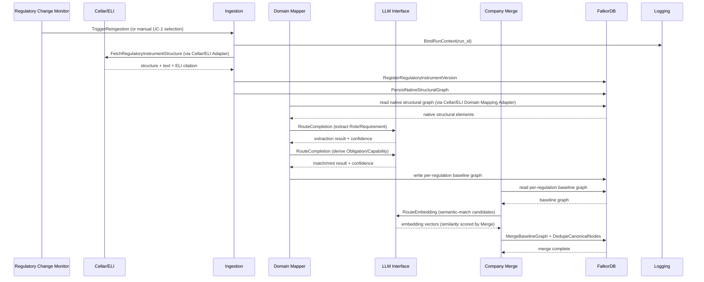
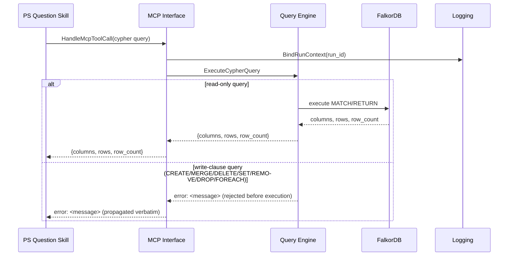
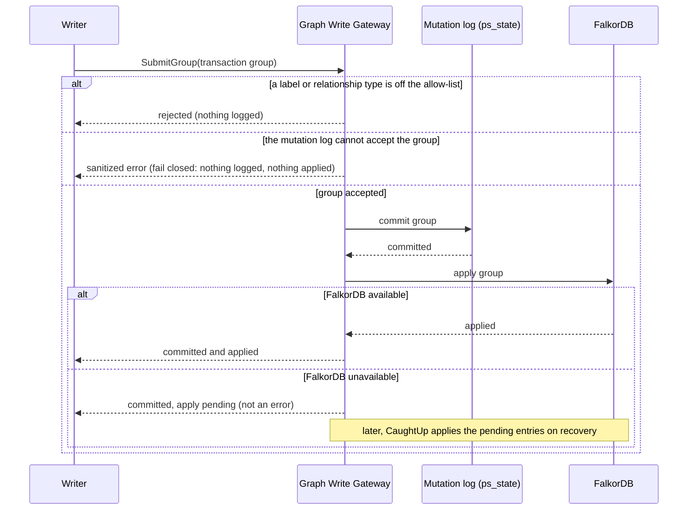

<!-- © 2026 Cartman ApS. All rights reserved. -->
# Policy System - Container - PS Service Architecture

**Status:** Draft
**Container:** PS Service

<!--
  Prerequisite note: this document was written without an approved IUD or
  Domain Terms artifact (neither exists in this repo yet), and against
  Draft-status Solution Architecture, Domain Concepts, and URS. Reconcile
  against those artifacts if/when they're created or approved.
-->

---

## Table of Contents

1. [Overview](#overview)
2. [C4 Component Level](#c4-component-level)
   - [C4 Component Diagram](#c4-component-diagram)
   - [C4 Component Overview](#c4-component-overview)
   - [Domain Concepts to Component Mapping](#domain-concepts-to-component-mapping)
3. [Components](#components)
   - [Ingestion](#ingestion)
   - [Domain Mapper](#domain-mapper)
   - [Company Merge](#company-merge)
   - [Export](#export)
   - [Restore](#restore)
   - [Curated Source](#curated-source)
   - [Invitations](#invitations)
   - [Query Engine](#query-engine)
   - [MCP Interface](#mcp-interface)
   - [Authentication](#authentication)
   - [Authorization](#authorization)
   - [Policy Lifecycle](#policy-lifecycle)
   - [Graph Cleanup](#graph-cleanup)
   - [Regulatory Change Monitor](#regulatory-change-monitor)
   - [LLM Interface](#llm-interface)
   - [Logging](#logging)
   - [Dependency Health](#dependency-health)
   - [Passkey Signing](#passkey-signing)
   - [Audit](#audit)
   - [Graph Write Gateway](#graph-write-gateway)
   - [Persistence](#persistence)
   - [Runtime Config](#runtime-config)
   - [Ingestion Runs](#ingestion-runs)
   - [Process Harness](#process-harness)
4. [Use Case Coverage Mapping](#use-case-coverage-mapping)
5. [NFR Implementation](#nfr-implementation)
6. [Implementation Guide](#implementation-guide)

---

## Overview

PS Service is the Policy System's backend container: it ingests EU regulations, maps them into the PS Conceptual Model (`ps-domain-concepts.md`) compliance graph, merges them into a company's single-tenant graph, and serves read-only queries back to consuming clients.

### Container Purpose

- Ingest EU regulation structure/text from Cellar/ELI (replacing PDF extraction as the source of truth)
- Map ingested regulatory content into the PS Conceptual Model — external regulations through Role/Requirement/Obligation/Capability; internal regulations (Business SoPs) continuing through Policy/Standard/Control via their own paired adapter
- Merge per-regulation baselines into a single-tenant compliance graph, with cross-regulation canonical convergence at Capability (and Policy for internal-SoP-derived instances); Role/Requirement/Obligation are source-scoped and passed through, not converged
- Serve read-only Cypher queries to consuming clients via MCP (MCP Interface), with guarded execution owned by Query Engine — MCP Interface is currently the only access path; no direct/REST query path exists yet
- Detect regulatory amendments and re-trigger ingestion for the affected regulation

### Container Architectural Pattern

Pipeline + query-surface split, not a layered web-app architecture:

- **Ingestion pipeline** (sequential, per-regulation): Ingestion → Domain Mapper → Company Merge
- **Query surface** (parallel, stateless, read-only): Query Engine, fronted by MCP Interface for the PS Question Skill client
- **Support**: Regulatory Change Monitor (triggers the pipeline), LLM Interface (shared infra used by Domain Mapper and Company Merge today), Logging (shared infra used by every component for structured/semantic debug logging)

A thin REST entry-point layer routes external requests to these components but is not itself a named component in the Solution Architecture's Component Breakdown, so it isn't documented as one here — see [Implementation Guide](#implementation-guide).

**Domain Path:** `ps.service`

---

## C4 Component Level

### C4 Component Diagram

```mermaid
graph TB
    subgraph External["External"]
        Cellar{{Cellar/ELI}}
        LLMProvider{{LLM Provider}}
        PSSkill{{PS Question Skill}}
        CuratedContentSource{{Curated Content Source}}
        Authentik{{Authentik}}
    end

    subgraph PSService["PS Service"]
        subgraph Pipeline["Ingestion Pipeline"]
            Ingestion[Ingestion]
            DomainMapper[Domain Mapper]
            CompanyMerge[Company Merge]
        end

        subgraph Curation["Curation"]
            Export[Export]
            Restore[Restore]
            CuratedSource[Curated Source]
        end

        subgraph QuerySurface["Query Surface"]
            QueryEngine[Query Engine]
            MCPInterface[MCP Interface]
        end

        subgraph AccessControl["Access Control"]
            Authentication[Authentication]
            Authorization[Authorization]
            PasskeySigning[Passkey Signing]
            Invitations[Invitations]
        end

        subgraph Governance["Governance"]
            PolicyLifecycle[Policy Lifecycle]
            GraphCleanup[Graph Cleanup]
            Audit[Audit]
            GraphWriteGateway[Graph Write Gateway]
            Persistence[Persistence]
            RuntimeConfig[Runtime Config]
            IngestionRuns[Ingestion Runs]
        end

        ChangeMonitor[Regulatory Change Monitor]
        LLMInterface[LLM Interface]
        Logging[Logging]
        LogFiles[(logs/)]
        DependencyHealth[Dependency Health]
        ProcessHarness[Process Harness]
    end

    FalkorDB[(FalkorDB)]
    PSPostgres[(PS Postgres: ps_state, ps_signing)]

    Cellar -->|"regulation text, structure, ELI citations"| Ingestion
    ChangeMonitor -->|"poll for amendments"| Cellar
    ChangeMonitor -->|"trigger re-ingestion"| Ingestion
    ChangeMonitor -->|"submit succession and re-ingest marker writes"| GraphWriteGateway

    %% Graph Write Gateway and its edges: target design (not yet implemented; delivered by #205-#214)
    Ingestion -->|"submit native graph writes"| GraphWriteGateway
    DomainMapper -->|"read native graph"| FalkorDB
    DomainMapper -->|"submit per-regulation baseline graph writes"| GraphWriteGateway
    CompanyMerge -->|"read per-regulation baseline graph"| FalkorDB
    CompanyMerge -->|"submit company graph writes"| GraphWriteGateway
    CompanyMerge -->|"submit Capability embedding backfills ({short}_baseline)"| GraphWriteGateway

    Export -->|"read {short}_baseline / {short}_native"| FalkorDB
    Export -->|"submit Capability/Policy embedding backfills ({short}_baseline)"| GraphWriteGateway
    Restore -->|"submit {short}_native / {short}_baseline / policy_system writes"| GraphWriteGateway

    CuratedContentSource -->|"catalog.json; manifest/baseline/native.json"| CuratedSource
    CuratedSource -->|"get/set/reset override"| RuntimeConfig
    CuratedSource -->|"fetched, unverified artifact"| Restore
    MCPInterface -->|"delegates to"| CuratedSource

    DomainMapper -->|"extraction calls"| LLMInterface
    CompanyMerge -->|"semantic convergence calls (embeddings)"| LLMInterface
    Export -->|"RouteEmbedding calls"| LLMInterface
    LLMInterface -->|"chat/embedding"| LLMProvider

    QueryEngine -->|"read"| FalkorDB
    MCPInterface -->|"delegates to"| QueryEngine
    PSSkill -->|"MCP: submit query"| MCPInterface

    MCPInterface -->|"verify bearer token"| Authentication
    Authentication -->|"OIDC discovery, JWKS"| Authentik
    Authentication -->|"log entries"| Logging

    MCPInterface -->|"grant/revoke/list access roles; require_role checks"| Authorization
    CuratedSource -->|"SystemAdmin check"| Authorization
    Authorization -->|"read/write access_role_assignments (ps_state)"| PSPostgres
    Authorization -->|"record/query audit_events"| Audit
    Authorization -->|"log entries"| Logging

    MCPInterface -->|"create/propose/approve/reject/revert/edit policy drafts"| PolicyLifecycle
    PolicyLifecycle -->|"read Policy/Standard/Control tree (policy_system)"| FalkorDB
    PolicyLifecycle -->|"submit Policy/Standard/Control tree writes"| GraphWriteGateway
    PolicyLifecycle -->|"record policy.* audit events"| Audit
    PolicyLifecycle -->|"require_role / resolve_active_roles"| Authorization

    MCPInterface -->|"discover/preview/approve/check duplicate-node cleanup (ComplianceOfficer)"| GraphCleanup
    GraphCleanup -->|"read (policy_system)"| FalkorDB
    GraphCleanup -->|"submit merge/release/unmerge writes"| GraphWriteGateway
    GraphCleanup -->|"require_role(ComplianceOfficer), re-checked at execution"| Authorization
    GraphCleanup -->|"create/check pending approvals"| PasskeySigning
    GraphCleanup -->|"record capability.*/obligation.* audit events; read merge history"| Audit
    PasskeySigning -->|"execute registered action on signed assertion"| GraphCleanup
    GraphCleanup -->|"log entries"| Logging

    MCPInterface -->|"near_misses_resolve (merge): create/check pending approval"| PasskeySigning
    PasskeySigning -->|"read/write pending_approvals, signing_credentials (ps_signing)"| PSPostgres
    PasskeySigning -->|"execute near-miss merge on signed assertion"| CompanyMerge
    PasskeySigning -->|"log entries"| Logging

    MCPInterface -->|"invite_user: create Authentik invitation"| Invitations
    Invitations -->|"POST invitation (service credential)"| Authentik

    MCPInterface -->|"start_ingestion / get_ingestion_status"| IngestionRuns
    IngestionRuns -->|"read/write ingestion_runs (ps_state)"| PSPostgres
    IngestionRuns -->|"record ingestion_run.* audit events"| Audit
    Ingestion -->|"record sync ingestion_run.* audit events (REST + MCP orchestration)"| Audit
    ChangeMonitor -->|"record amendment_check ingestion_run.* audit events"| Audit
    Restore -->|"record instrument.restore audit events"| Audit
    CompanyMerge -->|"record near_miss.resolve audit events"| Audit
    Invitations -->|"record user.invite audit events"| Audit
    RuntimeConfig -->|"record runtime_config.* audit events"| Audit
    RuntimeConfig -->|"read/write runtime_config (ps_state)"| PSPostgres
    Audit -->|"read/write audit_events (ps_state)"| PSPostgres

    ProcessHarness -->|"apply_pending_migrations (audit, authz, runtime_config, ingestion_runs)"| Persistence
    ProcessHarness -->|"verify_privileged_migrations (graph_gateway, read-only)"| Persistence
    Persistence -->|"connect / migrate (ps_state)"| PSPostgres
    Persistence -->|"privileged provisioning (admin)"| PSPostgres
    Persistence -->|"log entries"| Logging
    GraphWriteGateway -->|"apply writes; replay"| FalkorDB
    GraphWriteGateway -->|"append/read mutation log (ps_state)"| PSPostgres
    GraphWriteGateway -->|"log entries"| Logging

    Ingestion -->|"record health"| DependencyHealth
    LLMInterface -->|"record health"| DependencyHealth
    Persistence -->|"record health (ps_state)"| DependencyHealth
    GraphWriteGateway -->|"record health"| DependencyHealth
    Audit -->|"record health (ps_state)"| DependencyHealth
    RuntimeConfig -->|"record health (ps_state)"| DependencyHealth
    IngestionRuns -->|"record health (ps_state)"| DependencyHealth
    PasskeySigning -->|"record health (ps_signing)"| DependencyHealth
    DependencyHealth -->|"read for /ready"| ProcessHarness

    ProcessHarness -->|"startup CheckConnectivity"| FalkorDB
    ProcessHarness -->|"startup CheckConnectivity"| LLMInterface
    ProcessHarness -->|"startup CheckConnectivity"| Cellar
    ProcessHarness -->|"resolve_auth_context (startup)"| Authentication
    ProcessHarness -->|"require_bootstrap_owner_configured (startup)"| Authorization
    ProcessHarness -->|"require_authentik_credential_configured (startup)"| Invitations
    ProcessHarness -->|"log entries"| Logging

    Ingestion -->|"log entries"| Logging
    DomainMapper -->|"log entries"| Logging
    CompanyMerge -->|"log entries"| Logging
    Export -->|"log entries"| Logging
    Restore -->|"log entries"| Logging
    CuratedSource -->|"log entries"| Logging
    QueryEngine -->|"log entries"| Logging
    MCPInterface -->|"log entries"| Logging
    ChangeMonitor -->|"log entries"| Logging
    LLMInterface -->|"log entries"| Logging
    Logging -->|"write JSON lines"| LogFiles

    style Cellar fill:#FFD54F,stroke:#333,stroke-width:2px,color:#333
    style LLMProvider fill:#FFD54F,stroke:#333,stroke-width:2px,color:#333
    style PSSkill fill:#90CAF9,stroke:#333,stroke-width:2px,color:#333
    style CuratedContentSource fill:#FFD54F,stroke:#333,stroke-width:2px,color:#333
    style Authentik fill:#FFD54F,stroke:#333,stroke-width:2px,color:#333
    style FalkorDB fill:#81C784,stroke:#333,stroke-width:2px,color:#333
    style PSPostgres fill:#81C784,stroke:#333,stroke-width:2px,color:#333
    style LogFiles fill:#CFD8DC,stroke:#333,stroke-width:2px,color:#333

    style Ingestion fill:#4DB6AC,stroke:#333,stroke-width:2px,color:#FFFFFF
    style DomainMapper fill:#4DB6AC,stroke:#333,stroke-width:2px,color:#FFFFFF
    style CompanyMerge fill:#4DB6AC,stroke:#333,stroke-width:2px,color:#FFFFFF
    style Export fill:#4DB6AC,stroke:#333,stroke-width:2px,color:#FFFFFF
    style Restore fill:#4DB6AC,stroke:#333,stroke-width:2px,color:#FFFFFF
    style CuratedSource fill:#4DB6AC,stroke:#333,stroke-width:2px,color:#FFFFFF
    style PolicyLifecycle fill:#4DB6AC,stroke:#333,stroke-width:2px,color:#FFFFFF
    style GraphCleanup fill:#4DB6AC,stroke:#333,stroke-width:2px,color:#FFFFFF
    style QueryEngine fill:#64B5F6,stroke:#333,stroke-width:2px,color:#FFFFFF
    style MCPInterface fill:#64B5F6,stroke:#333,stroke-width:2px,color:#FFFFFF
    style ChangeMonitor fill:#B39DDB,stroke:#333,stroke-width:2px,color:#FFFFFF
    style LLMInterface fill:#B39DDB,stroke:#333,stroke-width:2px,color:#FFFFFF
    style Authentication fill:#B39DDB,stroke:#333,stroke-width:2px,color:#FFFFFF
    style Authorization fill:#B39DDB,stroke:#333,stroke-width:2px,color:#FFFFFF
    style PasskeySigning fill:#B39DDB,stroke:#333,stroke-width:2px,color:#FFFFFF
    style Invitations fill:#B39DDB,stroke:#333,stroke-width:2px,color:#FFFFFF
    style Audit fill:#B39DDB,stroke:#333,stroke-width:2px,color:#FFFFFF
    style Persistence fill:#B39DDB,stroke:#333,stroke-width:2px,color:#FFFFFF
    style GraphWriteGateway fill:#B39DDB,stroke:#333,stroke-width:2px,color:#FFFFFF
    style RuntimeConfig fill:#B39DDB,stroke:#333,stroke-width:2px,color:#FFFFFF
    style IngestionRuns fill:#B39DDB,stroke:#333,stroke-width:2px,color:#FFFFFF
    style DependencyHealth fill:#B39DDB,stroke:#333,stroke-width:2px,color:#FFFFFF
    style ProcessHarness fill:#B39DDB,stroke:#333,stroke-width:2px,color:#FFFFFF
    style Logging fill:#B39DDB,stroke:#333,stroke-width:2px,color:#FFFFFF
```

**Diagram Legend:**
- **Hexagon shapes (yellow/blue):** External systems and clients
- **Cylinder (green):** Data store
- **Teal:** Ingestion pipeline and policy-lifecycle components (core internal domain writes)
- **Blue:** Query surface components
- **Purple:** Support components (access control, audit/persistence/config, dependency health, process harness)

### C4 Component Overview

| Component name | Domain Path | Key responsibilities |
|---|---|---|
| Ingestion | `ps.service.ingestion` | Fetch regulation structure/text via a pluggable Ingestion Adapter (Cellar/ELI first); register RegulatoryInstrument bibliographic metadata; persist the source's native structural graph to FalkorDB |
| Domain Mapper | `ps.service.domainmapper` | Read a source's native structural graph via a paired Domain Mapping Adapter; LLM-driven extraction of Role/Requirement; derive Obligation/Capability |
| Company Merge | `ps.service.companymerge` | Merge per-regulation baseline graphs into the single-tenant graph; dedupe canonical nodes |
| Export | `ps.service.export` | Serialize an already-ingested instrument's `{short}_baseline`/`{short}_native` graphs into a curated, checksummed, schema-versioned artifact for `curated-content/`; backfill Capability/Policy embeddings onto the source baseline graph so restore never needs a live LLM call |
| Restore | `ps.service.restore` | Verify a curated artifact's checksum and `schema_version`, then load it into a target deployment: baseline via an offline replay of Company Merge's own Capability dedup/convergence, native as a straight load, both atomically; an internal instrument's Policy/Standard/Control tree is imported as `draft`, owned by the restoring caller |
| Curated Source | `ps.service.curatedsource` | Fetch the curated catalog listing and, on demand, one instrument's artifact (manifest/baseline/native) from a configurable HTTP(S) source at runtime; keep a runtime override of that source as a registered key in Runtime Config, taking precedence over the env-var/default when present; fails closed when the override cannot be read |
| Invitations | `ps.service.invitations` | Create single-use Authentik enrollment invites on behalf of the `invite_user` MCP tool, calling Authentik's invitation-stage API (`POST /api/v3/stages/invitation/invitations/`) with PS Service's own configured service credential (`PS_AUTHENTIK_API_TOKEN`/`PS_AUTHENTIK_BASE_URL`) — never a caller-supplied token; fails closed at process startup when either credential is unset |
| Query Engine | `ps.service.queryengine` | Execute read-only Cypher queries against the graph |
| MCP Interface | `ps.service.mcpinterface` | Expose Query Engine to PS Question Skill via MCP |
| Authentication | `ps.service.auth` | Validate OIDC bearer tokens for both REST and MCP Interface via one shared verifier; fail closed at startup when auth config and the local-test bypass are both absent |
| Authorization | `ps.service.authz` | Enforce RBAC (`AccessRole`) and ABAC (`AccessRule`) checks for both REST and MCP Interface; own the role-assignment table in the PS state Postgres; record every grant/revoke through the shared Audit component; fails closed on store unavailability |
| Policy Lifecycle | `ps.service.policylifecycle` | Enforce the draft → proposed → approved → deprecated governance workflow for Policy/Standard/Control; cascading tree transitions, self-approval block, versioning/SUPERSEDED_BY building blocks, audit integration via ps.service.audit |
| Graph Cleanup | `ps.service.graphcleanup` | Let a Compliance Officer find near-duplicate Capabilities and duplicate Obligations (same Role) and, after a preview and a signed passkey approval, merge them, release a Capability from a draft governing Policy, or reverse a merge; every edit is audited before it is applied, from a before/after snapshot that makes it reversible |
| Regulatory Change Monitor | `ps.service.changemonitor` | Poll Cellar/ELI for amendments; trigger re-ingestion |
| LLM Interface | `ps.service.llminterface` | Route chat/embedding requests to the configured LLM Provider via LiteLLM |
| Logging | `ps.service.logging` | Provide structured, semantic logging for every component; write JSON entries to file; bind a correlation (run) ID at primary-use-case entry points |
| Dependency Health | `ps.service.dependencyhealth` | Process-wide registry of whether FalkorDB, LLM Interface, and Cellar/ELI were reachable on their most recent real call; fed by those components' own exception handling, read by Process Harness for `/ready` |
| Passkey Signing | `ps.service.passkeysigning` | Own WebAuthn relying party for transaction-signing (independent of the OIDC login IdP); PS-Service-owned store in the separate `ps_signing` database of the PS Postgres server for enrolled signing credentials and pending-approval records; dynamically-bound challenge construction/verification; companion-browser enrollment/signing ceremony pages |
| Audit | `ps.service.audit` | Shared, insert-only audit trail (`audit_events` in the PS state Postgres) for every component that records who did what to what; validates each action's typed `details` against its registered model; writes in the caller's transaction so the audit row and the state change commit or roll back together; operations whose effect is outside Postgres (ingestion, restore, near-miss resolve, invite, `check_regulations` re-ingests) write an opening row first (fail-closed: if it cannot be written the operation does not run) and a best-effort terminal row (issue #195); `list-audit-events` supports an allow-listed `details` filter (`celex`, `regulatory_instrument_id`, `instrument_id`) backed by expression indexes (migration 0002) |
| Graph Write Gateway | `ps.service.graphgateway` | Target design (not yet implemented; delivered by #205-#214): the single path for graph writes by Ingestion, Domain Mapper, Company Merge, Restore, Policy Lifecycle, Graph Cleanup and Regulatory Change Monitor; record each transaction group in the mutation log (`ps_state`) before it is applied; apply to FalkorDB as a rebuildable projection of the log; replay the log and verify a rebuilt graph against a digest checkpoint; reject labels and relationship types outside the allow-list; fail closed, reporting "committed, apply pending" when only the apply is delayed |
| Persistence | `ps.service.persistence` | Own PS Service's access to the PS state Postgres: per-call connections, connectivity probe, and applying each component's SQL migrations at startup, tracked per component; fails closed when the store is unconfigured or unreachable |
| Runtime Config | `ps.service.runtimeconfig` | Own runtime-mutable configuration values: each key is declared in a typed registry (name, value type, validator); reject an unregistered key or invalid value before any write; persist values in the `runtime_config` table of the PS state Postgres; audit every set/reset in the same transaction through Audit's public interface |
| Ingestion Runs | `ps.service.ingestionruns` | Track catalog ingestion runs submitted asynchronously over MCP: persist each run's status and terminal result or sanitized error in the `ingestion_runs` table of the PS state Postgres; run each submission on a background thread tracked by a process-local in-flight registry |
| Process Harness | `ps.service.main` | Expose `/health` (liveness) and `/ready` (readiness); probe FalkorDB, LLM Interface, and Cellar/ELI once at startup, and confirm every ingestion-required Configuration field resolved; the process composition root (`load_config()`, `uvicorn.run()`) |

### Domain Concepts to Component Mapping

| Domain Concept | Component Name | Domain Path | Implementation Notes |
|---|---|---|---|
| RegulatoryInstrument | Ingestion | `ps.service.ingestion` | Bibliographic metadata (`title`, `jurisdiction`, `effective_date`, `version`, `instrument_type`) is direct Cellar/ELI structural data — no LLM extraction needed to create this node. `instrument_type` (`regulation` \| `directive` \| `national_transposition`) is read from the source's ELI type. A `directive` source is ingested in two shapes: the Directive text as one EU-level framework node, and each member state's transposing statute as its own `national_transposition` node linked to it by `TRANSPOSES` (see [`ps-domain-concepts.md`](../artifacts/ps-domain-concepts.md#directives-and-national-transposition)). For a `directive` node, `effective_date` is the Member-State transposition deadline, not the Directive's own EU-level entry-into-force date — the transposition deadline is the point the Directive's obligations actually bind affected entities, which is what this field represents for a RegulatoryInstrument source too. Which member-state transpositions exist in the graph is a function of what has been ingested; the model does not track transposition status separately |
| Native structural elements (adapter-defined, e.g. TITLE/CHAPTER/SECTION/ARTICLE/PARAGRAPH for Cellar/ELI) | Ingestion (write, via source-specific Ingestion Adapter) + Domain Mapper (read, via paired Domain Mapping Adapter) | `ps.service.ingestion`, `ps.service.domainmapper` | Not a fixed, project-wide domain concept — each source's Ingestion Adapter persists its own native hierarchy as-is; only its paired Domain Mapping Adapter knows how to read that shape. A new regulatory source (e.g. SOX, HIPAA) means adding a new matched adapter pair, not extending a shared schema |
| Role | Domain Mapper | `ps.service.domainmapper` | LLM-extracted from the native structural graph via the Domain Mapping Adapter; `DEFINES` edge with `source_ref` |
| Requirement | Domain Mapper | `ps.service.domainmapper` | LLM-extracted; `EXPRESSES` edge with `source_ref` |
| Obligation | Domain Mapper (mint/match) | `ps.service.domainmapper` | Domain Mapper matches/mints per Role within a source — an Obligation is reused only across that same Role's Requirements. **No cross-regulation convergence:** an Obligation is a weak entity of exactly one Role (identity scoped to duty statement + Role), and Roles are regulation-scoped, so Company Merge passes Obligations through unchanged, like Role and Requirement. Cross-source duties converge one hop down, at Capability. The one exception to "minted, never removed" is a Compliance Officer cleanup merge of two Obligations under the same Role (Graph Cleanup), which deletes the absorbed Obligation and leaves a `MergedObligation` marker that Company Merge follows |
| Capability | Domain Mapper (mint/match) + Company Merge (cross-regulation dedup, redirect-following) + Graph Cleanup (post-hoc merge) | `ps.service.domainmapper`, `ps.service.companymerge`, `ps.service.graphcleanup` | Domain Mapper matches/mints per-regulation; Graph Cleanup lets a Compliance Officer merge duplicates after the fact (the absorbed Capability stays as a `merged` tombstone with a `MERGED_INTO` redirect to the survivor); Company Merge resolves canonical convergence across regulations — an exact canonical-identity match, or a semantic-equivalence match (via LLM Interface's `RouteEmbedding` action) for differently-worded content expressing the same capacity. This is the first convergence point on the compliance spine |
| Policy | Ingestion (internal-seed adapter, internal sources only, authored) + Company Merge (cross-source dedup) + Policy Lifecycle (human-authored, via MCP tools) | `ps.service.ingestion`, `ps.service.companymerge`, `ps.service.policylifecycle` | Internal-source Policy is authored directly in the intake document and minted (canonical id only) by `ps_service.ingestion.adapters.internal_seed`, the same step that authors/mints Role/Requirement/Obligation/Capability for that source — linked from Capability via `GOVERNED_BY`. Human-authored Policy is authored via Policy Lifecycle's `create-policy-draft` MCP tool (issue #134), inside this container; the Policy Editor client (outside this container) remains a separate, still-out-of-scope origin. Canonical identity derived from the Policy's own `title` alone applies across all origins, with the same exact-or-semantic convergence matching as Capability, except that a restored curated instrument's Policy tree is imported as `draft` and never converged |
| Standard | Ingestion (internal-seed adapter, internal sources only, authored) | `ps.service.ingestion` | Authored directly in the intake document alongside its parent Policy, and minted (canonical id only) via `SUPPORTED_BY` from that Policy, for `source_type: internal`. Weak-entity identity derived from its Policy + version — scoped to exactly one Policy, no cross-source dedup needed |
| Control | Ingestion (internal-seed adapter, internal sources only, authored) | `ps.service.ingestion` | Authored directly in the intake document alongside its parent Standard, and minted (canonical id only) via `IMPLEMENTED_BY` from that Standard, for `source_type: internal`. Weak-entity identity derived from its Standard + type — scoped to exactly one Standard, no cross-source dedup needed |
| PracticeArea | Ingestion (internal-seed adapter, authored) + Company Merge (exact-identity passthrough) | `ps.service.ingestion`, `ps.service.companymerge` | Authored directly in the intake document for `source_type: internal` and minted (canonical id only, content-derived from `name` alone) by `ps_service.ingestion.adapters.internal_seed`, the same step that authors/mints Policy/Standard/Control for that source. Company Merge's `persist_practice_area_and_risk_path_passthrough` carries it through unchanged (`MERGE ... ON CREATE SET`, never a semantic/embedding comparison) — two sources naming the same PracticeArea converge onto one node because their ids are identical content hashes minted by Ingestion, not because Company Merge compares them. `validate_classification_edge_endpoints` confirms every edge endpoint already exists before any classification edge is written. `COVERS` (→ Capability) and `OWNS` (→ Policy) edge targets are rewritten onto the target's own canonical id when it was dedup-resolved, exactly like `GOVERNED_BY`'s Policy target |
| RiskPath | Ingestion (internal-seed adapter, authored) + Company Merge (exact-identity passthrough) | `ps.service.ingestion`, `ps.service.companymerge` | Same origin/passthrough shape as PracticeArea, canonical identity content-derived from `name` alone, carried through by the same `persist_practice_area_and_risk_path_passthrough` function. `MITIGATED_BY` (→ Capability) has its target rewritten the same way; `VERIFIED_BY` (→ Control) passes through unchanged, since Control is never canonically deduped. Write counts for both labels and all four edge types (`COVERS`/`OWNS`/`MITIGATED_BY`/`VERIFIED_BY`) are reported via `classification_write_counts` on the merge's semantic log entry |
| Mutation log | Graph Write Gateway | `ps.service.graphgateway` | Target design (not yet implemented; delivered by #205-#214): The authoritative, append-only record of graph content; FalkorDB is a projection of it. Defined in [`ps-domain-concepts.md`](../artifacts/ps-domain-concepts.md#graph-write-gateway-and-mutation-log); not a graph node |
| Log entry | Graph Write Gateway | `ps.service.graphgateway` | Target design (not yet implemented; delivered by #205-#214): One resolved primitive graph mutation, traceable to the Audit event of its causing command. Defined in [`ps-domain-concepts.md`](../artifacts/ps-domain-concepts.md#graph-write-gateway-and-mutation-log); not a graph node |
| Transaction group | Graph Write Gateway | `ps.service.graphgateway` | Target design (not yet implemented; delivered by #205-#214): Ordered entries committed together as one unit; the unit a writer submits. Defined in [`ps-domain-concepts.md`](../artifacts/ps-domain-concepts.md#graph-write-gateway-and-mutation-log); not a graph node |
| Per-graph sequence | Graph Write Gateway | `ps.service.graphgateway` | Target design (not yet implemented; delivered by #205-#214): Gap-free ordering of entries within one graph. Defined in [`ps-domain-concepts.md`](../artifacts/ps-domain-concepts.md#graph-write-gateway-and-mutation-log); not a graph node |
| Applied marker | Graph Write Gateway | `ps.service.graphgateway` | Target design (not yet implemented; delivered by #205-#214): Per-graph position up to which the graph reflects the log. Defined in [`ps-domain-concepts.md`](../artifacts/ps-domain-concepts.md#graph-write-gateway-and-mutation-log); not a graph node |
| Digest checkpoint | Graph Write Gateway | `ps.service.graphgateway` | Target design (not yet implemented; delivered by #205-#214): A recorded canonical digest of one graph at a sequence position. Defined in [`ps-domain-concepts.md`](../artifacts/ps-domain-concepts.md#graph-write-gateway-and-mutation-log); not a graph node |
| Canonical digest | Graph Write Gateway | `ps.service.graphgateway` | Target design (not yet implemented; delivered by #205-#214): Storage-order-independent fingerprint of one graph's content, used to compare a live graph with a replayed one. Defined in [`ps-domain-concepts.md`](../artifacts/ps-domain-concepts.md#graph-write-gateway-and-mutation-log); not a graph node |
| Graph Write Gateway | Graph Write Gateway | `ps.service.graphgateway` | Target design (not yet implemented; delivered by #205-#214): The actor through which writers submit groups; see the [Graph Write Gateway](#graph-write-gateway) section. Defined in [`ps-domain-concepts.md`](../artifacts/ps-domain-concepts.md#graph-write-gateway-and-mutation-log); not a graph node |

---

## Components

### Ingestion

#### Domain Concepts

##### Regulatory instrument

###### Constraints

| Constraint | Description |
|---|---|
| Read-only once created | RegulatoryInstruments are never modified in place; a new version supersedes the old via `SUPERSEDED_BY` (see [Regulatory Change Monitor](#regulatory-change-monitor)) |
| Natural-key identity | `{SHORT}-{VERSION}` (e.g. `CRA-1.0`); a `national_transposition` node uses `{SHORT}-{JURISDICTION}-{VERSION}` (e.g. `NIS2-DE-1.0`) — no separate surrogate key |
| Directive/transposition split | A `directive` source produces one EU-level framework node plus zero-or-more `national_transposition` nodes (each `TRANSPOSES` → the framework node), ingested independently from their own national texts |

###### Attributes

| Attribute | Description | Type | Min | Max | Rules |
|---|---|---|---|---|---|
| `id` | Same as Identity | string | — | — | Required |
| `title` | RegulatoryInstrument title | string | — | — | Required |
| `source_type` | `external` or `internal` | enum | — | — | Required |
| `instrument_type` | `regulation` \| `directive` \| `national_transposition` | enum | — | — | Required for `source_type: external`; absent for `internal` |
| `jurisdiction` | Jurisdiction or org-unit scope | string | — | — | Required in practice for `external`; a single ISO 3166-1 alpha-2 code for `national_transposition` |
| `effective_date` | ISO 8601 date | date | — | — | Required |
| `version` | Version string | string | — | — | Required |
| `status` | `active` \| `superseded` \| `vacated` | enum | — | — | Required |

##### Native Structural Graph (adapter-defined)

###### Constraints

| Constraint | Description |
|---|---|
| Source-native shape, not a fixed schema | Each Ingestion Adapter persists whatever hierarchy its source actually has (e.g. Cellar/ELI: TITLE/CHAPTER/SECTION/ARTICLE/PARAGRAPH/ANNEX/RECITAL) — no generic/common node schema is imposed across sources |
| One FalkorDB graph per regulation | The Cellar/ELI Adapter persists each regulation's native structural graph into its own FalkorDB graph, named `{short_name}_native` (e.g. `cra_native`) — not a shared graph across regulations. Avoids one regulation's re-ingest/reset affecting another's data; other adapters may choose differently, this isn't a project-wide requirement |
| Implicit contract with Domain Mapper | The shape an Ingestion Adapter writes is only ever read by its paired Domain Mapping Adapter (see [Domain Mapper](#domain-mapper)) — adapter pairs are added and changed together |
| Contract is unenforced | Nothing (shared schema, contract test, or otherwise) currently catches drift between an Ingestion Adapter's output shape and its paired Domain Mapping Adapter's expected input shape — the "changed together" discipline above is process-only, not enforced |
| Anchored to RegulatoryInstrument | Every native structural node links back to its RegulatoryInstrument node (directly or transitively) so the full verbatim text stays traceable after Domain Mapper's extraction pass |
| Versions coexist | After a [Regulatory Change Monitor](#regulatory-change-monitor) re-ingest, more than one version of the same instrument lives in `{short_name}_native` at once. Each version's structural subtree is anchored to its own `{SHORT}-{VERSION}` RegulatoryInstrument node, and structural node ids carry their source identifier as a prefix (base-act vs consolidated expression), so the subtrees never collide. Because several versions coexist, the Domain Mapper reads one version at a time: extract reads the `RegulatoryInstrument` node by id and reaches the Articles and Annexes by traversing `HAS` from it; derive reads the Requirements that node `EXPRESSES`. The reachability guarantee is that every structural node is reachable from *some* RegulatoryInstrument node — not that the graph holds a single version |

###### Attributes (Cellar/ELI Adapter)

| Attribute | Description | Type | Min | Max | Rules |
|---|---|---|---|---|---|
| `element_type` | `TITLE` \| `CHAPTER` \| `SECTION` \| `ARTICLE` \| `PARAGRAPH` \| `ANNEX` \| `RECITAL` | enum | — | — | Required; Cellar/ELI-specific — other adapters define their own vocabulary. `TITLE` is walked but not minted as its own node by the shipped Cellar/ELI Adapter (a `TITLE`-shaped element is a transparent pass-through container — its children attach to the current parent); no CRA/GDPR/NIS2 document exercises `TITLE`-level markup, so this is untested rather than a deliberate design choice for a source that does use it |
| `text` | Verbatim text of this structural element | string | — | — | Required |
| `citation_ref` | ELI citation identifying this element | string | — | — | Required; used as `source_ref` by Domain Mapper's extraction edges |
| `order` | Position among siblings | integer | — | — | Required |

#### Kind

| Kind | Framework | Language | Project Pattern | Namespace Pattern |
|---|---|---|---|---|
| Internal component (Python package) | None | Python 3.14 | `ps-service/src/ps_service/ingestion/`, adapters under `ps-service/src/ps_service/ingestion/adapters/` | `ps_service.ingestion`, `ps_service.ingestion.adapters` |

**Implementation Guidance:**
- Stateless — no persistent state of its own beyond what it writes to FalkorDB via `RegisterRegulatoryInstrumentVersion` and `PersistNativeStructuralGraph`.
- Target design (not yet implemented; delivered by #205-#214): every graph write this component makes is submitted to the [Graph Write Gateway](#graph-write-gateway); it holds no other path to write to FalkorDB.
- Source-specific fetch/persist logic lives behind an Ingestion Adapter interface (`ps_service.ingestion.adapters.base`), one concrete adapter per regulatory source. The Cellar/ELI Adapter is the only implementation for this walking skeleton; adding SOX/HIPAA/FDA later means adding a new adapter, not modifying Ingestion's core.
- An Ingestion Adapter's output shape is an implicit contract with its paired Domain Mapping Adapter (see [Domain Mapper](#domain-mapper)) — not enforced by a shared schema, so the two must be reviewed/changed together.
- Retry policy for Cellar/ELI fetch failures is deliberately not built into this component — `FetchRegulatoryInstrumentStructure` fails clearly and lets the caller (manual UC-1 trigger, or Regulatory Change Monitor's next poll cycle) decide whether to retry.
- No feed-integrity/authenticity verification (e.g. signing) is designed for Cellar/ELI responses beyond transport-level TLS — full trust is placed in Cellar/ELI's own content integrity.
- Pagination/chunking strategy for very large regulations is an L2 implementation concern, not decided here.
- A run's currently-executing pipeline stage is observable while ingestion is in progress, in addition to the post-hoc per-stage report returned on completion. This is a best-effort observation, not an authoritative record of a specific run — accuracy is not guaranteed if two in-flight runs are ever correlated under the same run identifier.

#### Implementation Registration

| Path | Purpose | Implements |
|---|---|---|
| `ps-service/src/ps_service/ingestion/__init__.py` | Package front door, re-exports `ingest_regulatory_instrument` | — |
| `ps-service/src/ps_service/ingestion/pipeline.py` | `ingest_regulatory_instrument()` — the primary-use-case entry point (fetch → register → persist → verify, one `bind_run_context()` run per call) | FetchRegulatoryInstrumentStructure, RegisterRegulatoryInstrumentVersion, PersistNativeStructuralGraph |
| `ps-service/src/ps_service/ingestion/models.py` | `RegulatoryInstrumentMetadata`, `StructuralNode`, `StructuralEdge`, `FetchedRegulatoryInstrumentStructure`, `ReachabilityCount`, `IngestResult` | — |
| `ps-service/src/ps_service/ingestion/errors.py` | `IngestionPersistenceError`, `IngestionConfigurationError` | — |
| `ps-service/src/ps_service/ingestion/graph_writer.py` | `register_regulatory_instrument_version`, `persist_native_structural_graph`, `verify_structural_graph_reachable` | RegisterRegulatoryInstrumentVersion, PersistNativeStructuralGraph |
| `ps-service/src/ps_service/ingestion/falkordb_client.py` | `connect`/`connect_from_config`, `check_connectivity`, `select_graph`, `native_graph_name`, `GraphHandle` Protocol | CheckConnectivity (FalkorDB) |
| `ps-service/src/ps_service/ingestion/adapters/base.py` | `IngestionAdapter` Protocol | — |
| `ps-service/src/ps_service/ingestion/adapters/errors.py` | `CellarFetchError`, `CellarParseError` | — |
| `ps-service/src/ps_service/ingestion/adapters/cellar_eli/adapter.py` | `CellarEliAdapter` — the Cellar/ELI `IngestionAdapter` implementation, CELEX-identifier-driven (ELI URI as a literal identifier is not currently supported — no verified live HTTP path resolves one to Cellar content without an unbuilt SPARQL-based resolution step) | FetchRegulatoryInstrumentStructure |
| `ps-service/src/ps_service/ingestion/adapters/cellar_eli/fetch.py` | `fetch_xhtml` — live Cellar/ELI HTTP fetch by CELEX, injectable transport; `check_connectivity` — bare-domain reachability probe, independent of any CELEX identifier | FetchRegulatoryInstrumentStructure, CheckConnectivity (Cellar/ELI) |
| `ps-service/src/ps_service/ingestion/adapters/cellar_eli/metadata.py` | `extract_metadata` — bibliographic metadata extraction, incl. `instrument_type` and AC-007's transposition-deadline convention | — |
| `ps-service/src/ps_service/ingestion/adapters/cellar_eli/structure.py` | `parse_structure` — native ELI structural graph parsing | — |

#### Actions

| Action | Purpose | Authentication Required | Authorization Scope | Pre-conditions | Post-conditions | Side Effects | External Dependencies | Processing Time (SLA) | Idempotent | Error Handling Strategy |
|---|---|---|---|---|---|---|---|---|---|---|
| FetchRegulatoryInstrumentStructure | Fetch a regulation's document structure and verbatim text from Cellar/ELI by ELI citation, via the Cellar/ELI Ingestion Adapter | No (deferred — see SA Risks & Concerns) | n/a (deferred) | ELI identifier is known/selected | Structural text held in memory, ready for `PersistNativeStructuralGraph`; no graph writes yet | None (read-only against Cellar/ELI) | Cellar/ELI | Best-effort; no target set | Yes | Return a clear fetch error if Cellar/ELI is unreachable; when the ELI reference genuinely does not resolve (e.g. a Cellar 404), return a distinct not-found error without treating it as a Cellar/ELI outage; no partial state either way |
| RegisterRegulatoryInstrumentVersion | Create/update the RegulatoryInstrument node's bibliographic metadata directly from Cellar/ELI's structured metadata | No (deferred) | n/a (deferred) | FetchRegulatoryInstrumentStructure succeeded | RegulatoryInstrument node exists with `status: active`; prior version's `SUPERSEDED_BY` set if this is a new version | Writes to FalkorDB | FalkorDB | < 2s | Yes (same id+version → no duplicate) | Reject with a clear error if required properties are missing from Cellar/ELI metadata; no partial node |
| PersistNativeStructuralGraph | Persist the fetched structure as native structural nodes (shape defined by the Cellar/ELI Adapter), linked to the RegulatoryInstrument node | No (deferred) | n/a (deferred) | RegisterRegulatoryInstrumentVersion succeeded | Native structural graph exists in FalkorDB, anchored to the RegulatoryInstrument node; every element retains verbatim text and its ELI `citation_ref` | Writes to FalkorDB | FalkorDB | Not yet set — bounded by document size | Yes (structural nodes keyed by RegulatoryInstrument id+version + `citation_ref`; re-persisting an already-registered version is a no-op) | Abort with no partial write if structure can't be fully persisted; surface a clear error |
| CheckConnectivity (FalkorDB) | Confirm FalkorDB is reachable — Process Harness's `/ready` startup probe (issue #22) | No (internal call) | n/a | None | Records the outcome in Dependency Health | `list_graphs()` round-trip — no write | FalkorDB | Cheapest real round-trip available; no target set | Yes | Raises `FalkorDBConnectionError` on failure, wrapping the underlying cause |

`RegisterRegulatoryInstrumentVersion`/`PersistNativeStructuralGraph`'s actual FalkorDB write calls (`graph_writer.py`) also record their outcome in Dependency Health on every real call (issue #22) — not just this dedicated startup probe — so a write failure mid-run marks FalkorDB unhealthy immediately, and a later successful write self-heals it, both independent of `/ready`'s one-time startup check.

---

### Domain Mapper

#### Domain Concepts

##### Role

###### Constraints

| Constraint | Description |
|---|---|
| Immutable once created | Stable reference data that Obligations attach to |
| RegulatoryInstrument-scoped identity | Distinct nodes per defining regulation, even for semantically similar roles across regulations |

###### Attributes

| Attribute | Description | Type | Min | Max | Rules |
|---|---|---|---|---|---|
| `name` | Role name | string | — | — | Required |
| `description` | Free-text description | string | — | — | Optional |
| `confidence` | Extraction confidence | float | 0.0 | 1.0 | Required, always recorded |

##### Requirement

###### Constraints

| Constraint | Description |
|---|---|
| Read-only once created | Only deprecated when superseded by a new regulation version |
| Paragraph-level granularity | One Requirement per independently-bundled duty, not per article |

###### Attributes

| Attribute | Description | Type | Min | Max | Rules |
|---|---|---|---|---|---|
| `text` | Requirement text | string | — | — | Required |
| `type` | `requirement` \| `prohibition` \| `recommendation` | enum | — | — | Required |
| `status` | `active` \| `deprecated` | enum | — | — | Optional |
| `confidence` | Extraction confidence | float | 0.0 | 1.0 | Required, always recorded |

##### Obligation

Domain Mapper matches/mints Obligation per Role within a source, always. There is no cross-source convergence step for Obligation — it is a weak entity of exactly one Role (identity scoped to duty statement + Role), so [Company Merge](#company-merge) persists it per source, like Role and Requirement. Attribute table below.

###### Constraints

| Constraint | Description |
|---|---|
| Role-scoped weak-entity identity | `obl_{slug}_{hash}` — hash derived from the duty statement **and its defining Role** (via the inbound `HAS` edge); an Obligation exists only in the context of one Role, so it is never shared across regulations. This makes `Role → Obligation` `1 : 0..*` structural, not a rule extraction must honour |
| No `source_ref` | Provenance is recoverable transitively via `SATISFIED_BY` → `EXPRESSES`; never duplicated onto this node |

###### Attributes

| Attribute | Description | Type | Min | Max | Rules |
|---|---|---|---|---|---|
| `text` | Duty statement | string | — | — | Required |
| `confidence` | Match/mint confidence | float | 0.0 | 1.0 | Required, always recorded |

##### Capability / Policy

See [Domain Concepts to Component Mapping](#domain-concepts-to-component-mapping) — Domain Mapper performs the per-source match/mint step for Capability, for every source; internal-source Policy is authored/minted by Ingestion's internal-seed adapter instead, never by Domain Mapper. Full attribute tables are documented once, under [Company Merge](#company-merge), which owns cross-source convergence for both.

##### Standard

Only authored/minted for `source_type: internal` (by Ingestion's internal-seed adapter, not Domain Mapper) — see [Domain Concepts to Component Mapping](#domain-concepts-to-component-mapping). Per [`ps-domain-concepts.md`](../artifacts/ps-domain-concepts.md#standard), a Standard's other origin (human-authored, once its Policy is human-authored) lies outside this container.

###### Constraints

| Constraint | Description |
|---|---|
| Weak-entity identity | `std_{POLICY}_{VERSION}` — derived from the Policy it supports plus version; scoped to exactly one Policy, so no cross-source dedup is needed |

###### Attributes

| Attribute | Description | Type | Min | Max | Rules |
|---|---|---|---|---|---|
| `title` | Standard title | string | — | — | Required |
| `description` | Free-text description | string | — | — | Optional |
| `implementation_status` | `draft` \| `implemented` \| `reviewed` \| `deprecated` | enum | — | — | Required |
| `version` | Version identifier | string | — | — | Optional |

##### Control

Only authored/minted for `source_type: internal` (by Ingestion's internal-seed adapter, not Domain Mapper) — see [Domain Concepts to Component Mapping](#domain-concepts-to-component-mapping). Per [`ps-domain-concepts.md`](../artifacts/ps-domain-concepts.md#control), operational fields below are never populated on mint — they stay null until engineering teams fill them in during actual implementation/testing.

###### Constraints

| Constraint | Description |
|---|---|
| Weak-entity identity | `ctrl_{STANDARD}_{TYPE}` — derived from the Standard it verifies plus control type; scoped to exactly one Standard, so no cross-source dedup is needed |

###### Attributes

| Attribute | Description | Type | Min | Max | Rules |
|---|---|---|---|---|---|
| `type` | `automated` \| `manual` | enum | — | — | Required |
| `title` | Control title | string | — | — | Required |
| `description` | Free-text description | string | — | — | Optional |
| `implementation_status` | `planned` \| `implemented` \| `reviewed` \| `deprecated` | enum | — | — | Required |
| `execution_frequency` | Re-verification cadence | string | — | — | Optional; never set by the internal-seed adapter on mint |
| `last_test_date` | Last verification date | date (ISO 8601) | — | — | Optional; never set by the internal-seed adapter on mint |
| `next_review_date` | Next scheduled verification | date (ISO 8601) | — | — | Optional; never set by the internal-seed adapter on mint |
| `evidence_ref` | Opaque pointer into an external evidence/audit store (out of scope for this document) | string | — | — | Optional; never set by the internal-seed adapter on mint |

#### Kind

| Kind | Framework | Language | Project Pattern | Namespace Pattern |
|---|---|---|---|---|
| Internal component (Python package) | None (calls LLM Interface) | Python 3.14 | `ps-service/src/ps_service/domain_mapper/`, adapters under `ps-service/src/ps_service/domain_mapper/adapters/` | `ps_service.domain_mapper`, `ps_service.domain_mapper.adapters` |

**Implementation Guidance:**
- Target design (not yet implemented; delivered by #205-#214): every graph write this component makes is submitted to the [Graph Write Gateway](#graph-write-gateway); it holds no other path to write to FalkorDB.
- LLM-extraction results always carry a `confidence` score — never dropped, even for low-confidence extractions (confidence review is a downstream/governance concern, not this component's job to gate).
- Reads the native structural graph (see [Ingestion](#ingestion)) through a Domain Mapping Adapter (`ps_service.domain_mapper.adapters.base`), one per regulatory source, paired 1:1 with that source's Ingestion Adapter. The Cellar/ELI Domain Mapping Adapter is the only implementation for this walking skeleton.
- A Domain Mapping Adapter's expected input shape must track its paired Ingestion Adapter's output shape exactly — the two are reviewed/changed together, never independently.
- How far a Domain Mapping Adapter extracts down the compliance spine is external-source-only: the Cellar/ELI adapter is the only Domain Mapping Adapter that exists, and it stops at Capability. Domain Mapper is not invoked at all for `source_type: internal` — see Ingestion's internal-seed adapter (`ps_service.ingestion.adapters.internal_seed`), which authors and mints Role through Control directly from the customer's intake document in a single step, before Company Merge runs. This is permanent design, not a partial/deferred state.
- Everything this component writes (Role/Requirement/Obligation/Capability) lands in a distinct **per-regulation baseline graph space** in FalkorDB — never directly in the company's merged single-tenant graph. For `source_type: internal`, Policy/Standard/Control land in that same per-regulation baseline graph space, authored and minted there by Ingestion's internal-seed adapter instead. [Company Merge](#company-merge) is the only component that reads this space and merges its contents into the company graph.
- LLM-extraction currently treats the native structural graph's source text as trusted input to the extraction prompt — no mitigation for adversarial content in that text is designed yet; see Solution Architecture Risks & Concerns.
- LLM extraction is not guaranteed deterministic (see Actions below) — a retried run after a partial failure could reword the same source text differently, producing a different content-hash identity for what is semantically the same Role/Requirement/Obligation, rather than being caught as a duplicate; not yet mitigated. The live symptom of this (duplicate Role nodes → an Obligation with multiple `HAS` edges) is tracked in issue #34.

#### Implementation Registration

| Path | Purpose | Implements |
|---|---|---|
| `ps-service/src/ps_service/domain_mapper/__init__.py` | Package front door, re-exports `extract_roles_and_requirements`, `derive_obligations_and_capabilities` | — |
| `ps-service/src/ps_service/domain_mapper/errors.py` | `DomainMapperExtractionError`, `DomainMapperDerivationError`, `DomainMapperPersistenceError`, `DomainMapperConfigurationError` | — |
| `ps-service/src/ps_service/domain_mapper/models.py` | `ExtractionUnit`, `RequirementCandidate`, `ExtractionResult`, `RoleRequirements`, `ObligationAssignment`, `CapabilityDecision`, `DerivationResult`, plus the internal node/edge shapes `graph_writer.py` persists | — |
| `ps-service/src/ps_service/domain_mapper/identity.py` | `role_id`, `requirement_id`, `obligation_id`, `capability_id` — pure functions implementing `ps-domain-concepts.md`'s identity formulas. Per the resolution of #42, `obligation_id()` is Role-scoped (hash of duty statement + defining Role) so `Role → Obligation` `1 : 0..*` is structural; the current implementation still hashes duty text only — a code follow-up brings it in line | — |
| `ps-service/src/ps_service/domain_mapper/prompts.py` | System prompts and response-parsing helpers for all four LLM calls (extraction, obligation derivation, capability derivation, capability reuse verification) | ExtractRolesAndRequirements, DeriveObligationsAndCapabilities |
| `ps-service/src/ps_service/domain_mapper/extraction.py` | `extract_roles_and_requirements()` — reads native units via the Domain Mapping Adapter, calls the LLM per unit, canonicalizes Roles, builds the Requirement graph with collision disambiguation, persists via `graph_writer.py` | ExtractRolesAndRequirements |
| `ps-service/src/ps_service/domain_mapper/derivation.py` | `derive_obligations_and_capabilities()` — reads Requirements back from the baseline graph by Role, runs the whole-run collision-aware Obligation mint/match, then whole-run Capability mint/match with one verification LLM call per reuse proposal (a matched existing Capability, or a mint whose id is already registered; #187), persists via `graph_writer.py` | DeriveObligationsAndCapabilities |
| `ps-service/src/ps_service/domain_mapper/graph_writer.py` | `persist_role_and_requirement_graph` (validate-then-write, mirrors #14's B1 fix), `persist_obligation_and_capability_graph` | ExtractRolesAndRequirements, DeriveObligationsAndCapabilities |
| `ps-service/src/ps_service/domain_mapper/falkordb_client.py` | `connect`/`connect_from_config`, `check_connectivity`, `select_graph`, `native_graph_name`, `baseline_graph_name`, `GraphHandle` Protocol | CheckConnectivity (FalkorDB) |
| `ps-service/src/ps_service/domain_mapper/adapters/base.py` | `DomainMappingAdapter` Protocol | — |
| `ps-service/src/ps_service/domain_mapper/adapters/cellar_eli.py` | `CellarEliDomainMappingAdapter` — reads a regulation's native structural graph (`{short}_native`), paired 1:1 with #14's Cellar/ELI Ingestion Adapter, returns ordered `ExtractionUnit`s (one per `PARAGRAPH`, or per whole `ARTICLE` when it has none) | ExtractRolesAndRequirements |

#### Actions

| Action | Purpose | Authentication Required | Authorization Scope | Pre-conditions | Post-conditions | Side Effects | External Dependencies | Processing Time (SLA) | Idempotent | Error Handling Strategy |
|---|---|---|---|---|---|---|---|---|---|---|
| ExtractRolesAndRequirements | Read the native structural graph via the paired Domain Mapping Adapter; LLM-driven extraction of Role/Requirement, with `DEFINES`/`EXPRESSES` edges carrying `source_ref` (the native graph's `citation_ref`) | No (deferred) | n/a (deferred) | `PersistNativeStructuralGraph` completed for this regulation | Role/Requirement nodes exist with confidence scores and provenance edges | Reads + writes FalkorDB; calls LLM Interface | LLM Interface, FalkorDB | Not yet set — bounded by LLM latency | No (LLM extraction is not guaranteed deterministic) | Low-confidence extractions are recorded, not dropped |
| DeriveObligationsAndCapabilities | Match/mint Obligation per Requirement (`SATISFIED_BY`), with `HAS` set from its Role; match/mint Capability per Obligation (`REQUIRES`) | No (deferred) | n/a (deferred) | ExtractRolesAndRequirements completed | Every Requirement that resolves has ≥1 `SATISFIED_BY`; every Obligation whose Capability derivation does not raise `DomainMapperDerivationError` is not itself surfaced as unmatched — a pre-existing, out-of-scope edge case (a well-formed but empty `capabilities` list) can still leave such an Obligation with zero `REQUIRES` edges without being flagged; this issue does not change that. A reused Capability (matched, or re-minted under an already-registered id) is attached only after a verification verdict, and each verdict is logged as `verify_capability_reuse` (#187) | Writes to FalkorDB; calls LLM Interface | LLM Interface, FalkorDB | Not yet set | No | A Requirement that can't be matched/satisfied is surfaced, not silently skipped; likewise, an Obligation whose Capability-derivation response is malformed/unresolvable is surfaced, not silently skipped, and does not abort derivation for any other Obligation; a malformed reuse-verification response, or a verifier-minted name colliding with an existing Capability, surfaces the Obligation as unmatched with no `REQUIRES` edge (#187) — a genuine LLM Interface failure still aborts the whole run |

---

### Company Merge

#### Domain Concepts

Company Merge resolves cross-regulation convergence for **Capability** (always) and **Policy** (internal-SoP-derived instances only). Role, Requirement, and Obligation are source-scoped and passed through unchanged — see [Domain Mapper → Obligation](#obligation) for the Obligation identity and constraints.

The single-tenant graph's guaranteed contents are not limited to these four node types: `RegulatoryInstrument` nodes and the `DEFINES`/`EXPRESSES` edges Domain Mapper attaches to Role/Requirement are carried forward into the single-tenant graph too, alongside Role/Requirement/Obligation/Capability (issue #32). This is load-bearing, not incidental — Obligation's provenance is only "recoverable transitively via `SATISFIED_BY` → `EXPRESSES`" (see [Domain Mapper → Obligation](#obligation)) if `EXPRESSES` and the `RegulatoryInstrument` it ultimately traces to actually exist in whichever graph a caller traverses, which for Query Engine/MCP Interface is the single-tenant graph, not just the per-regulation baseline graph.

##### Capability

###### Constraints

| Constraint | Description |
|---|---|
| Canonical, regulation-independent identity | `cap_{slug}_{hash}` derived from `name` alone — deliberately excludes the requiring Obligation, so equivalent capabilities converge across obligations instead of fragmenting |

###### Attributes

| Attribute | Description | Type | Min | Max | Rules |
|---|---|---|---|---|---|
| `name` | Capability name | string | — | — | Required |
| `description` | Free-text description | string | — | — | Optional |
| `type` | e.g. `technical`, `organizational` | string | — | — | Optional |
| `status` | `active` \| `deprecated` \| `merged` | enum | — | — | Optional; `merged` marks a cleanup tombstone |
| `confidence` | Match/mint confidence | float | 0.0 | 1.0 | Required, always recorded |

##### Policy

###### Constraints

| Constraint | Description |
|---|---|
| Canonical, source-independent identity | `pol_{slug}_{hash}` derived from the Policy's own `title` alone — enables convergence across internal sources, deliberately not derived from a governed Capability |

###### Attributes

| Attribute | Description | Type | Min | Max | Rules |
|---|---|---|---|---|---|
| `title` | Policy title | string | — | — | Required |
| `description` | Free-text description | string | — | — | Optional |
| `owner_id` | Owning policy manager/team | string | — | — | Optional |
| `status` | `draft` \| `approved` \| `deprecated` | enum | — | — | Required |
| `version` | Version identifier | string | — | — | Optional |

#### Kind

| Kind | Framework | Language | Project Pattern | Namespace Pattern |
|---|---|---|---|---|
| Internal component (Python package) | None (calls LLM Interface) | Python 3.14 | `ps-service/src/ps_service/company_merge/` | `ps_service.company_merge` |

**Implementation Guidance:**
- Target design (not yet implemented; delivered by #205-#214): every graph write this component makes is submitted to the [Graph Write Gateway](#graph-write-gateway); it holds no other path to write to FalkorDB.
- Add/merge-only — per UC-1, adding a regulation never modifies or deletes existing customer data.
- Convergence matching is two-tier: canonical-identity equality first, then a semantic-equivalence check (via LLM Interface's `RouteEmbedding` action — cosine similarity over embeddings) for content that doesn't hash-match but expresses the same capability (or, for internal sources, the same policy). Obligation is not in scope — it is Role-scoped and passed through. Unlike Domain Mapper's chat-driven decisions, the embedding computation itself is deterministic for a fixed model/input; the similarity-threshold decision is still a judgment call that can land wrong near the boundary, which is why a below-threshold near-miss is surfaced — recorded, not merged and not dropped — rather than silently resolved either way. This surfacing never blocks the run and is distinct from, and never triggers, the hard-failure abort described in Actions below.
- On a confirmed match (exact identity, or a confident semantic match), the existing canonical node's properties are never overwritten — it wins on any disagreement (e.g. `confidence`, `description`); the incoming duplicate is dropped and only its edges are rewired onto the canonical node, consistent with add/merge-only.
- A Capability id that matches a `merged` tombstone (an absorbed duplicate left by a Compliance Officer cleanup merge) resolves through its `MERGED_INTO` edge to the survivor, following chains to the terminal Capability on both the live and the offline restore path; the incoming edges attach to the survivor and no node is minted. Tombstones are never exact-match or semantic-match candidates. A broken redirect (cycle, missing survivor, tombstone without a `MERGED_INTO` edge) aborts the run before any write.
- An Obligation id that matches a `MergedObligation` marker (the record a Compliance Officer cleanup merge leaves when it deletes an absorbed Obligation) is dropped from the incoming baseline before any write, and its incoming `HAS`, `SATISFIED_BY` and `REQUIRES` edges attach to the terminal surviving Obligation on both the live and the offline restore path, so a re-ingest or re-restore never recreates the duplicate. A broken redirect (cycle, or a survivor that no longer exists) aborts the run before any write. A `MergedObligation` marker is never part of an artifact.
- A surfaced near-miss is recorded but not yet acted upon: no resolution workflow exists yet for a human (or downstream process) to review it and decide merge vs. keep-separate — tracked separately in #35. Until that workflow exists, a near-miss always resolves to keep-separate (mint a new canonical node); it never blocks ingestion and never aborts the run.
- A freshly-computed Capability embedding is cached on BOTH sides of the comparison, mirroring the same `WHERE n.embedding IS NULL` idempotent-write shape: the existing side onto the single-tenant graph's canonical node (pre-#31), and the incoming side onto that Capability's own `{short}_baseline` node (issue #31) — so a re-ingested amended regulation (Regulatory Change Monitor, #19) re-running `MergeBaselineGraph` against a mostly-unchanged baseline reuses both cached embeddings instead of paying `RouteEmbedding` cost again. Obligation is out of scope for this caching — it is Role-scoped and re-minted with a fresh id on every amended version regardless (see [Domain Mapper → Obligation](#obligation)), so there is no prior node to cache onto.

#### Implementation Registration

| Path | Purpose | Implements |
|---|---|---|
| `ps-service/src/ps_service/company_merge/__init__.py` | Package front door, re-exports `merge_baseline_graph` (the one public action this component exposes) | — |
| `ps-service/src/ps_service/company_merge/errors.py` | `CompanyMergeConfigurationError`, `CompanyMergePersistenceError`, `CompanyMergeValidationError` | — |
| `ps-service/src/ps_service/company_merge/models.py` | `BaselineNode`, `ProvenanceEdge`, `BareEdge`, `BaselineGraph`, `ExistingCanonicalNode`, `NearMissPair`, `CanonicalResolution`, `SemanticMatchResult`, `DedupResult`, `MergeResult` — plain frozen dataclasses, internal pipeline plumbing | — |
| `ps-service/src/ps_service/company_merge/similarity.py` | `cosine_similarity` — pure function scoring an incoming node's embedding against a candidate's embedding | — |
| `ps-service/src/ps_service/company_merge/falkordb_client.py` | `connect`/`connect_from_config`, `check_connectivity`, `select_graph`, `single_tenant_graph_name`, `GraphHandle` Protocol | CheckConnectivity (FalkorDB) |
| `ps-service/src/ps_service/company_merge/graph_reader.py` | `read_baseline_graph` — reads a complete `{short}_baseline` graph (RegulatoryInstrument/Role/Requirement/Obligation/Capability and their edges) back into a `BaselineGraph`, read-only | MergeBaselineGraph |
| `ps-service/src/ps_service/company_merge/graph_writer.py` | `persist_role_and_requirement_passthrough`, `persist_canonical_nodes`, `backfill_canonical_embeddings`, `persist_rewired_edges` — writes to the single-tenant graph; `backfill_incoming_capability_embeddings` — writes back onto the INCOMING `{short}_baseline` graph instead (issue #31) | MergeBaselineGraph, DedupeCanonicalNodes |
| `ps-service/src/ps_service/company_merge/dedup.py` | `read_existing_canonical_index`, `resolve_exact_match`, `find_best_semantic_match`, `dedupe_canonical_nodes` — exact-key and semantic-match convergence resolution for Capability (and Policy for internal sources) | DedupeCanonicalNodes |
| `ps-service/src/ps_service/company_merge/obligation_redirect.py` | `resolve_obligation_redirects` and its read/follow/apply helpers — reads `MergedObligation` markers, follows them to the terminal surviving Obligation, and drops the absorbed Obligation from the incoming baseline before any write | MergeBaselineGraph |
| `ps-service/src/ps_service/company_merge/merge.py` | `merge_baseline_graph` — top-level orchestration wiring `graph_reader`, `dedup` (both kinds), and `graph_writer` together | MergeBaselineGraph |

#### Actions

| Action | Purpose | Authentication Required | Authorization Scope | Pre-conditions | Post-conditions | Side Effects | External Dependencies | Processing Time (SLA) | Idempotent | Error Handling Strategy |
|---|---|---|---|---|---|---|---|---|---|---|
| MergeBaselineGraph | Read a regulation's baseline graph from its per-regulation graph space and merge it into the company's single-tenant graph | No (deferred) | n/a (deferred) | For `source_type: external`: `DeriveObligationsAndCapabilities` (Domain Mapper) completed. For `source_type: internal`: the `internal_ingestion` stage (Ingestion's internal-seed adapter) completed. Both cases converge on the same `MergeBaselineGraph` action; `DeriveObligationsAndCapabilities` and `DeriveGovernanceArtifacts` are never on the internal-source path. | All baseline nodes/edges exist in the company graph — including `RegulatoryInstrument` and its `DEFINES`/`EXPRESSES` edges, not just Role/Requirement/Obligation/Capability; existing canonical nodes' properties untouched | Reads + writes FalkorDB | FalkorDB | Not yet set — bounded by DedupeCanonicalNodes's semantic-match latency (no longer a fixed target now that convergence isn't identity-only) | Yes | Two independent triggers, never conflated: (1) Abort, no partial write — only on a hard failure, when the semantic-match step's embedding call itself fails and no similarity score could be computed at all. (2) A below-threshold near-miss (a score was computed but landed under the configured threshold) never aborts — it resolves to keep-separate (mints a new canonical node) and is recorded for later human review via #35's not-yet-implemented resolution workflow. A confirmed match (exact identity, or an at/above-threshold semantic match) never aborts and is not a near-miss |
| DedupeCanonicalNodes | Resolve Capability/Policy convergence — merge onto an existing canonical node instead of duplicating, whether matched by exact canonical identity or by semantic equivalence (Policy applies only to internal-SoP-derived instances; human-authored Policy is out of this container's scope). Obligation is not deduped — Role-scoped, passed through | No (deferred) | n/a (deferred) | Runs as part of MergeBaselineGraph | No duplicate Capability/Policy for the same canonical concept; incoming edges rewired to the canonical node; canonical node's own properties unchanged | Writes to FalkorDB (edge rewiring); calls LLM Interface's `RouteEmbedding` action for semantic-match candidates | LLM Interface, FalkorDB | Bounded by LLM latency for semantic-match calls; canonical-identity lookups remain fast | Yes (embedding computation is deterministic for a fixed model/input, unlike Domain Mapper's chat-driven decisions; a fixed candidate set re-run against the same canonical set yields the same match/no-match outcome) | Same two triggers as MergeBaselineGraph: a hard embedding-call failure aborts (no partial write); a below-threshold near-miss never aborts, resolves to keep-separate, and is recorded for #35's resolution workflow rather than silently merged or silently dropped |

---

### Export

#### Domain Concepts

None — reads the existing baseline/native graph shapes Domain Mapper already defines and introduces no new domain concept of its own. The Capability/Policy `embedding` property it backfills onto the source `{short}_baseline` graph is the same attribute Company Merge already lazily backfills during cross-regulation convergence (see [Company Merge](#company-merge)), not a new one.

#### Kind

| Kind | Framework | Language | Project Pattern | Namespace Pattern |
|---|---|---|---|---|
| Internal component (Python package) | None (calls LLM Interface) | Python 3.14 | `ps-service/src/ps_service/export/` | `ps_service.export` |

**Implementation Guidance:**
- Target design (not yet implemented; delivered by #205-#214): its baseline embedding backfills are submitted to the Graph Write Gateway under the Regulatory Change Monitor's contract (#213).
- Maintainer-only, never exposed via REST or `ps-cli` — a project maintainer runs the thin CLI shim `tools/curated-export/export_instrument.py` against an already-ingested source (direct FalkorDB + LLM Interface access), not a customer-facing action.
- Fixed orchestration order: backfill Capability/Policy embeddings onto the live `{short}_baseline` graph first (one `RouteEmbedding` call per node lacking one), then serialize both graphs, then write the manifest, then regenerate `catalog.json` from every manifest now on disk — never just the instrument just exported, so a re-export never drops another instrument's catalog entry.
- Serializes generically: enumerates the source graph's own labels/relationship types (`CALL db.labels()`/`CALL db.relationshipTypes()`) rather than hardcoding Role/Requirement/Obligation/Capability, so one function is correct for both the baseline graph and the native structural graph, and for `external`- and `internal`-sourced instruments alike (source_type-agnostic, per AC-BI-003). A node carrying zero or more than one label is an export error, never silently coerced.
- Reads per-instrument `{short}_baseline`/`{short}_native` graphs only, never the single-tenant graph, so a cleanup tombstone or `MergedObligation` marker (which exist only there) is never serialized; a cleanup merge does not require re-exporting or re-curating any artifact.
- Backfilling embeddings onto the *source* FalkorDB instance is a deliberate, documented side effect — the one point where curation is not purely "dump what's there" — so that restore, downstream, never needs a live LLM provider.
- Licensing of curated content is confirmed once, project-wide, before the first artifact is committed — see [`curated-content/LICENSING.md`](../../curated-content/LICENSING.md).

#### Implementation Registration

| Path | Purpose | Implements |
|---|---|---|
| `ps-service/src/ps_service/export/__init__.py` | Package front door, re-exports `InstrumentManifest` | — |
| `ps-service/src/ps_service/export/models.py` | `InstrumentManifest`, `SerializedNode`, `SerializedEdge`, `SerializedGraph` — plain frozen dataclasses | — |
| `ps-service/src/ps_service/export/errors.py` | `ExportSourceGraphError` | — |
| `ps-service/src/ps_service/export/falkordb_connection.py` | `_RawGraphConnection`, `_GraphCopyHandle`, `_GraphQueryHandle`, `_WatchablePipeline` Protocols + their one-conversion-site accessors, shared with `ps_service.restore` | — |
| `ps-service/src/ps_service/export/embeddings.py` | `backfill_capability_embeddings` — writes embeddings onto the source `{short}_baseline` graph's Capability (and, for internal sources, Policy) nodes before serialization | — |
| `ps-service/src/ps_service/export/serialize.py` | `serialize_graph`, `to_json_bytes`, `parse_serialized_graph_json`, `checksum_bytes` — the generic graph/JSON codec and SHA-256 checksum | — |
| `ps-service/src/ps_service/export/catalog_writer.py` | `write_manifest`, `read_manifest`, `write_catalog_json` — `manifest.json`/`catalog.json` I/O, including the packaged copy under `ps_service.api.curated_content` | — |
| `ps-service/src/ps_service/export/export_instrument.py` | `export_instrument` — the top-level orchestration (embed → serialize → checksum → manifest → catalog.json) | ExportInstrument |
| `tools/curated-export/export_instrument.py` | Thin maintainer CLI shim over `ps_service.export.export_instrument` | — |

#### Actions

| Action | Purpose | Authentication Required | Authorization Scope | Pre-conditions | Post-conditions | Side Effects | External Dependencies | Processing Time (SLA) | Idempotent | Error Handling Strategy |
|---|---|---|---|---|---|---|---|---|---|---|
| ExportInstrument | Serialize one already-ingested instrument's `{short}_baseline`/`{short}_native` graphs into a checksummed, schema-versioned curated artifact under `curated-content/{instrument_id}/`, and regenerate `catalog.json` | No (maintainer-invoked local tooling, not network-reachable) | n/a (maintainer-invoked) | Instrument already ingested (MergeBaselineGraph and, for external sources, DeriveObligationsAndCapabilities have run); LLM Interface configured for the embedding backfill | `manifest.json`/`baseline.json`/`native.json` written for the instrument; `catalog.json` regenerated from every manifest on disk; source `{short}_baseline` graph gains `embedding` on its Capability/Policy nodes | Writes embeddings onto the source FalkorDB `{short}_baseline` graph; writes files under `curated-content/` and the packaged `ps_service.api.curated_content` copy | FalkorDB, LLM Interface (`RouteEmbedding`), local filesystem | Bounded by one `RouteEmbedding` call per Capability/Policy node lacking an embedding; paid once, at curation time | No (re-running recomputes embeddings only for nodes still lacking one, and rewrites the artifact) | A node with zero or more than one label raises `ExportSourceGraphError` before any file is written |

---

### Restore

#### Domain Concepts

None — writes into the existing baseline/native/single-tenant graph shapes Domain Mapper and Company Merge already define; introduces no new domain concept of its own.

#### Kind

| Kind | Framework | Language | Project Pattern | Namespace Pattern |
|---|---|---|---|---|
| Internal component (Python package) | None (no LLM Interface call) | Python 3.14 | `ps-service/src/ps_service/restore/` | `ps_service.restore` |

**Implementation Guidance:**
- Target design (not yet implemented; delivered by #205-#214): every graph write this component makes is submitted to the [Graph Write Gateway](#graph-write-gateway); it holds no other path to write to FalkorDB.
- Verifies before touching FalkorDB: checksum (SHA-256 over each blob) first, then `schema_version` equality against `ps_service.domain_mapper.DOMAIN_SCHEMA_VERSION` — a mismatch on either refuses outright, no migrate/warn path, before any FalkorDB call has happened.
- Every write happens against a freshly-created, uniquely-tokened staged key; the target's real `{short}_native`, `{short}_baseline`, and `policy_system` keys are touched only inside one final `RENAME`-based finalize step, so an interruption at any earlier point leaves the target byte-for-byte unchanged — never a partially-seeded baseline-only or native-only state.
- The `policy_system` leg (the only one a concurrent live ingestion could also be writing) finalizes under a `WATCH`/`MULTI`/`EXEC` optimistic-concurrency retry loop, not a bare rename — a concurrent writer aborts and retries the snapshot+merge computation, bounded, rather than silently losing either side's update.
- Native leg: a straight, parameterized `UNWIND`+`CREATE` load, no dedup step at all, since native graphs are already isolated per instrument and never shared. Baseline leg: replays Company Merge's own Capability dedup/convergence (exact-identity match, then semantic-match) unchanged, substituting the artifact's own pre-computed Capability embeddings for a live `RouteEmbedding` call — this is why restore needs no LLM provider.
- Governance content: an internal instrument's Policy, Standard and Control nodes are never converged onto existing ones. They are imported as `draft` with every authored property, each Policy owned by the restoring caller (their verified identity), and only the Policy Lifecycle's propose/approve flow can change that status — restoring never imports an authored `approved` status. A restore of an artifact carrying Policy content without a verified caller is refused before any write. Re-restoring leaves any node that already exists (including one since approved) unchanged.
- A restored baseline never carries a cleanup tombstone or marker: an artifact node `Capability` with `status` `merged` is rejected before any graph call, and neither the `MERGED_INTO` relationship type nor the `MergedObligation` label is in any allow-list. Curated artifacts are therefore unchanged by a cleanup merge; durability comes from the restore-time replay, which follows a `merged` tombstone's `MERGED_INTO` redirect and a `MergedObligation` marker already present in the target graph, so re-restoring an instrument never recreates a duplicate a Compliance Officer merged.
- Label/relationship-type strings parsed from an artifact are allow-listed (`schema_allowlist.py`) before being interpolated into any Cypher — an artifact is untrusted content once it has left this project's own export tooling (e.g. read from a git repo or a REST upload), unlike a live FalkorDB read.
- Exposed via two REST routes: `POST /restorations` (a caller reads the artifact locally and uploads it directly) and `POST /restorations/from-catalog` (issue #125; PS Service itself fetches the artifact from the configured curated-content source, given just an `instrument_id` — no local artifact needed). Neither is called by `ps-cli`, which has no restore command (issue #127 removed `ps-cli restore instrument`, moving this capability onto the `ps-restore-instrument` MCP skill, which reaches `POST /restorations/from-catalog`). PS Service does the actual FalkorDB work either way, keeping any REST caller decoupled from `falkordb`/`redis` entirely.
- Every restore is logged with actor, instrument id, and the artifact's `schema_version`, at `started`/`succeeded`/`failed`, matching ingestion's own audit traceability; the `succeeded` entry also carries the count of Policy, Standard and Control nodes imported as draft and how many authored statuses were overridden. An unexpected failure is logged server-side with its real cause while the caller still sees only the scrubbed stage message.

#### Implementation Registration

| Path | Purpose | Implements |
|---|---|---|
| `ps-service/src/ps_service/restore/__init__.py` | Package front door, re-exports `RestoreArtifact`, `RestoreOutcome` | — |
| `ps-service/src/ps_service/restore/models.py` | `RestoreArtifact`, `RestoreOutcome` — plain frozen dataclasses | — |
| `ps-service/src/ps_service/restore/errors.py` | `ArtifactIntegrityError`, `ArtifactSchemaVersionMismatchError`, `ArtifactContentRejectedError`, `RestoreConcurrencyConflictError` | — |
| `ps-service/src/ps_service/restore/schema_allowlist.py` | `BASELINE_ALLOWED_LABELS`/`_RELATIONSHIP_TYPES`, `NATIVE_ALLOWED_LABELS`/`_RELATIONSHIP_TYPES`, `validate_serialized_graph` | — |
| `ps-service/src/ps_service/restore/populate.py` | `populate_graph` — batched, parameterized `UNWIND`+`CREATE`/`MERGE` writer building a staged graph from a parsed artifact | — |
| `ps-service/src/ps_service/restore/staging.py` | `stage_graph`, `snapshot_single_tenant`, `finalize_atomic_swap`, `discard_staged_keys`, `stage_and_finalize_policy_system_leg` — the staged-key lifecycle, including the `policy_system` leg's WATCH-guarded retry loop | — |
| `ps-service/src/ps_service/restore/restore_instrument.py` | `restore_instrument` — the top-level orchestration (verify → stage → merge-or-load → finalize/discard) | RestoreInstrument |
| `ps-service/src/ps_service/api/restore_orchestration.py` | REST-boundary glue for `POST /restorations`, mirroring `ingestion_orchestration.py`'s injection-seam shape | — |

#### Actions

| Action | Purpose | Authentication Required | Authorization Scope | Pre-conditions | Post-conditions | Side Effects | External Dependencies | Processing Time (SLA) | Idempotent | Error Handling Strategy |
|---|---|---|---|---|---|---|---|---|---|---|
| RestoreInstrument | Load one curated instrument's artifact into the target deployment: baseline merged into the single-tenant graph via an offline dedup replay, native loaded straight into its own per-instrument graph space | No (deferred — REST-layer concern, same posture as ingestion) | n/a (deferred) | Artifact's checksum and `schema_version` both verified | `{short}_native`, `{short}_baseline`, and `policy_system` all reflect the instrument, or (on any failure) none of them do | Reads/writes FalkorDB (staged keys, then one atomic multi-key rename) | FalkorDB | Not yet set — bounded by the offline dedup step's candidate-scoring cost, no LLM latency | Yes (re-restoring an instrument overwrites its own `{short}_native`/`{short}_baseline` via the same rename-based finalize) | A checksum or `schema_version` mismatch refuses before any FalkorDB call; any failure after staging discards every staged key and re-raises, leaving the target unchanged; exhausting the `policy_system` leg's concurrency retries raises `RestoreConcurrencyConflictError` with the same no-partial-write guarantee |

---

### Curated Source

#### Domain Concepts

None — the persisted source override is operational configuration, not a PS Conceptual Model domain concept, and a fetched artifact's bytes stay unverified/opaque here; mirrors Export/Restore's own "introduces no new domain concept" posture.

#### Kind

| Kind | Framework | Language | Project Pattern | Namespace Pattern |
|---|---|---|---|---|
| Internal component (Python package) | None (`urllib.request` HTTP GET, plain parameterized Cypher) | Python 3.14 | `ps-service/src/ps_service/curated_source/` | `ps_service.curated_source` |

**Implementation Guidance:**
- Fetches, at runtime, both the curated catalog listing (`GET /catalog`) and, on demand, one instrument's artifact (manifest/baseline/native, `POST /restorations/from-catalog`) from a configurable HTTP(S) base URL, replacing the earlier build-time-packaged `catalog.json` copy for the listing path. Layout is `{base_url}/catalog.json` and `{base_url}/{instrument_id}/{manifest,baseline,native}.json` — 1:1 with `ps-cli`'s own local-checkout layout, just over HTTP instead of local disk.
- Default source is the public Policy System GitHub repo's `curated-content` tree (`PS_CURATEDSOURCE_URL`, https only unless `PS_CURATEDSOURCE_ALLOW_INSECURE_HTTP=true` is explicitly set) — an operator can point PS Service at a different source with config alone, no code change.
- A runtime override, held as a registered key (`curated_source.base_url`) of Runtime Config in the PS state Postgres, takes precedence over the env-var/default on every fetch once set via the `set-catalog-source` MCP tool — readable via `get-catalog-source`, clearable via `reset-catalog-source`, no restart required either way, and surviving a PS Service restart. Curated Source holds no FalkorDB access.
- Reading the override fails closed: when the PS state Postgres cannot be read, `GET /catalog`, an artifact fetch, and `get-catalog-source` return a named error and never fall back to the env-var/default source, so a persisted override can never be silently ignored. The error carries no host, port or driver detail. Reset removes the override, after which the env-var/default applies again. An override set before the state Postgres held it is not carried over and must be set again.
- Both the catalog fetch and the artifact fetch fail hard and name the source (and, for an artifact, the instrument id) on any network/HTTP failure or malformed response — no partial result and no silent fallback to stale data.
- A fetched artifact's bytes are handed to Restore unverified; checksum and `schema_version` verification happen there, not here, so verification logic is never duplicated between the upload path (`POST /restorations`) and the fetch-and-restore path (`POST /restorations/from-catalog`).
- One shared http(s)/TLS validator gates both startup configuration and the runtime `set-catalog-source` tool, so both surfaces reject the same inputs (a non-http(s) scheme, or plain `http://` without the insecure opt-in) identically.
- The three MCP-exposed actions (`SetCatalogSource`/`ResetCatalogSource`/`GetCatalogSource`) require the shared OIDC bearer-token check every other MCP tool already requires, plus (issue #133) a `SystemAdmin`-or-above check via the shared `ps.service.authz` component — skipped entirely under the local-test bypass, which has no real actor identity to check (see [MCP Interface](#mcp-interface)).

#### Implementation Registration

| Path | Purpose | Implements |
|---|---|---|
| `ps-service/src/ps_service/curated_source/__init__.py` | Package front door | — |
| `ps-service/src/ps_service/curated_source/errors.py` | `CuratedSourceConfigurationError` (bad scheme/TLS), `CuratedSourceFetchError` (network/HTTP/malformed-data failure naming the source) | — |
| `ps-service/src/ps_service/curated_source/source_url.py` | `validate_source_url` — the one http(s)/TLS guard shared by startup config and `set-catalog-source` | — |
| `ps-service/src/ps_service/curated_source/http_fetch.py` | `fetch_bytes` — injectable-transport HTTP GET mechanics | — |
| `ps-service/src/ps_service/curated_source/catalog_client.py` | `fetch_catalog` — GETs `{base_url}/catalog.json` and parses it; `CuratedCatalogDependencies`/`build_default_curated_catalog_dependencies`, the DI seam `GET /catalog`'s route handler calls through | FetchCatalog |
| `ps-service/src/ps_service/curated_source/artifact_client.py` | `fetch_artifact` — GETs `{base_url}/{instrument_id}/manifest.json`+`baseline.json`+`native.json`, stopping at the first failure | FetchArtifact |
| `ps-service/src/ps_service/curated_source/manifest_parser.py` | `parse_manifest_json` — validates a fetched `manifest.json`'s shape | — |
| `ps-service/src/ps_service/curated_source/config_key.py` | Registers the catalog-source key with Runtime Config, using the shared http(s)/TLS validator as its validator and a credential-free projection of the URL for audit `details` | SetCatalogSource |
| `ps-service/src/ps_service/curated_source/store.py` | `get_override`/`set_override`/`reset_override` — thin adapter over Runtime Config's store for the catalog-source key; backs the `set-catalog-source`/`reset-catalog-source` MCP tools (`mcp_interface/mcp_server.py`) | SetCatalogSource, ResetCatalogSource |
| `ps-service/src/ps_service/curated_source/resolve.py` | `resolve_effective_source`/`EffectiveCatalogSource` — checks the persisted override and raises when it cannot be read (fail closed, no fallback to the env-var/default); backs `GET /catalog`, the artifact fetch, and the `get-catalog-source` MCP tool | GetCatalogSource |
| `ps-service/src/ps_service/curated_source/instrument_lookup.py` | `resolve_canonical_instrument_id` — resolves a requested `instrument_id` against the fetched catalog case-insensitively, returning the canonical cased id; raises `CuratedSourceAmbiguousInstrumentIdError`/`CuratedSourceUnknownInstrumentIdError` | — |

#### Actions

| Action | Purpose | Authentication Required | Authorization Scope | Pre-conditions | Post-conditions | Side Effects | External Dependencies | Processing Time (SLA) | Idempotent | Error Handling Strategy |
|---|---|---|---|---|---|---|---|---|---|---|
| FetchCatalog | Fetch and parse `catalog.json` from the effective curated-content source's base URL, returning every curated instrument entry | No (internal call — reached only via `GET /catalog`'s own REST auth posture, or (issue #127) the `get-catalog-listing` MCP tool's own shared verifier; not directly network-reachable) | n/a (no role/scope model exists anywhere in this architecture yet) | The effective source URL has already been resolved (persisted override, else the env-var/default) | Every entry in `catalog.json` returned as a `CuratedInstrumentEntry` tuple, or the call raises before returning anything | None — read-only HTTP GET | The configured curated-content source (HTTP(S)) | Not yet set — bounded by one HTTP round trip to the configured source | Yes | An unreachable source or a missing/malformed `catalog.json` raises `CuratedSourceFetchError` naming the source and the specific failure — no partial result, never a silent fallback to stale data |
| FetchArtifact | Fetch one curated instrument's `manifest.json`, `baseline.json`, and `native.json` from the effective curated-content source, on demand | No (internal call — reached only via `POST /restorations/from-catalog`'s own REST auth posture, or (issue #127) the `restore_instrument` MCP tool's own shared verifier; not directly network-reachable) | n/a (no role/scope model exists anywhere in this architecture yet) | The effective source URL has already been resolved; a well-formed `instrument_id` | A `FetchedArtifact` carrying the parsed manifest plus both raw, unverified blob bytes — checksum/`schema_version` verification happens downstream, in Restore | None — read-only HTTP GETs; stops at the first failure (manifest fetched and parsed before baseline/native are ever requested) | The configured curated-content source (HTTP(S)) | Not yet set — bounded by up to three sequential HTTP round trips | Yes | An unreachable source or a missing/malformed file raises `CuratedSourceFetchError` naming the source, the instrument id, and the specific failure — no partial artifact ever returned |
| SetCatalogSource | Validate and persist a new curated-content source URL as the effective override, taking precedence over the env-var/default on every subsequent fetch, no restart required | Yes — bearer token validated via the shared `ps.service.auth` verifier; local-test bypass remains the loopback-only exception | Yes — `SystemAdmin`-or-above, via the shared `ps.service.authz` component (issue #133; skipped entirely under the local-test bypass) | `url` is non-empty | On success, `{"url": <validated url>, "source": "override"}`; the `runtime_config` row for the catalog-source key holds the new URL | Upserts the catalog-source row in `runtime_config` and writes one `audit_events` row (actor, key, old and new value in typed `details`, credentials and query string of the URL omitted from `details`) in the same transaction; under the local-test bypass the actor is the sentinel `system:local-test-bypass`, and the PS state Postgres is still required | PS state Postgres | Not yet set — bounded by one database transaction | Yes (re-setting the same URL leaves the same persisted state; each call still records one audit row) | A non-http(s) scheme or a plain `http://` URL without the insecure opt-in returns `error: <message>` from the shared validator before any write; a failed write or audit insert applies neither and returns a fixed `error:` string naming the failure, with detail logged server-side only |
| ResetCatalogSource | Clear the persisted curated-content source override, reverting the effective source to the env-var/default, no restart required | Yes — same shared verifier | Yes — `SystemAdmin`-or-above, via the shared `ps.service.authz` component (issue #133; skipped entirely under the local-test bypass) | None — a no-op, not an error, when no override is currently persisted | On success, `{"url": <the env-var/default url>, "source": "default"}`; the catalog-source row in `runtime_config` is absent | Deletes the catalog-source row in `runtime_config`, if present, and writes one `audit_events` row in the same transaction (old value omitted when no override existed); requires the PS state Postgres also under the local-test bypass | PS state Postgres | Not yet set — bounded by one database transaction | Yes | A failed delete or audit insert applies neither and returns a fixed `error:` string naming the failure |
| GetCatalogSource | Report the currently effective curated-content source URL and whether it is the persisted override or the env-var/default | Yes — same shared verifier | Yes — `SystemAdmin`-or-above, via the shared `ps.service.authz` component (issue #133; skipped entirely under the local-test bypass) | None — takes zero parameters | `{"url": ..., "source": "override"}` when a persisted override is in effect, else `{"url": ..., "source": "default"}` | None — read-only | PS state Postgres | Not yet set — bounded by one database read | Yes | When the override cannot be read the tool fails closed: it returns a fixed `error:` string and never reports the env-var/default source in its place; no host, port or driver detail is exposed |

---

### Invitations

#### Domain Concepts

None — the created invitation is an Authentik-side resource (an invitation-stage `Invitation` object), not a PS Conceptual Model domain concept; mirrors Curated Source's own "introduces no new domain concept" posture.

#### Kind

| Kind | Framework | Language | Project Pattern | Namespace Pattern |
|---|---|---|---|---|
| Internal component (Python package) | None (`urllib.request` HTTP POST, injectable transport) | Python 3.14 | `ps-service/src/ps_service/invitations/` | `ps_service.invitations` |

**Implementation Guidance:**
- Owns exactly one responsibility: creating a single-use Authentik enrollment invite on behalf of the `invite_user` MCP tool, using PS Service's own configured service credential (`PS_AUTHENTIK_API_TOKEN`/`PS_AUTHENTIK_BASE_URL`) — never a caller-supplied token. Named for what this component does (creates invitations), not the vendor it calls.
- Calls `POST {PS_AUTHENTIK_BASE_URL}/api/v3/stages/invitation/invitations/` with a bearer-token `Authorization` header and a JSON body `{"name": "ps-invite-<random>", "single_use": true, "fixed_data": {"email": <invitee>}}` — `name` carries a random suffix rather than the raw email, since Authentik requires `name` unique and a repeat invite to the same address must not collide with a still-pending one.
- Fails closed at process startup, unconditionally (no local-test-bypass carve-out, unlike Authorization's own bootstrap-owner check): if either `PS_AUTHENTIK_API_TOKEN` or `PS_AUTHENTIK_BASE_URL` is unset, `create_app` never returns an app.
- The invitation redemption URL is constructed client-side from the returned `pk` (`{base_url}/if/flow/ps-invite-enrollment/?itoken=<pk>`) — no separate lookup call.
- Error messages never echo the raw exception object or the configured token — only the HTTP status code or exception type name, since (unlike Curated Source's own fetch errors, which are safe to echo raw) the outbound request itself carries a bearer credential whose surrounding transport exception text could echo request internals.
- Audit (issue #195): `invite_user_audited` writes one `user.invite` row (`applied`, the invitee email as `invitee_email` and as the resource id) BEFORE the Authentik call, and a `failed` row with an enumerated `reason_code` (`upstream_http_error`, `upstream_unreachable`, `unexpected_error`) if the call fails. The opening row is fail-closed: if it cannot be written no invite is created and the tool returns `error: The audit trail is temporarily unavailable; the operation was not performed.`. The `itoken` and `invite_url` never reach a row or a log line; the email is not logged. `invite-user` is MCP-only (no REST route), so there is no cross-transport variant.
- The gating MCP tool (`invite-user`) requires the caller hold `SystemAdmin` or above via the shared `ps.service.authz` component, skipped entirely under the local-test bypass, mirroring `set-catalog-source`'s exact gate (issue #133) — this component itself performs no authorization check of its own.

#### Implementation Registration

| Path | Purpose | Implements |
|---|---|---|
| `ps-service/src/ps_service/invitations/__init__.py` | Package front door — re-exports `create_invitation`, `InvitationResult`, `AuthentikTransport`, `require_authentik_credential_configured`, and this component's errors | — |
| `ps-service/src/ps_service/invitations/client.py` | `create_invitation` — builds and sends the Authentik invitation-stage POST, injectable-transport (`AuthentikTransport` Protocol, defaults to `urllib.request.urlopen`); `InvitationResult(itoken, invite_url)` | CreateInvitation |
| `ps-service/src/ps_service/invitations/startup.py` | `require_authentik_credential_configured` — fail-closed presence check for `PS_AUTHENTIK_API_TOKEN`/`PS_AUTHENTIK_BASE_URL`, called once from `create_app`, unconditionally (no local-test-bypass carve-out) | RequireAuthentikCredentialConfigured |
| `ps-service/src/ps_service/invitations/errors.py` | `AuthentikCredentialConfigurationError`, `AuthentikInvitationError` | — |

#### Actions

| Action | Purpose | Authentication Required | Authorization Scope | Pre-conditions | Post-conditions | Side Effects | External Dependencies | Processing Time (SLA) | Idempotent | Error Handling Strategy |
|---|---|---|---|---|---|---|---|---|---|---|
| RequireAuthentikCredentialConfigured | Fail closed at process startup unless both `PS_AUTHENTIK_API_TOKEN` and `PS_AUTHENTIK_BASE_URL` are configured | No (startup-only, internal) | n/a | `create_app` is being constructed | Returns `None` when both are set | None | None | Once per process start | Yes (idempotent given the same config) | Raises `AuthentikCredentialConfigurationError` naming exactly which variable(s) are unset; unlike Authentication's/Authorization's own startup checks, this one has no local-test-bypass carve-out — it always runs |
| CreateInvitation | Create a single-use Authentik enrollment invite for a target email, on behalf of the `invite_user` MCP tool | No (internal call — the gating `invite-user` MCP tool's own `SystemAdmin`-or-above check, via the shared `ps.service.authz` component, happens before this is ever called) | n/a (enforced by the calling MCP tool, not this component) | `RequireAuthentikCredentialConfigured` succeeded at startup | Returns an `InvitationResult(itoken, invite_url)` | One `POST` to Authentik's invitation-stage API, using PS Service's own service credential — no local state written Also records one `user.invite` audit row (the invitee email, `applied`) BEFORE the Authentik call and a `failed` row with an enumerated `reason_code` if the call fails; never the token or URL (issue #195). | Authentik ; shared Audit component | Bounded by a 30-second request timeout; no target set | No (each call mints a new invitation `name`/`pk`, even for the same email) | Any failure (DNS, connection refused, timeout, a non-2xx HTTP status) raises `AuthentikInvitationError`, naming only the HTTP status code or exception type — never the token, never the raw response body If the opening audit row cannot be written the call is not made and the tool returns `error: The audit trail is temporarily unavailable; the operation was not performed.`. |

---

### Query Engine

#### Domain Concepts

None — reads across all concepts, owns none.

#### Kind

| Kind | Framework | Language | Project Pattern | Namespace Pattern |
|---|---|---|---|---|
| Internal component (Python package) | None | Python 3.14 | `ps-service/src/ps_service/query_engine/` | `ps_service.query_engine` |

**Implementation Guidance:**
- Read-only enforcement (rejecting write clauses) happens once, here — MCP Interface delegates rather than reimplementing the guard.
- Both a query timeout and a result-size cap are enforced here (issue #38). The timeout (`PS_QUERY_TIMEOUT_MS`, default 5000ms) is passed as FalkorDB's own native `timeout` parameter on `graph.query()`, so a slow query is aborted server-side, not via client-side cancellation. The row cap (`PS_QUERY_ROW_CAP`, default 1000) is enforced Python-side: `execute_cypher_query` truncates its own already-returned `rows` to the first N entries after `graph.query()` completes — never via FalkorDB's global `RESULTSET_SIZE` (`GRAPH.CONFIG SET`), which is instance-wide and would silently affect `company_merge`/`domain_mapper` ingestion reads sharing the same FalkorDB instance. `QueryResult.truncated` tells a caller whether a result was capped (more rows existed) versus complete.
- MCP Interface calls this component's `execute_cypher_query` in-process (no `subprocess`); the guard/execution logic lives here under `ps_service/query_engine/`.

#### Implementation Registration

| Path | Purpose | Implements |
|---|---|---|
| `ps-service/src/ps_service/query_engine/__init__.py` | Package front door, re-exports `execute_cypher_query`, `QueryResult`, `WriteClauseRejectedError`, `QueryEngineExecutionError` | — |
| `ps-service/src/ps_service/query_engine/errors.py` | `WriteClauseRejectedError`, `QueryEngineExecutionError` | — |
| `ps-service/src/ps_service/query_engine/models.py` | `QueryResult(columns, rows, row_count)` — the generic tabular-result envelope | — |
| `ps-service/src/ps_service/query_engine/falkordb_client.py` | `connect`/`connect_from_config`/`select_graph`, `GraphHandle`/`GraphQueryResult` Protocols | — |
| `ps-service/src/ps_service/query_engine/cypher_query.py` | `_WRITE_CLAUSE` guard, `is_write_clause`, `execute_cypher_query` — the guard/execution core | `ExecuteCypherQuery` |

#### Actions

| Action | Purpose | Authentication Required | Authorization Scope | Pre-conditions | Post-conditions | Side Effects | External Dependencies | Processing Time (SLA) | Idempotent | Error Handling Strategy |
|---|---|---|---|---|---|---|---|---|---|---|
| ExecuteCypherQuery | Execute a read-only Cypher query against the graph; returns raw tabular results — whether they carry provenance (`source_ref`, node IDs, etc.) depends on what the caller's `RETURN` clause selects, not on any enrichment this action performs | No (internal call — not directly network-reachable; see MCP Interface for the network-facing auth decision) | Read-only enforced at execution: `CREATE`/`MERGE`/`DELETE`/`SET`/`REMOVE`/`DROP`/`FOREACH` are rejected before execution | Query is syntactically valid Cypher | On success: `{columns: [...], rows: [...], row_count: N}`. On rejection or failure: an `error: <message>` string; a rejected write-clause query is never sent to FalkorDB | None | FalkorDB | < 2s (aspirational target, not load-tested) with a hard `PS_QUERY_TIMEOUT_MS` (default 5000ms) ceiling enforced server-side via FalkorDB's native `timeout` parameter — these are distinct: the former is an unverified goal, the latter is the actual enforced bound (see Implementation Guidance) | Yes | Write-clause queries rejected with `error: <message>` before execution, not a stack trace; FalkorDB errors surfaced verbatim as `error: <exception message>` |

---

### MCP Interface

#### Domain Concepts

None — transport layer; it may serve read-only reference content (e.g. the domain schema itself) as an MCP resource, but owns no domain concept node or edge.

#### Kind

| Kind | Framework | Language | Project Pattern | Namespace Pattern |
|---|---|---|---|---|
| Internal component (Python package) | `mcp` SDK | Python 3.14 | `ps-service/src/ps_service/mcp_interface/` | `ps_service.mcp_interface` |

**Implementation Guidance:**
- Seeded from the `tools/graph-query/ps.py` prototype, which is a local dev tool (talks directly to a local FalkorDB) and is not itself part of this container's documented interface. Its companion MCP prototype was deleted; the Policy System Plugin's `ps-mcp` connector is the only client path. Delegates to Query Engine for execution — do not re-implement the write-clause guard here.
- **GetDomainConcepts** is served via MCP's Resources primitive (`resources/list`/`resources/read`), not the `cypher` tool — a different MCP mechanism for "fetch this content" vs. "execute this query." It is addressed by the stable resource URI `psdomain://concepts`, and a zero-parameter `domain_concepts` tool is additionally exposed because some MCP hosts (Claude Desktop, observed) let the model call tools but never read resources — without the tool the `ps-qna` skill's schema-grounding step is unexecutable there. The two surfaces differ on purpose. The tool renders a slim schema (node labels, properties with types, enum values and required flag, edges with direction, cardinality and edge properties, no prose or examples) from the code-defined `DOMAIN_SCHEMA` in `ps_service.domain_schema`, and cannot fail from a missing file. The resource returns `ps-domain-concepts.md` verbatim, so the prose and worked examples stay available to a client that can read resources. This reverses the earlier decision that the tool returns the document verbatim with no derived schema representation: that doc-as-source design made every tool call cost the whole document (about 71,000 characters), too large for hosts such as Claude Code to inline. The duplication risk the earlier decision avoided is now closed mechanically instead: the schema module is the single source of the facts, the document's property, relationship and edge-catalog tables are generated from it between marker comments (generated, do not edit by hand), and `python -m ps_service.domain_schema check` (a pre-commit hook and a CI step) fails when the generated regions, the packaged copy, or the intake schema drift from it. The resource URI is a custom scheme carrying no filesystem path, so it survives the local→remote migration. The backing file currently resolves from the repo checkout (`docs/artifacts/ps-domain-concepts.md`); wheel-packaging `docs/` so it is available without a checkout is part of the same remote-deployment migration already flagged for the transport. This becomes necessary, not optional, once client and service no longer share a machine: the `policy-question` skill's current grounding step ("read `docs/artifacts/ps-domain-concepts.md` locally") has no equivalent for a remote client and needs to become "fetch this resource over MCP" instead — that's a follow-up change to the skill itself, out of scope for this document.
- Graph cleanup tools (issue #190): `find-capability-merge-candidates`, `find-duplicate-obligations`, `merge-capabilities`, `merge-obligations`, `release-capability-governance`, `unmerge` and `check-cleanup-approval` are registered here and delegate in-process to [Graph Cleanup](#graph-cleanup), behind one shared `ComplianceOfficer` gate. Their contracts are specified once, under Graph Cleanup, not repeated in this table.
- **Transport:** as of issue #39, a network-reachable Streamable HTTP transport is shipped and mounted at `/mcp` inside the same FastAPI app that already serves the REST entry-point layer (`ps_service/api/`) — same process, same container, same port, not a separate network service, exactly as this section previously called for. It is the **only** transport: MCP's stdio transport (a locally-spawned child process) was removed once the Policy System Plugin (`ps-plugin`) made the HTTP endpoint the single supported client path. Clients reach the endpoint at `/mcp/`.
- **Authentication is implemented:** PS Service validates OIDC bearer tokens for both REST and MCP Interface via one shared verifier component (`ps.service.auth`, see [Authentication](#authentication)). Configuration is `PS_AUTH_ISSUER`/`PS_AUTH_AUDIENCE`/optional `PS_AUTH_CLI_CLIENT_ID`/`PS_AUTH_SCOPES`; the process refuses to start if neither this config nor the local-test bypass (`PS_SERVICE_LOCAL_TEST_BYPASS`, issue #67) is present. The mechanism is IdP-agnostic — any OIDC-compliant provider works; production deployments use the bundled Authentik as the fixed default IdP, documented in the [IdP configuration contract](../artifacts/idp-configuration-contract.md). The local-test bypass remains the one exception: enforced loopback-only by refusal to bind on any other host, and announced with a structured warning on every process start.

#### Implementation Registration

| Path | Purpose | Implements |
|---|---|---|
| `ps-service/src/ps_service/mcp_interface/__init__.py` | Package marker | — |
| `ps-service/src/ps_service/mcp_interface/mcp_server.py` | MCP server surface (transport-free; see `http_transport.py`): `HandleMcpToolCall` (in-process call to Query Engine's `execute_cypher_query`, per-call `run_id` binding), `GetDomainConcepts` (MCP resource `psdomain://concepts`, the verbatim document; the `domain_concepts` tool renders the slim schema from `ps_service.domain_schema`), `IngestRegulation` (the `ingest_regulation` tool — in-process call to `run_catalog_ingestion_pipeline`, via the shared `_run_mcp_action` audit-logging wrapper), `CheckRegulations` (the `check_regulations` tool — in-process call to `run_change_check_sweep`, via the same `_run_mcp_action` wrapper), `ListNearMisses` (the `near_misses_list` tool — in-process call to `run_list_near_misses`, via the same `_run_mcp_action` wrapper), `ResolveNearMiss` (the `near_misses_resolve` tool — in-process call to `run_resolve_near_miss`, via the same `_run_mcp_action` wrapper; `decision="merge"` additionally gated by a pre-execution elicitation confirmation, `_confirm_merge`/`Resolve`, CHANGES.md H2, reversing D-MERGE-WARN's earlier rejection of that mechanism), `GetCatalogListing` (issue #127, the `get-catalog-listing` tool — in-process call to `resolve_effective_source`/`fetch_catalog`, replicating `list_curated_catalog`'s own two-call sequence inline since curated-catalog listing has no separate orchestration module to delegate to, via the same `_run_mcp_action` wrapper), `RestoreInstrumentFromCatalog` (issue #127, the `restore_instrument` tool — in-process call to `run_restoration_from_catalog_source`, the exact same function `POST /restorations/from-catalog`'s own route calls, via the same `_run_mcp_action` wrapper), `StartIngestion` (issue #194, the `start_ingestion` tool — the same fast validation as `ingest_regulation`, then a background run of `run_catalog_ingestion_pipeline` recorded in Ingestion Runs), and `GetIngestionStatus` (issue #194, the `get_ingestion_status` tool — reads an Ingestion Runs row plus the live stage from `api/run_status.py`) | `HandleMcpToolCall`, `GetDomainConcepts`, `IngestRegulation`, `CheckRegulations`, `ListNearMisses`, `ResolveNearMiss`, `GetCatalogListing`, `RestoreInstrumentFromCatalog`, `StartIngestion`, `GetIngestionStatus` |
| `ps-service/src/ps_service/mcp_interface/http_transport.py` | Streamable HTTP ASGI transport, mounted by `ps_service.main.create_app` | — |
| `ps-service/src/ps_service/mcp_interface/errors.py` | `McpGraphUnavailableError`, `McpResourceUnavailableError` | — |

#### Actions

| Action | Purpose | Authentication Required | Authorization Scope | Pre-conditions | Post-conditions | Side Effects | External Dependencies | Processing Time (SLA) | Idempotent | Error Handling Strategy |
|---|---|---|---|---|---|---|---|---|---|---|
| HandleMcpToolCall | Accept an MCP `cypher` tool call from PS Question Skill, delegate to Query Engine, return results over MCP | Yes — bearer token validated via the shared `ps.service.auth` verifier (`MCPServer(token_verifier=...)`); local-test bypass remains the loopback-only exception | Same read-only enforcement as Query Engine (delegated, not reimplemented) | MCP client is connected over the Streamable HTTP transport at `/mcp/` | Returns Query Engine's `{columns, rows, row_count}` or `error: <message>` result unmodified | None | Query Engine (internal call) | Bounded by Query Engine's SLA plus MCP transport overhead | Yes | A FalkorDB query rejection is propagated verbatim as Query Engine's `error: <message>` result; a graph-acquisition/connection failure returns a sanitised generic `error:` string (host / port / driver / env-var detail never crosses the MCP boundary) and emits one `outcome="unavailable"` log entry. Narrow residual: a DB drop between acquisition and execution surfaces verbatim and could carry a connection string (future: Query Engine error classification) |
| GetDomainConcepts | Serve the PS domain schema: the `domain_concepts` tool renders a slim schema from the code-defined `DOMAIN_SCHEMA`, and the `psdomain://concepts` resource serves `ps-domain-concepts.md` (prose and examples), so a client without local repo access (e.g. Claude Desktop connected to a remote PS Service) can ground itself in the canonical schema/vocabulary instead of assuming a local file path | Yes — same posture as HandleMcpToolCall; still gated by the same MCP-wide `token_verifier`, since auth applies to the whole `/mcp` surface, not per-tool | Read-only; serves a code-defined schema and static repo content, not graph data | None for the tool (no file read); for the resource, the packaged `ps-domain-concepts.md` exists and is readable by the running process | Tool: the slim schema text. Resource: the file's current content verbatim, addressed by a stable MCP resource URI | None | None for the tool; local filesystem for the resource (the packaged document, not FalkorDB) | < 100ms (static file read) | Yes | The tool cannot fail from a missing file; a missing/unreadable file makes the resource return a fixed `error:` string with no path or cause, not a stack trace |
| IngestRegulation | Accept an MCP `ingest_regulation` tool call (issue #126, replacing ps-cli's `ingest regulation`), delegate in-process to the same ingestion pipeline `POST /ingestions` calls, return the run summary over MCP | Yes — same shared `ps.service.auth` verifier as HandleMcpToolCall; local-test bypass remains the loopback-only exception | n/a (no role/scope model exists anywhere in this architecture yet) | A Cellar-resolvable CELEX that is not already present in the live graph; a well-formed `short_name` (required on every call, issues #96/#146), normalized to upper case, that is not already claimed -- compared case-insensitively -- by a different CELEX in the live graph. The curated catalog is never consulted. Enforced identically on `POST /ingestions` via the shared `resolve_ingestion_entry` check (issue #193) | Same shape as `IngestionAcceptedResponse` (`run_id`, `regulatory_instrument_id`, `source`, `outcome`, per-stage `stages`) on success, or a string beginning `error: `. A CELEX already present in the live graph is rejected before any stage runs (`celex_already_ingested`, 409 on `POST /ingestions`). `outcome="already_ingested"` (issue #135) occurs only for a legacy celex-less node: the pipeline short-circuits when a fully-merged `RegulatoryInstrument` already exists for the resolved id -- Domain Mapper and Company Merge never run, and `stages` is empty | Writes the native, baseline, and single-tenant graphs for the resolved regulation Records an `ingestion_run.submit` audit row (`trigger=sync_ingest`, run id as resource) before identity resolution and the pipeline, and a terminal `ingestion_run.complete` row with the instrument id and the new Obligation / new Capability / matched Capability counts (or an enumerated `reason_code`); an already-ingested CELEX gets a `succeeded` row with `outcome=already_ingested` and zero counts (issue #195). Actor: the verified caller, or `system:local-test-bypass` under the bypass. | Query Engine's siblings (Ingestion, Domain Mapper, Company Merge), FalkorDB, the configured LLM provider ; shared Audit component | Bounded only by the pipeline's own SLA — minutes, not seconds (a real run has measured ~613s end to end) | No for celex-bearing nodes (a re-ingest of a CELEX already in the graph is rejected, not a no-op); legacy celex-less nodes still no-op (issue #135's pre-flight check returns `outcome="already_ingested"` before any stage runs); for an identifier not yet merged, LLM-extraction non-determinism can still fragment a reworded Capability across re-ingestions (`run_catalog_ingestion_pipeline`'s own documented caveat) | An already-ingested CELEX, a not-found CELEX, an incomplete ingestion config, or a failing pipeline stage each return their own distinct `error: <message>` string (never collapsed into one generic failure); a `short_name` already claimed by a different CELEX in the live graph is rejected before any pipeline stage runs, on both this tool and `POST /ingestions`; any other unexpected exception is sanitised to a fixed generic `error:` string with the full detail logged server-side only; every call emits a `component="mcp_interface"` started/succeeded/failed log triad carrying the resolved principal If the opening audit row cannot be written nothing runs and the tool returns `error: The audit trail is temporarily unavailable; the operation was not performed.`; a failed terminal row is only logged (with the run id) and the result is unchanged. |
| StartIngestion | Accept an MCP `start_ingestion` tool call (issue #194): run `ingest_regulation`'s fast validation synchronously, record an `ingestion_runs` row, run the catalog ingestion pipeline on a background thread and return a `run_id` at once | Yes — same shared `ps.service.auth` verifier as HandleMcpToolCall; local-test bypass remains the loopback-only exception | `ComplianceOfficer`, an exact-match role, checked through Authorization before any row, slot or thread exists (same gate and denial text as `IngestRegulation`) | Same inputs and pre-flight checks as `IngestRegulation` (valid `celex`/`short_name` schema, LLM Interface healthy, CELEX not already ingested, `short_name` not claimed by a different CELEX, CELEX resolvable on Cellar/ELI; issue #193) | `{run_id, status: "running"}` returned without waiting for the pipeline; one `ingestion_runs` row exists with status `running`; the run is recorded `succeeded` or `failed` exactly once by the background thread | Inserts an `ingestion_runs` row; starts a daemon thread; the thread writes the native, baseline and single-tenant graphs exactly as `IngestRegulation` does Its `ingestion_runs` store writes the `ingestion_run.submit` (`trigger=async_ingest`) and terminal `ingestion_run.complete` audit rows with the same counts, `celex` and `reason_code` as the synchronous path; a rejected identity check writes no row (issue #195). | Ingestion Runs (PS state Postgres), Query Engine's siblings (Ingestion, Domain Mapper, Company Merge), FalkorDB, the configured LLM provider ; shared Audit component | Immediate (validation plus one Postgres insert); the run itself takes minutes | No — each call starts a new run with a new `run_id` | Every pre-flight failure returns the same named `error: <message>` as `IngestRegulation`, with no row or thread created; a duplicate in-flight `short_name`, or a submission over `PS_INGESTIONRUNS_MAX_IN_FLIGHT` (default 1), returns a named `error:` (duplicate check first) with no row or thread created; a store failure returns the store's fixed no-detail message and frees the run slot; a failure inside the background run is recorded on the row (sanitized) and read through GetIngestionStatus; every call emits a `component="mcp_interface"` started/succeeded/failed triad, and the background run emits its own `background_ingestion_run` triad under the same `run_id` An unwritable opening row starts no worker and releases the run slot (`error:`). |
| GetIngestionStatus | Accept an MCP `get_ingestion_status` tool call (issue #194): report a `start_ingestion` run's status, live stage and terminal result or error | Yes — same shared `ps.service.auth` verifier as HandleMcpToolCall; local-test bypass remains the loopback-only exception | `ComplianceOfficer`, an exact-match role, checked before any store read, so the denial never reveals whether a `run_id` exists | A `run_id` of 1-64 characters | One fixed shape `{run_id, status, stage, result, error}`: `unknown` for a never-submitted or unparseable id; `running` with the current `stage` when known; `succeeded` with exactly `IngestRegulation`'s success dict as `result`; `failed` with the sanitized `error: ...` text | From S5 (`ReconcileOrphanedRun`; with S7 that same transaction also records one `ingestion_run.complete` audit row under `system:ingestion-run-reconciler`): if the row is `running` and no in-process worker holds it (the worker's terminal write failed, or the process restarted), compare-and-swap marks it `failed` with the fixed interrupted message `error: the ingestion run was interrupted before it finished; its outcome is unknown`. The CAS is single-winner, so a worker that finished first keeps its result. A failed reconciliation write or re-read never fails the poll: the row is returned unchanged (`running`) and the failure is logged by exception class Writes no audit row, except the reconciler's single terminal row for an orphaned run (`reason_code=interrupted`) (issue #195). | Ingestion Runs (PS state Postgres), the process-local live-stage registry ; shared Audit component | Bounded by one Postgres read, plus one write only for an orphaned run | Yes (single-winner CAS) | A store outage returns the fixed `error: The ingestion run store is temporarily unavailable.`; an unknown id is a normal `unknown` response, never an error; every call emits a `component="mcp_interface"` started/succeeded/failed triad — |
| CheckRegulations | Accept an MCP `check_regulations` tool call (issue #126, replacing ps-cli's `check regulations`), delegate in-process to the same `run_change_check_sweep` `POST /change-checks` calls, return the per-instrument sweep summary over MCP | Yes — same shared `ps.service.auth` verifier as HandleMcpToolCall; local-test bypass remains the loopback-only exception | n/a (no role/scope model exists anywhere in this architecture yet) | None — takes zero parameters; every actively-tracked external `regulation`/`directive` instrument in the compliance graph is swept unconditionally | Same shape as `ChangeCheckResponse` (`run_id`, one `instruments` entry per tracked instrument with `instrument_id`/`outcome`/`detail`/`reingest_run_id`) on success, or a string beginning `error: ` | May write the native, baseline, and single-tenant graphs for any instrument whose sweep detects and re-ingests an amendment Each re-ingest that actually runs writes an `ingestion_run.submit` / `ingestion_run.complete` audit pair (`trigger=amendment_check`, the re-ingest's own run id as resource, the caller as actor, counts are the real new-Obligation / new-Capability / matched-Capability numbers from the Company Merge result, or the failure `reason_code`, because the sweep runs the full Ingestion, Domain Mapper, Company Merge pipeline); an `already_processed` outcome, or a link-only completion that runs no stage, writes nothing (issue #195). | Regulatory Change Monitor, and (only when an amendment is re-ingested) Query Engine's siblings (Ingestion, Domain Mapper, Company Merge), FalkorDB, the configured LLM provider ; shared Audit component | Bounded by the poll step's own SLA plus, for each detected amendment, that instrument's own re-ingestion SLA (minutes, not seconds) | Partial — the sweep's own classification step (poll + bucket assignment) is idempotent, but a triggered re-ingest inherits the pipeline's own non-idempotence caveat (LLM-extraction non-determinism) exactly as `IngestRegulation` does | The LLM Interface being unhealthy or the policy graph database being unreachable each return their own distinct `error: <message>` string; any other unexpected exception is sanitised to a fixed generic `error:` string with the full detail logged server-side only; every call emits a `component="mcp_interface"` started/succeeded/failed log triad carrying the resolved principal — closing the gap that `run_change_check_sweep` itself takes no `caller` parameter and so produces zero actor-identified log lines of its own An unwritable opening audit row aborts the sweep with `error: The audit trail is temporarily unavailable; the operation was not performed.`; pairs of earlier instruments stay recorded. |
| ListNearMisses | Accept an MCP `near_misses_list` tool call (issue #126, replacing ps-cli's `near-misses list`), delegate in-process to the same `run_list_near_misses` `GET /near-misses` calls, return every unresolved near-miss pending review over MCP | Yes — same shared `ps.service.auth` verifier as HandleMcpToolCall; local-test bypass remains the loopback-only exception | n/a (no role/scope model exists anywhere in this architecture yet) | None — takes zero parameters | Same shape as `PendingReviewListResponse` (a `reviews` list, each entry carrying `id`, `kind`, `incoming_text`, `nearest_existing_text`, `similarity`) on success, or a string beginning `error: ` | None — read-only | Company Merge (its `pending_review` read path), FalkorDB | Bounded by one single-tenant graph read — well under a second in practice | Yes | Unlike `IngestRegulation`/`CheckRegulations`, this tool has no LLM Interface dependency of its own and so runs no LLM-Interface pre-flight check (matching ps-cli's own `handle_near_misses_list`); any unexpected failure is sanitised to a fixed generic `error:` string with the full detail logged server-side only; every call emits a `component="mcp_interface"` started/succeeded/failed log triad carrying the resolved principal |
| ResolveNearMiss | Accept an MCP `near_misses_resolve` tool call (issue #126, replacing ps-cli's `near-misses resolve`), delegate in-process to the same `run_resolve_near_miss` `POST /near-misses/{review_id}/resolve` calls, resolve one pending review by keeping its two entities separate or merging them | Yes — same shared `ps.service.auth` verifier as HandleMcpToolCall; local-test bypass remains the loopback-only exception | n/a (no role/scope model exists anywhere in this architecture yet) | A `review_id` naming an unresolved `PendingReview`; `decision` of `"keep-separate"` or `"merge"` — the MCP schema's own `Literal` enum rejects any other value before the tool body ever runs | Same shape as `ResolveReviewResponse` (`review_id`, `decision`, `winner_id`, `loser_id`) on success, or a string beginning `error: `. `decision="keep-separate"` deletes only the `PendingReview` record and leaves `winner_id`/`loser_id` `None`. `decision="merge"` (WARNING: IRREVERSIBLE) re-points every edge referencing the loser canonical node onto the deterministically-chosen winner (including any inbound `MERGED_INTO` redirect edge from a `merged` Capability tombstone, so that tombstone then resolves to the winner), deletes the loser, and deletes the `PendingReview` record, all atomically, populating both ids. A review naming a `merged` Capability tombstone on either side is stale and never merges | None beyond deleting the `PendingReview` record for `keep-separate`; for `merge`, rewrites edges and deletes the loser node in the single-tenant graph Writes a `near_miss.resolve` audit row (`applied`, before the write, with both entity ids, the decision and the `approval_id` for a merge) and a `failed` row with a `reason_code` if the write fails. `keep-separate` is recorded at the request; a `merge` is recorded when the approver signs (approver as actor) (issue #195). | Company Merge (its `pending_review` write path), FalkorDB ; shared Audit component | Bounded by one single-tenant graph write — well under a second in practice for either decision | No — a second call against the same, now-already-resolved `review_id` returns a not-found error rather than repeating the effect, for either decision | A `review_id` that doesn't exist, was already resolved, or (`merge` only) references a node a prior merge already deleted (a stale reference) returns its own `error: <message>` string (`PendingReviewNotFoundError`); a graph-acquisition failure returns the same sanitised generic graph-unavailable `error:` string as `ListNearMisses`; any other unexpected exception is sanitised to a fixed generic `error:` string with the full detail logged server-side only. `decision="merge"` additionally requires the client to answer a pre-execution `elicitation/create` confirmation carrying the same `IRREVERSIBLE` warning as the docstring before any write happens — a decline/cancel response raises `ToolError` automatically and the merge never executes; `decision="keep-separate"` resolves with no round trip. Every call emits a `component="mcp_interface"` started/succeeded/failed log triad carrying the resolved principal If the opening audit row cannot be written the review is untouched and the caller receives the audit-unavailable `error:` (REST: 503); for a signed merge the single-use approval is already consumed and a new approval is needed. |
| GetCatalogListing | Accept an MCP `get-catalog-listing` tool call (issue #127, replacing ps-cli's `get catalog`), delegate in-process to the same `resolve_effective_source`/`fetch_catalog` calls `GET /catalog` makes, return the full curated instrument listing over MCP | Yes — same shared `ps.service.auth` verifier as HandleMcpToolCall; local-test bypass remains the loopback-only exception | n/a (no role/scope model exists anywhere in this architecture yet) | None — takes zero parameters | Same shape as `CuratedCatalogResponse` (an `instruments` list, one entry per curated instrument with `instrument_id`/`title`/`source_type`/`jurisdiction`) on success, or a string beginning `error: ` | None — read-only | The configured curated-content source (HTTP(S)), PS state Postgres (override read) | Bounded by one HTTP round trip to the configured source plus one database read of the override | Yes | An unreachable source or a missing/malformed `catalog.json` returns `CuratedSourceFetchError`'s own message verbatim as `error: <message>` (it already names the source and the specific failure, so no further sanitisation is applied); any other unexpected exception is sanitised to a fixed generic `error:` string with the full detail logged server-side only; every call emits a `component="mcp_interface"` started/succeeded/failed log triad carrying the resolved principal. When the override cannot be read the tool fails closed and returns a fixed `error:` string, never listing the env-var/default source in its place, the same behavior `GetCatalogSource` documents |
| RestoreInstrumentFromCatalog | Accept an MCP `restore_instrument` tool call (issue #127, replacing ps-cli's `restore instrument`), delegate in-process to the same `run_restoration_from_catalog_source` `POST /restorations/from-catalog` calls, fetch and restore one curated instrument's artifact | Yes — same shared `ps.service.auth` verifier as HandleMcpToolCall; local-test bypass remains the loopback-only exception | n/a (no role/scope model exists anywhere in this architecture yet) | A well-formed `instrument_id` naming an entry the effective curated source actually serves — validated at the MCP schema layer against the same charset/length bound ps-cli's own `restore instrument` positional used, plus an `AfterValidator` rejecting any `".."` substring (at least as strict as ps-cli's own `type=` callback) — plus (issue #184) the id must resolve to exactly one catalog entry case-insensitively before any artifact fetch is attempted | Same shape as `RestorationAcceptedResponse` (`instrument_id`, one `stages` entry per completed restore stage) on success, or a string beginning `error: ` | Writes `{short}_native`, `{short}_baseline`, and the single-tenant graph for the restored instrument Writes an `instrument.restore` audit opening row (`applied`, `status=started`) and a terminal row (instrument id, source, outcome, `reason_code` on failure); `POST /restorations` (upload) writes the same rows with `source=upload` (issue #195). | The configured curated-content source (HTTP(S)), PS state Postgres (override read), FalkorDB ; shared Audit component | Bounded by the offline dedup step's own SLA, no LLM latency (mirrors the Restore component's own Actions-table row) | Yes (re-restoring an instrument overwrites its own `{short}_native`/`{short}_baseline` via the same rename-based finalize, mirrors Restore's own documented idempotence) | An unreachable curated-content source or a missing/malformed fetched artifact returns `CuratedSourceUnavailableError`'s own message verbatim; a requested `instrument_id` matching more than one catalog entry case-insensitively returns `RestoreInstrumentIdAmbiguousError`'s own message verbatim naming the colliding ids, and no fetch is attempted; a requested `instrument_id` matching no catalog entry in any case returns `RestoreInstrumentIdNotFoundError`'s own message verbatim naming the closest candidate ids, and no fetch is attempted; an override that cannot be read fails closed with a fixed `error:` string and no fetch is attempted; a checksum/`schema_version` verification failure returns `RestoreArtifactRejectedError`'s own message verbatim; any other restore-stage failure (including a missing `PS_COMPANYMERGE_SIMILARITY_THRESHOLD` configuration value) returns `RestoreStageFailedError`'s own message verbatim; a graph-acquisition failure returns the same sanitised generic graph-unavailable `error:` string as `ListNearMisses`/`ResolveNearMiss`; any other unexpected exception is sanitised to a fixed generic `error:` string with the full detail logged server-side only; every call emits a `component="mcp_interface"` started/succeeded/failed log triad carrying the resolved principal, and `run_restoration_from_catalog_source`'s own `actor` argument is set to that same resolved principal If the opening audit row cannot be written nothing is restored and the tool returns the audit-unavailable `error:` (REST: 503). |
| GrantAccessRole | Accept an MCP `grant-access-role` tool call (issue #133), grant `access_role` (`SystemOwner`/`SystemAdmin`/`PolicyManager`) to `principal_subject` via the shared `ps.service.authz` component, `HandleMcpToolCall`'s own delegation pattern | Yes — same shared `ps.service.auth` verifier as HandleMcpToolCall, **plus**: unlike every action above, the local-test bypass is refused outright here, not skipped — `grant-access-role` writes a real, permanent, identity-keyed Postgres row, and the fixed bypass principal string must never be bootstrapped as `SystemOwner` in it | Yes — RBAC via `ps.service.authz`: granting `SystemAdmin` or `SystemOwner` requires the caller already hold `SystemOwner`; granting `PolicyManager` requires `SystemOwner` or `SystemAdmin`; a caller may not grant a role to themselves unless they hold `SystemOwner` | `principal_subject` is non-empty; `access_role` is one of the three grantable roles (the MCP schema's own `Literal` rejects any other value before the tool body runs, `AccessRole(...)`'s own `ValueError` as the inner defensive layer); the caller is not granting to themselves, unless they hold `SystemOwner` | On success, `{"principal_subject", "access_role", "granted_by_subject", "system_owner_floor_warning"}`; the target's `access_role_assignments` row is inserted (idempotent) and one permanent `outcome="applied"` `audit_events` row (`action="access_role.grant"`) is appended in the same transaction (issue #147); a denial (access denied, self-grant blocked) instead appends one `outcome="rejected"` `audit_events` row naming a reason code, before the assignment table is ever touched | Writes/inserts into `access_role_assignments` and `audit_events` in the PS state Postgres store (never FalkorDB; never the now-removed `access_role_grant_events` table, issue #147) | PS state Postgres (`ps.service.authz`, shared `ps.service.audit` component) | Not yet set — bounded by one or two Postgres round trips | Yes (re-granting an already-held role is a no-op insert; the permanent audit event is still appended) | Distinct `error: <message>` strings for `InvalidAccessRoleError`/`AccessDeniedError`/`SelfGrantOrRevokeBlockedError`/`AuthorizationStoreUnavailableError` (issue #133, AC-BI-011/013/014 — the store-unavailable case fails closed, never a silent default/success; issue #147 AC-BI-010 extends this to the `audit_events` insert itself — its failure rolls back the grant in the same transaction); a caller with no real authenticated session (local-test bypass included) returns its own distinct `error:` string before any store call |
| RevokeAccessRole | Accept an MCP `revoke-access-role` tool call (issue #133), revoke `access_role` (`SystemOwner`/`SystemAdmin`/`PolicyManager`) from `principal_subject` via the shared `ps.service.authz` component | Yes — same posture as GrantAccessRole (bypass refused outright, not skipped) | Yes — RBAC via `ps.service.authz`: revoking `SystemAdmin`/`PolicyManager` mirrors `GrantAccessRole`'s own actor requirement per role; revoking `SystemOwner` requires the caller hold `SystemOwner` **or** `SystemAdmin`; a caller may not revoke a role from themselves, except a `SystemOwner` revoking a role other than `SystemOwner` (checked before the `SystemOwner` floor check below) | `principal_subject` is non-empty; `access_role` is one of the three roles this tool manages; the caller is not revoking from themselves (a `SystemOwner` may, except for `SystemOwner`); revoking `SystemOwner` must not leave zero active `SystemOwner`s | On success, `{"principal_subject", "access_role", "revoked_by_subject", "system_owner_floor_warning"}`; the matching `access_role_assignments` row is deleted (no-op if already absent) and one permanent `outcome="applied"` `audit_events` row (`action="access_role.revoke"`) is appended in the same transaction (issue #147); a denial (access denied, self-revoke blocked, SystemOwner floor violation) instead appends one `outcome="rejected"` `audit_events` row naming a reason code, before the assignment table is ever touched | Deletes from `access_role_assignments`, inserts into `audit_events`, in the PS state Postgres store (never FalkorDB; never the now-removed `access_role_grant_events` table, issue #147) | PS state Postgres (`ps.service.authz`, shared `ps.service.audit` component) | Not yet set — bounded by one or two Postgres round trips | Yes (revoking an already-absent role is a no-op delete; the permanent audit event is still appended) | Distinct `error: <message>` strings for `InvalidAccessRoleError`/`AccessDeniedError`/`SelfGrantOrRevokeBlockedError`/`SystemOwnerFloorViolationError`/`AuthorizationStoreUnavailableError` (issue #133, AC-BI-006/011/013/014; issue #147 AC-BI-010 extends the store-unavailable case to the `audit_events` insert itself — its failure rolls back the revoke in the same transaction); a caller with no real authenticated session (local-test bypass included) returns its own distinct `error:` string before any store call |
| ListAccessRoles | Accept an MCP `list-access-roles` tool call (issue #133), report every principal's current `AccessRole` assignments plus the `SystemOwner` floor warning via the shared `ps.service.authz` component | Yes — same posture as GrantAccessRole/RevokeAccessRole (bypass refused outright, not skipped) | Yes — requires `SystemAdmin` or `SystemOwner` (the sole `SystemOwner` also satisfies a `SystemAdmin` minimum, the hierarchy fix that keeps the first-ever bootstrapped owner from being permanently locked out); a plan-original design choice restricting the full roster to elevated callers, not derived from any specific AC | None — takes zero parameters; the very first-ever caller of any identity is auto-bootstrapped to `AuthenticatedUser` + `SystemOwner` before this tool's own gate is evaluated, so that one call always succeeds | On success, `{"assignments": [{"principal_subject", "principal_issuer", "access_role", "granted_at", "granted_by_subject", "granted_by_issuer"}, ...], "system_owner_floor_warning": bool}` | None beyond the once-ever bootstrap write, on the first-ever call only | PS state Postgres (`ps.service.authz`) | Not yet set — bounded by one or two Postgres reads | Yes | Distinct `error: <message>` strings for `AccessDeniedError`/`AuthorizationStoreUnavailableError` (issue #133, AC-BI-011); a caller with no real authenticated session (local-test bypass included) returns its own distinct `error:` string before any store call |
| ListAuditEvents | Accept an MCP `list-audit-events` tool call (issue #147), read the shared `audit_events` trail via the shared `ps.service.audit` component, filtered by any combination of actor, resource type+id, action, time range and (issue #195) an allow-listed `details` key (`celex`, `regulatory_instrument_id`, `instrument_id`), newest-first and paginated | Yes — same posture as GrantAccessRole/RevokeAccessRole/ListAccessRoles (bypass refused outright, not skipped — audit-trail access is never available under it) | Yes — requires `SystemAdmin` or `SystemOwner`, the identical gate `ListAccessRoles` enforces (`require_role(minimum=SYSTEM_ADMIN)`), evaluated before any filter is validated or `AuditStore.query` is ever called | `actor_subject`/`actor_issuer`/`resource_type`/`resource_id`/`action` are each non-empty when given; `action` names a registered action and `resource_type` a registered resource type; `occurred_from` is not later than `occurred_to`; `page_size` is between 1 and 100 (default 25); `cursor`, when given, decodes to a well-formed pagination token; `details`, when given, uses only an allow-listed key with a non-empty value — every one of these is checked before any query runs (AC-BI-008) | On success, `{"events": [{"id", "occurred_at", "actor_subject", "actor_issuer", "action", "resource_type", "resource_id", "outcome", "details"}, ...], "next_cursor": str \| None}`, newest first; `next_cursor` is `None` once no further page remains | None — read-only | PS state Postgres (`ps.service.authz`'s own store, for the RBAC gate) and `audit_events` (`ps.service.audit`) | Not yet set — bounded by one Postgres read (keyset-paginated, fetches `page_size + 1` rows to detect a next page) | Yes | Distinct `error: <message>` strings for `AccessDeniedError`/`InvalidAuditQueryFilterError` (naming the specific invalid `action`/`resource_type`/time-range/`page_size`/`cursor`/`details` filter, AC-BI-008)/`AuthorizationStoreUnavailableError` (issue #147, AC-BI-011 — fails closed, no host/port/driver detail crosses the MCP boundary); a caller with no real authenticated session (local-test bypass included) returns its own distinct `error:` string before any store call |

---

### Authentication

#### Domain Concepts

None — shared infrastructure component, like Logging.

#### Kind

| Kind | Framework | Language | Project Pattern | Namespace Pattern |
|---|---|---|---|---|
| Internal component (Python package) | `pyjwt[crypto]`, `mcp` SDK's auth primitives (`TokenVerifier`, `AuthSettings`) | Python 3.14 | `ps-service/src/ps_service/auth/` | `ps_service.auth` |

**Implementation Guidance:**
- One shared verifier instance, constructed once per process at `create_app` time, is the single component both REST middleware and `MCPServer(token_verifier=...)` call — never two independent implementations of token validation.
- Configuration is `PS_AUTH_ISSUER` / `PS_AUTH_AUDIENCE` (required unless the local-test bypass is active) / `PS_AUTH_CLI_CLIENT_ID` (optional, advertised in the RFC 9728 metadata) / `PS_AUTH_SCOPES` (optional, informational only — never enforced as authorization).
- Fail-closed at startup: if the local-test bypass (`PS_SERVICE_LOCAL_TEST_BYPASS`, issue #67) is inactive and either `PS_AUTH_ISSUER` or `PS_AUTH_AUDIENCE` is unset, the process refuses to start, naming the missing variable(s) and the bypass as the local-only alternative. If both are set, OIDC discovery against the issuer must succeed and yield a usable JWKS endpoint and at least one trusted signing algorithm, or the process refuses to start naming the issuer.
- Validation guarantees on every request: signature (verified against the issuer's published JWKS, refetched once on an unrecognized key id before rejecting), `iss`, `aud`, `exp`, `nbf`, and algorithm (restricted to asymmetric algorithms the issuer itself advertises — a symmetric or untrusted algorithm is rejected regardless of signature). Authorization is out of scope — audience validation only, no role/scope enforcement.
- On success, the caller receives a principal carrying `sub` and `iss`; on failure, the caller is rejected before any protected handler runs, and no response or log entry ever carries the presented token or library-internal validation detail.
- IdP-agnostic by design: any OIDC-compliant provider works via discovery, with no provider-specific code. the production and evaluator deployments both use the bundled Authentik as the fixed default IdP (the evaluator serves it over HTTPS with a locally issued certificate authority, which PS Service trusts through the standard `SSL_CERT_FILE` environment variable) — see the [IdP configuration contract](../artifacts/idp-configuration-contract.md) for the configuration values and a worked Authentik walkthrough.
- The local-test bypass (issue #67) remains the one exception to all of the above: while active, no token is required and no `AuthContext` is constructed.

#### Implementation Registration

| Path | Purpose | Implements |
|---|---|---|
| `ps-service/src/ps_service/auth/__init__.py` | Package front door — re-exports `AuthContext`, `Principal`, `PsTokenVerifier`, the error types, and `resolve_auth_context` | — |
| `ps-service/src/ps_service/auth/errors.py` | `AuthConfigurationError`, `AuthDiscoveryError` | — |
| `ps-service/src/ps_service/auth/models.py` | `AuthContext`, `Principal` — the resolved-configuration and request-principal shapes | — |
| `ps-service/src/ps_service/auth/discovery.py` | OIDC discovery-document fetch and asymmetric-algorithm allow-list computation | — |
| `ps-service/src/ps_service/auth/startup.py` | `resolve_auth_context` — fail-closed presence check and discovery, called once from `create_app` | ResolveAuthContext |
| `ps-service/src/ps_service/auth/verifier.py` | `PsTokenVerifier` — the one shared token-verification implementation, called by both REST middleware and `MCPServer(token_verifier=...)` | VerifyToken |
| `ps-service/src/ps_service/auth/middleware.py` | `RestAuthMiddleware` — pure ASGI middleware gating the REST entry-point layer, default-deny with an explicit open-route allow-list | — |
| `ps-service/src/ps_service/auth/protected_resource.py` | RFC 9728 protected-resource metadata builder and route registration | PublishProtectedResourceMetadata |

#### Actions

| Action | Purpose | Authentication Required | Authorization Scope | Pre-conditions | Post-conditions | Side Effects | External Dependencies | Processing Time (SLA) | Idempotent | Error Handling Strategy |
|---|---|---|---|---|---|---|---|---|---|---|
| ResolveAuthContext | Resolve auth configuration into a usable `AuthContext` at process startup, or refuse to start | No (startup-only, internal) | n/a | `create_app` is being constructed | Returns an `AuthContext` (issuer, audience, JWKS URI, allowed algorithms), or `None` when the local-test bypass is active | One OIDC discovery fetch against the issuer | The configured OIDC issuer (discovery endpoint) | Once per process start | Yes (idempotent given the same config) | Missing config (bypass inactive) raises `AuthConfigurationError` naming the missing variable(s); a failed/incomplete discovery response raises `AuthDiscoveryError` naming the issuer — both propagate out of `create_app`, refusing process startup |
| VerifyToken | Validate a presented bearer token's signature, issuer, audience, expiry and algorithm; called by both `RestAuthMiddleware` and `MCPServer(token_verifier=...)` | n/a (this action is the authentication mechanism itself) | Audience validation only — no role/scope enforcement | An `AuthContext` was resolved at startup (bypass inactive) | Valid token: a `Principal`-bearing result (`sub`, `iss`). Invalid/missing token: rejection, no downstream handler invoked | On an unrecognized key id, one JWKS refetch before rejecting | The issuer's JWKS endpoint (cached, refetched on cache miss) | Dominated by JWKS fetch on cache miss; cached-path verification is CPU-only | Yes | Every outcome is logged (`sub`+`iss` on success; `outcome=unauthenticated` + a fixed reason category — `missing`/`expired`/`wrong_audience`/`wrong_issuer`/`bad_alg`/`invalid_signature` — on failure); the presented token and library-internal error detail never appear in a response body or log entry |
| PublishProtectedResourceMetadata | Serve RFC 9728 protected-resource metadata at `GET /.well-known/oauth-protected-resource`, unauthenticated | No (this endpoint is itself part of the discovery contract) | n/a | REST app is constructed | Returns JSON: `resource`, `authorization_servers: [issuer]`, `scopes_supported`, plus `ps_cli_client_id` when `PS_AUTH_CLI_CLIENT_ID` is set | None | None | < 10ms | Yes | n/a (static, config-derived response) |

---

### Authorization

#### Domain Concepts

##### AccessRole assignment

Deliberately named apart from `ps-domain-concepts.md`'s `Role` node (a regulatory, RegulatoryInstrument-scoped compliance-spine concept) — this component's types are operational access-control data only: never a FalkorDB graph node, never exposed via Cypher, never referenced from `ps-domain-concepts.md`.

###### Constraints

| Constraint | Description |
|---|---|
| Closed role set | `AuthenticatedUser` \| `SystemOwner` \| `SystemAdmin` \| `PolicyManager` \| `ComplianceOfficer` — an unrecognized role name is rejected before any store call |
| `AuthenticatedUser` implicit | Every already-authenticated caller has it; only ever persisted as an explicit row for the bootstrap principal (`system:bootstrap`) |
| Once-ever bootstrap | The first-ever principal to resolve its roles against an empty `access_role_assignments` table is granted `SystemOwner` + `AuthenticatedUser`, gated by an advisory lock and an operator-configured expected identity (`PS_AUTHZ_BOOTSTRAP_OWNER_SUBJECT`/`_ISSUER`); every other principal against an empty table defaults to `AuthenticatedUser` alone, recorded as a distinct `access_role.bootstrap_rejected` audit event |
| SystemOwner floor | Revoking the last active `SystemOwner` is blocked — a pre-mutation rule check, and an advisory-locked recount immediately before the delete that defends against a genuine concurrent-revoke race |
| Self-grant/revoke blocked | A caller may not grant or revoke their own access roles, except a `SystemOwner`, who may grant themselves any role and revoke any role from themselves except `SystemOwner` |
| `SystemAdmin` hierarchy | A `SystemAdmin` minimum gate is also satisfied by `SystemOwner` (never the reverse), so the sole bootstrapped owner is never locked out of a `SystemAdmin`-gated action |

###### Attributes

| Attribute | Description | Type | Min | Max | Rules |
|---|---|---|---|---|---|
| `principal_subject` | The principal's OIDC `sub` | string | — | — | Required |
| `principal_issuer` | The principal's OIDC `iss` | string | — | — | Required; the same `subject` under a different `issuer` is a different principal |
| `access_role` | One of the closed `AccessRole` set | enum | — | — | Required |
| `granted_at` | When this assignment was created | datetime | — | — | Required |
| `granted_by_subject` / `granted_by_issuer` | The granting actor's identity, or the bootstrap sentinel `system:bootstrap` | string | — | — | Required |

#### Kind

| Kind | Framework | Language | Project Pattern | Namespace Pattern |
|---|---|---|---|---|
| Internal component (Python package) | None (`psycopg[binary]`) | Python 3.14 | `ps-service/src/ps_service/authz/` | `ps_service.authz` |

**Implementation Guidance:**
- One shared enforcement implementation (`ps_service.authz.service`) — both MCP tools and the REST dependency call the exact same functions, never two parallel gating mechanisms; mirrors Passkey Signing's own single-role pattern.
- Owns its own role-assignment table (`access_role_assignments`) in the PS state Postgres, via `PsycopgAccessRoleStore` — one short-lived `psycopg.connect(...)` per call, no pool.
- `resolve_active_roles` implicitly bootstraps the very first caller of any identity, per the constraint above; the winning call's resulting `SystemOwner` count is deterministically 1.
- `grant_role`/`revoke_role` each resolve the requested role against a fixed grant/revoke RBAC table (which roles the actor must already hold to grant/revoke each), run `block_self_target` (and, for revoking `SystemOwner`, `enforce_system_owner_floor`), then mutate the store — every denial records an `outcome="rejected"` `audit_events` row (via the shared Audit component) before the caller-visible error is raised, and every successful mutation records its own `outcome="applied"` row in the same Postgres transaction as the state change.
- Fails closed everywhere: any store read/write failure raises `AuthorizationStoreUnavailableError`, never silently returning a default/empty result — including when the failure occurs while trying to record a denial's own audit event (a denial that cannot be proven durably logged is never returned as-is).
- `list_audit_events` (the shared Audit component's read path) is gated behind this component's own `SystemAdmin`-or-above `require_role` check before any query runs, and validates every filter (unknown `action`/`resource_type`, an inverted time range, an over-limit `page_size`) before ever calling `AuditStore.query`.
- `ComplianceOfficer` has no hierarchy override: `SystemOwner`/`SystemAdmin` do not satisfy it. Besides the catalog-source ingestion/restore/export/change-check surfaces, it gates every [Graph Cleanup](#graph-cleanup) tool, and Graph Cleanup re-checks it for the approval's actor at execution time, because the role may be revoked between preview and signature.
- Emits a `component="authz"` warning log entry whenever a grant/revoke/list/bootstrap call leaves exactly one active `SystemOwner`, surfacing the same condition the tool's own response payload reports as `system_owner_floor_warning`.

#### Implementation Registration

| Path | Purpose | Implements |
|---|---|---|
| `ps-service/src/ps_service/authz/__init__.py` | Package front door | — |
| `ps-service/src/ps_service/authz/models.py` | `AccessRole`, `AccessRoleAssignmentRow`, `AccessRoleGrantEvent` | — |
| `ps-service/src/ps_service/authz/rules.py` | `AccessRuleContext`, `AccessRuleResult`, `block_self_target`, `enforce_system_owner_floor` — the ABAC extension point, generic over the context type | — |
| `ps-service/src/ps_service/authz/service.py` | `resolve_active_roles`, `require_role`, `list_assignments`, `grant_role`, `revoke_role`, `list_audit_events` — the one shared enforcement implementation | ResolveActiveRoles, RequireRole, ListAssignments, GrantRole, RevokeRole, ListAuditEvents |
| `ps-service/src/ps_service/authz/store.py` | `AccessRoleStore` Protocol; `PsycopgAccessRoleStore` — the real Postgres-backed implementation, incl. the advisory-locked bootstrap and SystemOwner-floor revoke paths | — |
| `ps-service/src/ps_service/authz/audit_actions.py` | Typed `details` models for `access_role.bootstrap`/`.bootstrap_rejected`/`.grant`/`.revoke`, registered with the shared Audit component | — |
| `ps-service/src/ps_service/authz/errors.py` | `AccessRoleAssignmentPersistenceError`, `AccessRoleSystemOwnerFloorRaceError`, `AccessRoleBootstrapConfigurationError` | — |
| `ps-service/src/ps_service/authz/startup.py` | `require_bootstrap_owner_configured` — fail-closed presence check for the bootstrap-owner identity, called once from `create_app` | RequireBootstrapOwnerConfigured |
| `ps-service/src/ps_service/authz/migrations/0001_access_role_assignments.sql` | `access_role_assignments` table schema | — |

#### Actions

| Action | Purpose | Authentication Required | Authorization Scope | Pre-conditions | Post-conditions | Side Effects | External Dependencies | Processing Time (SLA) | Idempotent | Error Handling Strategy |
|---|---|---|---|---|---|---|---|---|---|---|
| RequireBootstrapOwnerConfigured | Fail closed at process startup unless the RBAC bootstrap-owner identity is configured, or the local-test bypass is active | No (startup-only, internal) | n/a | `create_app` is being constructed | Returns `None` when the bypass is active, or both `PS_AUTHZ_BOOTSTRAP_OWNER_SUBJECT`/`_ISSUER` are set | None | None | Once per process start | Yes (idempotent given the same config) | Raises `AccessRoleBootstrapConfigurationError` naming exactly which variable(s) are unset and the bypass as the local-only alternative |
| ResolveActiveRoles | Resolve a principal's current active `AccessRole` set, implicitly bootstrapping the very first-ever caller | No (internal call) | n/a | None | Returns the principal's role set, unioned with `AuthenticatedUser`; the first-ever call against an empty store either bootstraps `SystemOwner` or defaults to `AuthenticatedUser` alone | On the winning bootstrap call only: inserts `SystemOwner`+`AuthenticatedUser` rows and one `access_role.bootstrap` audit event; on an identity mismatch against an empty store, one `access_role.bootstrap_rejected` audit event | PS state Postgres, shared Audit component | Not yet set — bounded by one or two Postgres round trips | Yes | Never falls open on a store failure — raises `AuthorizationStoreUnavailableError` |
| RequireRole | Raise unless a principal's active roles satisfy a minimum `AccessRole`, with `SystemAdmin` also satisfied by `SystemOwner` | No (internal call) | Whatever minimum the caller specifies | None | Returns normally if satisfied | None (read-only) | PS state Postgres (via ResolveActiveRoles) | Not yet set — bounded by ResolveActiveRoles's own cost | Yes | Raises `AccessDeniedError` when unsatisfied; propagates `AuthorizationStoreUnavailableError` from ResolveActiveRoles |
| ListAssignments | Return every `access_role_assignments` row plus the SystemOwner-floor warning | No (internal call — gated by its own RequireRole check) | `SystemAdmin`-or-above | None | Full roster plus `system_owner_floor_warning: bool` | None (read-only) | PS state Postgres | Not yet set — bounded by one or two Postgres reads | Yes | `AccessDeniedError`/`AuthorizationStoreUnavailableError` |
| GrantRole | Grant one of `SystemOwner`/`SystemAdmin`/`PolicyManager`/`ComplianceOfficer` to a target principal | No (internal call — the calling MCP tool/REST dependency resolves the caller's verified identity first) | Per the fixed grant RBAC table (e.g. granting `SystemAdmin`/`SystemOwner` requires the actor already hold `SystemOwner`) | `access_role` names a role this flow manages; actor is not the target | Idempotent insert into `access_role_assignments`; one `outcome="applied"` `access_role.grant` audit event in the same transaction | Writes `access_role_assignments` + `audit_events` (PS state Postgres) | PS state Postgres, shared Audit component | Not yet set — bounded by one or two Postgres round trips | Yes (re-granting an already-held role is a no-op insert; the audit event is still appended) | `InvalidAccessRoleError`/`AccessDeniedError`/`SelfGrantOrRevokeBlockedError`/`AuthorizationStoreUnavailableError` — a denial's own audit write failing raises `AuthorizationStoreUnavailableError` instead of returning the original denial |
| RevokeRole | Revoke one of the four roles from a target principal, enforcing the SystemOwner floor | No (internal call) | Per the fixed revoke RBAC table; revoking `SystemOwner` requires `SystemOwner` or `SystemAdmin` | Actor is not the target; revoking `SystemOwner` must not leave zero active `SystemOwner`s | Delete (no-op if absent) + one `outcome="applied"` `access_role.revoke` audit event in the same transaction | Writes `access_role_assignments` + `audit_events` | PS state Postgres, shared Audit component | Not yet set — bounded by one or two Postgres round trips | Yes | `InvalidAccessRoleError`/`AccessDeniedError`/`SelfGrantOrRevokeBlockedError`/`SystemOwnerFloorViolationError`/`AuthorizationStoreUnavailableError`; a genuine concurrent-revoke race is caught by the store's own advisory-locked recount (`AccessRoleSystemOwnerFloorRaceError`, translated to the same `SystemOwnerFloorViolationError`) |
| ListAuditEvents | Return one filtered, newest-first, paginated page of `audit_events`, gated at this component's own `SystemAdmin`-or-above check | No (internal call) | `SystemAdmin`-or-above | Every filter (including the allow-listed `details` key)/`page_size`/`cursor` valid | One page of events plus `next_cursor` | None (read-only) | PS state Postgres, shared Audit component | Not yet set — bounded by one Postgres read | Yes | `AccessDeniedError`/`InvalidAuditQueryFilterError` (naming the specific invalid filter)/`AuthorizationStoreUnavailableError` |

---

### Policy Lifecycle

#### Domain Concepts

##### Policy / Standard / Control lifecycle status

See [Domain Concepts to Component Mapping](#domain-concepts-to-component-mapping) — Policy Lifecycle owns the human-authored creation path and the draft → proposed → approved → deprecated status-transition workflow for Policy/Standard/Control. Policy's own attribute table is documented once, under [Company Merge](#company-merge); Standard's and Control's attribute tables are documented once, under [Domain Mapper](#domain-mapper) — this component introduces no new attribute beyond what those sections already define; it owns transition behavior (valid transitions, ownership/RBAC gates, cascading), not new schema.

###### Constraints

| Constraint | Description |
|---|---|
| Four-state workflow | `draft` → `proposed` → `approved` → `deprecated`, plus `proposed` → `draft` (reject or owner-revert) and `approved` → `deprecated` (auto-deprecation only, never a direct caller action) |
| Cascading | Every transition of a Policy cascades atomically, in one Cypher statement, to every Standard/Control in its tree — a Standard/Control never holds a status independent of its Policy's own transition |
| Owner-authored content, elevated-gated governance | Only the Policy's own owner may create it, edit its draft content, `propose`, or `revert` it; only a `PolicyManager` (or above) who is NOT the owner may `approve`/`reject` — self-approval is always blocked |
| Draft visibility restricted | A Draft Policy is visible only to its owner or a `SystemOwner`/`SystemAdmin`; a Proposed/Approved/Deprecated Policy is readable by any authenticated caller |
| Amendment via fork, not in-place edit | Amending an `approved` Policy mints a brand-new successor draft (`create-policy-draft` with `supersedes_policy_id`) that forks the prior tree's current content as new, independently-editable nodes, linked by a single Policy-level `SUPERSEDED_BY` edge — the prior tree's own nodes are never mutated |
| Auto-deprecation on approval | Approving a successor that supersedes an already-`approved` prior automatically cascades that prior's own tree to `deprecated`, as a second, separate audit event — never folded into the successor's own `policy.approve` event |
| Completeness gate | A Policy cannot be proposed with zero Standards attached (a Standard with zero Controls is never checked) |
| Governance edge | A Capability has exactly one governing Policy (`GOVERNED_BY`) at any time. A fresh draft claims the Capabilities the caller names at creation; a fork claims none at creation and takes over the superseded Policy's Capabilities in the same operation as its own approval, so no Capability is ever left with zero or two governors. If the superseded Policy's Capabilities changed between the pre-approval read and the approval, the approval changes nothing and fails with a named error |

#### Kind

| Kind | Framework | Language | Project Pattern | Namespace Pattern |
|---|---|---|---|---|
| Internal component (Python package) | None (`redis.exceptions` for FalkorDB error translation) | Python 3.14 | `ps-service/src/ps_service/policy_lifecycle/` | `ps_service.policy_lifecycle` |

**Implementation Guidance:**
- Target design (not yet implemented; delivered by #205-#214): every graph write this component makes is submitted to the [Graph Write Gateway](#graph-write-gateway); it holds no other path to write to FalkorDB.
- Every top-level action authored here writes into the same single-tenant `policy_system` FalkorDB graph that Company Merge merges into — never a per-regulation baseline graph of its own.
- Reuses the shared `ps_service.authz` RBAC machinery directly (`require_role`, `resolve_active_roles`) for the `PolicyManager` approve/reject gate and the `SystemOwner`/`SystemAdmin` draft-visibility override — never a second, parallel gating mechanism; defines its own ABAC rules (`require_owner`, `require_status`, `block_self_approval`, in `ps_service.policy_lifecycle.rules`) only for the ownership/status checks genuinely specific to this component.
- Every state-changing action (create, and the four status transitions) records its own `policy.*` audit event via the shared Audit component's `record_standalone` — `applied` BEFORE the graph write, and a follow-up `failed` event if the write then fails; a rejected gate check (ownership/status/self-approval/completeness) instead records its own `outcome="rejected"` event and raises, before any graph write is attempted. The six draft-content PATCH/add tools (issue #136) are the one deliberate exception: they record no audit event at all, relying entirely on MCP Interface's own generic started/succeeded/failed log triad.
- A graph write failure after its own `applied` audit event was already recorded raises `PolicyLifecycleGraphUnavailableError`, wrapping the underlying `redis.exceptions.RedisError` — the original driver exception is never leaked to the caller.
- `create-policy-draft`'s supersede-fork path (`supersedes_policy_id`) requires the named prior Policy to exist and currently be `approved`; the successor's `version` is `str(int(prior_version) + 1)`, and its Standard/Control children are forked read-only copies of the prior tree's current content, never the caller-supplied `standards` argument (silently ignored on a fork).
- `create-policy-draft`'s optional `capability_ids` applies to a fresh draft only (ignored on a fork); every named Capability must exist and be ungoverned, otherwise nothing is created and the caller gets a named error. A Capability whose `status` is `merged` (a cleanup tombstone) counts as nonexistent: it can never be claimed, even by a race. The audit `details` for `policy.create_draft` and for each transition record the `capability_ids` involved; an `applied` event followed by a `failed` event for the same resource means the ids did not move.
- The six draft-content PATCH/add tools (`update-policy-draft`, `add-standard-to-draft`, `update-standard-draft`, `add-control-to-draft`, `update-control-draft`) each apply exactly the caller-supplied fields to an already-`draft`-status node, gated by the same owner-or-`SystemOwner`/`SystemAdmin` + must-be-draft check (`_authorize_draft_edit`) — an omitted field keeps its existing value, an explicitly-`None` value clears it.

#### Implementation Registration

| Path | Purpose | Implements |
|---|---|---|
| `ps-service/src/ps_service/policy_lifecycle/__init__.py` | Package front door | — |
| `ps-service/src/ps_service/policy_lifecycle/service.py` | `create_policy_draft`, `get_policy`, `propose_policy`, `approve_policy`, `reject_policy`, `revert_policy_to_draft`, `update_policy_draft`, `add_standard_to_draft`, `update_standard_draft`, `add_control_to_draft`, `update_control_draft` — every public action this component exposes | CreatePolicyDraft, GetPolicy, ProposePolicy, ApprovePolicy, RejectPolicy, RevertPolicyToDraft, UpdatePolicyDraft, AddStandardToDraft, UpdateStandardDraft, AddControlToDraft, UpdateControlDraft |
| `ps-service/src/ps_service/policy_lifecycle/graph_writer.py` | `create_policy_draft`, `read_policy_tree`, `read_policy_tree_for_fork`, `cascade_status`, `find_approved_prior`, `backfill_governance_status`, `update_policy_fields`, `add_standard_to_policy`, `update_standard_fields`, `add_control_to_standard`, `update_control_fields` — the FalkorDB read/write layer | (all of the above) |
| `ps-service/src/ps_service/policy_lifecycle/rules.py` | `PolicyLifecycleRuleContext`, `require_status`, `require_owner`, `block_self_approval` — the ABAC rules specific to this component | — |
| `ps-service/src/ps_service/policy_lifecycle/audit_actions.py` | Typed `details` models for `policy.create_draft`/`.propose`/`.approve`/`.reject`/`.revert`/`.auto_deprecate`, registered with the shared Audit component | — |
| `ps-service/src/ps_service/policy_lifecycle/errors.py` | `PolicyNotFoundError`, `PolicyDraftAccessDeniedError`, `PolicyTitleAlreadyExistsError`, `PolicyStandardNotFoundError`, `PolicyControlNotFoundError`, `PolicyIncompleteForProposalError`, `PolicyInvalidStatusTransitionError`, `PolicySelfApprovalBlockedError`, `PolicySupersedePriorNotApprovedError`, `PolicyCapabilityNotFoundError`, `PolicyCapabilityAlreadyGovernedError`, `PolicyGovernanceConflictError`, `PolicyLifecycleGraphUnavailableError` | — |

#### Actions

| Action | Purpose | Authentication Required | Authorization Scope | Pre-conditions | Post-conditions | Side Effects | External Dependencies | Processing Time (SLA) | Idempotent | Error Handling Strategy |
|---|---|---|---|---|---|---|---|---|---|---|
| CreatePolicyDraft | Mint a new draft Policy (optionally with Standard/Control children), owned by the caller; or, given `supersedes_policy_id`, fork a successor draft from an already-`approved` prior; for a fresh draft, optionally claim Capabilities via `capability_ids` | No (internal call — the `create-policy-draft` MCP tool resolves the caller's verified identity first) | Any authenticated caller (becomes the new Policy's owner); claiming Capabilities needs no further role | For a fork: `supersedes_policy_id` names an existing, currently-`approved` Policy. For `capability_ids` on a fresh draft: every id names an existing Capability that has no governing Policy | New Policy (`status="draft"`) plus any Standard/Control children exist; a fork's children are forked copies of the prior tree, never the caller-supplied `standards`; each claimed Capability is governed by the new draft, and a fork claims none | Writes FalkorDB (`policy_system`); records one `policy.create_draft` audit event, before the write on success, or after a title-collision rejection with no write attempted | FalkorDB, shared Audit component | Not yet set | No (a title collision leaves no partial write; re-attempting the same title always collides) | `PolicyTitleAlreadyExistsError` (a rejected audit event is recorded first, no write attempted); `PolicyNotFoundError`/`PolicySupersedePriorNotApprovedError` for a bad fork target; `PolicyCapabilityNotFoundError`/`PolicyCapabilityAlreadyGovernedError` for a bad or already-governed Capability id (a rejected audit event is recorded first, nothing written; a claim lost to a concurrent draft records `failed` with no ids moved); `PolicyLifecycleGraphUnavailableError` on a write failure after the audit event was already recorded |
| GetPolicy | Read a Policy plus its full Standard/Control tree | No (internal call) | Any authenticated caller for a non-Draft Policy; owner or `SystemOwner`/`SystemAdmin` for a Draft | None | Returns the Policy's fields and tree | None (read-only; self-heals a pre-existing node's missing `status`/`version` via `backfill_governance_status`) | FalkorDB | Not yet set | Yes | `PolicyNotFoundError`; `PolicyDraftAccessDeniedError` for an unauthorized Draft read (no audit event — reads are not audited) |
| ProposePolicy | Propose a draft Policy, cascading its whole tree to `proposed` | No (internal call) | Owner only | Policy is `draft`; ≥1 Standard attached | Policy and tree now `proposed` | Writes FalkorDB; records one `policy.propose` audit event (`applied` or `rejected`) | FalkorDB, shared Audit component | Not yet set | Yes (gate checks are read-only; a repeat call while still `draft` just re-evaluates the same gates) | `PolicyNotFoundError`/`PolicyDraftAccessDeniedError`/`PolicyInvalidStatusTransitionError`/`PolicyIncompleteForProposalError`/`PolicyLifecycleGraphUnavailableError` |
| ApprovePolicy | Approve a proposed Policy, cascading its whole tree to `approved`; auto-deprecates an approved prior this Policy supersedes | No (internal call) | `PolicyManager` or above, and NOT the owner | Policy is `proposed` | Policy and tree now `approved`; a superseded, still-`approved` prior (if any) now `deprecated`; for a fork, the Capabilities the superseded Policy governed are now governed by this Policy (a fork whose superseded Policy governs none approves without moving any edge) | Writes FalkorDB (up to two cascades); records `policy.approve` (carrying the `capability_ids` moved) and, if applicable, a separate `policy.auto_deprecate` audit event | FalkorDB, shared Authorization component, shared Audit component | Not yet set | Yes | `AccessDeniedError` (raised directly by the RBAC gate, no extra audit wrapping)/`PolicyNotFoundError`/`PolicySelfApprovalBlockedError`/`PolicyInvalidStatusTransitionError`/`PolicyGovernanceConflictError` (the superseded Policy's Capabilities changed during approval: nothing changed, a `failed` audit event follows the `applied` one)/`PolicyLifecycleGraphUnavailableError` |
| RejectPolicy | Reject a proposed Policy, cascading its whole tree back to `draft` | No (internal call) | `PolicyManager` or above, and NOT the owner | Policy is `proposed` | Policy and tree back to `draft` | Writes FalkorDB; records one `policy.reject` audit event | FalkorDB, shared Authorization component, shared Audit component | Not yet set | Yes | Same error set as ApprovePolicy, minus auto-deprecation |
| RevertPolicyToDraft | Owner-only withdrawal of a proposed Policy back to `draft`, with no RBAC gate at all | No (internal call) | Owner only (a non-owner `PolicyManager` is rejected the same as anyone else) | Policy is `proposed` | Policy and tree back to `draft` | Writes FalkorDB; records one `policy.revert` audit event | FalkorDB, shared Audit component | Not yet set | Yes | `PolicyNotFoundError`/`PolicyDraftAccessDeniedError`/`PolicyInvalidStatusTransitionError`/`PolicyLifecycleGraphUnavailableError` |
| UpdatePolicyDraft | PATCH a subset of a draft Policy's own content fields | No (internal call) | Owner or `SystemOwner`/`SystemAdmin` | Policy is `draft` | Named fields updated; omitted fields unchanged, explicit `None` clears | Writes FalkorDB; no audit event | FalkorDB | Not yet set | Yes (re-applying the same fields is a no-op write) | `PolicyNotFoundError`/`PolicyDraftAccessDeniedError`/`PolicyInvalidStatusTransitionError`/`PolicyLifecycleGraphUnavailableError` |
| AddStandardToDraft | Add a new Standard under a draft Policy | No (internal call) | Owner or `SystemOwner`/`SystemAdmin` of the parent Policy | Parent Policy is `draft` | New Standard (`status="draft"`) exists, `SUPPORTED_BY`-linked | Writes FalkorDB; no audit event | FalkorDB | Not yet set | No (each call mints a new Standard, even with the same title) | `PolicyNotFoundError`/`PolicyDraftAccessDeniedError`/`PolicyInvalidStatusTransitionError`/`PolicyLifecycleGraphUnavailableError` |
| UpdateStandardDraft | PATCH a subset of a draft Standard's own content fields | No (internal call) | Owner (of the root Policy) or `SystemOwner`/`SystemAdmin` | The Standard itself is `draft` | Named fields updated | Writes FalkorDB; no audit event | FalkorDB | Not yet set | Yes | `PolicyStandardNotFoundError`/`PolicyDraftAccessDeniedError`/`PolicyInvalidStatusTransitionError`/`PolicyLifecycleGraphUnavailableError` |
| AddControlToDraft | Add a new Control under a draft Standard | No (internal call) | Owner (of the root Policy) or `SystemOwner`/`SystemAdmin` | Parent Standard is `draft` | New Control (`status="draft"`, `implementation_status="planned"`) exists, `IMPLEMENTED_BY`-linked | Writes FalkorDB; no audit event | FalkorDB | Not yet set | No (each call mints a new Control) | `PolicyStandardNotFoundError`/`PolicyDraftAccessDeniedError`/`PolicyInvalidStatusTransitionError`/`PolicyLifecycleGraphUnavailableError` |
| UpdateControlDraft | PATCH a subset of a draft Control's own content fields | No (internal call) | Owner (of the root Policy) or `SystemOwner`/`SystemAdmin` | The Control itself is `draft` | Named fields updated | Writes FalkorDB; no audit event | FalkorDB | Not yet set | Yes | `PolicyControlNotFoundError`/`PolicyDraftAccessDeniedError`/`PolicyInvalidStatusTransitionError`/`PolicyLifecycleGraphUnavailableError` |

---

### Graph Cleanup

#### Domain Concepts

##### Merge tombstone, Obligation marker, merge case and merge snapshot

Graph Cleanup introduces no new regulatory concept; it edits existing Capability and Obligation nodes. Capability's own attribute table and relationships (including `status` `merged` and `MERGED_INTO`) are documented once, under [Company Merge](#company-merge) and in [`ps-domain-concepts.md`](../artifacts/ps-domain-concepts.md#capability); Obligation's under [Domain Mapper](#domain-mapper). This component owns the behaviour that produces and reverses those states.

###### Constraints

| Constraint | Description |
|---|---|
| Human decision, explicit grant | Every tool requires an explicit `ComplianceOfficer` grant on a real authenticated session. There is no hierarchy override (`SystemOwner`/`SystemAdmin` are denied) and the local-test bypass never satisfies it |
| Edit only on a signed approval | Discovery and every preview are read-only. A merge, release or unmerge happens only after the Compliance Officer signs a passkey approval bound to the exact node pair (or node) and to the previewed graph state; a replayed, expired or mismatched approval changes nothing |
| Capability merge tombstones | The absorbed Capability is kept with `status` `merged` and a `MERGED_INTO` edge to the survivor, never deleted. Its `REQUIRES`, `COVERS` and `MITIGATED_BY` edges move to the survivor with no duplicate edges; a `GOVERNED_BY` edge moves or is dropped according to the merge case, so a tombstone never holds a governing Policy |
| Obligation merge deletes, within one Role | Both Obligations must be borne by the same single Role. The absorbed Obligation's `SATISFIED_BY` and `REQUIRES` edges union onto the survivor, which keeps its one `HAS` Role edge, and the absorbed Obligation is deleted. The delete leaves a `MergedObligation` marker holding the absorbed id and the survivor id (never counted as an Obligation), so a later ingest or restore attaches to the survivor |
| Merge case | Case 1: neither Capability has a governing Policy. Case 2: exactly one does; the merge needs an explicit acknowledgment of the governance change, in addition to the passkey approval, and without it no approval is created. Case 3: both are governed; by the same Policy, no acknowledgment is needed; by different Policies, the merge is rejected before any approval exists, naming both Policies and the release-governance step |
| Release only from a draft | Releasing a Capability removes its `GOVERNED_BY` edge to a governing Policy only while that Policy is `draft`. A `proposed` Policy is rejected with a pointer to the owner's revert; an `approved` or `deprecated` Policy is rejected with a pointer to the Policy Lifecycle (a fork carries the whole governed set and cannot drop one Capability). Consequently a merge of two Capabilities governed by two different `approved` Policies has no completion path today |
| Audit before edit, fail closed | The audit row (actor, action, both ids, policy case, acknowledgment, approval id, before/after edge snapshot sufficient to reverse the edit) is written first; if it cannot be written the graph is not edited. The graph edit itself is one all-or-nothing statement guarded by the previewed state; a failure leaves the graph unchanged and a follow-up `failed` audit row under the same approval id, so an `applied` row followed by a `failed` row for one approval id means no edit occurred |
| Reversal from the snapshot | Unmerge restores a Capability tombstone to `active` (its `MERGED_INTO` edge removed) or recreates a deleted Obligation under its original id (its marker removed), restoring exactly the snapshot's edges. Edges added to the survivor since the merge stay and are listed. It is rejected, with an explanation and no approval, when restoring would conflict with the survivor's or a linked node's current state |
| Interrupted approvals reconcile | A signed approval with no recorded outcome, more than five minutes past its expiry, is settled the next time its creator checks it: the edit present in the graph is recorded as applied; the edit absent is recorded as a `failed` audit row (`interrupted_no_effect`) and the outcome set to an error |
| Similarity is advisory | Candidate groups are suggestions. Capabilities are grouped when their names are equal ignoring case and punctuation, or when the cosine similarity of their already-cached embeddings reaches the threshold (explicit parameter, else the configured Company Merge threshold, else 0.90); a Capability with no cached embedding is matched by name only. Obligations are grouped only within one Role, on equal normalised text or high word overlap, and each lists its Requirements' `source_ref`s |

#### Kind

| Kind | Framework | Language | Project Pattern | Namespace Pattern |
|---|---|---|---|---|
| Internal component (Python package) | None (`redis.exceptions` for FalkorDB error translation) | Python 3.14 | `ps-service/src/ps_service/graph_cleanup/` | `ps_service.graph_cleanup` |

**Implementation Guidance:**
- Every action reads and writes the single-tenant `policy_system` FalkorDB graph Company Merge merges into, through its own narrowed graph opener (the only FalkorDB connection surface of this component, an approved mock boundary).
- Target design (not yet implemented; delivered by #205-#214): every graph write this component makes is submitted to the [Graph Write Gateway](#graph-write-gateway); it holds no other path to write to FalkorDB.
- Reuses the shared `ps_service.authz` RBAC machinery (`require_role`) for the `ComplianceOfficer` gate, the shared Audit component for every `capability.*`/`obligation.*` event, and Passkey Signing's approval store and executor registry for the signed edit — never a parallel gating, audit or approval mechanism. Registers its executors and effect verifiers with Passkey Signing at import.
- Company Merge keeps its add/merge-only contract: it only gains redirect-following for `merged` tombstones and `MergedObligation` markers. The near-miss merge re-points inbound `MERGED_INTO` edges onto its winner and treats a review naming a tombstone as stale; Policy Lifecycle treats a tombstone as nonexistent when claiming Capabilities.
- Registered audit actions: `capability.merge`, `obligation.merge`, `capability.release_governance`, `capability.unmerge`, `obligation.unmerge`, with resource types `capability` and `obligation`; `resource_id` is the absorbed or affected node id and every `details` payload carries the `approval_id`. They are returned by the `list-audit-events` tool like any other registered action.
- Error messages returned to a caller never carry internal detail (graph, driver or store specifics); the real cause is logged server-side only.
- No REST routes: the tools are reached only over MCP; the passkey ceremony pages are Passkey Signing's existing routes.
- Design decisions recorded for issue #190:
  - **Curated content and restore:** restore allow-lists exclude `MERGED_INTO` and `MergedObligation` and reject a `merged` Capability in an artifact; export serializes per-instrument graphs that never hold them; the CRA, DORA and AI Act curated artifacts are not re-curated after cleanup, because durability comes from the redirect applied at restore and ingest time.
  - **Releasing from an approved Policy:** not offered through this component; it points at the Policy Lifecycle. Dropping a single Capability from a fork draft is a separate follow-on change.
  - **Candidate similarity:** name matching and cached-embedding cosine for Capabilities, normalised-text and word-overlap for Obligations; only Company Merge's pure cosine function is shared, because its semantic matcher is incoming-versus-existing, calls the LLM, and carries near-miss semantics that do not fit a read-only pairwise sweep.
  - **Two stores, no shared transaction:** FalkorDB (graph) and Postgres (audit) cannot commit together, hence audit-before-edit with a compensating `failed` row and lazy reconciliation of an orphaned `applied` row.
  - **Readers that must not surface tombstones:** Company Merge dedup (live and offline), the near-miss merge, Policy Lifecycle claims and `ps-qna`'s active-only default exclude `merged` Capabilities. A raw `cypher` query that omits the status filter will see tombstones; this is documented in the schema (the Capability `merged` status and `MERGED_INTO` edge served by the `domain_concepts` tool) and in the domain-concepts prose and the user guide, and Query Engine does not rewrite caller Cypher.

#### Implementation Registration

| Path | Purpose | Implements |
|---|---|---|
| `ps-service/src/ps_service/graph_cleanup/__init__.py` | Package front door | — |
| `ps-service/src/ps_service/graph_cleanup/models.py` | Result, preview, plan and snapshot models (`extra="forbid"`) | — |
| `ps-service/src/ps_service/graph_cleanup/errors.py` | `GraphCleanupValidationError`, `GraphCleanupPersistenceError`, `GraphCleanupStaleStateError`, `GraphCleanupAcknowledgmentRequiredError` | — |
| `ps-service/src/ps_service/graph_cleanup/discovery.py` | Pure grouping of similar Capabilities and duplicate Obligations; merge-case classification | — |
| `ps-service/src/ps_service/graph_cleanup/merge_planner.py`, `obligation_planner.py`, `release_planner.py`, `unmerge_planner.py` | Pure validation, preview, guard counts, before/after snapshot and state digest for each kind of edit | — |
| `ps-service/src/ps_service/graph_cleanup/unmerge_locator.py`, `unmerge.py` | Locate the newest effective merge of an id from the audit trail and plan its reversal | — |
| `ps-service/src/ps_service/graph_cleanup/graph_reader.py` | Read-only FalkorDB reads for discovery, previews, redirect state and effect verification | — |
| `ps-service/src/ps_service/graph_cleanup/graph_writer.py` | The one guarded, all-or-nothing statement per edit kind | — |
| `ps-service/src/ps_service/graph_cleanup/service.py` | Discovery, previews, approval creation and `check_cleanup_approval` (with reconciliation) — every public action this component exposes | FindCapabilityMergeCandidates, FindDuplicateObligations, MergeCapabilities, MergeObligations, ReleaseCapabilityGovernance, Unmerge, CheckCleanupApproval |
| `ps-service/src/ps_service/graph_cleanup/executors.py` | The approval executors (role re-check, state re-validation, audit, write) and effect verifiers registered with Passkey Signing | (execution half of the four edit actions above) |
| `ps-service/src/ps_service/graph_cleanup/audit_actions.py` | Typed `details` models for the five audit actions, registered with the shared Audit component | — |
| `ps-service/src/ps_service/graph_cleanup/dependencies.py` | Narrowed dependency bundle: graph opener, audit store and access-role store factories | — |
| `ps-skills/ps-plugin/skills/ps-graph-cleanup/SKILL.md` | The client skill that walks a Compliance Officer through discovery, preview, confirmation, passkey and result | — |

#### Actions

| Action | Purpose | Authentication Required | Authorization Scope | Pre-conditions | Post-conditions | Side Effects | External Dependencies | Processing Time (SLA) | Idempotent | Error Handling Strategy |
|---|---|---|---|---|---|---|---|---|---|---|
| FindCapabilityMergeCandidates | Accept an MCP `find-capability-merge-candidates` tool call; return groups of similar active Capabilities | Yes — verified `(sub, iss)` on a real session; the local-test bypass is refused, not skipped | Yes — explicit `ComplianceOfficer` (no hierarchy override); a store outage denies | Optional `min_similarity`, greater than 0.5 and at most 1.0 | Groups of at least two active Capabilities, each member with id, name, obligation count and governing Policy (id, title, status) or none, plus the group's matching basis and merge case 1/2/3 and whether its Policies differ; `merged` and `deprecated` Capabilities are excluded | None — read-only | FalkorDB, Authorization | Bounded by one graph read and an in-memory pairwise comparison | Yes | Named `error:` strings for a missing session, missing grant, unavailable authorization store, unreachable graph |
| FindDuplicateObligations | Accept an MCP `find-duplicate-obligations` tool call; return groups of Obligations under one Role with identical or near-identical text | Same as FindCapabilityMergeCandidates | Same | Optional `role_id` limits the sweep to one Role | Groups of at least two Obligations that share a Role, each member listing its Requirements' `source_ref`s; Obligations of different Roles are never grouped | None — read-only | FalkorDB, Authorization | Bounded by one graph read | Yes | Same as FindCapabilityMergeCandidates |
| MergeCapabilities | Accept an MCP `merge-capabilities` tool call (survivor, absorbed, optional governance acknowledgment); preview the merge and create a signed-approval request bound to the pair and state | Same as FindCapabilityMergeCandidates | Same | Both ids name distinct, existing, active Capabilities; a Capability pair governed by two different Policies is blocked; case 2 needs the acknowledgment flag for an approval to be created | Returns the preview (edges to move per class, duplicate edges collapsed, obligations affected, policy case, governance change with the Policy's id/title/status and the governed set before and after) plus the approval id, link and expiry; on a signed approval the executor applies the merge: edges moved, absorbed Capability tombstoned with `MERGED_INTO`, one `capability.merge` audit row | The preview writes one `pending_approvals` row (`ps_signing`); the signed execution writes one audit row, then FalkorDB | FalkorDB, Authorization, Passkey Signing, Audit | Preview bounded by one graph read; approval valid 15 minutes | No (each preview mints a new approval; a signed approval executes at most once) | Same, plus named validation errors that create no approval; a stale state, a revoked grant, an unwritable audit row, or a failed write is stored as a generic safe outcome error and changes nothing |
| MergeObligations | Accept an MCP `merge-obligations` tool call (survivor, absorbed); preview and create a signed-approval request | Same | Same | Both ids name distinct, existing Obligations borne by the same single Role | Preview (Role, requirement and capability edges that union onto the survivor, duplicate edges collapsed, the absorbed side's `source_ref`s) plus approval details; on a signed approval: edges unioned, absorbed Obligation deleted, `MergedObligation` marker written in the same statement, one `obligation.merge` audit row holding the full snapshot | As MergeCapabilities | FalkorDB, Authorization, Passkey Signing, Audit | As MergeCapabilities | No | As MergeCapabilities; a pair across two Roles is rejected and creates no approval |
| ReleaseCapabilityGovernance | Accept an MCP `release-capability-governance` tool call (capability id); preview and create a signed-approval request | Same | Same | The Capability exists, is active, and is governed by a `draft` Policy | Preview (Capability, Policy id/title/status, the Policy's governed set before and after) plus approval details; on a signed approval the `GOVERNED_BY` edge is removed and one `capability.release_governance` audit row is written | As MergeCapabilities | FalkorDB, Authorization, Passkey Signing, Audit | As MergeCapabilities | No | A Policy that is not a draft is rejected before any approval exists, with the pointer described in the constraints; otherwise as MergeCapabilities |
| Unmerge | Accept an MCP `unmerge` tool call (the absorbed id); preview the reversal from the merge's audit snapshot and create a signed-approval request | Same | Same | An effective merge of that id exists in the audit trail (an `applied` row not followed by a `failed` row for the same approval) and no conflict applies to the survivor or linked nodes | Preview (kind, survivor, edges to restore, edges added to the survivor since, for an Obligation the survivor edges that may originate from the merge); on a signed approval: tombstone back to `active` or Obligation recreated under its original id with its marker removed, exactly the snapshot's edges restored, one `capability.unmerge` or `obligation.unmerge` audit row | As MergeCapabilities | FalkorDB, Authorization, Passkey Signing, Audit | As MergeCapabilities | No | Named conflict and not-found errors that create no approval and force nothing; otherwise as MergeCapabilities |
| CheckCleanupApproval | Accept an MCP `check-cleanup-approval` tool call; report the live status and outcome of the caller's own cleanup approval, reconciling an interrupted one | Same | Same; the caller must be the approval's own actor | None | Returns `pending`/`expired`/`signed` plus, once signed, the outcome (`merged`, `released`, `unmerged`, `reconciled`, or an `error`); returns nothing distinguishable from "not found" for another actor's or a non-cleanup approval | May append one `failed` audit row (`interrupted_no_effect`) and set the outcome while settling an interrupted approval | Passkey Signing, FalkorDB, Audit | Bounded by one approval read, plus one graph read and one audit write when reconciling | Yes (reconciliation is itself idempotent) | A store failure during reconciliation leaves the approval unsettled and returns a retry message |

---

### Regulatory Change Monitor

#### Domain Concepts

None new — maintains `RegulatoryInstrument.SUPERSEDED_BY`, documented under [Ingestion](#ingestion).

#### Kind

| Kind | Framework | Language | Project Pattern | Namespace Pattern |
|---|---|---|---|---|
| Internal component (Python package) | None | Python 3.14 | `ps-service/src/ps_service/change_monitor/` | `ps_service.change_monitor` |

**Implementation Guidance:**
- Target design (not yet implemented; delivered by #205-#214): every graph write this component makes is submitted to the [Graph Write Gateway](#graph-write-gateway); it holds no other path to write to FalkorDB. This includes the baseline embedding backfills made by Export.
- Delta report shape/mechanism is under exploration (per Solution Architecture) — do not assume a shape here that the SA doc doesn't already commit to.
- Amendment detection relies on Cellar/ELI's consolidated-version linkage between a regulation's CELEX-numbered expressions. Verified live against the Cellar SPARQL endpoint under issue #19 (AC-001, `tests/change_monitor/test_cellar_consolidated.py` plus the consolidated-re-ingestion capstone): the working predicate is `cdm:act_consolidated_consolidates_resource_legal` (endpoint `https://publications.europa.eu/webapi/rdf/sparql`, GET with `format=application/sparql-results+json`, no auth), filtered to the base act's CELEX and ordered by consolidation date.
- `regulation` and `directive` framework nodes are polled on the **identical** Cellar-lineage code path — both resolve to a single base-act CELEX with its own consolidation lineage, and nothing in `PollForAmendments` branches on `instrument_type`. `national_transposition` nodes are the exception: their checkable obligations live in the member states' national transposing statutes, each independently amendable in its own national legal database with no common EU-level access point, so polling a Directive's Cellar lineage detects nothing about a member state amending its transposition. Those nodes are excluded from the tracked set here, and `TriggerReingestion` guards against them explicitly. Per-`national_transposition` monitoring — plus a transposition-ingestion work-queue and directive-supersession re-transposition tracking — is a separate, larger piece of work (see issues #41 / #46).

#### Implementation Registration

| Path | Purpose | Implements |
|---|---|---|
| `ps-service/src/ps_service/change_monitor/__init__.py` | Package front door — re-exports `poll_for_amendments` and `trigger_reingestion` | — |
| `ps-service/src/ps_service/change_monitor/poll.py` | `poll_for_amendments` — enumerate the tracked set and detect newer consolidated versions, read-only | PollForAmendments |
| `ps-service/src/ps_service/change_monitor/trigger.py` | `trigger_reingestion` — run the full re-ingest for an amended instrument (through an injected `PipelineRunner`) and record its succession last; `classify_reingestion` classifies fresh / resume / repair / finalize / already-processed from durable graph facts; `national_transposition` guard | TriggerReingestion |
| `ps-service/src/ps_service/change_monitor/cellar_consolidated.py` | Cellar SPARQL client — the consolidated expressions of a base act, newest last (injected HTTP transport) | PollForAmendments |
| `ps-service/src/ps_service/change_monitor/graph_reader.py` | Fixed Cypher read of the tracked instrument set from `policy_system` (`status: active`, `source_type: external`, `instrument_type ∈ {regulation, directive}`) | PollForAmendments |
| `ps-service/src/ps_service/change_monitor/succession.py` | `SUPERSEDED_BY` + `status` bookkeeping — against `{short_name}_native` the edge, its `absorbed` flag, `status: superseded` and the `linked` stage marker are one fused Cypher statement, then the same edge and status are mirrored into `policy_system`, then the `ReingestProgress` marker (stage bookkeeping, not UC-4 content) is deleted; each step is idempotent | TriggerReingestion |
| `ps-service/src/ps_service/change_monitor/falkordb_client.py` | FalkorDB connection surface + graph-naming helpers (near-duplicate of the Company Merge client, by design) | PollForAmendments, TriggerReingestion |
| `ps-service/src/ps_service/change_monitor/models.py` | Frozen-dataclass core types shared by `poll` / `trigger` / `graph_reader` | — |
| `ps-service/src/ps_service/change_monitor/errors.py` | Component-specific exception types under a shared `ChangeMonitorError` base | — |

#### Actions

| Action | Purpose | Authentication Required | Authorization Scope | Pre-conditions | Post-conditions | Side Effects | External Dependencies | Processing Time (SLA) | Idempotent | Error Handling Strategy |
|---|---|---|---|---|---|---|---|---|---|---|
| PollForAmendments | Poll Cellar/ELI for newer consolidated versions of tracked instruments (`instrument_type: regulation` and `directive` framework nodes, identical code path; `national_transposition` nodes are excluded — see Implementation Guidance) | No — manually invoked; no scheduler yet | n/a — manually invoked | ≥1 RegulatoryInstrument node with `status: active`, `source_type: external` exists | New consolidated version detected for the tracked RegulatoryInstrument (Cellar consolidation dated after the ingested baseline) — required, gates `TriggerReingestion`. A delta report of affected content is also produced as a secondary output (shape under exploration — does not block triggering) | None (read-only against Cellar/ELI) | Cellar/ELI, FalkorDB (read) | Manually invoked; no scheduler yet, so no polling interval | Yes | A failed per-instrument poll is isolated (`outcome="poll_failed"`) and the poll continues; does not block other instruments |
| TriggerReingestion | For an amended instrument, run the full re-ingestion cycle for the new version — Ingestion, Domain Mapper (extract, derive), Company Merge — through the same stage sequence the catalog pipeline uses (handed in as an injected `PipelineRunner`, because Regulatory Change Monitor must not import the API layer), then record the `SUPERSEDED_BY` succession as the last write | No — manually invoked; no scheduler yet | n/a — manually invoked | PollForAmendments detected a real new consolidated version; instrument is not a `national_transposition` (guarded before any stage runs); the chat model, embed model and merge similarity threshold are configured (checked before any graph write) | The new version is ingested, mapped and merged into `policy_system`; only then are `SUPERSEDED_BY` (`absorbed: true`) and the prior's `status: superseded` written, in `{short_name}_native` and in `policy_system` | Runs the four stages for the new version; writes `ReingestProgress` stage markers and the succession in `{short_name}_native`, then the succession in `policy_system` | Ingestion, Domain Mapper, Company Merge (via the injected runner), Cellar/ELI, the configured LLM provider, FalkorDB | Bounded by the full pipeline for the consolidated document | Yes — durable markers make a retry re-run only the missing stages; re-triggering a processed version is a no-op; a crash between the three succession writes resumes at the first outstanding one; an edge written by the earlier ingestion-only sweep (no `absorbed` flag) is repaired once by the next sweep | A failed stage leaves the prior `active`, writes no `SUPERSEDED_BY` and reports an enumerated reason code (no raw exception text); the sweep continues with the next instrument; a `national_transposition` target aborts before any write. Known limits: stage inputs are version-scoped (Domain Mapper reads only the new version's `RegulatoryInstrument` subtree and its `EXPRESSES` Requirements) but Company Merge still reads the whole baseline, so `matched_capabilities` includes Capabilities of prior versions; and a legacy ingestion-only link whose successor is superseded by a newer version before the repair runs is not mapped |

---

### LLM Interface

#### Domain Concepts

None — shared infrastructure utility.

#### Kind

| Kind | Framework | Language | Project Pattern | Namespace Pattern |
|---|---|---|---|---|
| Internal component (Python package) | LiteLLM | Python 3.14 | `ps-service/src/ps_service/llm_interface/` | `ps_service.llm_interface` |

**Implementation Guidance:** Provider-agnostic — abstracts provider-specific credentials/config away from consuming components: Domain Mapper (chat, for extraction) and Company Merge (embeddings, for semantic-equivalence matching) today; potentially Query Engine/Regulatory Change Monitor later, per Solution Architecture. Credential/config storage and rotation for the configured LLM Provider is not addressed by this document — an open item, deferred to L2.

#### Implementation Registration

| Path | Purpose | Implements |
|---|---|---|
| `ps-service/src/ps_service/llm_interface/__init__.py` | Package front door — re-exports only | — |
| `ps-service/src/ps_service/llm_interface/client.py` | `CompletionCaller`/`EmbeddingCaller`/`StructuredCompletionCaller` DI seams; `default_completion_caller`/`default_embedding_caller`/`default_structured_completion_caller`, the real `litellm.completion`/`litellm.embedding` callers | — |
| `ps-service/src/ps_service/llm_interface/completion.py` | `route_completion` | RouteCompletion |
| `ps-service/src/ps_service/llm_interface/structured_completion.py` | `route_structured_completion` | RouteStructuredCompletion |
| `ps-service/src/ps_service/llm_interface/embedding.py` | `route_embedding` | RouteEmbedding |
| `ps-service/src/ps_service/llm_interface/connectivity.py` | `check_connectivity` | CheckConnectivity |
| `ps-service/src/ps_service/llm_interface/models.py` | `ChatMessage`, `CompletionResult`, `EmbeddingResult`, `StructuredCompletionResult` | — |
| `ps-service/src/ps_service/llm_interface/errors.py` | `LlmProviderError`, `LlmResponseSchemaError` | — |
| `ps-service/src/ps_service/llm_interface/_logging_support.py` | Shared `_log` helper for `route_completion`/`route_embedding`/`route_structured_completion` | — |

#### Actions

| Action | Purpose | Authentication Required | Authorization Scope | Pre-conditions | Post-conditions | Side Effects | External Dependencies | Processing Time (SLA) | Idempotent | Error Handling Strategy |
|---|---|---|---|---|---|---|---|---|---|---|
| RouteCompletion | Route a chat completion request from a consuming component to the configured LLM Provider via LiteLLM | No (internal call) | n/a | LLM Provider is configured (LiteLLM routing config present) | None beyond returning the completion | Network call to LLM Provider; potential cost/quota consumption | LLM Provider (via LiteLLM) | Bounded by provider latency; no target set | No (chat completions are not guaranteed deterministic) | Provider errors (rate limit, timeout, auth failure) surface as a typed error to the caller; retry policy is provider-config-driven, not hardcoded |
| RouteStructuredCompletion | Route a chat completion whose response the provider must shape to a caller-supplied Pydantic model | No (internal call) | n/a | LLM Provider is configured (LiteLLM routing config present) and the model supports provider-enforced response schemas (`litellm.utils.supports_response_schema`) — otherwise the call fails fast without contacting the provider | None beyond returning the validated instance | Network call to LLM Provider; potential cost/quota consumption | LLM Provider (via LiteLLM) | Bounded by provider latency; no target set | No (chat completions are not guaranteed deterministic) | Provider errors surface as `LlmProviderError` (and mark LLM Interface unhealthy); a non-conforming or unparseable response surfaces as `LlmResponseSchemaError` with the provider text reachable only via `__cause__`, leaving health untouched; an unsupported model raises `LlmProviderError` before any call is made |
| RouteEmbedding | Route an embedding request from a consuming component to the configured LLM Provider via LiteLLM | No (internal call) | n/a | LLM Provider is configured (LiteLLM routing config present) | None beyond returning the embedding vector | Network call to LLM Provider; potential cost/quota consumption | LLM Provider (via LiteLLM) | Bounded by provider latency; no target set | Yes (embeddings are deterministic for a fixed model/input, unlike chat completions) | Provider errors (rate limit, timeout, auth failure) surface as a typed error to the caller; retry policy is provider-config-driven, not hardcoded |
| CheckConnectivity | Confirm the configured LLM Provider is reachable for both completion and embedding — Process Harness's `/ready` startup probe (issue #22) | No (internal call) | n/a | `PS_LLMINTERFACE_MODEL`/`PS_LLMINTERFACE_EMBED_MODEL` are expected to be configured — raises if either is unset, treating LLM Interface as hard-required regardless of those fields' own optionality elsewhere | Records the outcome in Dependency Health | One real (minimal) completion call and one real (minimal) embedding call; potential cost/quota consumption | LLM Provider (via LiteLLM) | Bounded by provider latency; no target set | No | Raises `LlmProviderError` for an unconfigured model or a failed call; never called on every `/ready` poll — see Process Harness |

---

### Logging

#### Domain Concepts

None — shared infrastructure utility.

#### Kind

| Kind | Framework | Language | Project Pattern | Namespace Pattern |
|---|---|---|---|---|
| Internal component (Python package) | structlog | Python 3.14 | `ps-service/src/ps_service/logging/` | `ps_service.logging` |

**Implementation Guidance:**
- Correlation ID (`run_id`) is bound only at primary-use-case entry points — MCP Interface's `HandleMcpToolCall` (query path, wired) and Ingestion's trigger (UC-1/UC-2, not yet wired) — not at every internal call; once bound it propagates automatically to all downstream log entries within that run.
- Structured fields follow a documented convention (component, action, entity_id(s), outcome, duration_ms), not an enforced schema — **whether to formalize this into an enforced event catalog later is under exploration**.
- Default sink is a git-tracked `logs/` folder at repo root (directory tracked, file contents gitignored), file name `ps-service.jsonl`; the location is configurable via the `PS_LOGGING_DIR` environment variable, overriding the repo-root default — **log rotation is under exploration**.
- **Multi-process write safety is under exploration** — fine for the single-process walking skeleton, needs revisiting if PS Service's REST API later runs multi-worker — no constraint currently prevents that layer from doing so before this is resolved.
- A log write failure never propagates back to the calling component — logging must not break the pipeline it's observing.
- Current logging is operational/pipeline tracing, not a tamper-evident record of caller identity or access — a distinct security-audit logging mechanism is not yet designed. The local-test bypass (issue #67) attaches a fixed local principal (`LOCAL_TEST_PRINCIPAL_ID`) to every query's structured log entry while active, deliberately keeping this code path exercised for a future real identity — but a fixed constant shared by every caller is attribution-shaped, not tamper-evident or per-user, so this is explicitly not the security-audit logging mechanism this line flags as undesigned.

#### Implementation Registration

| Path | Purpose | Implements |
|---|---|---|
| `ps-service/src/ps_service/logging/errors.py` | Component-specific exception types (`LoggingConfigurationError`, `LoggingLifecycleError`) — implemented | — |
| `ps-service/src/ps_service/logging/models.py` | Log entry record shape and JSON serialization — implemented | EmitLogEntry (record shape) |
| `ps-service/src/ps_service/logging/run_context.py` | Correlation-ID bind/unbind for a call chain — implemented | BindRunContext |
| `ps-service/src/ps_service/logging/emitter.py` | Non-blocking write path, including the write-failure fallback — implemented | EmitLogEntry (write path) |
| `ps-service/src/ps_service/logging/facade.py` | Process-wide entry point and default sink resolution — implemented | EmitLogEntry (public API), BindRunContext (via re-export) |
| `ps-service/src/ps_service/logging/__init__.py` | Package front door — re-exports only | — |

**Caller wiring status:** MCP Interface's `HandleMcpToolCall` now calls `BindRunContext` per tool call, so end-to-end `run_id` correlation for the UC-3 query path is live. Ingestion's trigger (UC-1/UC-2) remains the outstanding caller — until it is wired, `run_id` correlation across a full pipeline run is not yet live. Wiring that call site is a follow-up (issue #20 scoped only the Logging component's own actions).

#### Actions

| Action | Purpose | Authentication Required | Authorization Scope | Pre-conditions | Post-conditions | Side Effects | External Dependencies | Processing Time (SLA) | Idempotent | Error Handling Strategy |
|---|---|---|---|---|---|---|---|---|---|---|
| BindRunContext | Generate (or accept) a run ID and bind it so all subsequent log entries in this call chain include it | No (internal call) | n/a | Called at a primary-use-case entry point | `run_id` bound for the current call chain | None | None | < 1ms | Yes | n/a |
| EmitLogEntry | Accept structured fields from a calling component and write a JSON entry to the active log file | No (internal call) | n/a | Logging initialized at process start | Entry appended to the active log file | Writes to file under `logs/` | Local filesystem | < 10ms, non-blocking | Yes (each entry independent) | Write failure falls back to stderr, never raised to the caller |

---

### Dependency Health

#### Domain Concepts

None — shared infrastructure utility.

#### Kind

| Kind | Framework | Language | Project Pattern | Namespace Pattern |
|---|---|---|---|---|
| Internal component (Python package) | None | Python 3.14 | `ps-service/src/ps_service/dependency_health/` | `ps_service.dependency_health` |

**Implementation Guidance:**
- A process-wide registry (issue #22), not `app.state` — most callers that need to record an outcome (Ingestion's `graph_writer`/`falkordb_client`, the Cellar/ELI Adapter, LLM Interface) run outside any FastAPI request/app context and have no `app.state` to write into. Process Harness reads this registry for `/ready`; it does not own it.
- Adds no probing of its own. It only records outcomes the calling component's own real-traffic exception handling already observes (a real FalkorDB write, a real LLM Provider call, a real Cellar/ELI fetch) — never issues its own health-check calls.
- A dependency with no recorded outcome yet is treated as healthy — matters only before any real call or startup probe has run.
- Self-heals: the next successful call for a dependency clears its unhealthy state, with no restart required.

#### Implementation Registration

| Path | Purpose | Implements |
|---|---|---|
| `ps-service/src/ps_service/dependency_health/registry.py` | The registry itself | MarkDependencyHealthy, MarkDependencyUnhealthy, IsDependencyHealthy |
| `ps-service/src/ps_service/dependency_health/__init__.py` | Package front door — re-exports only | — |

#### Actions

| Action | Purpose | Authentication Required | Authorization Scope | Pre-conditions | Post-conditions | Side Effects | External Dependencies | Processing Time (SLA) | Idempotent | Error Handling Strategy |
|---|---|---|---|---|---|---|---|---|---|---|
| MarkDependencyHealthy | Record that a named dependency's most recent call succeeded | No (internal call) | n/a | None | That dependency reads as healthy | None | None | < 1ms | Yes | n/a |
| MarkDependencyUnhealthy | Record that a named dependency's most recent call failed | No (internal call) | n/a | None | That dependency reads as unhealthy until the next MarkDependencyHealthy | None | None | < 1ms | Yes | n/a |
| IsDependencyHealthy | Report whether one (or every) named dependency's most recent recorded outcome was a success | No (internal call) | n/a | None | None | None | None | < 1ms | Yes | n/a |

---

### Passkey Signing

#### Domain Concepts

##### Signing credential / Pending approval

These are PS Service's own operational security records, not PS Conceptual Model domain concepts — never a FalkorDB graph node, never exposed via Cypher.

###### Constraints

| Constraint | Description |
|---|---|
| Independent relying party | A separate WebAuthn relying party from Authentik's login-time WebAuthn — its own RP id (PS Service's own hostname, derived per-request from the `Host` header, never Authentik's issuer path), its own credential type, its own storage (`signing_credentials`) |
| Separate database | Both tables live in the `ps_signing` database of the PS Postgres server — a database distinct from `ps_state` (Authorization/Audit/Runtime Config), with its own least-privilege role |
| Opaque capability code | A pending approval's high-entropy code is returned to the caller exactly once, at creation; only its `sha256` digest (`code_hash`) is ever persisted — the raw code never reaches storage or a log entry |
| Time-boxed, single-use | A pending approval expires 15 minutes after creation and is consumed exactly once — the `pending` → `signed` transition is an atomic, single-winner compare-and-swap (`UPDATE ... WHERE status = 'pending'`), never a read-then-write |
| No stored challenge | Neither the enrollment nor the signing WebAuthn challenge is ever persisted as its own column — both are deterministically recomputed, at both the `/options` and `/verify` step, from the row's own already-persisted fields (`id`/`nonce` for enrollment; `tool_name`/`normalized_args`/`actor_subject`/`actor_issuer`/`nonce` for signing) |
| Actor-bound | A signing assertion's resolved credential must belong to the same `(actor_subject, actor_issuer)` as the pending approval itself — checked before any cryptographic verification runs |
| Uniform rejection | Every distinct failure mode of the companion-browser ceremony (unknown id, wrong/tampered code, expired, already-consumed, wrong-actor credential, a lost CAS race, a malformed or cryptographically-invalid WebAuthn payload) surfaces as the identical generic error to the caller; the real reason is recorded server-side only |

###### Attributes (`pending_approvals`)

| Attribute | Description | Type | Min | Max | Rules |
|---|---|---|---|---|---|
| `id` | Row identity | string | — | — | Required |
| `code_hash` | `sha256` digest of the one-time capability code | bytes | — | — | Required; the raw code itself is never persisted |
| `tool_name` | The MCP tool this approval was created for (`near_misses_resolve`, or one of the [Graph Cleanup](#graph-cleanup) tools `merge-capabilities`, `merge-obligations`, `release-capability-governance`, `unmerge`) | string | — | — | Required |
| `normalized_args` | The tool call's own arguments (e.g. `review_id`, `decision`), canonical-JSON-encoded for the signing challenge | object | — | — | Required |
| `actor_subject` / `actor_issuer` | The requesting caller's verified identity | string | — | — | Required |
| `nonce` | Fresh random bytes, domain-separating this row's challenges from any other | bytes | — | — | Required |
| `display_summary` | The WYSIWYS summary shown to the signer before they approve | object | — | — | Required |
| `status` | `pending` \| `signed` | enum | — | — | Required; `expired` is derived live from `expires_at`, never itself stored |
| `outcome` | The executed action's result (e.g. `winner_id`/`loser_id`, or `merged`/`released`/`unmerged`), or a safe error message | object | — | — | Optional; set only once `status="signed"` |
| `created_at` / `expires_at` | Creation time and its 15-minutes-later expiry | datetime | — | — | Required |

###### Attributes (`signing_credentials`)

| Attribute | Description | Type | Min | Max | Rules |
|---|---|---|---|---|---|
| `id` | Row identity | string | — | — | Required |
| `actor_subject` / `actor_issuer` | The enrolling caller's verified identity | string | — | — | Required |
| `credential_id` | The WebAuthn authenticator's own credential id | bytes | — | — | Required |
| `public_key` | The COSE public key from registration | bytes | — | — | Required; no private key, biometric data, or attestation blob is ever stored |
| `sign_count` | The authenticator's own monotonic signature counter, bumped on every successful signing assertion | integer | — | — | Required |
| `created_at` | Enrollment time | datetime | — | — | Required |

#### Kind

| Kind | Framework | Language | Project Pattern | Namespace Pattern |
|---|---|---|---|---|
| Internal component (Python package) | `webauthn`, FastAPI (companion-browser router) | Python 3.14 | `ps-service/src/ps_service/passkey_signing/` | `ps_service.passkey_signing` |

**Implementation Guidance:**
- Exists to add a second, independent factor to irreversible graph edits: merging two entities via `near_misses_resolve(..., "merge")`, and each Graph Cleanup merge, release and unmerge — a verified WebAuthn signature is required before the write actually executes.
- Any component may register one approval executor (and, optionally, one effect verifier) per `tool_name`; the signing ceremony runs the executor registered for the approval's `tool_name` after the signature is consumed. An unregistered `tool_name`, or an executor that fails, stores one generic safe error as the outcome and is never retried. `near_misses_resolve` keeps its own dedicated path. A cleanup approval's `normalized_args` also carry a digest of the previewed graph state, so the signature binds the exact pair and the exact state the signer saw.
- The companion-browser ceremony (`GET /approvals/{id}`, `POST /approvals/{id}/{summary,enroll/options,enroll/verify,sign/options,sign/verify}`) is mounted on the same FastAPI app as the REST API router, but sits under the auth middleware's own exemption for this path prefix — unauthenticated at the bearer-token layer by design, with the per-approval opaque code (carried only in the client's request body, or, before that, the approval link's URL *fragment* — never the path or a `Referer` header) as the sole per-request authorization, verified inside this router.
- The MCP tool (`near_misses_resolve`) and the REST route (`POST /near-misses/{review_id}/resolve`) both call the exact same `create_merge_pending_approval` function to create a pending approval — never two parallel gating mechanisms; likewise `check_pending_approval` backs both `near_misses_check_approval` (MCP) and `GET /near-misses/approvals/{id}` (REST).
- The signing ceremony's post-signature step (`post_sign_verify`) delegates the actual merge write to the exact same `run_resolve_near_miss` function `POST /near-misses/{review_id}/resolve` and `near_misses_resolve`'s own keep-separate path call — the signature's validity is never contingent on the merge write's own success; a since-gone-stale review reference is recorded as a safe error message on the now-`signed` row, never re-raised.
- Enrollment and signing challenges are always recomputed fresh from already-persisted row fields, never read back from a separately stored value — this is deliberate, not an oversight, and applies identically to both ceremonies.
- Every method on both stores opens, uses, and closes its own connection (`connect_from_config`/no pool) — a separate connection helper and migration runner from the shared `ps_service.persistence` component, because this data lives in a different database (`ps_signing`) with its own credentials.

#### Implementation Registration

| Path | Purpose | Implements |
|---|---|---|
| `ps-service/src/ps_service/passkey_signing/__init__.py` | Package front door | — |
| `ps-service/src/ps_service/passkey_signing/models.py` | `PendingApprovalRow`, `SigningCredentialRow` | — |
| `ps-service/src/ps_service/passkey_signing/service.py` | `create_merge_pending_approval`, `check_pending_approval` — the shared MCP/REST gating logic; `_require_pending_and_unexpired`, `_compute_sign_challenge` — shared companion-browser-router helpers | CreateMergePendingApproval, CheckPendingApproval |
| `ps-service/src/ps_service/passkey_signing/webauthn_rp.py` | `rp_id_and_origin`, `enrollment_challenge`, `build_registration_options`, `verify_registration`, `build_authentication_options`, `verify_authentication` — PS Service's own WebAuthn relying party | — |
| `ps-service/src/ps_service/passkey_signing/router.py` | `build_passkey_signing_router` — the companion-browser ceremony's `APIRouter`: `GET /approvals/{id}`, `POST /approvals/{id}/summary`, `.../enroll/options`, `.../enroll/verify`, `.../sign/options`, `.../sign/verify` | GetApprovalShell, PostApprovalSummary, PostEnrollOptions, PostEnrollVerify, PostSignOptions, PostSignVerify |
| `ps-service/src/ps_service/passkey_signing/error_handlers.py` | `reject`, `reject_on_webauthn_failure` — maps every router failure mode to the identical generic rejection, logging the real reason server-side only | — |
| `ps-service/src/ps_service/passkey_signing/executors.py` | `register_approval_executor`/`resolve_approval_executor`, `register_effect_verifier`/`resolve_effect_verifier` — the per-`tool_name` registry of what runs on a signed approval, and of how a signed approval's effect is later verified | — |
| `ps-service/src/ps_service/passkey_signing/store.py` | `PendingApprovalStore` Protocol; `PsycopgPendingApprovalStore`; `connect_from_config`/`check_connectivity_from_config` for the `ps_signing` database | CheckConnectivity (Passkey Signing Postgres) |
| `ps-service/src/ps_service/passkey_signing/signing_credential_store.py` | `SigningCredentialStore` Protocol; `PsycopgSigningCredentialStore` | — |
| `ps-service/src/ps_service/passkey_signing/migration_runner.py` | This component's own hand-rolled migration runner, applied against `ps_signing` (separate from the shared `ps_service.persistence` runner) | — |
| `ps-service/src/ps_service/passkey_signing/errors.py` | `PendingApprovalPersistenceError`, `PasskeySigningPostgresConnectionError`, `MigrationApplyError`, `SigningCredentialPersistenceError` | — |
| `ps-service/src/ps_service/passkey_signing/migrations/` | `pending_approvals`/`signing_credentials` table schemas | — |

#### Actions

| Action | Purpose | Authentication Required | Authorization Scope | Pre-conditions | Post-conditions | Side Effects | External Dependencies | Processing Time (SLA) | Idempotent | Error Handling Strategy |
|---|---|---|---|---|---|---|---|---|---|---|
| CreateMergePendingApproval | Create a `pending_approvals` row for one `near_misses_resolve(..., "merge")` call, returning the approval link | No (internal call — the calling MCP tool/REST route resolves the caller's verified identity first) | Any authenticated caller (becomes the approval's own actor) | `review_id` names a currently-unresolved `PendingReview` | New `pending_approvals` row (`status="pending"`, expires in 15 minutes); returns `{pending_approval_id, approval_url, expires_at}` | Writes `pending_approvals` (`ps_signing`) | Passkey Signing Postgres | Not yet set | No (each call mints a new row, even for the same `review_id`) | `PendingReviewNotFoundError` — no Postgres row is created on this path |
| CheckPendingApproval | Poll a caller's own pending approval's live status | No (internal call) | The caller must be the approval's own actor | None | Returns the approval's live status (`pending`/`expired`/`signed`) plus, once signed, the outcome — `winner_id`/`loser_id` on success and `error` (the stored safe message) when the signature was valid but the action it authorised could not be completed, so a failed signed action is distinguishable from a successful one rather than both reading as null ids (issue #196); returns nothing distinguishable from "not found" for a different actor's approval | None (read-only) | Passkey Signing Postgres | Not yet set | Yes | Never distinguishes "unknown id" from "belongs to a different actor" (leak-nothing) |
| GetApprovalShell | Serve the generic companion-browser HTML shell for an approval link | No (unauthenticated by design; the per-approval code is the authorization) | n/a | None | Byte-identical HTML regardless of the approval's real state — the handler never looks the row up | `Referrer-Policy: no-referrer` response header | None | < 10ms | Yes | n/a (static content, no lookup) |
| PostApprovalSummary | Verify the opaque code and return the WYSIWYS summary for display | No (unauthenticated; the code is the authorization) | n/a | `code` matches the row's `code_hash`; row is `pending` and unexpired | Returns `{status, display_summary, needs_enrollment}` | None (read-only) | Passkey Signing Postgres | Not yet set | Yes | `PendingApprovalInvalidOrExpiredError` for any unknown id, wrong code, or expired/consumed row — generic body, real reason logged server-side only |
| PostEnrollOptions | Generate WebAuthn registration ("create") options for a new signing credential | No (unauthenticated; the code is the authorization) | n/a | Code verified; row `pending` and unexpired | Returns `PublicKeyCredentialCreationOptions` (JSON) | None | Passkey Signing Postgres | Not yet set | Yes | `PendingApprovalInvalidOrExpiredError` |
| PostEnrollVerify | Verify a WebAuthn registration response and persist the new signing credential | No (unauthenticated; the code is the authorization) | n/a | Code and pending/unexpired guard re-verified independently of PostEnrollOptions | Returns `{status: "enrolled"}`; a new `signing_credentials` row exists for this approval's actor | Writes `signing_credentials` (`ps_signing`) | Passkey Signing Postgres | Not yet set | No (each successful call enrolls a new credential) | `PendingApprovalInvalidOrExpiredError` — covers a malformed WebAuthn payload or a genuine verification failure too, never left to the app-wide generic 500 handler |
| PostSignOptions | Generate WebAuthn authentication ("get") options for the signing ceremony | No (unauthenticated; the code is the authorization) | n/a | Code verified; row `pending` and unexpired | Returns `PublicKeyCredentialRequestOptions` (JSON), scoped to the approval's own actor's enrolled credentials | None | Passkey Signing Postgres | Not yet set | Yes | `PendingApprovalInvalidOrExpiredError` |
| PostSignVerify | Verify a WebAuthn assertion and, on success, execute the approval's action (the near-miss merge, or the executor registered for the approval's `tool_name`) | No (unauthenticated; the code is the authorization) | n/a | Code verified; the assertion's credential belongs to the approval's own actor; cryptographic verification succeeds; the `pending`→`signed` compare-and-swap wins | Row flips to `status="signed"`; the credential's `sign_count` is bumped; the near-miss merge executes (or a safe error is recorded) exactly once | Writes `pending_approvals`/`signing_credentials` (`ps_signing`); delegates to Company Merge's own pending-review write path (FalkorDB) | Passkey Signing Postgres, Company Merge, FalkorDB | Not yet set | No (the signature and the merge each execute at most once per approval) | `PendingApprovalInvalidOrExpiredError` for every failure mode (unknown id, wrong/expired code, wrong-actor credential, malformed or cryptographically-invalid assertion, a lost compare-and-swap race) — the real reason is recorded server-side only; a since-gone-stale `review_id` at merge time is recorded as a safe error on the outcome, never re-raised (the signature stays consumed regardless) |
| CheckConnectivity (Passkey Signing Postgres) | Confirm the `ps_signing` database is reachable | No (internal call) | n/a | None | Records the outcome in Dependency Health | One round-trip query — no write | Passkey Signing Postgres | Cheapest real round-trip available; no target set | Yes | Raises `PasskeySigningPostgresConnectionError` on failure |

---

### Audit

#### Domain Concepts

##### Audit event

###### Constraints

| Constraint | Description |
|---|---|
| Insert-only | `AuditStore` never defines an `UPDATE`/`DELETE` method — enforced by omission, not yet a DB privilege/trigger |
| Typed `details` per action | Every `action` string must be registered (via `register_audit_action`) with a Pydantic model that forbids extra fields; `details` is validated against that model before any row is written |
| Same-transaction write | `record` uses the caller's own already-open cursor/transaction — the audit row commits or rolls back atomically together with the state change it documents |
| Standalone write for pre-mutation denials | `record_standalone` opens its own connection/transaction for a denial recorded before any state-changing store method is ever called (e.g. an access-denied grant/revoke) |
| Newest-first, keyset-paginated reads | `query` orders by `(occurred_at, id) DESC` and paginates via an opaque cursor encoding the last row's own `(occurred_at, id)` — never `OFFSET`, whose cost grows with an ever-growing, never-pruned table |
| Extensible registries, not closed enums | Both the action→`details`-model registry and the known-resource-type set are plain module-level registries a new component registers into at import time — never edited here |
| Opening row fail-closed, terminal row best-effort | For operations whose effect is outside Postgres (issue #195), the `applied` opening row is written before the effect and, if it cannot be written, the operation does not run (REST 503, MCP `error:`); a terminal row that cannot be written is logged with the run id and the caller's result is unchanged |
| No secrets or free text | New rows carry an enumerated `reason_code` for failures and never an invite token, URL, credential, exception message, stack trace or internal path |
| Allow-listed `details` filter | `query` can match `details ->> key = value` only for the keys in `AUDIT_DETAILS_FILTER_KEYS` (`celex`, `regulatory_instrument_id`, `instrument_id`); each key maps to a fixed SQL fragment and an expression index (migration 0002), the value is a bound parameter |

###### Attributes

| Attribute | Description | Type | Min | Max | Rules |
|---|---|---|---|---|---|
| `id` | Row identity | UUID | — | — | Required |
| `occurred_at` | When the event was recorded | datetime | — | — | Required |
| `actor_subject` / `actor_issuer` | The acting principal's identity, or a fixed sentinel (e.g. `system:bootstrap`) for a system-originated event | string | — | — | Required |
| `action` | A registered action name (e.g. `access_role.grant`, `policy.approve`) | string | — | — | Required; must be registered with a typed `details` model |
| `resource_type` | A registered resource type (e.g. `principal`, `policy`) | string | — | — | Required; must be registered |
| `resource_id` | The affected resource's own id | string | — | — | Required |
| `outcome` | `applied` \| `rejected` \| `failed` | enum | — | — | Required |
| `details` | The action's own typed payload | object | — | — | Required; validated against `action`'s registered model, extra fields forbidden, `None`-valued fields omitted rather than stored as `null` |

#### Kind

| Kind | Framework | Language | Project Pattern | Namespace Pattern |
|---|---|---|---|---|
| Internal component (Python package) | None (`psycopg[binary]`, `pydantic`) | Python 3.14 | `ps-service/src/ps_service/audit/` | `ps_service.audit` |

**Implementation Guidance:**
- Deliberately a standalone component, not nested under any one consumer, even though `audit_events` lives in the PS state Postgres instance several components share — Authorization, Policy Lifecycle, Graph Cleanup, Runtime Config, and Ingestion Runs each register their own typed `details` models against this component's extensible registry rather than editing this package.
- Reuses `ps_service.persistence.connect_from_config` directly for its own connection lifecycle (`record_standalone`/`query`), rather than a parallel config surface — the `audit_events` table itself is created by this component's own migration directory, applied by the shared `ps_service.persistence` runner.
- `record` never opens its own connection — it always runs on the caller's own already-open cursor, so the audit row and the state change it documents share one transaction and commit or roll back together.
- `query`'s pagination cursor is an opaque, base64-encoded `"{occurred_at_iso}|{id}"` token — callers must never rely on or document its internal shape, only that it round-trips.
- Feeds Dependency Health on every real Postgres call (`record_standalone`/`query`), marking the shared PS state Postgres instance unhealthy on failure and healthy again on the next success — the same signal Authorization's and Runtime Config's own stores feed.

#### Implementation Registration

| Path | Purpose | Implements |
|---|---|---|
| `ps-service/src/ps_service/audit/__init__.py` | Package front door | — |
| `ps-service/src/ps_service/audit/models.py` | `AuditDetails` (base Pydantic type, `extra="forbid"`), `register_audit_action`/`resolve_details_model`, `register_audit_resource_type`/`is_known_resource_type`, `AuditEventRow`/`AuditQueryFilters`/`AuditQueryPage` | — |
| `ps-service/src/ps_service/audit/store.py` | `AuditStore` Protocol; `PsycopgAuditStore` — `record` (cursor-scoped), `record_standalone` (own connection), `query` (keyset-paginated read) | Record, RecordStandalone, Query |
| `ps-service/src/ps_service/audit/errors.py` | `AuditUnknownActionError`, `AuditInvalidDetailsError`, `AuditPostgresUnavailableError`, `AuditPersistenceError`, `AuditInvalidCursorError` | — |
| `ps-service/src/ps_service/audit/migrations/0001_audit_events.sql` | `audit_events` table schema | — |

#### Actions

| Action | Purpose | Authentication Required | Authorization Scope | Pre-conditions | Post-conditions | Side Effects | External Dependencies | Processing Time (SLA) | Idempotent | Error Handling Strategy |
|---|---|---|---|---|---|---|---|---|---|---|
| Record | Validate `details` against `action`'s registered model, then insert one `audit_events` row on the caller's own open cursor/transaction | No (internal call — the caller has already authenticated/authorized its own action) | n/a (this component enforces no access control of its own) | `action` is registered with a typed `details` model; caller already holds an open cursor/transaction | One row inserted, uncommitted (commits with the caller's own transaction) | Writes `audit_events` (PS state Postgres), within the caller's transaction | None beyond the caller's own connection | < 5ms | No (each call appends a new row; never idempotent by design — insert-only) | `AuditUnknownActionError` for an unregistered `action`; `AuditInvalidDetailsError` for `details` that fails validation — both raised before any `INSERT` |
| RecordStandalone | Open its own connection/transaction, call Record, commit | No (internal call) | n/a | Same as Record | Same as Record, committed in its own transaction | Writes `audit_events` (PS state Postgres), opens/commits its own connection | PS state Postgres | Not yet set — bounded by one Postgres round trip | No (insert-only) | `AuditPostgresUnavailableError` (connection could not be opened) vs. `AuditPersistenceError` (connection opened, insert failed) — distinct failure phases; `AuditUnknownActionError`/`AuditInvalidDetailsError` propagate unchanged |
| Query | Return one filtered, newest-first, paginated page of `audit_events` | No (internal call — gated by the calling component's own access check, e.g. Authorization's `ListAuditEvents`) | n/a (this component enforces no access control of its own — filter *validity* is the caller's responsibility) | `cursor`, if given, decodes to a well-formed pagination token | One page of events (≤ `page_size`) plus `next_cursor` (`None` once no further page remains) | None (read-only) | PS state Postgres | Not yet set — bounded by one Postgres read | Yes | `AuditPostgresUnavailableError`; `AuditInvalidCursorError` for a malformed `cursor` |

---

### Graph Write Gateway

Target design (not yet implemented; delivered by #205-#214): the Graph Write Gateway is the single path through which the writers below change the compliance graphs; the contracts below describe the intended behavior.

#### Domain Concepts

The entities below are defined in [`ps-domain-concepts.md`](../artifacts/ps-domain-concepts.md#graph-write-gateway-and-mutation-log). They are not graph nodes and are not part of `ps_service.domain_schema`. Audit records who invoked which domain command and when; the mutation log records the resolved primitive graph mutations those commands produced. A log entry carries the identifier of the command that caused it, so each mutation can be traced to its Audit event.

##### Log entry

###### Constraints

| Constraint | Description |
|---|---|
| Insert-only | An entry, once recorded, is never changed or removed |
| One resolved mutation | An entry names exactly one node or relationship write, already resolved to concrete identity and content |
| Traceable | An entry carries the identifier of the domain command that caused it |
| Allow-listed names | Every label and relationship type an entry names is permitted by the [label allow-list contract](#label-allow-list-contract) |

###### Attributes

| Attribute | Description | Type | Min | Max | Rules |
|---|---|---|---|---|---|
| Graph | The graph the mutation applies to | string | — | — | Required |
| Position | The entry's place in that graph's per-graph sequence | integer | 1 | — | Required; assigned on commit, never reused |
| Name | The node label or relationship type written | string | — | — | Required; on the allow-list |
| Identity | The identity of the node or relationship written | string | — | — | Required |
| Content | The properties written | object | — | — | Required |
| Command | Identifier of the domain command that caused the entry | string | — | — | Required |

##### Transaction group

###### Constraints

| Constraint | Description |
|---|---|
| All or nothing | Either every entry of the group is recorded or none is |
| Ordered | Entries keep the order the writer submitted them in |
| Unit of submission | A writer submits whole groups, never single entries outside a group |

###### Attributes

| Attribute | Description | Type | Min | Max | Rules |
|---|---|---|---|---|---|
| Entries | The ordered log entries of the group | list | 1 | — | Required; a group with no effective change is not recorded |
| Command | Identifier of the domain command that caused the group | string | — | — | Required |

##### Per-graph sequence

###### Constraints

| Constraint | Description |
|---|---|
| Gap-free | Positions within one graph run 1, 2, 3, … with no gap |
| Independent per graph | A position in one graph's sequence says nothing about another graph's |

###### Attributes

| Attribute | Description | Type | Min | Max | Rules |
|---|---|---|---|---|---|
| Graph | The graph the sequence orders | string | — | — | Required |
| Last position | The highest position recorded for the graph | integer | 0 | — | Required |

##### Applied marker

###### Constraints

| Constraint | Description |
|---|---|
| Never ahead of the log | The marker never exceeds the last position recorded for the graph |
| Moves with the graph | The marker advances together with the applied entries, so the graph and its marker never disagree |

###### Attributes

| Attribute | Description | Type | Min | Max | Rules |
|---|---|---|---|---|---|
| Graph | The graph the marker belongs to | string | — | — | Required |
| Applied position | The position up to which the graph reflects the log | integer | 0 | — | Required; the graph is caught up when it equals the last position |

##### Digest checkpoint

###### Constraints

| Constraint | Description |
|---|---|
| Insert-only | A checkpoint, once recorded, is never changed or removed |
| Canonical | The digest is a canonical digest, independent of storage order and storage-internal identifiers |

###### Attributes

| Attribute | Description | Type | Min | Max | Rules |
|---|---|---|---|---|---|
| Graph | The graph digested | string | — | — | Required |
| Position | The position in the graph's sequence the digest was taken at | integer | 0 | — | Required |
| Canonical digest | The fingerprint of the graph content at that position | string | — | — | Required |

#### Invariants

- **Log-first:** a write is durable in the mutation log before it is applied to the graph, and nothing is applied that is not logged.
- **Insert-only:** log entries and digest checkpoints are only ever added; none is changed or removed.
- **Deterministic replay:** replaying a graph's log from the beginning reproduces the same graph content and the same canonical digest, every time.
- **Fail-closed:** when the log cannot accept a group, nothing is logged and nothing is applied, and the caller receives the existing sanitized error.
- **No-op writes are not logged:** a group whose entries change nothing is not recorded.
- **Guards before logging:** where a writer's change depends on a guard or pattern condition, the condition is evaluated before anything is logged.
- **Effect checks only when caught up:** a writer's check on the effect of its own write is made only when the graph's applied marker equals the last recorded position.

#### C-0 exceptions

The gateway deliberately differs from today's direct writes in the caller-visible cases below. Each states the condition under which it occurs and what the caller sees.

- **Committed, apply pending.** Condition: the group is recorded in the log, and FalkorDB then remains unavailable after the gateway's bounded retries. The caller is told the group is committed and will be applied on recovery; this is not an error. When FalkorDB recovers, CaughtUp applies the pending entries in order.
- **Crash-case completion.** Condition: the process stops after the group is recorded and before it is fully applied. On restart the unapplied entries are applied from the log, so an operation interrupted part-way is completed rather than left partial as today.
- **Re-used Standard or Control id.** Condition: a Standard or Control id is re-used under a different parent. It no longer creates a second node (#211). This cannot occur in normal operation because computed ids embed the parent id.
- **Pre-commit failure (the contract, not an exception).** Condition: the log cannot accept the group, for example because the PS state store is unavailable before the commit. The group fails closed: nothing is logged, nothing is applied, and the caller receives the sanitized error.

#### Label allow-list contract

A write is accepted only if every node label and relationship type it names is in the union of:

1. the labels and relationship types of the domain schema (`ps_service.domain_schema`); and
2. three named, closed exception sets, kept as named sets in the domain schema's vocabulary exceptions:
   - **system-minted edges:** `SUPERSEDED_BY`, `TRANSPOSES`, `MERGED_INTO`;
   - **operational labels:** `MergedObligation`, `PendingReview`, `ReingestProgress`;
   - **native structural labels:** `TITLE`, `CHAPTER`, `SECTION`, `ARTICLE`, `PARAGRAPH`, `ANNEX`, `RECITAL` (the Cellar/ELI adapter vocabulary).

A write naming anything else is rejected before anything is logged. If the lists above ever disagree with the named sets, the named sets win.

- Native graphs have no exemption: the native structural labels are a closed set, and a write to a native graph is checked like any other.
- No runtime registration: a new regulatory source adds its labels to the native set by a change to the architecture and schema, not at runtime.
- The Restore allow-lists are hand-written, independent of this rule, and remain; the gateway does not replace them.

#### Kind

| Kind | Framework | Language | Project Pattern | Namespace Pattern |
|---|---|---|---|---|
| Internal component (Python package) | None (`psycopg[binary]`, `pydantic`) | Python 3.14 | `ps-service/src/ps_service/graph_gateway/` | `ps_service.graph_gateway` |

**Implementation Guidance:**

- The gateway owns the mutation log store in the PS state Postgres (`ps_state`): the `graph_log` schema with five tables (`groups`, `entries`, `payloads`, `checkpoints`, `applied_markers`). Persistence supplies the state-store connection surface and, since #205, the privileged migration runner that creates these tables (see Persistence: `ApplyPrivilegedMigrations`, `VerifyPrivilegedMigrations`).
- Immutability is enforced by the database, not by the application: a dedicated non-login owner role (`ps_state_graph_owner`) owns the tables, and the `ps_state` application role holds only `SELECT` and `INSERT` (plus `UPDATE` on the applied marker table). The application role is never a member of the owner role and never holds the admin credential. Database triggers and checks additionally reject a position gap, a group whose range disagrees with its entries, and an applied marker that moves backwards or past the last entry.
- Residual: `ps_state` owns the `ps_state` database, so it can still `DROP DATABASE` from another connection or drop objects in `public` (`audit_events` is likewise enforced only by omission until #151). The log tables are protected from alteration by that role, not the database that contains them.
- The store accepts a group with no audit-event identifier (the link is optional at the store, so a bootstrap group can be appended and the store exercised without an audit row); the gateway (#206) will require one, so the Command attribute above is optional at the store and required at the gateway.
- Appends allocate gap-free per-graph positions under a per-graph advisory lock held to the caller's commit and require READ COMMITTED; the gateway's callers must make the audit `record` and the append the last writes of a short transaction.
- Large payloads (every embedding, and content over 2048 bytes) are stored once, keyed by a `sha256:` hash, in `payloads`; smaller content stays inline in the entry.
- Writers hold no other path to write to FalkorDB; reads stay direct.
- Feeds Logging with its log entries and Dependency Health with the health of the stores it uses.

#### Implementation Registration

Registered for #205 (the mutation log store and its provisioning only; the gateway's submit, replay and verify behaviour is registered when #206 and #207 land).

| Path | Purpose | Implements |
|---|---|---|
| `ps-service/src/ps_service/graph_gateway/__init__.py` | Package front door, `MIGRATIONS_DIR`, `GRAPH_LOG_TABLES` | — |
| `ps-service/src/ps_service/graph_gateway/store.py` | `GraphLogStore` and `PsycopgGraphLogStore`: append a group (cursor-scoped or standalone), read entries and groups, applied marker, digest checkpoints; no update or delete of log rows | Store behaviour behind SubmitGroup, CaughtUp, Verify (not yet wired) |
| `ps-service/src/ps_service/graph_gateway/models.py` | Typed drafts and records for entries, groups, markers and checkpoints | — |
| `ps-service/src/ps_service/graph_gateway/payloads.py` | Canonical payload encoding and hashing | — |
| `ps-service/src/ps_service/graph_gateway/errors.py` | `GraphLogUnavailableError`, `GraphLogPersistenceError`, `GraphLogInvalidGroupError`, `GraphLogPayloadError` | — |
| `ps-service/src/ps_service/graph_gateway/provision.py` | Operator command `python -m ps_service.graph_gateway.provision` (admin credential; run by the Helm Job) | Persistence: ApplyPrivilegedMigrations |
| `ps-service/src/ps_service/graph_gateway/migrations/0001_graph_mutation_log.sql` | The `graph_log` schema, tables, ownership, grants, checks and triggers | — |

#### Actions

| Action | Purpose | Authentication Required | Authorization Scope | Pre-conditions | Post-conditions | Side Effects | External Dependencies | Processing Time (SLA) | Idempotent | Error Handling Strategy |
|---|---|---|---|---|---|---|---|---|---|---|
| SubmitGroup | Accept one transaction group from a writer, record it in the mutation log, then apply it to the graph | No (internal call — the writer has already authenticated and authorized its own command) | n/a | Every label and relationship type named is on the allow-list; the group carries the identifier of its causing command | The group is recorded in the log and applied to FalkorDB; or recorded and reported "committed, apply pending" (not an error) | Appends entries to the mutation log (`ps_state`); writes to FalkorDB; advances the applied marker | PS state Postgres, FalkorDB | Not yet set | No (each submission is a new group) | Off-allow-list names are rejected before anything is logged; if the log cannot accept the group it fails closed with nothing logged or applied; if FalkorDB is unavailable after the commit the caller is told "committed, apply pending" |
| Replay | Rebuild a graph by applying its log from the beginning | No (internal call) | n/a | The graph's log is available | The graph reflects the log up to its last position, and its applied marker equals that position | Rewrites the graph in FalkorDB from the log | PS state Postgres, FalkorDB | Target only: see #202 AC-BI-013 | Yes (the same log always yields the same graph) | Fails closed if the log cannot be read; a partly rebuilt graph is never reported as caught up |
| Verify | Compare the canonical digest of a replayed graph with a recorded digest checkpoint | No (internal call) | n/a | A digest checkpoint exists for the graph and position | A match or mismatch is reported; the graph and the log are unchanged | May record a new digest checkpoint | PS state Postgres, FalkorDB | Target only: see #202 AC-BI-013 | Yes | A mismatch is reported as a failure of deterministic replay and never repaired silently |
| CaughtUp | Apply the log entries beyond a graph's applied marker, for example after FalkorDB recovers or the process restarts | No (internal call) | n/a | The graph's applied marker is behind the last recorded position | The applied marker equals the last recorded position | Applies pending entries to FalkorDB in sequence order; advances the applied marker | PS state Postgres, FalkorDB | Not yet set | Yes (nothing pending means nothing applied) | While FalkorDB stays unavailable the entries remain pending and the writers' groups stay "committed, apply pending" |

### Persistence

#### Domain Concepts

None — shared infrastructure utility, like Logging; owns the PS state Postgres connection surface and migration application, not a domain concept of its own.

#### Kind

| Kind | Framework | Language | Project Pattern | Namespace Pattern |
|---|---|---|---|---|
| Internal component (Python package) | None (`psycopg[binary]`) | Python 3.14 | `ps-service/src/ps_service/persistence/` | `ps_service.persistence` |

**Implementation Guidance:**
- Owns the PS state Postgres connection helper and its connectivity probe; consumer components (Audit, Authorization, Runtime Config, Ingestion Runs) own their own tables and migration directories, wired to this component's runner by the composition root (`ps_service.main`).
- One short-lived `psycopg.connect(...)` per call via `connect_from_config` — no pool, no cached connection held across calls, mirroring Passkey Signing's own per-call-connection idiom for its separate `ps_signing` database.
- Fails closed on an unconfigured store: unlike Passkey Signing's own connectivity probe (a no-op when unset, since it has no caller that must fail closed), `connect_from_config` raises `StatePostgresConnectionError` immediately when `PS_STATE_POSTGRES_HOST` is unset, without attempting a doomed connection — every state-store caller (Authorization, Audit, Runtime Config, Ingestion Runs) must fail closed rather than silently no-op, since an unconfigured store would otherwise mean every role-gated action silently passes or silently fails open.
- The migration runner is component-agnostic: the composition root passes explicit `MigrationSource(component, directory)` entries (currently `audit`, `authz`, `runtime_config`, `ingestion_runs`) — this package never imports a consumer component package. Each source's `.sql` files are applied in filename order, skipping any not yet recorded for that `(component, filename)` pair, each inside its own transaction; a second run applies nothing new.
- Migrations are append-only from the first deployment onward — never edit, renumber, or delete an applied migration file; add a new, higher-numbered file instead. The runner records each applied file by `(component, filename)` and never re-checks its contents, so an edited already-applied file silently diverges from every database that already ran it.
- Privileged path (#205): tables whose immutability must not depend on the application role are created by `apply_privileged_migrations` (`persistence/privileged_migration_runner.py`), driven by the operator command `python -m ps_service.graph_gateway.provision` with the admin credential (`PS_STATE_ADMIN_POSTGRES_USER`, `PS_STATE_ADMIN_POSTGRES_PASSWORD`) and the owner role name (`PS_STATE_GRAPH_OWNER_ROLE`). The command first applies the ordinary sources (`ps_service.state_migrations`) on the same admin connection with `apply_pending_migrations(..., run_as_role=<application role>)`, so the application role owns every public table as when the service applied them, and a failure there stops before any `graph_log` object exists. It then creates the owner role if absent, refuses if the application role is a member of it, applies the pending `graph_gateway` files with the same per-file transaction and `ps_schema_migrations` tracking as the ordinary runner, and leaves each object owned by the owner role. It runs as the chart's `ps-state-provision` Job (once per `helm upgrade`); the ordinary startup runner never lists `graph_gateway`, and the service pod never receives the admin credential.
- Startup verification (#205): after the ordinary migrations, `verify_privileged_migrations_applied` runs with application credentials only and is read-only. It requires a tracking row per privileged migration file, every `graph_log` table, and that the application role neither owns nor is a member of the owner of any of them. Any failure raises `GraphLogMigrationMissingError`, whose fixed message names `graph_gateway/0001_graph_mutation_log.sql` and the remedy, and startup is fatal.
- Tracked in its own `ps_schema_migrations` table, keyed `(component, filename)` — deliberately not the bare `schema_migrations` name Passkey Signing's own separate runner uses, so the two runners can never silently collide even if ever pointed at the same physical Postgres instance/database.

#### Implementation Registration

| Path | Purpose | Implements |
|---|---|---|
| `ps-service/src/ps_service/persistence/__init__.py` | Package front door | — |
| `ps-service/src/ps_service/persistence/connection.py` | `connect_from_config`, `check_connectivity_from_config` — the PS state Postgres connection helper and its connectivity probe | CheckConnectivity (PS state Postgres) |
| `ps-service/src/ps_service/persistence/migration_runner.py` | `MigrationSource`, `apply_pending_migrations` (with `run_as_role` and `lock_timeout_seconds`), `MIGRATION_LOCK_KEY` — the component-agnostic SQL migration runner, tracked via `ps_schema_migrations` | ApplyPendingMigrations |
| `ps-service/src/ps_service/persistence/errors.py` | `StatePostgresConnectionError`, `StatePostgresMigrationApplyError`, `StatePostgresProvisioningError`, `GraphLogMigrationMissingError` | — |
| `ps-service/src/ps_service/persistence/privileged_migration_runner.py` | `apply_privileged_migrations`, `verify_privileged_migrations_applied` — the admin-credential runner and the read-only startup check | ApplyPrivilegedMigrations, VerifyPrivilegedMigrations |

#### Actions

| Action | Purpose | Authentication Required | Authorization Scope | Pre-conditions | Post-conditions | Side Effects | External Dependencies | Processing Time (SLA) | Idempotent | Error Handling Strategy |
|---|---|---|---|---|---|---|---|---|---|---|
| CheckConnectivity (PS state Postgres) | Confirm the PS state Postgres instance is reachable — Process Harness's `/ready` startup probe | No (internal call) | n/a | None | Records the outcome in Dependency Health | One round-trip query (`SELECT 1`) — no write | PS state Postgres | Cheapest real round-trip available; no target set | Yes | Raises `StatePostgresConnectionError` for both an unconfigured store and a configured-but-unreachable one — unconfigured is treated as unhealthy, not a healthy "not applicable" state |
| ApplyPendingMigrations | Apply every not-yet-recorded `.sql` migration file of every registered component's migration directory, in list then filename order | No (internal: PS Service startup, and the provision CLI with `run_as_role`) | n/a | `PS_STATE_POSTGRES_HOST` is configured (gated by the composition root; a no-op call is never made when it isn't); with `run_as_role`, the connection may `SET ROLE` to it | Every pending file applied and recorded in `ps_schema_migrations`; returns the filenames actually applied this call (empty on an already-up-to-date database) | Writes DDL plus `ps_schema_migrations` bookkeeping rows, one file's statements + its tracking row per transaction; with `run_as_role` each transaction starts with `SET LOCAL ROLE`, so that role owns the objects; a pending file takes the migration advisory lock and re-checks inside it (a runner with nothing pending never takes it) | PS state Postgres | `lock_timeout_seconds` (default 60) bounds the wait for the advisory lock; otherwise bounded by the pending migrations' own DDL cost | Yes (a repeat run applies nothing new; two concurrent runners record each file once) | `StatePostgresMigrationApplyError` names the failing `component/filename`; a mid-file failure rolls back that file's own transaction, never leaving it half-applied-but-unrecorded; `StatePostgresMigrationLockError` when the lock is not obtained within the timeout; `StatePostgresProvisioningError` (`cannot SET ROLE <role>`) when `run_as_role` cannot be assumed |
| ApplyPrivilegedMigrations | Bring `ps_state` from any state to ready with the admin credential: apply the pending ordinary migrations as the application role (`ApplyPendingMigrations` with `run_as_role`, through `SET ROLE`), then create and migrate the owner-protected tables (the `graph_gateway` component), leaving them owned by a dedicated non-login owner role the application role is not a member of | No (operator command or Helm Job, internal) | n/a | The admin credential and the target database are configured; the admin role can `SET ROLE` to the application role; the database may be empty | Every pending ordinary and `graph_gateway` file applied and recorded in `ps_schema_migrations` (ordinary tables owned by the application role); the owner role exists; the application role holds only the privileges the migration grants; returns the filenames applied (empty when up to date) | Creates the owner role if absent; writes DDL, ownership and grants, and tracking rows (one file's statements and its tracking row per transaction), each pending file under the migration advisory lock | PS state Postgres (admin credential) | The command retries only while no server answers, within a configured connect timeout (`PS_STATE_PROVISION_CONNECT_TIMEOUT_SECONDS`); the migration lock wait is bounded by `PS_STATE_PROVISION_LOCK_TIMEOUT_SECONDS` (default 60) | Yes (a repeat run applies nothing) | Refuses to run if the application role is a member of the owner role; `StatePostgresProvisioningError` / `StatePostgresMigrationApplyError` / `StatePostgresMigrationLockError` name the failing `component/filename` (or the role that cannot be assumed) and never include SQL, host or password; an ordinary migration failure exits non-zero before any `graph_log` object is created; an authentication or permission failure exits at once |
| VerifyPrivilegedMigrations | Confirm at startup that the privileged migrations are in place and the application role does not control the protected tables | No (startup-only, internal) | n/a | `PS_STATE_POSTGRES_HOST` is configured; the ordinary migrations have been applied | Returns normally only when every privileged migration file is recorded, every protected table exists, and the application role neither owns nor is a member of the owner of any of them | One read-only round of catalog queries; one log entry per call; no write | PS state Postgres (application credentials only) | One connection, a handful of catalog reads; no target set | Yes | Raises `GraphLogMigrationMissingError` with fixed text naming `graph_gateway/0001_graph_mutation_log.sql`, a fixed reason (`migration_not_recorded`, `table_missing`, `state_role_controls_table`) and the remedy; startup treats it as fatal, and the message never carries a host, SQL or driver text |

---

### Runtime Config

#### Domain Concepts

##### Runtime config key

###### Constraints

| Constraint | Description |
|---|---|
| Registry-gated, not free-form | Each runtime-mutable value is declared once, in code, as a typed `RuntimeConfigKey` (name, value type, validator, audit projection) — the store rejects an unregistered key, or a value that fails its type check or validator, before any write |
| Re-validated on read | A stored value is re-validated against its key's own validator on every read, not just on write — a row hand-edited out of band to an invalid shape never reaches a caller; it is instead treated as if no value were stored |
| Same-transaction audit | `set`/`reset` write their row and their `runtime_config.*` audit event in one transaction, advisory-locked on the key — either both apply or neither does |
| Always-audited, even no-ops | A `reset` of a key with no row, and a `set` of a value identical to what's already stored, each still write exactly one audit row |
| Projected audit values only | An audit row's `details` may only ever carry what a key's own `audit_value` projection allows through (e.g. a URL with credentials and query string stripped) — never the raw value, never an unvalidated stored blob |

###### Attributes (`runtime_config` row)

| Attribute | Description | Type | Min | Max | Rules |
|---|---|---|---|---|---|
| `key` | The registered key's unique name (e.g. `curated_source.base_url`) | string | — | — | Required; must be registered |
| `value` | The current value, JSON-encoded | jsonb | — | — | Required; must pass the key's own type check and validator |
| `updated_at` | When this value was last written | datetime | — | — | Required |

#### Kind

| Kind | Framework | Language | Project Pattern | Namespace Pattern |
|---|---|---|---|---|
| Internal component (Python package) | None (`psycopg[binary]`, `pydantic`) | Python 3.14 | `ps-service/src/ps_service/runtime_config/` | `ps_service.runtime_config` |

**Implementation Guidance:**
- Persists runtime-mutable config values in the `runtime_config` table of the PS state Postgres — the first registered key is Curated Source's own catalog-source override (`curated_source.base_url`); adding a new runtime-mutable value costs one `register_runtime_config_key` call, not a new storage pattern.
- Depends on the shared Audit component one-way: it registers its own `runtime_config.set`/`runtime_config.reset` audit actions into Audit's extensible registry, and writes through Audit's public `AuditStore.record` on the same cursor as its own upsert/delete — Audit has no config-specific hook of its own.
- `set`/`reset` take an advisory lock on the specific key (`pg_advisory_xact_lock(hashtext('ps_runtime_config:{key}'))`) before reading the old value, serializing concurrent writers on that same key even when it has no row yet.
- Fails closed: connection or read failures raise `RuntimeConfigUnavailableError`; write/audit failures raise `RuntimeConfigPersistenceError` — both carry fixed messages, never host/port/driver text; log entries carry the key and the exception class name only, never the value itself.
- Feeds Dependency Health on every real Postgres call, marking the shared PS state Postgres instance unhealthy on failure and healthy again on the next success — the same signal Authorization's and Audit's own stores feed.
- Owns its own migration directory, applied by the shared `ps_service.persistence` runner alongside Audit's and Authorization's.

#### Implementation Registration

| Path | Purpose | Implements |
|---|---|---|
| `ps-service/src/ps_service/runtime_config/__init__.py` | Package front door | — |
| `ps-service/src/ps_service/runtime_config/registry.py` | `RuntimeConfigKey`, `define_runtime_config_key`, `register_runtime_config_key`/`resolve_runtime_config_key`/`require_runtime_config_key`, `prepare_runtime_config_value` — the typed key registry | — |
| `ps-service/src/ps_service/runtime_config/store.py` | `RuntimeConfigStore` Protocol; `PsycopgRuntimeConfigStore` — `get`/`set`/`reset`, each in one transaction with the same-cursor audit write | Get, Set, Reset |
| `ps-service/src/ps_service/runtime_config/audit_actions.py` | Typed `details` models for `runtime_config.set`/`.reset`, registered with the shared Audit component | — |
| `ps-service/src/ps_service/runtime_config/errors.py` | `RuntimeConfigError` (base), `RuntimeConfigUnknownKeyError`, `RuntimeConfigInvalidValueError`, `RuntimeConfigUnavailableError`, `RuntimeConfigPersistenceError` | — |
| `ps-service/src/ps_service/runtime_config/migrations/` | `runtime_config` table schema | — |

#### Actions

| Action | Purpose | Authentication Required | Authorization Scope | Pre-conditions | Post-conditions | Side Effects | External Dependencies | Processing Time (SLA) | Idempotent | Error Handling Strategy |
|---|---|---|---|---|---|---|---|---|---|---|
| Get | Read and re-validate the stored value for a registered key | No (internal call — the caller, e.g. Curated Source, enforces its own access check where one applies) | n/a (this component enforces no access control of its own) | `key` is registered | Returns the re-validated value, or `None` if no row exists | None (read-only) | PS state Postgres | Not yet set — bounded by one Postgres read | Yes | `RuntimeConfigUnknownKeyError`; `RuntimeConfigUnavailableError`; `RuntimeConfigInvalidValueError` if a stored row no longer validates |
| Set | Validate a new value for a registered key, then upsert it and write one `runtime_config.set` audit row, in one transaction | No (internal call — the caller enforces its own access check, e.g. `SystemAdmin`-or-above via Authorization for `set-catalog-source`) | n/a (this component enforces no access control of its own) | `key` is registered; `value` passes the key's type check and validator | New value stored; one audit row recorded, `old_value` present when a prior value existed | Upserts `runtime_config`, writes `audit_events`, in one transaction | PS state Postgres, shared Audit component | Not yet set — bounded by one Postgres transaction | Yes (re-setting the same value is a no-op write; one audit row is still recorded) | `RuntimeConfigUnknownKeyError`/`RuntimeConfigInvalidValueError` rejected before any connection is opened; `RuntimeConfigUnavailableError`; `RuntimeConfigPersistenceError` (write or audit insert failed, rolled back) |
| Reset | Delete a registered key's row (if any) and write one `runtime_config.reset` audit row, in one transaction | No (internal call — same posture as Set) | n/a (this component enforces no access control of its own) | `key` is registered | Row deleted if present (a no-op is not an error); one audit row recorded regardless | Deletes from `runtime_config`, writes `audit_events`, in one transaction | PS state Postgres, shared Audit component | Not yet set — bounded by one Postgres transaction | Yes | `RuntimeConfigUnknownKeyError`; `RuntimeConfigUnavailableError`; `RuntimeConfigPersistenceError` (delete or audit insert failed, rolled back) |

---

### Ingestion Runs

#### Domain Concepts

##### Ingestion run

An operational record of one catalog ingestion submitted through the `start_ingestion` MCP tool. It is not a concept of the PS Conceptual Model: it holds a run's progress and outcome so a caller can poll, while the permanent who-did-what record stays in Audit.

###### Constraints

| Constraint | Description |
|---|---|
| Application-supplied id | `run_id` is the uuid4 the submitting call's run context already holds, never defaulted by the database, so one id correlates log entries, the live-stage registry and the row. It is random, so a caller cannot enumerate other callers' runs |
| Single-winner terminal write | A run leaves `running` exactly once: the terminal write is a compare-and-swap (`UPDATE ... WHERE status = 'running'`), so a second writer loses and the first result is kept |
| Process-local in-flight registry | The set of runs whose worker thread is alive lives in memory (`dispatch.py`), assuming the single-replica deployment. The registry is released only after the worker's terminal write |
| At most one in-flight run per `short_name` | A second submission for a `short_name` that already has a run in flight is rejected with `error: an ingestion run for short_name '<short_name>' is already in progress; ...` before any row or thread exists. This check runs before the cap check, so a duplicate gets the more specific text |
| Bounded in-flight runs | At most `PS_INGESTIONRUNS_MAX_IN_FLIGHT` runs (default 1; a positive integer, fails closed otherwise) execute concurrently in the process. A submission over the cap is rejected with `error: too many ingestion runs are already in progress (limit N); wait for one to finish, then try again`, with no row or thread created. The check-and-reserve is atomic under the registry lock |
| Audited in the same transaction | Accepting a run writes one `ingestion_run.submit` audit row and the winning terminal write one `ingestion_run.complete` row, each in the same transaction as the `ingestion_runs` change, so neither exists without the other. A lost compare-and-swap writes no audit row. The completion row is written on the worker thread's own connection, independent of the submitting call |
| Sanitized error text only | A failed run stores only the `error:` text `ingest_regulation` would have returned (or the fixed generic message), never a stack trace or internal detail |

###### Attributes (`ingestion_runs` row)

| Attribute | Description | Type | Min | Max | Rules |
|---|---|---|---|---|---|
| `run_id` | The run's correlation id | uuid | — | — | Primary key; supplied by the application |
| `celex` | The CELEX identifier submitted | text | — | — | Required |
| `short_name` | The `short_name` submitted | text | — | — | Required |
| `actor_subject` | The submitting caller's subject (a fixed `system:local-test-bypass` sentinel under the local-test bypass) | text | — | — | Required |
| `actor_issuer` | The submitting caller's issuer | text | — | — | Required |
| `status` | `running`, `succeeded` or `failed` | text | — | — | Required; CHECK-constrained; default `running` |
| `result` | The success summary | jsonb | — | — | Required when `succeeded` (CHECK) |
| `error` | The sanitized failure text | text | — | — | Required when `failed` (CHECK) |
| `submitted_at` | When the run was submitted | datetime | — | — | Required |
| `finished_at` | When the run reached a terminal status | datetime | — | — | Set exactly when `status` is not `running` (CHECK) |

#### Kind

| Kind | Framework | Language | Project Pattern | Namespace Pattern |
|---|---|---|---|---|
| Internal component (Python package) | None (`psycopg[binary]`) | Python 3.14 | `ps-service/src/ps_service/ingestion_runs/` | `ps_service.ingestion_runs` |

**Implementation Guidance:**
- Admission control: `PS_INGESTIONRUNS_MAX_IN_FLIGHT` (optional, default 1) caps concurrent runs; because the registry is process-local, the cap is per process and assumes `replicas: 1`. Run ids are uuid4, so concurrent runs never share a row, a live-stage key or a log `run_id`. The Helm chart does not expose the variable (like `PS_QUERY_ROW_CAP`).
- Modeled on Passkey Signing's pending-approval store: an `IngestionRunStore` Protocol, a `PsycopgIngestionRunStore`, a per-call connection (no pool), a single-winner compare-and-swap, and its own `migrations/` directory.
- **Deviation from issue #194's literal deliverable ("store + migration runner, mirroring `passkey_signing`").** Ingestion Runs keeps `passkey_signing`'s *layout*: a store Protocol, a Psycopg implementation, and its own `migrations/` directory. It does **not** add its own migration runner. Passkey Signing needs a separate runner only because its data lives in a different database, `ps_signing`. `ingestion_runs` is ordinary `ps_state` data. The Persistence runner is component-agnostic (`MigrationSource`) and exists so other components need not each carry their own connection or migration machinery. Its migration directory is therefore registered with the shared `ps_service.persistence` runner.
- Audit trail (issue #194, AC-BI-016/017): registers `ingestion_run.submit` and `ingestion_run.complete` (resource type `ingestion_run`, `resource_id` = `run_id`) through `ingestion_runs/audit_actions.py`, as Runtime Config does, and writes them through `AuditStore.record` on the store's own cursor. AC-BI-016's "outcome=started" is recorded as an `audit_events` row with `action="ingestion_run.submit"`, `outcome="applied"` (the *submission* was applied), and `details.status="started"`. `audit_events.outcome` is constrained to `applied|rejected|failed`. The `_run_mcp_action` started/succeeded/failed log lines are operational logs, not the audit record. A succeeded completion is `outcome="applied"` and a failed one `outcome="failed"` with `details.error`. Attribution: a worker's own completion is audited under the submitter (read from the compare-and-swap's `RETURNING actor_subject, actor_issuer`); a run reconciled by a status poll (`ReconcileOrphanedRun`) is audited under the sentinel `system:ingestion-run-reconciler` (subject and issuer), passed as `audit_actor`. If the audit write fails, the whole transaction rolls back and the store raises `IngestionRunPersistenceError`.
- Fails closed: connection or read failures raise `IngestionRunStoreUnavailableError`; write failures raise `IngestionRunPersistenceError`; both carry fixed messages, never host, port or driver text. Log entries carry the run id and the exception class name only.
- Feeds Dependency Health on every real Postgres call, the same signal Authorization's, Audit's and Runtime Config's stores feed.
- `get_run` of text that is not a UUID returns `None` without a database call, since a `uuid` column comparison against non-UUID text raises in Postgres.
- Background workers are daemon threads, so a graceful shutdown never waits on a multi-minute ingestion.

#### Implementation Registration

| Path | Purpose | Implements |
|---|---|---|
| `ps-service/src/ps_service/ingestion_runs/__init__.py` | Package front door; `MIGRATIONS_DIR` | — |
| `ps-service/src/ps_service/ingestion_runs/models.py` | `IngestionRunRow`, `IngestionRunStatus` | — |
| `ps-service/src/ps_service/ingestion_runs/errors.py` | `IngestionRunStoreError` (base), `IngestionRunStoreUnavailableError`, `IngestionRunPersistenceError`, `IngestionRunCapacityExceededError`, `IngestionRunAlreadyInProgressError` | — |
| `ps-service/src/ps_service/ingestion_runs/audit_actions.py` | `ingestion_run.submit` / `ingestion_run.complete` audit actions: typed `IngestionRunSubmitDetails` / `IngestionRunCompleteDetails`, pure entry builders, registered with `ps_service.audit` at import | — |
| `ps-service/src/ps_service/ingestion_runs/store.py` | `IngestionRunStore` Protocol; `PsycopgIngestionRunStore` — `create_run`, `get_run`, `complete_run` | CreateRun, GetRun, CompleteRun |
| `ps-service/src/ps_service/ingestion_runs/dispatch.py` | Process-local in-flight registry and background-thread launcher | ReserveRunSlot, StartBackgroundRun |
| `ps-service/src/ps_service/ingestion_runs/migrations/` | `ingestion_runs` table schema | — |

#### Actions

| Action | Purpose | Authentication Required | Authorization Scope | Pre-conditions | Post-conditions | Side Effects | External Dependencies | Processing Time (SLA) | Idempotent | Error Handling Strategy |
|---|---|---|---|---|---|---|---|---|---|---|
| CreateRun | Insert one row with status `running` | No (internal call — the MCP tool enforces the `ComplianceOfficer` gate) | n/a | `run_id` is a fresh uuid4 | The row exists with status `running` | Inserts into `ingestion_runs` | PS state Postgres | Bounded by one Postgres insert | No | `IngestionRunStoreUnavailableError`; `IngestionRunPersistenceError` (insert failed, rolled back) |
| GetRun | Read one row by primary key | No (internal call) | n/a | None | The row, or `None` for an unknown or non-UUID id | None (read-only) | PS state Postgres | Bounded by one Postgres read | Yes | `IngestionRunStoreUnavailableError` |
| CompleteRun | Flip a `running` row to `succeeded` or `failed`, once | No (internal call) | n/a | The row exists | `True` for the single call that flipped the row, `False` for any later call, which leaves the first result in place | Updates `ingestion_runs` | PS state Postgres | Bounded by one Postgres update | Yes (single-winner compare-and-swap) | `IngestionRunStoreUnavailableError`; `IngestionRunPersistenceError` (update failed, rolled back) |
| ReserveRunSlot | Atomically admit a run and reserve its in-flight slot before its row is written (rejects a duplicate in-flight `short_name`, then a submission over the `PS_INGESTIONRUNS_MAX_IN_FLIGHT` cap) | No (internal call) | n/a | None | The run id is in the in-flight registry | Mutates the process-local registry | None | Immediate | Yes | `IngestionRunAlreadyInProgressError` or `IngestionRunCapacityExceededError`, mapped by StartIngestion to `error: <message>` with nothing written; the slot is released on any failure before the worker starts |
| StartBackgroundRun | Run a unit of work on a daemon thread and release the run's slot when it ends, however it ends | No (internal call) | n/a | A slot is reserved for the run id | The work ran on another thread; the slot is released afterwards | Starts a thread | None | Immediate (the work itself takes minutes) | No | A thread that cannot start releases its slot and raises `RuntimeError` |
| ReconcileOrphanedRun | Mark a `running` row that no in-process worker holds as `failed` (interrupted), so a lost terminal write or a process restart never leaves a run `running` forever (implemented in MCP Interface, `_reconcile_orphaned_run`, and invoked by GetIngestionStatus) | No (internal call — the MCP tool enforces the `ComplianceOfficer` gate) | n/a | The row is `running` and its run id is not in the in-flight registry | The row is `failed` with the fixed interrupted message, or unchanged when a worker finished first or the store failed | A CompleteRun write; no startup sweep | PS state Postgres | Bounded by one Postgres update and one read | Yes (single-winner compare-and-swap) | Any store error is logged (exception class only) and the row is returned unchanged; it never becomes the poll's error |

---

### Process Harness

#### Domain Concepts

None — shared infrastructure utility; the process composition root.

#### Kind

| Kind | Framework | Language | Project Pattern | Namespace Pattern |
|---|---|---|---|---|
| Internal component (Python module) | FastAPI, uvicorn | Python 3.14 | `ps-service/src/ps_service/main.py`, `ps-service/src/ps_service/__main__.py` | `ps_service.main` |

**Implementation Guidance:**
- `create_app` now also mounts the `ps_service.api` REST router (issue #51); it still has no readiness relationship with, and no module-load import of, Domain Mapper, Company Merge, Query Engine, MCP Interface, or Regulatory Change Monitor (the pipeline stage entry points are imported lazily, function-local, inside `build_default_pipeline_dependencies`). Its cross-component relationships are the three startup dependency probes below (issue #22), Configuration's `INGESTION_REQUIRED_CONFIG_FIELDS`/`missing_ingestion_config_fields` (issue #16 follow-up), and Logging.
- `CheckLiveness` (`/health`) must never depend on startup progress or any external dependency — a dependency outage must never fail liveness, or an orchestrator would restart an otherwise-healthy process for a problem restarting it cannot fix.
- `CheckReadiness` (`/ready`) has two independent gates: a one-time startup check — FalkorDB, LLM Interface, and Cellar/ELI (each via that component's own `CheckConnectivity`/`check_connectivity`) AND every `INGESTION_REQUIRED_CONFIG_FIELDS` value on the resolved `ServiceConfig` being non-`None` — run once during process startup and never re-run on a schedule; and Dependency Health's live signal, updated by those same three components' real-traffic exception handling as it happens. Both must hold for `/ready` to report ready. The live gate is what lets a mid-run dependency failure flip `/ready` back to not-ready, and a later success self-heal it, without a restart; config completeness has no equivalent live gate — a frozen `ServiceConfig` cannot change mid-run, so the one-time startup check is the whole story for that half, and an incomplete deploy stays `not_ready` until restarted with the missing env var set. Before this, an incomplete ingestion config (e.g. `PS_COMPANYMERGE_SIMILARITY_THRESHOLD` unset) was only surfaced when a caller triggered `POST /ingestions` and got a 503 — an operator/orchestrator polling `/ready` had no way to see it.
- No per-poll re-probing: `/ready` never itself re-calls any `check_connectivity` function, nor re-reads Configuration. Re-probing on every poll was rejected for LLM Interface (real API spend/quota consumption per poll) and considered unnecessary for Cellar/ELI and FalkorDB once the live gate already reflects real traffic; re-reading config on every poll would be pure waste since it cannot change without a restart.
- **Local-test auth bypass** (issue #67): adds `PS_SERVICE_LOCAL_TEST_BYPASS` as a new Configuration field (`ServiceConfig.is_local_test_bypass_active`). While active, `lifespan()`/`main()` refuse to bind to any non-loopback host, raising before ever binding; every start (not only the first) also emits a structured warning stating both that the bypass is active and that the bind guarantee is loopback-only. This behavior lives in `main.py` — this section's own file, per the Implementation Registration table above — so it is documented here rather than in a component-specific section.

#### Implementation Registration

| Path | Purpose | Implements |
|---|---|---|
| `ps-service/src/ps_service/main.py` | `create_app`, `lifespan`, `/health`, `/ready`, `main()` | CheckLiveness, CheckReadiness |
| `ps-service/src/ps_service/__main__.py` | Thin `uv run python -m ps_service` entrypoint — dispatches to `main.main()`, no logic of its own | — |

#### Actions

| Action | Purpose | Authentication Required | Authorization Scope | Pre-conditions | Post-conditions | Side Effects | External Dependencies | Processing Time (SLA) | Idempotent | Error Handling Strategy |
|---|---|---|---|---|---|---|---|---|---|---|
| CheckLiveness | Report whether the process itself is alive and accepting connections | No | n/a | None | None | None | None | < 10ms | Yes | n/a — cannot itself fail short of the process being unresponsive |
| CheckReadiness | Report whether this instance should receive traffic: startup dependency probes succeeded AND every ingestion-required Configuration field resolved AND every dependency currently reads healthy | No | n/a | None | None | None | None | < 10ms | Yes | Never raises; an unreachable dependency or an incomplete config is reported via `not_ready`, not an error response |

---

## Action Sequence Diagrams

### Ingestion pipeline — happy path (UC-1)

*Every action below may also emit a log entry to Logging; only the run-ID binding is diagrammed, to keep the flow focused on business data.*

```mermaid
sequenceDiagram
    participant Monitor as Regulatory Change Monitor
    participant Cellar as Cellar/ELI
    participant Ingestion
    participant Mapper as Domain Mapper
    participant LLM as LLM Interface
    participant Merge as Company Merge
    participant DB as FalkorDB
    participant Logging

    Monitor->>Ingestion: TriggerReingestion (or manual UC-1 selection)
    Ingestion->>Logging: BindRunContext(run_id)
    Ingestion->>Cellar: FetchRegulatoryInstrumentStructure (via Cellar/ELI Adapter)
    Cellar-->>Ingestion: structure + text + ELI citation
    Ingestion->>DB: RegisterRegulatoryInstrumentVersion
    Ingestion->>DB: PersistNativeStructuralGraph

    Mapper->>DB: read native structural graph (via Cellar/ELI Domain Mapping Adapter)
    DB-->>Mapper: native structural elements
    Mapper->>LLM: RouteCompletion (extract Role/Requirement)
    LLM-->>Mapper: extraction result + confidence
    Mapper->>LLM: RouteCompletion (derive Obligation/Capability)
    LLM-->>Mapper: match/mint result + confidence
    Mapper->>DB: write per-regulation baseline graph

    Merge->>DB: read per-regulation baseline graph
    DB-->>Merge: baseline graph
    Merge->>LLM: RouteEmbedding (semantic-match candidates)
    LLM-->>Merge: embedding vectors (similarity scored by Merge)
    Merge->>DB: MergeBaselineGraph + DedupeCanonicalNodes
    DB-->>Merge: merge complete
```

*For the UC-4 (Regulatory Change Monitor) entry point, `TriggerReingestion` drives all four legs of this flow for the amended version and writes its `SUPERSEDED_BY` succession last, after Company Merge returns — see [Regulatory Change Monitor](#regulatory-change-monitor).*

*A second ingestion of the same identifier converges on the exact-canonical-identity nodes (the `RegulatoryInstrument` version node, and any Capability whose name is reproduced verbatim), but LLM-extraction non-determinism (issue #34) can still reword a Capability or Requirement between runs so that it falls outside Company Merge's semantic-equivalence threshold and is minted as a new canonical node — full re-ingestion convergence is not guaranteed until #34 is addressed.*

### Query path — happy path and error scenario

*Every action below may also emit a log entry to Logging; only the run-ID binding is diagrammed, to keep the flow focused on business data.*

```mermaid
sequenceDiagram
    participant Skill as PS Question Skill
    participant MCP as MCP Interface
    participant QE as Query Engine
    participant DB as FalkorDB
    participant Logging

    Skill->>MCP: HandleMcpToolCall(cypher query)
    MCP->>Logging: BindRunContext(run_id)
    MCP->>QE: ExecuteCypherQuery

    alt read-only query
        QE->>DB: execute MATCH/RETURN
        DB-->>QE: columns, rows, row_count
        QE-->>MCP: {columns, rows, row_count}
        MCP-->>Skill: {columns, rows, row_count}
    else write-clause query (CREATE/MERGE/DELETE/SET/REMOVE/DROP/FOREACH)
        QE-->>MCP: error: <message> (rejected before execution)
        MCP-->>Skill: error: <message> (propagated verbatim)
    end
```

### Graph Write Gateway: SubmitGroup, commit-then-apply, apply pending (C-0)

Target design (not yet implemented; delivered by #205-#214).

*Every action below may also emit a log entry to Logging; only the write path is diagrammed, to keep the flow focused on business data.*

```mermaid
sequenceDiagram
    participant Writer
    participant GW as Graph Write Gateway
    participant Log as Mutation log (ps_state)
    participant DB as FalkorDB

    Writer->>GW: SubmitGroup(transaction group)

    alt a label or relationship type is off the allow-list
        GW-->>Writer: rejected (nothing logged)
    else the mutation log cannot accept the group
        GW-->>Writer: sanitized error (fail closed: nothing logged, nothing applied)
    else group accepted
        GW->>Log: commit group
        Log-->>GW: committed
        GW->>DB: apply group
        alt FalkorDB available
            DB-->>GW: applied
            GW-->>Writer: committed and applied
        else FalkorDB unavailable
            GW-->>Writer: committed, apply pending (not an error)
            Note over GW,DB: later, CaughtUp applies the pending entries on recovery
        end
    end
```

---

## Use Case Coverage Mapping

| Use Case | Components | Coverage Notes |
|---|---|---|
| UC-1: Select and add a regulation to the system | Ingestion, Domain Mapper, Company Merge, Ingestion Runs, MCP Interface (`start_ingestion`/`get_ingestion_status`), Graph Write Gateway (target design; all graph writes) | Fully covered by this container's ingestion pipeline |
| UC-2: Govern internal regulations | Ingestion, Company Merge, Graph Write Gateway (target design; all graph writes) | Unlike UC-1, this pipeline never invokes Domain Mapper — Ingestion's internal-seed adapter authors and mints the entire compliance spine (Role through Control) directly from the customer's intake document in one stage (`internal_ingestion`), then Company Merge (`merge`) resolves cross-source convergence at Capability and Policy, the same as for external sources. Triggered by a Policy Manager via `ps-cli` (Policy Editor once built) — see Solution Architecture's User Role Mapping |
| Govern policy/standard/control content (not yet defined in `ps-primary-use-cases.md`) | **Not covered by this container** | Belongs to Policy Editor (separate, not-yet-designed container per Solution Architecture) |
| UC-3: Ask compliance questions (query regulations and policies) | MCP Interface (delegates to Query Engine) | Covered over the Streamable HTTP transport at `/mcp/`, reached by the Policy System Plugin's (`ps-plugin`) `ps-mcp` connector. Remote deployment — the stated production target — additionally requires the authentication and resource-bounding work flagged under [MCP Interface](#mcp-interface) |
| UC-4: Detect and absorb a regulatory amendment | Regulatory Change Monitor (poll + trigger), Ingestion, Domain Mapper, Company Merge, Graph Write Gateway (target design; all graph writes) | **Covered.** RCM's `PollForAmendments` (manually invoked; amendment-detection mechanism verified live under issue #19) and `TriggerReingestion` run the full Ingestion → Domain Mapper → Company Merge cycle for the amended version and write `SUPERSEDED_BY` (and the prior's `superseded` status, in `{short_name}_native` and `policy_system`) last. Not wired: no scheduler. See [Regulatory Change Monitor](#regulatory-change-monitor) |

---

## NFR Implementation

The Solution Architecture's own NFR Realization table is currently an unpopulated placeholder — no NFRs have been decided at the container level yet for this container to implement. This section is deferred until that upstream table is filled in; it should not be populated speculatively ahead of it.

---

## Implementation Guide

Implementation details (packages, middleware, configuration, testing infrastructure) live in the project's L2 coding standards — [`docs/coding-standards/level2-python-instructions.md`](../coding-standards/level2-python-instructions.md) — not here. This document records WHAT components exist and HOW they interact; the L2 doc records HOW to build them.

The REST entry-point layer (`ps-service/src/ps_service/api/`) that routes external PS-Cli/Policy Editor requests to these components is implementation wiring, not a named component — see [Container Architectural Pattern](#container-architectural-pattern). Once MCP Interface is deployed remotely, its network transport is expected to be hosted within this same process rather than as a separate service — see [MCP Interface](#mcp-interface). Its network-reachable transport shipped in issue #39. The REST entry-point layer's routes are gated by the same shared `ps.service.auth` verifier (see [Authentication](#authentication)) via `RestAuthMiddleware`, default-deny with an explicit open-route allow-list (`/health`, `/ready`, `/.well-known/*`); PS-Cli's own login-flow implementation is out of scope here (tracked separately, issue #57).

---

*End of Document*
