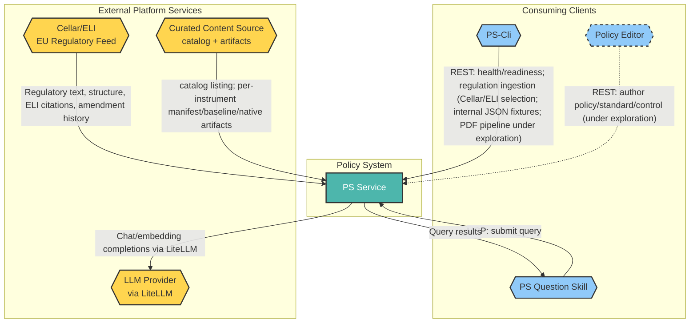
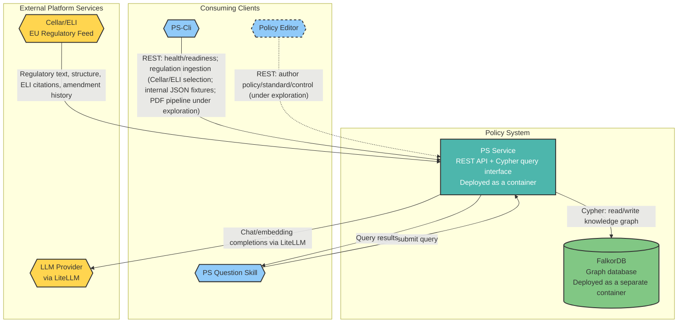

<!-- © 2026 Cartman ApS. All rights reserved. -->
# Policy System Solution Architecture

**Status:** Draft  
**Project Name:** Policy System  
**Last Updated:** August 21st 2026

---

## Table of Contents

1. [Overview](#overview)
2. [C4 System Context Level](#c4-system-context-level)
   - [Diagram Legend & Conventions](#diagram-legend--conventions)
   - [C4 System Context Diagram](#c4-system-context-diagram)
   - [System Context Breakdown](#system-context-breakdown)
3. [C4 Container Level](#c4-container-level)
   - [C4 Container Diagram](#c4-container-diagram)
   - [Container Breakdown](#container-breakdown)
   - [User Role Mapping](#user-role-mapping)
4. [C4 Component Level](#c4-component-level)
   - [Component Breakdown](#component-breakdown)
5. [Use Case Coverage Mapping](#use-case-coverage-mapping)
   - [Query/Read-Only Roles Use Cases](#queryread-only-roles-use-cases)
   - [Regulation Ingestion Use Cases](#regulation-ingestion-use-cases)
   - [Regulatory Change Monitoring Use Cases](#regulatory-change-monitoring-use-cases)
   - [Policy Managers Use Cases](#policy-managers-use-cases)
   - [System Admin Use Cases](#system-admin-use-cases)
6. [NFR Realization](#nfr-realization)
7. [Architectural Considerations](#architectural-considerations)
   - [Risks & Concerns](#risks--concerns)

---

## Overview

**System Purpose & Scope**
The purpose of the Policy System is to provide a backend service that ingests, stores, and monitors EU regulations in a compliance knowledge graph, unifying a select set of EU regulations with a company's internal business regulations and policies. The service will expose a REST API for lifecycle/config and authoring clients (PS-Cli, Policy Editor), and an MCP interface exposing a Cypher query mechanism for PS Question Skill to query the knowledge graph.

**Key Capabilities**
- Ingest EU Regulations via Cellar/ELI
- Map raw EU regulation into the PS Conceptual Model (`ps-domain-concepts.md`) knowledge graph
- Monitor ingested EU regulations for amendments and trigger re-ingestion of affected content
- Ingest Business regulation and policies — the entire compliance spine (Role through Control) is authored directly in the intake document and minted (canonical id only) by Ingestion's internal-seed adapter, converging on shared Capability/Policy nodes via Company Merge the same way external regulations do
- Cypher Query interface

**Consuming clients**
- PS-Cli a distributed command-line client (installed independently of PS Service, like `gh`/`az`) that drives PS Service's REST API — checking health and readiness, selecting EU regulations for Cellar/ELI-sourced ingestion, and ingesting internal business regulations/policies (JSON fixtures today; a PDF ingestion pipeline is deferred, not yet designed). Individual operators authenticate via OIDC before PS-Cli can reach a non-local PS Service instance. Also provides `ps-cli-mcp-bridge`, a separate entry point (never invoked directly by an operator) that an MCP host spawns as a local stdio server, so PS Question Skill can reach PS Service's MCP interface using PS-Cli's already-stored per-user OIDC credentials — needed because interactive OAuth against a customer's own Microsoft Entra tenant cannot be performed by an MCP host directly (spike #65: Entra's `resource`-parameter enforcement conflicts with the MCP authorization spec for any platform-hosted MCP server)
- PS Question Skill a skill that allows agents in VSCode or Claude Desktop ask questions, send Cypher queries to the PS Service and articulate answers to the users question. Reaches PS Service's MCP interface directly (any IdP supporting Dynamic Client Registration) or via PS-Cli's `ps-cli-mcp-bridge` (Microsoft Entra ID customer tenants, which do not)
- Policy Editor a client for authoring a Policy/Standard/Control from scratch and linking it to an existing Capability (under exploration — client not yet designed)

**Deployment Architecture**
- The PS Service is deployed as a Container and can be run in Podman, Kubernetes etc.
- The PS Service depends on FalkorDB which should be deployed in a separate container. This allows for patching FalkorDB without rebuilding and deploying the PS Service.
- PS Service is single-tenant
- **Local Test** deploys both containers via the same Helm chart onto a local `kind` cluster running under Podman, with `scripts/deploy-llm.sh` provisioning just the Azure LLM backend and `scripts/sync-llm-secrets-to-kind.sh` syncing its credentials into the cluster — shipped; see `docs/architecture/customer-azure-llm-bootstrap.md`
- **Production/customer-tenant** targets a real Azure AKS cluster (AAD + Azure RBAC hardened) in the customer's own subscription — `scripts/deploy-ps.sh` provisions the full stack end to end (LLM backend, Entra ID app registrations, the AKS cluster, the same Helm chart, and public HTTPS exposure via a Let's Encrypt certificate) — shipped; see `docs/architecture/customer-azure-deployment.md`. Both paths deploy the same chart; only the target cluster and provisioning tooling differ.
- PS-Cli runs on the same machine as both containers during Local Test; in Production it is a separately-installed client reaching PS Service over the network

**Regulatory Compliance (if applicable)**
- EU GDPR
- EU NIS2

---

## C4 System Context Level

### Diagram Legend & Conventions

**Shape Conventions:**
- **Hexagon shapes:** External systems and actors — consuming clients and external platform dependencies outside the Policy System boundary
- **Rectangle shapes:** Internal containers within the Policy System
- **Cylinder shapes:** Data stores

**Color Coding:**
- **Yellow (`#FFD54F`) fill:** External platform/data service dependency (e.g., Cellar/ELI)
- **Blue (`#90CAF9`) fill:** External consuming client application (e.g., PS-Cli, PS Question Skill)
- **Teal (`#4DB6AC`) fill:** Core Policy System service (PS Service)
- **Green (`#81C784`) fill:** Internal data store container (e.g., FalkorDB)

**Architectural Significance:**
- External system interactions (Cellar/ELI) represent integration boundaries with third-party data platforms outside the team's control
- Consuming clients (PS-Cli, PS Question Skill) interact with PS Service exclusively through its REST/Cypher API — no direct data-store access
- FalkorDB is deployed as a separate container from PS Service specifically so it can be patched independently without rebuilding or redeploying PS Service

### C4 System Context Diagram

*(See Diagram Legend & Conventions above for shape and color interpretations. Dashed border = under exploration, not yet designed.)*

### System Context Breakdown

| Actor | Interaction | System | Actor/System Type | Objective |
| :--- | :--- | :--- | :--- | :--- |
| Cellar/ELI | PS Service fetches EU regulatory document structure (TITLE/CHAPTER/SECTION/ARTICLE/PARAGRAPH), verbatim text per element, ELI citation identity, and amendment history | Policy System | External platform service (EU Publications Office) | Ingest authoritative, structurally-addressable EU regulatory text to keep the compliance knowledge graph current, replacing non-deterministic PDF extraction as the source of truth |
| LLM Provider | PS Service sends prompts/text for chat and embedding completions (provider-agnostic via LiteLLM: Ollama, Azure Foundry, AWS Bedrock, Anthropic, OpenAI, …) and receives generated text/embeddings back | Policy System | External platform service (LLM provider, swappable) | Enable LLM-assisted curation of regulatory/business content into the PS Conceptual Model, without coupling the system to a single LLM vendor |
| Curated Content Source | PS Service fetches the curated catalog listing (`catalog.json`) and, on demand, one instrument's artifact (manifest/baseline/native) at runtime from a configurable HTTP(S) base URL — default: the public Policy System GitHub repo's `curated-content` tree, overridable per deployment | Policy System | External platform service (HTTP(S) content host, swappable via config) | Let PS Service resolve the curated catalog and any instrument's artifact without a local repo checkout or another machine in the loop, so `GET /catalog` and a curated-instrument restore work from server-side config alone |
| PS-Cli | A distributed client, installed independently of PS Service (like `gh`/`az`), that checks PS Service's health and readiness via its REST API and selects EU regulations for Cellar/ELI-sourced ingestion (UC-1). Also drives a PDF ingestion pipeline (single file or folder) for business regulations/policies producing proposed Policy/Standard/Control content and suggested edge links to existing Capabilities — **pipeline design is under exploration, not yet specified**; internal ingestion today takes JSON fixtures only. Individual operators authenticate via OIDC before reaching a non-local PS Service instance | Policy System | External client application (command-line interface) | Enable operators to check PS Service health and readiness, trigger EU regulation ingestion via Cellar/ELI, and enable bulk ingestion of business regulation/policy documents into the governance layer |
| PS Question Skill | Sends Cypher queries to PS Service's MCP Interface and receives results, used to articulate answers to user questions | Policy System | External client application (Claude Desktop / VS Code skill) | Enable users in their agentic coding/chat environment to ask natural-language questions about regulations and policies, answered against the compliance knowledge graph |
| Policy Editor | Enables a user to author a Policy/Standard/Control from scratch and link it via an edge to an existing Capability — **client and interaction design are under exploration, not yet specified** | Policy System | External client application (not yet designed) | Enable manual authoring of governance-layer content as an alternative to PDF-based ingestion |

---

## C4 Container Level

### C4 Container Diagram

*(See Diagram Legend & Conventions above for shape and color interpretations. Dashed border = under exploration, not yet designed.)*

### Container Breakdown

**Important:** Diagrams must accurately reflect the containers listed in this table. The table is the source of truth; diagrams are visual representations of this data.

| Container/Service | Description | Key Responsibilities | Domain path |
|-----|---|---|---|
| PS Service | Backend REST API service, deployed as a single-tenant container (Podman/Kubernetes) | • Expose REST API for consuming clients (PS-Cli, Policy Editor) and an MCP interface for PS Question Skill • Ingest EU regulations via Cellar/ELI • Map raw EU regulation text into the PS Conceptual Model knowledge graph • Ingest business regulations/policies — the entire regulatory spine (Role through Control) is authored directly in the intake document and minted (canonical id only) by the internal-seed Ingestion Adapter, converging on shared Capability/Policy nodes via Company Merge the same way external regulations do • Expose a Cypher query interface to consuming services • Persist and query the compliance knowledge graph via FalkorDB • Access an LLM Provider via LiteLLM for content curation • Restore pre-curated instrument graphs (baseline + native) from a `curated-content` git folder into a target deployment, requiring no LLM provider or extraction run • Fetch the curated catalog listing and, on demand, one instrument's artifact at runtime from a configurable HTTP(S) source (default: the public Policy System GitHub repo), with a FalkorDB-persisted runtime override settable/resettable/readable via MCP, no restart required | ps.service |
| FalkorDB | Graph database storing the compliance knowledge graph, deployed as a separate container from PS Service to allow independent patching without rebuilding/redeploying PS Service | • Store the regulatory and organizational layers of the compliance knowledge graph • Execute Cypher queries issued by PS Service | ps.falkordb |

### User Role Mapping

| User Role | Accessible Containers/Services |
|-----------|-------------------------------|
| Compliance Officers | PS Service via PS Question Skill (read-only query) and ps-cli (select/ingest external regulations) |
| Policy Managers | PS Service via ps-cli (ingest internal regulations, current mechanism; PDF ingestion pipeline once built would extend this same path) and Policy Editor (create/edit/approve policies/standards — under exploration) |
| Legal Counsel | PS Service via PS Question Skill (read-only query) |
| Security Architects | PS Service via PS Question Skill (read-only query) |
| Risk Managers | PS Service via PS Question Skill (read-only query) |
| DevOps/Engineering | PS Service via PS Question Skill (VS Code) |
| Auditors | PS Service via PS Question Skill (read-only query) |
| Software Engineers | PS Service via PS Question Skill (read-only query) |
| Security Engineers | PS Service via PS Question Skill (read-only query) |
| Engineering Managers | PS Service via PS Question Skill (read-only query) |
| System Admin | PS Service via PS-Cli (health/readiness; provisioning named targets/contexts and other Policy-System global settings, mostly relevant in production deployment) |

**Purpose:** Maps user roles to the containers/services they can access, clarifying access control boundaries.

---

## C4 Component Level

### Component Breakdown

| Component | Description | Key Responsibilities | Domain path |
| :--- | :--- | :--- | :--- |
| Ingestion | Ingests regulation content from a source (Cellar/ELI for EU regulations) instead of PDF, persisting it as a native structural graph | Fetch a regulation's structure/text via a source-specific Ingestion Adapter; persist that source's native structural graph to FalkorDB as-is — see Container Architecture for the adapter pattern; an EU Directive is ingested as an EU-level framework node plus a separate node per member-state transposition (see [`ps-domain-concepts.md`](../artifacts/ps-domain-concepts.md#directives-and-national-transposition)) | ps.service.ingestion |
| Domain Mapper | Maps an *external* regulation's native structural graph into the curated, PS-domain-shaped baseline graph (Role/Requirement/Obligation/Capability) via LLM-driven extraction, through a Domain Mapping Adapter paired to that source's Ingestion Adapter | Curate/derive PS Conceptual Model entities from an external regulation's native structural graph into a per-regulation baseline. Internal sources bypass Domain Mapper entirely — see Ingestion's internal-seed adapter, which authors and mints the full compliance spine (Role through Control) directly from the customer's intake document in one step | ps.service.domainmapper |
| Company Merge | Dedupes and merges a company's selected regulation baseline graphs into one single-tenant graph | Merge selected baseline graphs per company — operates only on the per-regulation baseline graph already populated upstream (by Domain Mapper for external sources, by Ingestion's internal-seed adapter for internal sources), resolving it into the company graph with cross-regulation dedup at Capability (and Policy for internal sources); Role/Requirement/Obligation are source-scoped and passed through; unaffected by source-specific (Cellar/ELI) adapter changes | ps.service.companymerge |
| Export | Serializes an already-ingested instrument's baseline and native graphs into a checksummed, schema-versioned curated artifact for the `curated-content` git folder | Backfill Capability/Policy embeddings onto the source baseline graph so restore never needs a live LLM call; serialize both graphs generically (label/relationship-type agnostic); write the manifest and regenerate the aggregate catalog listing. Maintainer-invoked local tooling, never exposed via REST or PS-Cli | ps.service.export |
| Restore | Loads a curated instrument's artifact from the `curated-content` git folder into a target deployment, with no LLM provider or extraction run | Verify the artifact's checksum and `schema_version` before any write; merge the baseline leg into the single-tenant graph via an offline replay of Company Merge's own dedup/convergence, using the artifact's own pre-computed embeddings; load the native leg straight into its own per-instrument graph space, no dedup; both legs atomic — restore is all-or-nothing per instrument | ps.service.restore |
| Curated Source | Fetches the curated catalog listing and, on demand, one instrument's artifact from a configurable HTTP(S) source at runtime, and holds a FalkorDB-persisted runtime override of that source | Fetch `catalog.json` and, on demand, one instrument's manifest/baseline/native from the effective source (a persisted FalkorDB override, else the env-var/default), failing hard on an unreachable or malformed source rather than falling back to stale data; persist/resolve/clear the runtime override via MCP (`set-catalog-source`/`get-catalog-source`/`reset-catalog-source`), failing open to the env-var/default if FalkorDB is unreachable for the override check itself | ps.service.curatedsource |
| Query Engine | Executes Cypher queries against the compliance knowledge graph on behalf of PS Question Skill and returns results | Receive Cypher queries via PS Service's query interface; execute against FalkorDB; return results with provenance; return an explicit "graph is unseeded" error, distinguishable from a legitimate empty result, when the target graph has no seeded content at all | ps.service.queryengine |
| MCP Interface | Exposes the compliance knowledge graph's Cypher query capability to PS Question Skill via the Model Context Protocol (MCP) | Accept MCP tool calls from PS Question Skill; delegate query execution to Query Engine; return results over MCP | ps.service.mcpinterface |
| Regulatory Change Monitor | Detects when an EU regulation or Directive framework text is amended by polling Cellar/ELI, and triggers re-ingestion of the affected instrument | Poll Cellar/ELI for regulatory amendments; trigger re-ingestion of the amended consolidated text for the changed instrument; surface a delta report of affected content — **delta report shape/mechanism is under exploration**. Both poll and trigger are manually invoked today — **no scheduler yet**, and re-ingestion currently stops after Ingestion + `SUPERSEDED_BY`; chaining onward through Domain Mapper → Company Merge and propagating supersession into the merged graph is later end-to-end wiring work. Polling covers directly-applicable regulations and Directive framework texts on one identical Cellar-lineage path; monitoring a Directive's member-state transposing statutes is a separate concern **under exploration** — there is no common EU-level source to poll | ps.service.changemonitor |
| LLM Interface | Shared internal component wrapping LiteLLM, giving other components a single point of access to the configured LLM Provider | Route chat/embedding requests to the configured LLM Provider via LiteLLM; abstract provider-specific credentials/config away from consuming components (Domain Mapper, Company Merge, and potentially Query Engine/Regulatory Change Monitor) | ps.service.llminterface |
| Logging | Shared internal component providing structured, semantic logging for every other PS Service component, giving detailed debug data during pipeline/query runs | Accept structured log entries from other components; write JSON-structured entries to the configured log sink; bind a correlation (run) ID at each primary-use-case entry point so a full pipeline/query run can be traced end to end | ps.service.logging |

---

## Use Case Coverage Mapping

Use cases reference `ps-primary-use-cases.md`'s URS IDs (UC-1 through UC-4).
Roles are grouped where they share the same use case and implementing
component(s), rather than listed individually.

### Query/Read-Only Roles Use Cases

Compliance Officers, Legal Counsel, Security Architects, Risk Managers,
DevOps/Engineering, Auditors, Software Engineers, Security Engineers,
Engineering Managers.

| Use Case | API Entry Point | Implementing Container/Component | URS Requirement |
| :--- | :--- | :--- | :--- |
| Query regulations and policies | PS Question Skill → PS Service MCP Interface | MCP Interface (delegates to Query Engine). Alternate flow: a target with zero seeded content returns an explicit "graph is unseeded" error, distinguishable from a legitimate empty result — implemented once in Query Engine, so every client (MCP Interface today) observes the identical signal | UC-3 |

### Regulation Ingestion Use Cases

| Use Case | API Entry Point | Implementing Container/Component | URS Requirement |
| :--- | :--- | :--- | :--- |
| Select and add a regulation | PS-Cli → PS Service | Ingestion → Domain Mapper → Company Merge. Alternative, LLM-free path for a curated instrument: PS-Cli reads a pre-curated artifact from the `curated-content` git folder and PS Service's Restore component replays the same additive, merge-only outcome via a data load — no LLM provider or extraction run (the artifact itself is produced once, ahead of time, by Export) | UC-1 |
| Govern internal regulations | PS-Cli → PS Service | Ingestion → Company Merge (`source_type: internal`; Domain Mapper is not invoked for internal sources — Ingestion's internal-seed adapter authors and mints the full compliance spine, Role through Control, directly from the customer's intake document; Company Merge then resolves cross-source convergence at Capability and Policy exactly as for external sources) | UC-2 |

### Regulatory Change Monitoring Use Cases

Not user-triggered — Regulatory Change Monitor drives this use case by polling Cellar/ELI. Poll and trigger are manually invoked today (no scheduler yet); autonomous scheduling is the intended end state.

| Use Case | API Entry Point | Implementing Container/Component | URS Requirement |
| :--- | :--- | :--- | :--- |
| Detect and absorb a regulatory amendment | Regulatory Change Monitor → Cellar/ELI (poll) | Regulatory Change Monitor (poll + trigger) → Ingestion; Domain Mapper → Company Merge not yet chained from the trigger | UC-4 |

### Policy Managers Use Cases

| Use Case | API Entry Point | Implementing Container/Component | URS Requirement |
| :--- | :--- | :--- | :--- |
| Govern policy/standard/control content | Policy Editor → PS Service (under exploration) | Policy Editor backend (not yet defined) | — (not yet defined in `ps-primary-use-cases.md`) |

### System Admin Use Cases

| Use Case | API Entry Point | Implementing Container/Component | URS Requirement |
| :--- | :--- | :--- | :--- |
| Govern policy/standard/control content (bulk PDF path) | PS-Cli → PS Service (under exploration) | PDF ingestion pipeline (not yet defined) | — (not yet defined in `ps-primary-use-cases.md`) |

**Purpose:** Provides traceability from user requirements (URS) to architectural implementation, ensuring all use cases are covered by the architecture.

---

## NFR Realization

This section maps non-functional requirements (from URS) to architectural decisions that satisfy them.

| NFR ID | Requirement Summary | Architectural Decision | Containers Affected | Rationale |
|--------|--------------------|-----------------------|---------------------|-----------|
| [NFR-PERF-001] | [e.g., P95 latency < 200ms] | [e.g., Redis caching layer for read-heavy endpoints] | [e.g., API, Cache] | [Why this decision satisfies the NFR] |

**Guidelines:**
- Every NFR from the URS should appear here — if an NFR has no architectural decision, document why (e.g., "deferred to component-level implementation")
- Multiple NFRs may share an architectural decision
- Decisions here drive Container Architecture strategies (CA documents the component-level details)

---

## Architectural Considerations

### Risks & Concerns

| Risk Category | Description | Mitigation Strategy |
|---------------|-------------|---------------------|
| Design Gap | Two business/policy ingestion paths (PS-Cli's PDF ingestion pipeline; the Policy Editor client) are named in the System Context but their design is under exploration — pipeline mechanics, proposal/review workflow, and the Policy Editor client itself are all unspecified | To be resolved through further design exploration before Container/Component-level detail is added for either path |
| Security | Authentication/authorization for PS Service's REST API and MCP Interface is implemented as generic OIDC bearer-token validation (any OIDC-compliant IdP; each customer brings their own — Entra ID is the reference example for Azure-hosted customers, see the [IdP configuration contract](../artifacts/idp-configuration-contract.md)). Audience validation only; role/scope-based authorization remains out of scope | Implemented (issue #58); role/scope-based authorization, rate limiting, and TLS termination remain open, tracked separately |
| Security | The three curated-content source MCP tools (`set-catalog-source`/`reset-catalog-source`/`get-catalog-source`) require only the same shared OIDC bearer-token check every other MCP tool requires — no role/attribute permission gating exists yet, so any authenticated caller can repoint where PS Service fetches its curated catalog and artifacts from | Not yet addressed; requires design exploration, alongside the broader role/scope-based authorization gap above |
| Design Gap | A FalkorDB outage during the curated-content source override check falls open: `GET /catalog` and the on-demand artifact fetch silently fall back to the env-var/default source rather than blocking on, or surfacing, the outage — a deliberate resilience choice, but it means a persisted override can go silently unhonored for the outage's duration with only a server-side log entry to show for it | Accepted for now; revisit if a caller ever needs a hard guarantee that the override, not the default, was actually used |
| Security | LLM-driven extraction (Domain Mapper, external sources only) treats an ingested Cellar/ELI regulation's source text as trusted input to the extraction prompt — adversarial content in a Cellar/ELI response could attempt to manipulate extraction into minting misleading Requirement/Obligation/Capability content, which the add/merge-only design would then retain | Not yet addressed; requires design exploration |
| Security | Internal-source ingestion (Ingestion's internal-seed adapter) is not LLM-driven, but it treats an internal intake document's asserted content as trusted and persists it largely as submitted — a misleading or malicious intake document could assert inaccurate Role/Requirement/Obligation/Capability/Policy/Standard/Control content directly, which the add/merge-only design would then retain | Not yet addressed; requires design exploration, particularly before internal-source (Business SoP) ingestion is treated as production-ready |
| Security | Credential/secrets management for LLM Provider API keys and FalkorDB access is undecided — no storage, rotation, or handling mechanism is specified anywhere in the architecture | To be decided at L2/implementation; must be confirmed before any non-local deployment |
| Security | No encryption at rest or in transit is specified for FalkorDB, which stores the full compliance knowledge graph — a company's regulatory gaps and control posture in one place | Deferred; should be decided before any non-local/production deployment, alongside the REST/MCP auth decision above |
| Security | Logging is operational/pipeline tracing (`run_id` correlation), not a tamper-evident security audit trail of who accessed or mutated what — relevant once REST/MCP auth introduces distinct callers to track | Deferred; revisit alongside the auth decision above |
| Scalability Bottleneck | No action in the architecture has a load-tested SLA — Query Engine's one stated target ("< 2s") is explicitly draft/not load-tested, and every other action's Processing Time is unset or best-effort | Load-test the read path and establish real SLOs before relying on any stated number to drive timeout/capacity decisions |
| Technical Debt | LLM extraction (Domain Mapper) is explicitly non-deterministic, yet Role/Requirement/Obligation/Capability identity is content-hash-derived — a retried run after a partial failure could reword the same source text differently and mint a duplicate instead of matching the existing node | Not yet addressed; requires design exploration into retry-safe extraction or a within-regulation semantic-match fallback, not just Company Merge's cross-regulation convergence |
| Design Gap | Company Merge surfaces (rather than resolves) a low-confidence semantic-match candidate, aborting the merge — no review/resolution workflow is defined for that surfaced state. Reached only via a manual PS-Cli ingestion today; once the Regulatory Change Monitor trigger is chained through to Company Merge (UC-4 end-to-end wiring) and a scheduler is added, it can be hit unattended | To be resolved through further design exploration — needs an owner, a queue/notification mechanism, and a decision on whether ingestion stays blocked pending review |
| Technical Debt | No schema/data migration strategy exists for the graph itself — RegulatoryInstrument instances version explicitly, but nothing addresses what happens to already-minted nodes when `ps-domain-concepts.md`'s own shape changes (a property renamed or added) | Deferred for the general case (a property rename, or any change that forces re-minting existing nodes). The `instrument_type` addition for Directive modelling is the first live instance and is handled as a purely additive backfill — no node re-identified, existing baselines untouched |

**Common Risk Categories:**
- **Single Points of Failure:** Components or systems whose failure would cause system-wide issues
- **Scalability Bottlenecks:** Areas that may not scale under increased load
- **Security Considerations:** Authentication, authorization, data protection, and compliance concerns
- **Integration Complexity:** Challenges with external system dependencies and data synchronization
- **Technical Debt:** Known limitations, legacy patterns, or areas requiring future refactoring

---

**End of Document**

---

