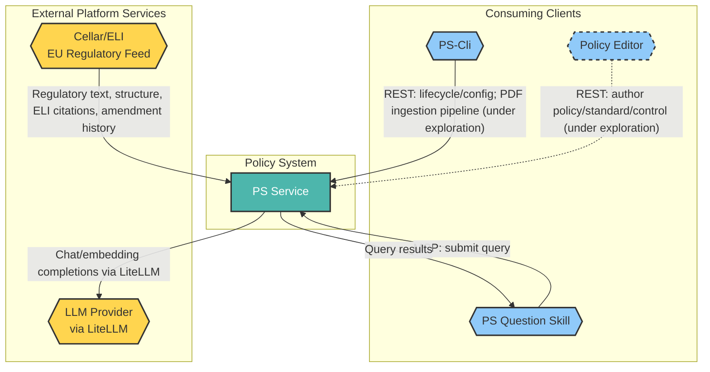
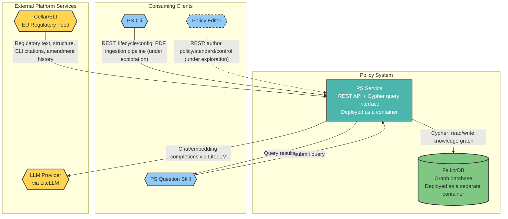

<!-- © 2026 Cartman ApS. All rights reserved. -->
# Policy System Solution Architecture

**Status:** Draft  
**Project Name:** Policy System  
**Last Updated:** August 21st 2026

---

## Table of Contents

1. [Overview](#overview)
2. [C4 System Context Level](#c4-system-context-level)
   - [Diagram Legend & Conventions](#diagram-legend--conventions)
   - [C4 System Context Diagram](#c4-system-context-diagram)
   - [System Context Breakdown](#system-context-breakdown)
3. [C4 Container Level](#c4-container-level)
   - [C4 Container Diagram](#c4-container-diagram)
   - [Container Breakdown](#container-breakdown)
   - [User Role Mapping](#user-role-mapping)
4. [C4 Component Level](#c4-component-level)
   - [Component Breakdown](#component-breakdown)
5. [Use Case Coverage Mapping](#use-case-coverage-mapping)
   - [Query/Read-Only Roles Use Cases](#queryread-only-roles-use-cases)
   - [Policy Managers Use Cases](#policy-managers-use-cases)
   - [System Admin Use Cases](#system-admin-use-cases)
6. [NFR Realization](#nfr-realization)
7. [Architectural Considerations](#architectural-considerations)
   - [Risks & Concerns](#risks--concerns)

---

## Overview

**System Purpose & Scope**
The purpose of the Policy System is to provide a backend service that ingests, stores, and monitors EU regulations in a compliance knowledge graph, unifying a select set of EU regulations with a company's internal business regulations and policies. The service will expose a REST-based API for consuming services. The API will include a query mechanism allowing consuming services to query the knowledge graph.

**Key Capabilities**
- Ingest EU Regulations via Cellar/ELI
- Map raw EU regulation into PS Conceptual Model knowledge graph
- Ingest Business regulation and policies enabling users to link governance layer to regulatory layer via Capability nodes
- Cypher Query interface

**Consuming clients**
- PS-Cli a command line interface for starting / stopping and configuring the PS Service, and for driving a PDF ingestion pipeline for business regulations/policies (under exploration)
- PS Question Skill a skill that allows agents in VSCode or Claude Desktop ask questions, send Cypher queries to the PS Service and articulate answers to the users question
- Policy Editor a client for authoring a Policy/Standard/Control from scratch and linking it to an existing Capability (under exploration — client not yet designed)

**Deployment Architecture**
- The PS Service is deployed as a Container and can be run in Podman, Kubernetes etc.
- The PS Service depends on FalkorDB which should be deployed in a separate container. This allows for patching FalkorDB without rebuilding and deploying the PS Service.
- PS Service is single-tenant

**Regulatory Compliance (if applicable)**
- EU GDPR
- EU NIS2

---

## C4 System Context Level

### Diagram Legend & Conventions

**Shape Conventions:**
- **Hexagon shapes:** External systems and actors — consuming clients and external platform dependencies outside the Policy System boundary
- **Rectangle shapes:** Internal containers within the Policy System
- **Cylinder shapes:** Data stores

**Color Coding:**
- **Yellow (`#FFD54F`) fill:** External platform/data service dependency (e.g., Cellar/ELI)
- **Blue (`#90CAF9`) fill:** External consuming client application (e.g., PS-Cli, PS Question Skill)
- **Teal (`#4DB6AC`) fill:** Core Policy System service (PS Service)
- **Green (`#81C784`) fill:** Internal data store container (e.g., FalkorDB)

**Architectural Significance:**
- External system interactions (Cellar/ELI) represent integration boundaries with third-party data platforms outside the team's control
- Consuming clients (PS-Cli, PS Question Skill) interact with PS Service exclusively through its REST/Cypher API — no direct data-store access
- FalkorDB is deployed as a separate container from PS Service specifically so it can be patched independently without rebuilding or redeploying PS Service

### C4 System Context Diagram

*(See Diagram Legend & Conventions above for shape and color interpretations. Dashed border = under exploration, not yet designed.)*

### System Context Breakdown

| Actor | Interaction | System | Actor/System Type | Objective |
| :--- | :--- | :--- | :--- | :--- |
| Cellar/ELI | PS Service fetches EU regulatory document structure (TITLE/CHAPTER/SECTION/ARTICLE/PARAGRAPH), verbatim text per element, ELI citation identity, and amendment history | Policy System | External platform service (EU Publications Office) | Ingest authoritative, structurally-addressable EU regulatory text to keep the compliance knowledge graph current, replacing non-deterministic PDF extraction as the source of truth |
| LLM Provider | PS Service sends prompts/text for chat and embedding completions (provider-agnostic via LiteLLM: Ollama, Azure Foundry, AWS Bedrock, Anthropic, OpenAI, …) and receives generated text/embeddings back | Policy System | External platform service (LLM provider, swappable) | Enable LLM-assisted curation of regulatory/business content into the PS Conceptual Model, without coupling the system to a single LLM vendor |
| PS-Cli | Starts, stops, and configures PS Service via its REST API. Also drives a PDF ingestion pipeline (single file or folder) producing proposed Policy/Standard/Control content and suggested edge links to existing Capabilities — **pipeline design is under exploration, not yet specified** | Policy System | External client application (command-line interface) | Enable operators to manage the PS Service lifecycle/configuration, and enable bulk ingestion of business regulation/policy documents into the governance layer |
| PS Question Skill | Sends Cypher queries to PS Service's MCP Interface and receives results, used to articulate answers to user questions | Policy System | External client application (Claude Desktop / VS Code skill) | Enable users in their agentic coding/chat environment to ask natural-language questions about regulations and policies, answered against the compliance knowledge graph |
| Policy Editor | Enables a user to author a Policy/Standard/Control from scratch and link it via an edge to an existing Capability — **client and interaction design are under exploration, not yet specified** | Policy System | External client application (not yet designed) | Enable manual authoring of governance-layer content as an alternative to PDF-based ingestion |

---

## C4 Container Level

### C4 Container Diagram

*(See Diagram Legend & Conventions above for shape and color interpretations. Dashed border = under exploration, not yet designed.)*

### Container Breakdown

**Important:** Diagrams must accurately reflect the containers listed in this table. The table is the source of truth; diagrams are visual representations of this data.

| Container/Service | Description | Key Responsibilities | Domain path |
|-----|---|---|---|
| PS Service | Backend REST API service, deployed as a single-tenant container (Podman/Kubernetes) | • Expose REST API for consuming clients (PS-Cli, Policy Editor) and an MCP interface for PS Question Skill • Ingest EU regulations via Cellar/ELI • Map raw EU regulation text into the PS Conceptual Model knowledge graph • Ingest business regulations/policies, linking governance layer to regulatory layer via Capability nodes • Expose a Cypher query interface to consuming services • Persist and query the compliance knowledge graph via FalkorDB • Access an LLM Provider via LiteLLM for content curation | ps.service |
| FalkorDB | Graph database storing the compliance knowledge graph, deployed as a separate container from PS Service to allow independent patching without rebuilding/redeploying PS Service | • Store the regulatory and organizational layers of the compliance knowledge graph • Execute Cypher queries issued by PS Service | ps.falkordb |

### User Role Mapping

| User Role | Accessible Containers/Services |
|-----------|-------------------------------|
| Compliance Officers | PS Service via PS Question Skill (read-only query) |
| Policy Managers | PS Service via Policy Editor (create/edit/approve policies/standards — under exploration) |
| Legal Counsel | PS Service via PS Question Skill (read-only query) |
| Security Architects | PS Service via PS Question Skill (read-only query) |
| Risk Managers | PS Service via PS Question Skill (read-only query) |
| DevOps/Engineering | PS Service via PS Question Skill (VS Code) |
| Auditors | PS Service via PS Question Skill (read-only query) |
| Software Engineers | PS Service via PS Question Skill (read-only query) |
| Security Engineers | PS Service via PS Question Skill (read-only query) |
| Engineering Managers | PS Service via PS Question Skill (read-only query) |
| System Admin | PS Service via PS-Cli (lifecycle/config; PDF ingestion pipeline — under exploration) |

**Purpose:** Maps user roles to the containers/services they can access, clarifying access control boundaries.

---

## C4 Component Level

### Component Breakdown

| Component | Description | Key Responsibilities | Domain path |
| :--- | :--- | :--- | :--- |
| Regulatory Structural Ingestion | Ingests EU regulation content from Cellar/ELI instead of PDF, producing a structurally-tagged regulation graph | Fetch regulation structure/text from Cellar/ELI; tag document structure — **exact output shape, and compatibility with Domain Mapper's input, is under exploration** | ps.service.ingestion |
| Domain Mapper | Maps a regulation's structural graph into the curated, PS-domain-shaped baseline graph (Role/Requirement/Obligation/Capability) | Curate/derive PS Conceptual Model entities from structural regulation content into a canonical per-regulation baseline — **whether this component needs adaptation for Cellar-sourced input is under exploration** | ps.service.domainmapper |
| Company Merge | Dedupes and merges a company's selected regulation baseline graphs into one single-tenant graph | Merge selected baseline graphs per company — **assumed unaffected by the Stage 1 change, not yet confirmed** | ps.service.companymerge |
| Query Engine | Executes Cypher queries against the compliance knowledge graph on behalf of PS Question Skill and returns results | Receive Cypher queries via PS Service's query interface; execute against FalkorDB; return results with provenance | ps.service.queryengine |
| MCP Interface | Exposes the compliance knowledge graph's Cypher query capability to PS Question Skill via the Model Context Protocol (MCP) | Accept MCP tool calls from PS Question Skill; delegate query execution to Query Engine; return results over MCP | ps.service.mcpinterface |
| Regulatory Change Monitor | Detects when an EU regulation is amended by polling Cellar/ELI, and triggers re-ingestion of the affected regulation | Poll Cellar/ELI for regulatory amendments; trigger a new Regulatory Structural Ingestion → Domain Mapper cycle for the changed regulation; surface a delta report of affected content — **delta report shape/mechanism is under exploration** | ps.service.changemonitor |
| LLM Interface | Shared internal component wrapping LiteLLM, giving other components a single point of access to the configured LLM Provider | Route chat/embedding requests to the configured LLM Provider via LiteLLM; abstract provider-specific credentials/config away from consuming components (Domain Mapper, and potentially Query Engine/Regulatory Change Monitor) | ps.service.llminterface |

---

## Use Case Coverage Mapping

Use cases reference `ps-primary-use-cases.md`'s URS IDs (UC-1 through UC-3).
Roles are grouped where they share the same use case and implementing
component(s), rather than listed individually.

### Query/Read-Only Roles Use Cases

Compliance Officers, Legal Counsel, Security Architects, Risk Managers,
DevOps/Engineering, Auditors, Software Engineers, Security Engineers,
Engineering Managers.

| Use Case | API Entry Point | Implementing Container/Component | URS Requirement |
| :--- | :--- | :--- | :--- |
| Query regulations and policies | PS Question Skill → PS Service MCP Interface | MCP Interface (delegates to Query Engine) | — (not a URS-defined PS Service use case; question-asking and answer synthesis are PS Question Skill's responsibility) |

### Policy Managers Use Cases

| Use Case | API Entry Point | Implementing Container/Component | URS Requirement |
| :--- | :--- | :--- | :--- |
| Govern policy/standard/control content | Policy Editor → PS Service (under exploration) | Policy Editor backend (not yet defined) | UC-3 |

### System Admin Use Cases

| Use Case | API Entry Point | Implementing Container/Component | URS Requirement |
| :--- | :--- | :--- | :--- |
| Govern policy/standard/control content (bulk PDF path) | PS-Cli → PS Service (under exploration) | PDF ingestion pipeline (not yet defined) | UC-3 |

**Purpose:** Provides traceability from user requirements (URS) to architectural implementation, ensuring all use cases are covered by the architecture.

---

## NFR Realization

This section maps non-functional requirements (from URS) to architectural decisions that satisfy them.

| NFR ID | Requirement Summary | Architectural Decision | Containers Affected | Rationale |
|--------|--------------------|-----------------------|---------------------|-----------|
| [NFR-PERF-001] | [e.g., P95 latency < 200ms] | [e.g., Redis caching layer for read-heavy endpoints] | [e.g., API, Cache] | [Why this decision satisfies the NFR] |

**Guidelines:**
- Every NFR from the URS should appear here — if an NFR has no architectural decision, document why (e.g., "deferred to component-level implementation")
- Multiple NFRs may share an architectural decision
- Decisions here drive Container Architecture strategies (CA documents the component-level details)

---

## Architectural Considerations

### Risks & Concerns

| Risk Category | Description | Mitigation Strategy |
|---------------|-------------|---------------------|
| Design Gap | Two business/policy ingestion paths (PS-Cli's PDF ingestion pipeline; the Policy Editor client) are named in the System Context but their design is under exploration — pipeline mechanics, proposal/review workflow, and the Policy Editor client itself are all unspecified | To be resolved through further design exploration before Container/Component-level detail is added for either path |
| Security | Authentication/authorization for PS Service's REST API is out of scope for now — no identity provider or auth mechanism is defined | Deferred; must be decided before any multi-user or production deployment |
| Coverage Gap | UC-1 (Select and add a regulation to the system) — no human role is defined as the one who lists/selects a regulation to trigger ingestion. UC-2 (Govern internal regulations — Role/Requirement/Obligation/Capability for internal content) has no assigned role or component; neither PS-Cli's pipeline nor Policy Editor currently targets this shape | To be resolved through further design exploration; must be assigned before Use Case Coverage Mapping is complete |

**Common Risk Categories:**
- **Single Points of Failure:** Components or systems whose failure would cause system-wide issues
- **Scalability Bottlenecks:** Areas that may not scale under increased load
- **Security Considerations:** Authentication, authorization, data protection, and compliance concerns
- **Integration Complexity:** Challenges with external system dependencies and data synchronization
- **Technical Debt:** Known limitations, legacy patterns, or areas requiring future refactoring

---

**End of Document**

---

