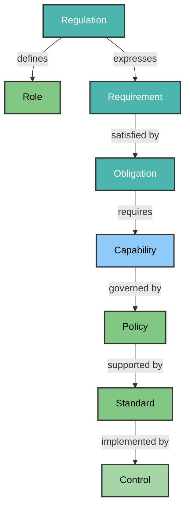
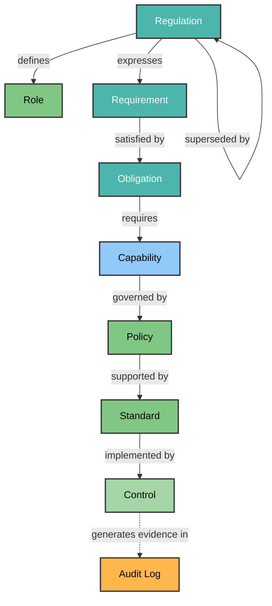

<!-- © 2026 Cartman ApS. All rights reserved. -->
# Policy System Domain Concepts

**Status:** Draft 

---

## Table of Contents

1. [Document Purpose](#document-purpose)
2. [Domain Concept Diagrams](#domain-concept-diagrams)
   - [Policy Content Management](#policy-content-management)
   - [Complete Domain Model](#complete-domain-model)
3. [Domain Concepts](#domain-concepts)
4. [Concept Details](#concept-details)
   - [Regulation](#regulation)
   - [Role](#role)
   - [Requirement](#requirement)
   - [Obligation](#obligation)
   - [Capability](#capability)
   - [Policy](#policy)
   - [Standard](#standard)
   - [Control](#control)
5. [Provenance & Traceability](#provenance--traceability)
6. [Analysis Notes](#analysis-notes)
7. [Relationship Summary](#relationship-summary)
8. [Domain Concept to Architecture Traceability](#domain-concept-to-architecture-traceability)
9. [Domain Model Summary](#domain-model-summary)

---

## Document Purpose

This document defines the Domain Concepts (entities with identity, lifecycle, and relationships) within the Policy System. The Policy System transforms regulatory compliance from a manual burden into an automated competitive advantage for EU-based organizations.

The domain model addresses the critical challenge of **regulatory convergence** - helping organizations see a cohesive picture across multiple overlapping EU regulations (GDPR, CRA, NIS2, DORA, AI Act, etc.) rather than treating each regulation in isolation.

Domain Concepts represent the core business entities used to manage regulatory obligations and organizational responses:

1. **Regulation** - EU or international regulation (e.g., GDPR, CRA, NIS2) with official identifier, version, and jurisdiction
2. **Role** - An actor defined by regulations that performs duties (e.g., "Manufacturer", "Data Controller", "Operator of Essential Services")
3. **Requirement** - A condition expressed by a regulation specifying what must be true ("Article X.Y: shall implement...")
4. **Obligation** - A canonical, reusable duty assigned to roles across multiple regulations
5. **Capability** - The technical capacity required to fulfill obligations (e.g., "Data Encryption", "Access Control")
6. **Policy** - Organizational commitments that govern how capabilities are achieved
7. **Standard** - Implementation guidelines and procedures for policies
8. **Control** - Technical/mechanical checks that validate standards

This ontology serves as the foundation for understanding how regulations map to business operations and guides the design of both content ingestion and query mechanisms.

---

## Domain Concept Diagrams

### Policy Content Management

This context covers the management of regulatory requirements and organizational compliance responses across multiple EU regulations. The system ingests regulations, extracts requirements, maps each requirement to canonical obligations via roles, identifies capabilities required by those obligations, establishes organizational policies that govern capabilities, defines standards to implement those policies, and establishes controls to verify standard adherence.

The role-centric model enables cross-regulation normalization - different regulations may define the same underlying duty through different wording and actor types, but they all converge on shared obligations and capabilities.



### Complete Domain Model

This diagram shows the complete network of relationships between policy content entities and external systems they interact with.



**Diagram Legend:**
- Solid lines (→) represent domain relationships between entities
- Dotted lines (-.→) represent external system integration or audit trail purposes
- Rectangle shapes `[Name]` represent Domain Concepts (entities with identity and lifecycle)
- Orange fill `#FFB74D` indicates External Systems
- **Blue** (`#90CAF9`) indicates Capability concepts

---

## Domain Concepts

This section identifies the core Domain Concepts within the Policy System. There are 8 domain concepts in total, organized to support multi-regulation compliance convergence.

---

## Concept Details

### Regulation

| Description | Global / Local | Justification | Bounded Context | Comment |
|-------------|----------------|---------------|-----------------|---------|
| A regulation source such as EU legislation (GDPR, CRA, NIS2), international standards, or national laws. Each regulation has an official identifier (e.g., "Regulation (EU) 2024/2847"), title, jurisdiction, effective date, version number, and status (active/superseded/vacated). Regulations are immutable once ingested into the system. | Local | Lifecycle managed within the system: ingested when regulations are loaded from official sources, retained for historical analysis, superseded by new versions with permanent version history maintained for traceability. Ingestion workflow creates Regulation entities with identifiers matching official publications. | Regulation Management | Regulations are read-only once ingested; they cannot be modified but can be superseded by new versions. Each regulation defines roles and expresses requirements. Used as the authoritative source that drives requirement extraction and connects to organizational policies via the role-obligation-capability-policy chain. Supports delta-only updates when regulations change (new version replaces old, not full re-ingestion). |

#### Fields

**Identity**: `{SHORT}-{VERSION}` (e.g., `CRA-1.0`) — business ID derived from the official identifier + version

| Field | Type | Required | Notes |
|-------|------|----------|-------|
| `id` | string | Yes | Official identifier short code + version |
| `title` | string | Yes | |
| `jurisdiction` | string | No | |
| `effective_date` | date (ISO 8601) | No | |
| `version` | string | No | |
| `status` | enum: `active` \| `superseded` \| `vacated` | No | |

#### Relationships

**UML Relationship Overview:**

| Source Concept | Relationship Type | Cardinality | Target Concept | Cardinality | Explanation | Consequence if Missing |
|----------------|-------------------|-------------|----------------|-------------|-------------|------------------------|
| Regulation | **defines** | 1..* | Role | 0..* | A regulation defines one or more actor types that have duties under that regulation. Each role is defined by exactly one regulation (though roles may be reused across regulations with different definitions). | Cannot identify which actors are responsible for compliance; breaks regulatory accountability mapping |
| Regulation | **expresses** | 1..* | Requirement | 0..* | A regulation expresses one or more conditions that must be met. Each requirement is expressed by exactly one regulation article/section. | Cannot connect requirements to their source regulation; breaks traceability for compliance validation |
| Regulation | **superseded by** | 0..1 | Regulation | 0..1 | When a new version of a regulation is published, the old version is superseded but retained in the system. | Cannot track regulatory change impact; cannot identify which requirements/roles are affected by update |

**External System Interactions (not domain relationships):**
- `Regulation` may be **ingested from** `EUR-Lex`, `Official EU Portals`, or other regulation sources for initial ingestion and version updates
- `Regulation` **records in** `Audit Log` when created, superseded, or referenced during ingestion workflows

---

### Role

| Description | Global / Local | Justification | Bounded Context | Comment |
|-------------|----------------|---------------|-----------------|---------|
| An actor type defined by regulations that has duties and responsibilities under those regulations. Examples include "Manufacturer" (CRA), "Data Controller" (GDPR), "Operator of Essential Services" (NIS2), "Provider of Trust Services" (eIDAS). Each role has a unique identifier, title, descriptive statement, a **required, structured source reference** (regulation id + article/section where the role is defined — not free text), and jurisdiction. Roles are immutable reference data once defined in the system. | Local | Lifecycle managed within the system: roles are extracted when regulations are loaded or from official regulatory glossaries/definitions. Once created, roles serve as stable reference points that different obligations can be assigned to across multiple regulations. | Regulatory Model | Roles represent the "who" of regulatory compliance - they answer "who must do what?". A single role (e.g., "Security Decision-Maker") may be defined differently in different regulations but represents the same organizational entity. The system's semantic normalization allows requirements from different regulations to converge on the same role, enabling cross-regulation alignment. The source reference is what makes a role's definition auditable — without it, "Manufacturer" is an assertion with no way to check it against the regulation that actually defines it. |

#### Fields

**Identity**: `{REG}_role_{SLUG}` — generated from regulation context + role name

| Field | Type | Required | Notes |
|-------|------|----------|-------|
| `name` | string | Yes | |
| `description` | string | No | |
| `source_ref` | string | **Yes** | Structured (regulation id + article/section); required per [Provenance & Traceability](#provenance--traceability) — a Role without this is unauditable |
| `regulation_id` | string | **Yes** | Same reason as `source_ref` above |

#### Relationships

**UML Relationship Overview:**

| Source Concept | Relationship Type | Cardinality | Target Concept | Cardinality | Explanation | Consequence if Missing |
|----------------|-------------------|-------------|----------------|-------------|-------------|------------------------|
| Regulation | **defines** | 1..* | Role | 0..* | A regulation defines one or more actor types that have duties under that regulation. Each role is defined by exactly one regulation (though roles may be semantically equivalent across regulations). | Cannot identify which actors are responsible for compliance; breaks regulatory accountability mapping |
| Role | **has** | 1..* | Obligation | 0..* | A role has one or more obligations assigned to it. Each obligation is assigned to exactly one role. | Cannot connect roles to their duties; breaks the actor→duty chain |

---

### Requirement

| Description | Global / Local | Justification | Bounded Context | Comment |
|-------------|----------------|---------------|-----------------|---------|
| A condition expressed by a regulation specifying what must, must not, or should be true — the focus is on **what must be true**, independent of who is responsible for making it true. Each requirement has a unique identifier, a **required, structured regulatory source reference** (article, section — a specific, verifiable location, not an LLM's unvalidated claim about where it appears), type (mandate/prohibition/recommendation), jurisdiction, effective date, and descriptive text. | Local | Lifecycle managed within the system: ingested when regulations are loaded into the platform, retained for historical analysis, potentially archived when superseded by new regulation versions. Ingestion workflow creates requirements from regulatory texts using LLM-driven extraction. | Regulation Management | Requirements are read-only once extracted from external regulations; they cannot be modified directly but can be deprecated when superseded. Each requirement is linked to its source regulation article/section for traceability — this is the terminal node in the provenance chain (see "Provenance & Traceability" below): every other concept's auditability ultimately depends on this reference being real, not extraction-hallucinated. A requirement becomes actionable when satisfied by an Obligation that assigns duty to a Role. |

#### Fields

**Identity**: `{REG}_req_art_{ARTICLE}` — generated from regulatory source reference

| Field | Type | Required | Notes |
|-------|------|----------|-------|
| `text` | string | Yes | |
| `source_ref` | string | Yes | Structured (article/section) |
| `type` | enum: `requirement` \| `prohibition` \| `recommendation` | Yes | |
| `status` | enum: `active` \| `deprecated` | No | |

#### Relationships

**UML Relationship Overview:**

| Source Concept | Relationship Type | Cardinality | Target Concept | Cardinality | Explanation | Consequence if Missing |
|----------------|-------------------|-------------|----------------|-------------|-------------|------------------------|
| Regulation | **expresses** | 1..* | Requirement | 0..* | A regulation expresses one or more conditions that must be met. Each requirement is expressed by exactly one regulation article/section. | Cannot connect requirements to their source regulation; breaks traceability for compliance validation |
| Requirement | **satisfied by** | 1..* | Obligation | 0..* | A requirement is satisfied when an obligation assigns the required duty to a role. This creates the bridge from regulation-specific conditions to organizational responses. | Cannot connect regulatory requirements to organizational compliance activities |

---

### Obligation

| Description | Global / Local | Justification | Bounded Context | Comment |
|-------------|----------------|---------------|-----------------|---------|
| A canonical, reusable duty assigned to a role across multiple regulations — e.g., "Conduct Cybersecurity Risk Assessment" or "Report Security Incidents". Each obligation has a unique identifier, title, descriptive statement of the duty, and is assigned to exactly one role. Obligations are immutable reference data — stable definitions that requirements map onto, not organization-specific assessments. | Local | Lifecycle managed within the system: an obligation is either pre-populated as part of the generic regulatory model's canonical taxonomy, or minted when a requirement doesn't correspond to any existing obligation. Once created, an obligation is stable reference data, rarely modified, since it represents a normalized duty pattern reused across many requirements and regulations. | Regulatory Model | Obligations are the semantic anchor point that enables cross-regulation normalization — e.g., recognizing that GDPR's 72-hour breach notice requirement for Data Controllers and NIS2's 24-hour early warning requirement for Operators of Essential Services both instantiate the same "Report Security Incidents" obligation assigned to different roles. Ownership and accountability for fulfilling an obligation live on Policy (where roles are assigned to concrete organizational entities), not on Obligation itself — Obligation defines the generic duty, and Policy is where that duty is assigned to a concrete accountable party within the organization. |

#### Fields

**Identity**: canonical, content-derived ID with no regulation prefix (e.g. `obl_risk_management_a8f3b1`) — deliberately regulation-independent, consistent with Obligation being reusable across regulations (assigned Role is expressed via the `has` edge, not a property)

| Field | Type | Required | Notes |
|-------|------|----------|-------|
| `text` | string | Yes | |
| `source_ref` | string | Yes | |
| `type` | enum: `requirement` \| `prohibition` \| `recommendation` | Yes | |
| `confidence` | float, 0.0–1.0 | No | Extraction confidence |
| `obligation_type` | string | No | e.g. `technical`, `organizational` |

#### Relationships

**UML Relationship Overview:**

| Source Concept | Relationship Type | Cardinality | Target Concept | Cardinality | Explanation | Consequence if Missing |
|----------------|-------------------|-------------|----------------|-------------|-------------|------------------------|
| Role | **has** | 0..* | Obligation | 1 | Many requirements, potentially from different regulations and different roles, may be satisfied by the same canonical obligation. Each obligation is assigned to exactly one role (e.g., "Report Security Incidents" may be assigned to both "Data Controller" and "Operator of Essential Services"). | Cannot connect obligations to their responsible actors; breaks accountability chain |
| Obligation | **requires** | 1..* | Capability | 0..* | Each obligation requires one or more capabilities to be fulfilled. A single capability (e.g., "Data Encryption") may be required by multiple obligations across different regulations. | Cannot determine what technical capacity is needed; breaks the duty→capability chain |

---

### Capability

| Description | Global / Local | Justification | Bounded Context | Comment |
|-------------|----------------|---------------|-----------------|---------|
| A technical or organizational capacity that must exist to fulfill obligations — e.g., "Data Encryption", "Access Control System", "Security Logging". Each capability has a unique identifier, title, descriptive statement of the technical capacity, and implementation status. Capabilities are immutable reference data representing the "how" of obligation fulfillment. | Local | Lifecycle managed within the system: capabilities are either pre-populated as part of the canonical capability taxonomy or minted when an obligation requires a new capability type. Once created, capabilities serve as stable reference points that policies can govern across multiple business contexts. | Capability Management | Capabilities represent the essential gap between regulatory obligations ("what must be done") and organizational implementation ("how it will be done"). The capability abstraction enables organizations to see commonalities across seemingly different obligations — e.g., recognizing that both "Maintain Security Monitoring" (CRA) and "Ensure Logging of Access" (GDPR) require the same "Security Logging" capability. Capabilities are what policies govern, not raw obligations. |

#### Fields

**Identity**: canonical, content-derived ID (e.g. `cap_data_encryption_a8f3b1`) — derived from capability name and related obligation content, not a plain name slug, so equivalent capabilities extracted from different regulations collapse to the same node

| Field | Type | Required | Notes |
|-------|------|----------|-------|
| `name` | string | Yes | |
| `description` | string | No | |
| `type` | string | No | e.g. `technical`, `organizational` |
| `status` | enum: `active` \| `deprecated` | No | |

#### Relationships

**UML Relationship Overview:**

| Source Concept | Relationship Type | Cardinality | Target Concept | Cardinality | Explanation | Consequence if Missing |
|----------------|-------------------|-------------|----------------|-------------|-------------|------------------------|
| Obligation | **requires** | 0..* | Capability | 1 | Many obligations, potentially from different regulations and different roles, may require the same capability. Each capability is required by one or more obligations to fulfill their duties. | Cannot determine what technical capacity is needed; breaks the duty→capability chain |
| Capability | **governed by** | 0..* | Policy | 1 | Multiple capabilities may be governed by a single policy (e.g., "Data Protection Policy" governs encryption, logging, and access control capabilities). Each capability is governed by exactly one policy. | Cannot link capacity requirements to organizational commitments; breaks capability visibility |

---

### Policy

| Description | Global / Local | Justification | Bounded Context | Comment |
|-------------|----------------|---------------|-----------------|---------|
| An organizational commitment that governs how capabilities must be achieved. Policies define what the organization commits to doing and include ownership information, review cycles, approval status, version history, and references to applicable regulatory obligations. | Local | Lifecycle managed within the system: created by policy managers through governance workflows, revised during regulation updates or business changes, archived when superseded. Policies are never deleted during their active lifecycle for audit purposes. | Policy Management | Policies serve as the bridge between generic capabilities and organization-specific implementation details. A policy is where accountability actually attaches — where the generic "what capacity" of a capability is assigned to concrete organizational ownership (policy owner) and operational parameters (review cycles, approval workflows). A single policy may govern multiple capabilities, but each capability is governed by exactly one policy — different business contexts or risk tolerances are handled by minting a distinct capability rather than letting one capability answer to more than one policy. Each policy references the capabilities it governs. |

#### Fields

**Graph label**: `Policy`
**Identity**: `pol_{capability_slug}_{capability_type}` — derived from the governing capability's name and type (e.g. `pol_data_encryption_technical`), not a year-stamped ID

| Field | Type | Required | Notes |
|-------|------|----------|-------|
| `title` | string | Yes | |
| `description` | string | No | |
| `owner_id` | string | No | |
| `status` | enum: `draft` \| `approved` \| `deprecated` | Yes | |
| `version` | string | No | |

#### Relationships

**UML Relationship Overview:**

| Source Concept | Relationship Type | Cardinality | Target Concept | Cardinality | Explanation | Consequence if Missing |
|----------------|-------------------|-------------|----------------|-------------|-------------|------------------------|
| Capability | **governed by** | 0..* | Policy | 1 | Each capability is governed by exactly one policy; a single policy may govern one or more capabilities for implementation. | Cannot link capabilities to organizational commitments; breaks governance chain |
| Policy | **supported by** | 1..* | Standard | 0..* | A policy is supported through one or more standards that provide detailed procedures. Each standard supports exactly one policy. | Cannot link policies to implementation details |

---

### Standard

| Description | Global / Local | Justification | Bounded Context | Comment |
|-------------|----------------|---------------|-----------------|---------|
| Implementation guidelines, procedures, and technical specifications that fulfill policy requirements. Standards include version history, implementation status (draft/implemented/reviewed/deprecated), testing evidence references, owner information, and validity periods. | Local | Lifecycle managed within the system: developed by policy managers or technical teams, reviewed for compliance adequacy, updated when policies change or technologies evolve. Retention follows organizational records management policies. | Standards Management | Standards provide the "how" that translates policy commitments ("what capacity must exist") into actionable procedures ("how to build/test/maintain that capacity"). Multiple standards may support a single policy to cover different technical approaches, systems, or business units. Each standard references the policy it implements. |

#### Fields

**Identity**: `std_{POLICY}_v1` — derived from supported policy + version

| Field | Type | Required | Notes |
|-------|------|----------|-------|
| `title` | string | Yes | |
| `description` | string | No | |
| `implementation_status` | enum: `draft` \| `implemented` \| `reviewed` \| `deprecated` | Yes | |
| `version` | string | No | |

#### Relationships

**UML Relationship Overview:**

| Source Concept | Relationship Type | Cardinality | Target Concept | Cardinality | Explanation | Consequence if Missing |
|----------------|-------------------|-------------|----------------|-------------|-------------|------------------------|
| Policy | **supported by** | 0..* | Standard | 1 | Each standard supports exactly one policy, providing implementation details for its governing requirements. | Cannot trace policies to implementation procedures; breaks compliance validation chain |
| Standard | **implemented by** | 1..* | Control | 0..* | A standard is implemented through one or more controls that verify adherence to the specified procedures. | Cannot automatically verify standard compliance; relies on manual testing |

---

### Control

| Description | Global / Local | Justification | Bounded Context | Comment |
|-------------|----------------|---------------|-----------------|---------|
| Technical or mechanical verification mechanisms that confirm adherence to standards. Controls include unique identifiers, type (automated/manual), implementation status, execution frequency, last test date, next review date, evidence references, and pass/fail results from validation runs. | Local | Lifecycle managed within the system: implemented by engineering teams based on standard requirements, tested and validated periodically, updated when standards change or technology evolves. Evidence of control execution is permanently recorded in audit logs for compliance verification. | Control Validation | Controls are the operational mechanism that enables automated compliance checking (e.g., CI/CD pipeline integration). Multiple controls may implement a single standard to cover different aspects, implementation contexts, or verification frequencies. Each control references the standards it verifies. |

#### Fields

**Identity**: `ctrl_{STANDARD}_{TYPE}` — derived from implemented standard + control type

| Field | Type | Required | Notes |
|-------|------|----------|-------|
| `type` | enum: `automated` \| `manual` | Yes | |
| `title` | string | Yes | |
| `description` | string | No | |
| `implementation_status` | enum: `planned` \| `implemented` \| `reviewed` \| `deprecated` | Yes | |
| `execution_frequency` | string | No | |

#### Relationships

**UML Relationship Overview:**

| Source Concept | Relationship Type | Cardinality | Target Concept | Cardinality | Explanation | Consequence if Missing |
|----------------|-------------------|-------------|----------------|-------------|-------------|------------------------|
| Standard | **implemented by** | 0..* | Control | 1 | Each control verifies adherence to exactly one standard. Controls cannot exist without a standard to validate (though they may be deprecated). | Cannot verify any standards; implementation is untested |
| Control | **generates evidence in** | 1..* | Audit Log | 1 | Control execution results generate evidence records that are permanently stored in audit logs with timestamps, participants information, and evidence artifacts. | Breaks full audit trail; cannot demonstrate ongoing compliance |

---

## Provenance & Traceability

Every concept in this model must be auditable back to the regulatory text
that justifies it. That requirement is met differently depending on
whether a concept is *extracted directly* from a regulation or *canonical/
generated* — treating both the same way (either by demanding a source
reference nothing can validate, or by omitting provenance entirely) breaks
auditability in different ways.

**Extracted concepts carry a direct, structured source reference:**
- **Regulation** — official identifier, jurisdiction, version (it *is* the
  source).
- **Role** — regulation id + article/section where the role is defined.
- **Requirement** — regulation id + article/section where the condition is
  expressed. This is the terminal node of the provenance chain: every
  other concept's auditability ultimately traces back to a Requirement's
  source reference.

In both cases the reference must be a **structured, verifiable pointer**
(regulation id + a specific article/section identifier), not unconstrained
free text generated by an extraction process. An unvalidated free-text
claim is indistinguishable from a hallucinated one — a source reference
that cannot be checked against the actual regulatory text provides no real
traceability, only the appearance of it.

**Canonical/generated concepts establish provenance transitively, not by
duplicating a source reference on themselves:**
- **Obligation** is deliberately canonical and reusable across regulations
  (see [Obligation](#obligation)) — a single Obligation may be satisfied by
  Requirements from several different regulations, so it cannot carry one
  source reference without arbitrarily privileging one origin over the
  others.
- **Capability**, **Policy**, **Standard**, and **Control** are further
  removed still — organizational/technical artifacts governed by, not
  extracted from, regulatory text.

For these concepts, provenance is established by walking the compliance
chain's relationships (Requirement →satisfied by→ Obligation →requires→
Capability →governed by→ Policy →supported by→ Standard →implemented by→
Control) back to a Requirement with a source reference. **This makes edge
completeness a provenance-integrity requirement, not merely a
relationship-completeness one**: a node with no path back to any
Requirement — for example an Obligation with no incoming `satisfied by`
edge — is not just missing a link, it is **unprovenanced**: nothing in the
system can demonstrate which regulatory text justifies its existence. Any
ingestion or generation process must treat "this node has at least one
live path back to a Requirement" as a correctness condition, on par with
the node itself existing.

---

## Analysis Notes

### Terms Identified as Domain Concepts ([8] total)

1. **Regulation** - Has identity (official identifier + version), lifecycle (ingested/superseded by new versions), and relationships (defines roles, expresses requirements, superseded_by)
2. **Role** - Has identity (role ID + title), lifecycle (defined in regulations or minted from regulatory glossaries), and relationships (has obligations)
3. **Requirement** - Has identity (regulatory reference + unique ID), lifecycle (ingested/created when regulation loaded), and relationships (expressed by regulation, satisfied by obligations)
4. **Obligation** - Has identity (canonical obligation ID + title), lifecycle (pre-populated in the regulatory model or minted on first unmatched requirement, rarely modified thereafter), and relationships (assigned to role, requires capabilities)
5. **Capability** - Has identity (capability ID + title), lifecycle (pre-seeded capability taxonomy or minted when new technical capacity needed), and relationships (required by obligations, governed by policies)
6. **Policy** - Has identity (policy ID + version), lifecycle (draft/approved/deprecated workflow), and relationships (governs capabilities, supported by standards)
7. **Standard** - Has identity (standard ID + version), lifecycle (development/testing/deployment workflow), and relationships (supported by policy, implemented by controls)
8. **Control** - Has identity (control ID + implementation details), lifecycle (implementation/testing/review cycle), and relationships (implements standards, generates evidence)

### Terms Identified as NON-Concepts

The following terms are **not** Domain Concepts because they lack identity, independent lifecycle, or represent values/attributes rather than entities:

- **Audit Log** - External service; provides immutable recording capability but is not a domain entity with business meaning in itself
- **User** - External role/system actor; users interact with the policy content but are not part of the governance domain
- **Approval Workflow** - Implementation pattern; describes process mechanics, not a domain entity with identity and lifecycle

---

## Relationship Summary

### Overview of All Conceptual Relationships

This section provides a consolidated view of all relationships defined in the domain model.

**Total Relationships: 10**

| Source Concept | Relationship Type | Target Concept | Cardinality (Source:Target) | Key Purpose | Graph Edge Type |
|----------------|-------------------|----------------|----------------------------|-------------|-----------------|
| Regulation | **defines** | Role | 1..* : 0..* | Establish which actors are responsible under each regulation | ⚠️ Not implemented — no edge currently connects Regulation to Role in the graph |
| Regulation | **expresses** | Requirement | 1..* : 0..* | Connect regulations to their conditions that must be met | `CONTAINS` (naming diverges from the conceptual relationship name; not yet reconciled) |
| Requirement | **satisfied by** | Obligation | 1..* : 0..* | Bridge from regulation-specific requirements to organization responses | `SATISFIED_BY` |
| Role | **has** | Obligation | 0..* : 1 | Assign canonical duties to specific actor types | `HAS` |
| Obligation | **requires** | Capability | 1..* : 0..* | Identify technical capacity needed to fulfill obligations | `REQUIRES` |
| Capability | **governed by** | Policy | 0..* : 1 | Link technical capacity to organizational commitments | `GOVERNED_BY` |
| Policy | **supported by** | Standard | 0..* : 1 | Connect policies to implementation procedures | `SUPPORTED_BY` |
| Standard | **implemented by** | Control | 1..* : 0..* | Link procedures to verification mechanisms | `IMPLEMENTED_BY` |
| Regulation | **superseded by** | Regulation | 0..* : 0..1 | Track regulatory version evolution and change impact assessment | Not covered by the current graph-ingestion spike |
| Control | **generates evidence in** | Audit Log | 1..* : 1 | Create immutable evidence trail for compliance verification | External system integration, not a graph edge |

**Known gap**: `Regulation --defines--> Role` has no corresponding edge in the current graph implementation. Per [Provenance & Traceability](#provenance--traceability), this leaves Role nodes without a live path back to their defining Regulation unless a `Role --has--> Obligation --requires--> Capability...` chain happens to exist — a Role with neither edge is fully unprovenanced.

### Directionality Note

All relationships are **unidirectional** from source concept to target, supporting natural query patterns. However, the graph implementation supports bidirectional traversal for efficient lookups.

---

## Domain Concept to Architecture Traceability

### Concept-to-Component Mapping

| Domain Concept | Component(s) | Domain Path | Implementation Notes |
|----------------|--------------|-------------|---------------------|
| **Regulation** | Regulation Ingestion Service, Knowledge Graph API | policy-system.content.ingestion → policy-system.graph | Stored with official identifier (e.g., Regulation (EU) 2024/2847), title, jurisdiction, effective date, version number, superseded_by_id for immutable version tracking |
| **Role** | Regulatory Model Service, Knowledge Graph API | policy-system.regulatory-model → policy-system.graph | Pre-seeded with common roles from major regulations (GDPR, CRA, NIS2); stored with role ID, title, description, and regulatory source; referenced by obligations via role assignment |
| **Requirement** | Regulation Ingestion Service, Knowledge Graph API | policy-system.content.ingestion → policy-system.graph | Ingested via LLM extraction workflows; stored with regulatory source reference (article/section), type classification, jurisdiction information |
| **Obligation** | Regulatory Model Service, Knowledge Graph API | policy-system.regulatory-model → policy-system.graph | Populated as canonical reference data — pre-seeded taxonomy from regulatory analysis and/or minted during requirement ingestion when no existing match is found; stored with stable identifier, title, duty statement, and assigned role |
| **Capability** | Capability Taxonomy Service, Knowledge Graph API | policy-system.capabilities → policy-system.graph | Pre-seeded capability catalog (encryption, logging, access control); stored with technical description; references from obligations show what capacity must exist |
| **Policy** | Policy Management UI, Approval Workflow Engine, Knowledge Graph API | policy-system.policy mgmt→policy-system.workflow → policy-system.graph | Managed through governance workflows; versioned with status tracking (draft/approved/deprecated); linked to capabilities via semantic relationships |
| **Standard** | Standards Repository, Testing Framework, Knowledge Graph API | policy-system.standards → policy-system.testing → policy-system.graph | Version-controlled procedures with implementation status; contains test cases for automated validation and references to controls |
| **Control** | Control Executor, CI/CD Integration Layer, Audit Event Logger | policy-system.control execution→policy-system.cicd-integration → policy-system.logging | Implemented as verifiable checks (automated scripts, manual procedures); results published to audit log; integrated into development pipelines for pre-deployment compliance validation |

### Architectural Pattern Alignment

**Current Architecture:**
- Separation of concerns with distinct services for ingestion, regulatory modeling, capability management, policy management, standards, and control execution
- Knowledge graph as central nervous system connecting all domain concepts with bidirectional traversal support
- Event-driven architecture for audit trail capture via control execution events
- **Enhanced capability layer** enables cross-regulation capability mapping (e.g., show all obligations across GDPR/CRA/NIS2 that require "Data Encryption")

**Evolution Patterns:**
- Natural language query layer built on top of enhanced compliance chain
- Multi-regulation gap analysis via capability traversal (show which capabilities lack policy coverage)
- Impact assessment when regulations change using superseded_by pattern extended to roles and obligations
- Delta-only updates enabled by version tracking in knowledge graph (using superseded_by pattern)

---

## Domain Model Summary

This section provides a quick reference summary of the complete Policy System domain model.

### Core Concepts (8 total)

| Concept | Type | Identity | Key Responsibility |
|---------|------|----------|-------------------|
| **Regulation** | Local | Official identifier (e.g., "Regulation (EU) 2024/2847") + version | Authoritative source of compliance requirements; defines roles and expresses conditions; immutable once ingested with superseding via new versions |
| **Role** | Local | Role ID + title | Actor type defined by regulations that has duties; enables cross-regulation actor normalization (e.g., "Data Controller" vs "Manufacturer") |
| **Requirement** | Local | Regulatory source reference + unique ID | Representation of conditions expressed by regulations (what must be true); source for obligation satisfaction |
| **Obligation** | Local | Canonical obligation ID + title | Canonical, reusable duty assigned to roles across multiple regulations; enables cross-regulation normalization (same duty pattern from different regulation wording) |
| **Capability** | Local | Capability ID + title | Technical or organizational capacity required to fulfill obligations; bridges obligations to policy governance |
| **Policy** | Local | Policy ID + version | Organizational commitments that govern how capabilities must be achieved; where accountability attaches to concrete organizational ownership |
| **Standard** | Local | Standard ID + version | Implementation guidelines and procedures that fulfill policy requirements; translates policy into actionable steps |
| **Control** | Local | Control ID + implementation details | Verification mechanisms that confirm adherence to standards; enables automated compliance checking |

### Relationships (10 total)

| From | Relationship | To | Cardinality | Pattern |
|------|--------------|-----|-------------|---------|
| Regulation | defines | Role | 1..* : 0..* | Regulatory actor definition chain |
| Regulation | expresses | Requirement | 1..* : 0..* | Regulatory condition expression chain |
| Requirement | satisfied by | Obligation | 1..* : 0..* | Regulation → obligation bridge |
| Role | has | Obligation | 0..* : 1 | Actor → duty assignment |
| Obligation | requires | Capability | 1..* : 0..* | Duty → technical capacity |
| Capability | governed by | Policy | 0..* : 1 | Capacity → organizational commitment |
| Policy | supported by | Standard | 0..* : 1 | Commitment → procedure |
| Standard | implemented by | Control | 1..* : 0..* | Procedure → verification |
| Regulation | superseded by | Regulation | 0..* : 0..1 | Regulatory version evolution |
| Control | generates evidence in | Audit Log | 1..* : 1 | Evidence trail for auditability |

### Key Characteristics

- **8 Local concepts**: All lifecycle managed within the Policy System; no Global (external lifecycle) concepts exist in this bounded context
- **Role-Centric Normalization**: Different regulations may define different actor types that represent the same organizational entity, enabling cross-regulation alignment
- **Requirement vs. Obligation Distinction**: Requirement captures the regulation-specific condition (*what must be true*, tied to one article/section); Obligation captures the canonical, reusable duty (*who-must-do-what*) assigned to a role that one or more requirements map onto
- **Capability Abstraction Layer**: Capabilities represent the technical capacity needed to fulfill obligations, bridging regulatory duties to organizational governance
- **Enhanced Compliance Chain Pattern**: Regulation → Role → Requirement → Obligation → Capability → Policy → Standard → Control enables end-to-end traceability across multiple regulations
- **Multi-Regulation Convergence**: Same obligation (e.g., "Report Security Incidents") may be assigned to different roles ("Data Controller", "Operator of Essential Services") but governs the same capability ("Security Monitoring"), enabling organizations to see cohesive picture across overlapping regulations
- **Regulation Evolution Pattern**: Regulation superseded by Regulation supports delta-only updates and change impact assessment
- **Provenance & Traceability** (see [full principle](#provenance--traceability)): Regulation, Role, and Requirement carry a direct, structured source reference to specific regulatory text; Obligation, Capability, Policy, Standard, and Control are canonical/generated concepts whose provenance is established transitively via unbroken compliance-chain edges back to a Requirement's source reference — making edge completeness a data-integrity requirement, not just a relationship-completeness one

### External System Integration

The Policy System integrates with the following external systems:

| External System | Integration Area |
|----------------|------------------|
| **Official Regulation Sources** (EUR-Lex, national portals) | Initial ingestion and version updates of Regulations |
| **Audit Logging Infrastructure** | Control execution evidence recording and compliance audit trail |
| **CI/CD Pipeline Systems** | Automated control execution at deployment gates |
| **GRC Platforms** (future integration) | Policy management synchronization, incident reporting coordination |

---

## Regulatory Convergence Use Cases

This enhanced model enables several critical capabilities for organizations facing multiple overlapping regulations:

### 1. Cross-Regulation Capability Mapping
**Query**: "Show me all obligations across GDPR, CRA, and NIS2 that require Data Encryption capability"
**Graph Traversal**: 
```
Policy-System Capability (Data Encryption) 
  ← governed by {Data Protection Policy}
  ← requires {Obligation-Encryption, Obligation-Secure-Transmission}
  ← satisfied by {Requirement-GDPR-Article32, Requirement-CRA-AnnexI-1e}
  ← expressed by {Regulation(GDPR), Regulation(CRA)}
```

### 2. Actor Normalization
**Query**: "What are all the duties assigned to Security Decision-Maker role across regulations?"
**Graph Traversal**:
```
Role(Security Decision-Maker)
  ← has {Obligation-Risk-Assessment, Obligation-Incident-Reporting}
  ← requires {Capability-Risk-Analysis, Capability-Security-Monitoring}
  ← governed by {Policy-Risk-Management, Policy-Security-Operations}
```

### 3. Gap Analysis
**Query**: "Which capabilities lack policy coverage across all regulations?"
**Graph Traversal**:
```
Capability → governed by? (none found for 'AI Model Validation')
→ obligation gaps → requirement gaps → regulation exposure
```

---

*End of Document*
