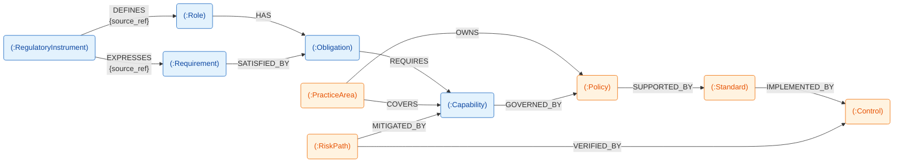
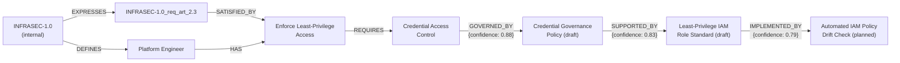
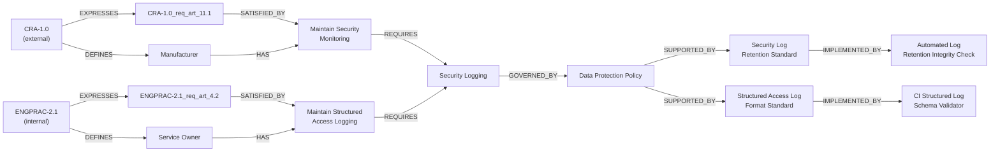
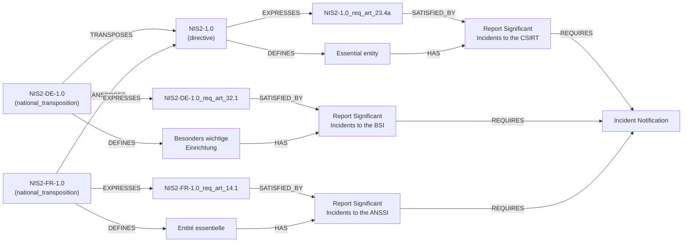

<!-- © 2026 Cartman ApS. All rights reserved. -->
# Policy System Domain Concepts

**Status:** Draft

---

## Table of Contents

1. [Document Purpose](#document-purpose)
2. [Domain Concept Diagram](#domain-concept-diagram)
3. [Provenance Placement Rule](#provenance-placement-rule)
4. [Edge Catalog](#edge-catalog)
5. [Domain Concepts](#domain-concepts)
   - [Regulatory instrument](#regulatory-instrument)
   - [Role](#role)
   - [Requirement](#requirement)
   - [Obligation](#obligation)
   - [PracticeArea](#practicearea)
   - [RiskPath](#riskpath)
   - [Capability](#capability)
   - [Policy](#policy)
   - [Standard](#standard)
   - [Control](#control)
6. [Directives and National Transposition](#directives-and-national-transposition)
7. [Worked Examples](#worked-examples)

---

## Document Purpose

This document models the Policy System domain as a **property graph**; a semantic knowledge graph.

**A fact belongs on the node or the edge, whichever it's actually about.** Properties that describe one specific relationship instance (a provenance reference for example) live on the edge, not on the node — otherwise a reused/canonical node ends up with a single property value that can't be true for all of its relationships at once.

The model has two layers:
- A **compliance spine** (`RegulatoryInstrument → Role/Requirement → Obligation → Capability → Policy → Standard → Control`) that carries regulatory provenance and implementation traceability.
- A **classification layer** (`PracticeArea`, `RiskPath`) that organizes and analyzes the spine without changing its compliance semantics.

**Orthogonal to that layering is a second axis: where a node's data actually originates.**
- **Regulatory** (`RegulatoryInstrument`, `Role`, `Requirement`, `Obligation`, `Capability`) — every property on these nodes is either lifted directly from regulatory text or derived transitively from it (see [Provenance Placement Rule](#provenance-placement-rule)). Nothing here is authored by a consumer of the model.
- **Governance** (`Policy`, `Standard`, `Control`, `PracticeArea`, `RiskPath`) — authored by the organization consuming the compliance spine: policy managers, engineering teams, risk owners, via Policy Editor. None of these nodes carries a `source_ref`; their provenance is organizational (`owner_id`, `status`, `evidence_ref`), not regulatory.

`Policy`/`Standard`/`Control` have a second possible origin, specific to `internal` RegulatoryInstruments. An `external` RegulatoryInstrument's ingestion pipeline always stops at `Capability`. An `internal` RegulatoryInstrument (an organizationally-authored Business SoP) is paired with a Domain Mapping Adapter that instead extracts all the way down the spine to `Control` — the same LLM-driven mint/match mechanism already used for `Role`/`Requirement`/`Obligation`/`Capability`, extended one source type further. A `Policy`/`Standard`/`Control` instance produced this way carries a `confidence` score, same as every other LLM-derived node; a human-authored instance (via Policy Editor) carries no `confidence`. This is an instance-level distinction, not a node-type one — the same `Policy` node type can be reached either way.

The two axes don't coincide. `Policy`/`Standard`/`Control` are Governance nodes that stay on the compliance spine — audit traceability from `RegulatoryInstrument` to `Control` is unbroken whether the last three hops are internal-SoP-derived or organizationally authored. `PracticeArea`/`RiskPath` are Governance nodes that sit outside the spine entirely, always human-authored.

| Node | Layer | Origin |
|------|-------|--------|
| RegulatoryInstrument | Spine | Regulatory |
| Role | Spine | Regulatory |
| Requirement | Spine | Regulatory |
| Obligation | Spine | Regulatory |
| Capability | Spine | Regulatory |
| Policy | Spine | Governance |
| Standard | Spine | Governance |
| Control | Spine | Governance |
| PracticeArea | Classification | Governance |
| RiskPath | Classification | Governance |

No node is both Classification and Regulatory — everything regulation-derived stays on the spine; only spine-adjacent, consumer-authored nodes are ever classification-only.

`Policy`/`Standard`/`Control`'s Governance origin is the default case (human-authored via Policy Editor); an instance derived from an `internal` RegulatoryInstrument via its Domain Mapping Adapter is the exception — see above.

---

## Domain Concept Diagram

**Legend:**
- Rounded nodes are labeled `(:Label)`, matching Cypher node syntax.
- Edge labels are relationship types in `SCREAMING_SNAKE_CASE`, matching Cypher relationship syntax.
- `{property}` under an edge label denotes an edge property — a fact about that specific relationship instance, not about either endpoint node.
- Node fill color is the [Origin axis](#document-purpose), not the compliance-spine/classification-layer axis: blue = Regulatory, orange = Governance. `Policy`/`Standard`/`Control` are orange (Governance) despite remaining on the compliance spine — color here tracks who authored the data, not chain membership.

---

## Provenance Placement Rule

Every edge's property set — whether it carries `source_ref`, or anything
else — is decided by one rule, applied identically to every edge in the
[Edge Catalog](#edge-catalog) below. No edge's properties are a local
judgment call made inside that edge's endpoint node sections; those
sections describe what an edge means, the catalog is the single place
that says what it *carries* and why.

1. **Edge-owned** — the edge is the *only* place the fact is true, and
   the fact isn't a fixed structural feature of the source text (so it
   can't safely be folded into either endpoint's identity instead).
   `DEFINES` and `EXPRESSES` are the only edges that qualify: a Role's or
   Requirement's defining/expressing location is an extraction decision,
   not a structural constant, so it has to live somewhere mutable and
   edge-scoped — correcting it later must not mint a new node.
2. **Deliberately absent — recoverable transitively** — the fact is real
   but already captured exactly once, one or more hops away; repeating
   it here would duplicate the source of truth and risk drift between
   the copies. `SATISFIED_BY` and `REQUIRES` fall here: an Obligation's
   or Capability's regulatory provenance is always reachable by walking
   `SATISFIED_BY`→`EXPRESSES` back to the originating RegulatoryInstrument article,
   so neither edge repeats it.
3. **Not applicable — no regulatory fact to place** — the edge doesn't
   sit on the RegulatoryInstrument-provenance chain at all. Classification-layer
   edges (`COVERS`, `OWNS`, `MITIGATED_BY`, `VERIFIED_BY`) qualify
   unconditionally. `GOVERNED_BY`/`SUPPORTED_BY`/`IMPLEMENTED_BY` qualify
   only when their target Policy/Standard/Control is human-authored (via
   Policy Editor) — content the consumer authored directly has no
   regulatory fact to omit. Their provenance in that case is a different
   kind of fact — who owns it, what evidence backs it — carried on node
   properties (`owner_id`, `evidence_ref`) where it actually belongs, not
   forced into this rule.

   When the target Policy/Standard/Control is instead derived from an
   `internal` RegulatoryInstrument via its Domain Mapping Adapter,
   `GOVERNED_BY`/`SUPPORTED_BY`/`IMPLEMENTED_BY` fall under **case 2**
   instead: the originating RegulatoryInstrument article is recoverable by walking
   `GOVERNED_BY`→`REQUIRES`→`SATISFIED_BY`→`EXPRESSES` back to it, the
   same transitive treatment already given to `REQUIRES` one hop up —
   no edge property is added for this case either.

---

## Edge Catalog

Single source of truth for every edge type in the model. Node sections
under [Domain Concepts](#domain-concepts) describe each edge's meaning
from that node's perspective; this table is the one place to see the
full cross-model shape and provenance rationale at once.

| Edge | Source → Target | Cardinality | Properties | Rule case ([above](#provenance-placement-rule)) |
|------|------------------|-------------|------------|------|
| `DEFINES` | RegulatoryInstrument → Role | 1 : 0..* | `source_ref` (required) | 1 — edge-owned |
| `EXPRESSES` | RegulatoryInstrument → Requirement | 1 : 0..* | `source_ref` (required) | 1 — edge-owned; also structurally fixed enough to double as Requirement's own identity, unlike Role's |
| `SUPERSEDED_BY` | RegulatoryInstrument → RegulatoryInstrument | 0..1 : 0..1 | — | n/a — version succession, not a provenance fact |
| `TRANSPOSES` | RegulatoryInstrument → RegulatoryInstrument | 0..* : 1 | — | n/a — structural bibliographic link (a national statute implements an EU directive), not a provenance fact; parallels `SUPERSEDED_BY`. Source is always a `national_transposition`, target always a `directive`. |
| `HAS` | Role → Obligation | 1 : 0..* | — | n/a — structural assignment, no location fact involved |
| `SATISFIED_BY` | Requirement → Obligation | 1..* : 0..* | — | 2 — recoverable via this Requirement's own `EXPRESSES` edge |
| `REQUIRES` | Obligation → Capability | 1..* : 0..* | — | 2 — recoverable transitively, one hop further than `SATISFIED_BY` |
| `COVERS` | PracticeArea → Capability | 1 : 0..* | — | 3 — classification layer |
| `OWNS` | PracticeArea → Policy | 1 : 0..* | — | 3 — classification layer |
| `MITIGATED_BY` | RiskPath → Capability | 1 : 0..* | — | 3 — classification layer |
| `VERIFIED_BY` | RiskPath → Control | 1 : 0..* | — | 3 — classification layer |
| `GOVERNED_BY` | Capability → Policy | 0..* : 0..1 | — | 3 if Policy is human-authored; 2 (recoverable via `REQUIRES`→`SATISFIED_BY`→`EXPRESSES`) if Policy is internal-SoP-derived |
| `SUPPORTED_BY` | Policy → Standard | 1 : 1..* | — | 3 if Standard is human-authored; 2 (recoverable via `GOVERNED_BY` onward) if internal-SoP-derived |
| `IMPLEMENTED_BY` | Standard → Control | 1 : 0..* | — | 3 if Control is human-authored; 2 (recoverable via `SUPPORTED_BY` onward) if internal-SoP-derived |

---

## Domain Concepts

### Regulatory instrument

**Description:** A regulation source, identified by an official identifier, title, effective date, version, and status. RegulatoryInstrument is the root of the domain model: it is the authoritative source Role and Requirement are derived from, and the point every other concept's provenance ultimately traces back to. `source_type` distinguishes two kinds of source that both fit this shape:
- **`external`** — EU legislation (GDPR, CRA, NIS2), an international standard, or national law, ingested from an official regulatory source.
- **`internal`** — an organizationally-authored "Business Regulation," e.g. an Engineering Practices standard, governed through normal internal engineering governance rather than official-source ingestion.

Both source types flow through the same `DEFINES` / `EXPRESSES` / Role / Requirement chain unchanged, so an internal standard's Requirements converge onto the same canonical Obligation and Capability nodes as external regulations — e.g. an internal "Security Logging Practice" can land on the same `Capability` node that CRA and GDPR already converge on (see [Obligation](#obligation) and [Capability](#capability)).

Within `external`, a second axis — `instrument_type` — records what kind of legal instrument the source is, because it changes both how the source is ingested and how its obligations are scoped to a company:
- **`regulation`** — a directly-applicable instrument binding entities EU-wide from one authoritative text, with no national implementation step (EU Regulations such as GDPR and CRA; also an international standard adopted as-is).
- **`directive`** — an EU instrument that binds *member states* to a result but leaves the form to national law: each member state transposes it into its own statute, with real discretion over scope thresholds, sanctions, and sector coverage (NIS2). A `directive` node holds the framework-level extraction from the Directive text itself; the checkable national obligations live in separate `national_transposition` nodes linked to it by [`TRANSPOSES`](#edge-catalog).
- **`national_transposition`** — one member state's statute transposing a specific `directive`. Its `jurisdiction` is a single country, its `source_ref`s point into that country's law, and it carries an outbound `TRANSPOSES` edge to the `directive` it implements.

`instrument_type` is required for `source_type: external` and absent for `internal`. The Directive/transposition pattern is described in full under [Directives and National Transposition](#directives-and-national-transposition).

**Lifecycle:** Ingested from official sources and retained permanently for historical analysis. RegulatoryInstruments are read-only once created — never modified in place. A new version doesn't overwrite the old one; it supersedes it via `SUPERSEDED_BY` — detected by Regulatory Change Monitor polling the source, which triggers a full re-ingestion cycle (Ingestion → Domain Mapper → Company Merge) for the new version, preserving a complete version history for traceability. A `directive` source adds a second ingestion shape: the Directive text is ingested as the framework node, and each member state's transposing statute is ingested separately as its own `national_transposition` node once real transposition text is available. A member state that has not yet transposed — or whose transposition has not yet been ingested — simply has no node; the model does not distinguish those two cases.

**Node label:** `RegulatoryInstrument`
**Identity:** natural key, shaped by `instrument_type`:

| `instrument_type` | Identity pattern | Example |
|---|---|---|
| `regulation` | `{SHORT}-{VERSION}` | `CRA-1.0`, `GDPR-1.0` |
| `directive` | `{SHORT}-{VERSION}` | `NIS2-1.0` |
| `national_transposition` | `{SHORT}-{JURISDICTION}-{VERSION}` | `NIS2-DE-1.0`, `NIS2-FR-1.0` |

`{JURISDICTION}` is the ISO 3166-1 alpha-2 code and always equals the node's own `jurisdiction`. `{VERSION}` on a `national_transposition` tracks that national statute's own revision history, independent of the Directive's version — when a member state amends its transposing law the national node is superseded via `SUPERSEDED_BY` while the `directive` node is untouched. RegulatoryInstrument is a root concept; a `national_transposition`'s link to its `directive` is carried entirely by the `TRANSPOSES` edge, never by a hashed identity segment, so the forms above stay stable human-readable keys rather than weak-entity encodings.

#### Properties

| Property | Type | Required | Notes |
|----------|------|----------|-------|
| `id` | string | Yes | Same value as Identity above |
| `title` | string | Yes | |
| `source_type` | enum: `external` \| `internal` | Yes | `external` = EU legislation, international standard, or national law. `internal` = organizationally-authored Business Regulation (e.g. Engineering Practices standard). |
| `instrument_type` | enum: `regulation` \| `directive` \| `national_transposition` | Conditional | Required for `source_type: external`; absent for `internal`. Determines the identity pattern (below) and, for `directive`, that framework-level and national obligations are modelled as separate linked nodes. See [Directives and National Transposition](#directives-and-national-transposition). |
| `jurisdiction` | string | No | Required in practice for `external` sources. Optional because `internal` sources may have no jurisdiction, or may use this field for org-unit scope instead — different business units can carry different values here. For `national_transposition` this is a single ISO 3166-1 alpha-2 country code and also appears in the identity. |
| `effective_date` | date (ISO 8601) | Yes | |
| `version` | string | Yes | |
| `status` | enum: `active` \| `superseded` \| `vacated` | Yes | |

#### Relationships

| Edge | Target | Cardinality | Edge Properties | Note |
|------|--------|-------------|------------------|------|
| `DEFINES` | Role | 1 : 0..* | `source_ref` (string, required) | The article/section where this RegulatoryInstrument defines this Role. Lives on the edge, not on Role, because the defining act is specific to this RegulatoryInstrument–Role pair. |
| `EXPRESSES` | Requirement | 1 : 0..* | `source_ref` (string, required) | The article/section where this RegulatoryInstrument expresses this Requirement. Lives on the edge, not on Requirement, for the same reason as `DEFINES` above — the expressing act is specific to this RegulatoryInstrument–Requirement pair. |
| `SUPERSEDED_BY` | RegulatoryInstrument | 0..1 : 0..1 | — | Self-relationship tracking regulatory version succession. |
| `TRANSPOSES` (outbound) | RegulatoryInstrument | 0..* : 1 | — | Only on `national_transposition` nodes: links the national statute to the EU `directive` it implements. Each national node transposes exactly one `directive`; a `directive` is transposed by zero-or-more national nodes. Structural bibliographic link — no `source_ref`, since this node's real provenance is on its own `DEFINES`/`EXPRESSES` edges. |

---

### Role

**Description:** An actor type defined by a regulation that carries duties and responsibilities — e.g. "Manufacturer" (CRA), "Data Controller" (GDPR), "Operator of Essential Services" (NIS2). Role answers "who must do what" under a given regulation. Because Role's identity is tied to its defining RegulatoryInstrument (see Identity below), roles that are semantically similar across different regulations remain distinct nodes rather than converging onto one — that convergence happens one layer down, at Obligation, which is exactly why Obligation (not Role) is designed to be regulation-independent. Without the structured source reference carried on the `DEFINES` edge, a Role's definition would be an unverifiable assertion — the reference is what lets "Manufacturer" be checked against the regulation that actually defines it, rather than merely claimed.

**Lifecycle:** Extracted when a regulation is loaded, or sourced from official regulatory glossaries/definitions. Immutable reference data once created — a stable point that Obligations attach to via `HAS`.

**Node label:** `Role`
**Identity:** `role_{slug}_{hash}` (e.g. `role_manufacturer_a1b2c3`) — content-derived from `name` + defining RegulatoryInstrument, opaque hash suffix. The defining-RegulatoryInstrument relationship is expressed only via the inbound `DEFINES` edge, never re-encoded into the ID string.

#### Properties

| Property | Type | Required | Notes |
|----------|------|----------|-------|
| `name` | string | Yes | |
| `description` | string | No | |
| `confidence` | float, 0.0–1.0 | Yes | The extracting LLM's own certainty that this candidate is genuinely a duty-bearing actor category the regulation names or creates — not conditioned on how the Role was minted; always recorded, since it's a fact about the extraction event itself and is unrecoverable once dropped. |

#### Relationships

| Edge | Target | Cardinality | Edge Properties | Note |
|------|--------|-------------|------------------|------|
| `DEFINES` (inbound) | RegulatoryInstrument | 0..* : 1 | `source_ref` (string, required) | See [RegulatoryInstrument → DEFINES](#regulatory-instrument). |
| `HAS` | Obligation | 1 : 0..* | — | A Role has zero or more canonical Obligations assigned to it. |

---

### Requirement

**Description:** A condition expressed by a regulation specifying what must, must not, or should be true — focused on what must be true, independent of who is responsible for making it true (that's Role's job). Requirement is the terminal node of the provenance chain: every other concept's auditability ultimately traces back to a Requirement's source reference being a real, verifiable regulatory location rather than an unvalidated extraction claim.

**Lifecycle:** Ingested from regulatory text via LLM-driven extraction when a regulation is loaded. Read-only once created — never modified directly, only deprecated when superseded by a new regulation version.

**Node label:** `Requirement`
**Identity:** `{REG}_req_art_{ARTICLE}.{PARAGRAPH}[LETTER]` (e.g. `CRA-1.0_req_art_13.8c`) — generated from the regulatory source reference (regulation + article + paragraph/sub-point). Paragraph-level, not article-level: a single article routinely bundles several independent "shall"/"shall not"/"should" duties in different numbered paragraphs, and a single paragraph is occasionally split further (the trailing letter) when it visibly bundles more than one independent duty of its own. Unlike Role and Obligation, this identity is deliberately non-opaque: a Requirement is expressed by exactly one paragraph/sub-point of one RegulatoryInstrument article, so encoding that location directly in the ID is safe — there's no reuse across regulations to protect against.

#### Properties

| Property | Type | Required | Notes |
|----------|------|----------|-------|
| `text` | string | Yes | |
| `type` | enum: `requirement` \| `prohibition` \| `recommendation` | Yes | |
| `status` | enum: `active` \| `deprecated` | No | |
| `confidence` | float, 0.0–1.0 | Yes | The extracting LLM's own certainty that this paragraph/sub-point genuinely states an operative requirement, prohibition, or recommendation (vs. a borderline case — ambiguous modal strength, an embedded conditional, disputed granularity). Always recorded, unconditionally. |

#### Relationships

| Edge | Target | Cardinality | Edge Properties | Note |
|------|--------|-------------|------------------|------|
| `EXPRESSES` (inbound) | RegulatoryInstrument | 0..* : 1 | `source_ref` (string, required) | See [RegulatoryInstrument → EXPRESSES](#regulatory-instrument). `source_ref` lives on this edge, not on Requirement, following the same rule applied to Role's `DEFINES` edge. |
| `SATISFIED_BY` | Obligation | 1..* : 0..* | — | Bridges this regulation-specific condition to one or more canonical Obligations. Many-to-many: a single Requirement may need several Obligations to be fully satisfied, and a single Obligation commonly satisfies Requirements from several different regulations — that reuse is the entire point of Obligation being canonical (see [Obligation](#obligation)). |

---

### Obligation

**Description:** A canonical, reusable duty assigned to exactly one Role — e.g. "Conduct Cybersecurity Risk Assessment" or "Report Security Incidents." Obligation is the semantic anchor that enables cross-regulation normalization: GDPR's 72-hour breach notice requirement for Data Controllers and NIS2's 24-hour early warning requirement for Operators of Essential Services both instantiate the same "Report Security Incidents" Obligation, assigned to different Roles — this is exactly why Obligation's identity (see below) is kept regulation-independent. Obligation defines the generic duty only; accountability for actually fulfilling it attaches at Policy (not yet in this document), where the duty is assigned to a concrete organizational owner.

**Lifecycle:** Either pre-populated as part of a canonical taxonomy, or minted the first time a Requirement doesn't match any existing Obligation. Rarely modified once created — stable reference data reused across many Requirements and regulations.

**Node label:** `Obligation`
**Identity:** `obl_{slug}_{hash}` (e.g. `obl_risk_management_a8f3b1`) — content-derived from the obligation's duty statement, deliberately **regulation-independent** (no `{REG}` prefix, unlike Role and Requirement). This is what makes Obligation canonical: the same node is reused as the `SATISFIED_BY` target for Requirements originating from different regulations, rather than a fresh Obligation being minted per regulation.

#### Properties

| Property | Type | Required | Notes |
|----------|------|----------|-------|
| `text` | string | Yes | The canonical duty statement, e.g. "Conduct Cybersecurity Risk Assessment" |
| `confidence` | float, 0.0–1.0 | Yes | The extracting LLM's own certainty in this decision — whether minting a new Obligation from an unmatched Requirement, or matching a Requirement to an existing canonical Obligation. Always recorded, unconditionally; not limited to the minted case. |

Deliberately **excluded**: a `source_ref` property, on the node or on any of its edges — see [Provenance Placement Rule, case 2](#provenance-placement-rule). An Obligation with no live `SATISFIED_BY` edge is unprovenanced.

#### Relationships

| Edge | Target | Cardinality | Edge Properties | Note |
|------|--------|-------------|------------------|------|
| `HAS` (inbound) | Role | 0..* : 1 | — | See [Role → HAS](#role). Each Obligation is assigned to exactly one Role. |
| `SATISFIED_BY` (inbound) | Requirement | 0..* : 1..* | — | See [Requirement → SATISFIED_BY](#requirement). |
| `REQUIRES` (outbound) | Capability | 1..* : 0..* | — | See [Capability](#capability). |

---

### PracticeArea

**Description:** A stable engineering taxonomy used to group related capabilities and govern ownership of policies — e.g. "Secure Development Lifecycle" or "Reliability and Service Operations." PracticeArea is organizational classification, not compliance provenance: it improves assignment, scoping, and reporting without altering the `RegulatoryInstrument`-anchored traceability chain.

**Lifecycle:** Curated by engineering governance and updated infrequently as operating models change. Usually long-lived reference data with occasional renames, merges, or deprecations.

**Node label:** `PracticeArea`
**Identity:** `pa_{slug}_{hash}` (e.g. `pa_secure_sdlc_4a7c1d`) — content-derived from `name` alone, regulation-independent.

#### Properties

| Property | Type | Required | Notes |
|----------|------|----------|-------|
| `name` | string | Yes | |
| `description` | string | No | |
| `status` | enum: `active` \| `deprecated` | Yes | |
| `version` | string | No | |
| `owner_id` | string | No | Optional organizational owner for this taxonomy area. |

#### Relationships

| Edge | Target | Cardinality | Edge Properties | Note |
|------|--------|-------------|------------------|------|
| `COVERS` | Capability | 1 : 0..* | — | Classifies which reusable Capabilities belong to this practice area. |
| `OWNS` | Policy | 1 : 0..* | — | Assigns governance ownership of Policies by area. |

---

### RiskPath

**Description:** A cross-cutting risk lens used to reason about completeness and gaps — e.g. "Secure Build and Release" or "Incident and Recovery Readiness." RiskPath is analytical metadata, not a replacement for Requirement or Obligation semantics.

**Lifecycle:** Seeded from the organization's baseline risk model and refined as incidents, audits, and threat modeling evolve.

**Node label:** `RiskPath`
**Identity:** `rp_{slug}_{hash}` (e.g. `rp_secure_build_release_d93f8a`) — content-derived from `name` alone, canonical across regulations and business units.

#### Properties

| Property | Type | Required | Notes |
|----------|------|----------|-------|
| `name` | string | Yes | |
| `description` | string | No | |
| `status` | enum: `active` \| `deprecated` | Yes | |
| `risk_type` | enum: `security` \| `reliability` \| `privacy` \| `compliance` \| `safety` \| `supply_chain` | No | Optional categorization for reporting slices. |
| `version` | string | No | |

#### Relationships

| Edge | Target | Cardinality | Edge Properties | Note |
|------|--------|-------------|------------------|------|
| `MITIGATED_BY` | Capability | 1 : 0..* | — | Connects abstract risk exposure to reusable technical/organizational capacity. |
| `VERIFIED_BY` | Control | 1 : 0..* | — | Connects risk exposure to concrete verification evidence paths. |

---

### Capability

**Description:** A technical or organizational capacity that must exist to fulfill Obligations — e.g. "Data Encryption," "Access Control System," "Security Logging." Capability is the "how" to Obligation's "what": it lets an organization see commonalities across obligations that look different on paper, e.g. recognizing that both "Maintain Security Monitoring" (CRA) and "Ensure Logging of Access" (GDPR) require the same "Security Logging" capability. This is exactly the cross-regulation convergence the identity design below protects — hashing on `name` alone is what lets one Capability be required by many Obligations instead of fragmenting.

**Lifecycle:** Either pre-populated as part of a canonical capability taxonomy, or minted when an Obligation requires a capability type that doesn't yet exist. Stable reference data once created — governed by Policy (not yet in this document), potentially across many business contexts.

**Node label:** `Capability`
**Identity:** `cap_{slug}_{hash}` (e.g. `cap_data_encryption_a8f3b1`) — content-derived from `name` alone, deliberately excluding any specific requiring Obligation. `ps-domain-concepts.md` describes this ID as derived from "capability name and related obligation content," but that would work against its own stated goal: Capability is required by 0..* Obligations (many-to-many, same reuse shape as Obligation itself), so baking one Obligation's content into the hash would fragment equivalent capabilities pulled in under different Obligations instead of collapsing them onto the same node. Deriving from `name` alone is what actually delivers cross-regulation convergence.

#### Properties

| Property | Type | Required | Notes |
|----------|------|----------|-------|
| `name` | string | Yes | |
| `description` | string | No | |
| `type` | string | No | e.g. `technical`, `organizational` |
| `status` | enum: `active` \| `deprecated` | No | |
| `confidence` | float, 0.0–1.0 | Yes | The extracting LLM's own certainty in this decision — whether reusing an existing Capability for an Obligation, or minting a new one because none of the existing candidates fit. Always recorded, unconditionally. |

#### Relationships

| Edge | Target | Cardinality | Edge Properties | Note |
|------|--------|-------------|------------------|------|
| `REQUIRES` (inbound) | Obligation | 0..* : 1..* | — | See [Obligation → REQUIRES](#obligation). |
| `COVERS` (inbound) | PracticeArea | 0..* : 1..* | — | See [PracticeArea → COVERS](#practicearea). |
| `MITIGATED_BY` (inbound) | RiskPath | 0..* : 1..* | — | See [RiskPath → MITIGATED_BY](#riskpath). |
| `GOVERNED_BY` (outbound) | Policy | 0..* : 0..1 | — | See [Policy → GOVERNED_BY](#policy). |

---

### Policy

**Description:** An organizational commitment governing how one or more Capabilities must be achieved. Policy is where accountability actually attaches to the generic model: the "what capacity must exist" of a Capability becomes "who owns making it happen and how it's reviewed" (owner, review cycle, approval status) once it reaches Policy. A single Policy commonly governs several Capabilities at once — e.g. one "Data Protection Policy" governing encryption, logging, and access-control capabilities together — rather than each Capability answering to its own policy; different business contexts or risk tolerances are handled by minting a distinct Capability, not by a Capability answering to more than one Policy.

**Lifecycle:** Created by policy managers through governance workflows; revised when regulations or the business change; archived (not deleted) when superseded, since audit history requires the full approval trail to remain intact. Moves through a `draft` → `approved` → `deprecated` status workflow.

Alternatively, matched/minted by the internal-source Domain Mapping Adapter when derived from an `internal` RegulatoryInstrument (a Business SoP) — the same LLM-driven mechanism already used for Obligation/Capability, extended past `Capability` for internal sources only (external sources stop at `Capability`). A Policy instance is one or the other, never both; see [Document Purpose](#document-purpose).

**Node label:** `Policy`
**Identity:** `pol_{slug}_{hash}` (e.g. `pol_data_protection_a8f3b1`) — content-derived from the Policy's own `title`, deliberately **not** derived from a governed Capability. `ps-domain-concepts.md` originally specified `pol_{capability_slug}_{capability_type}`, but that formula only encodes a single Capability — incoherent the moment a Policy governs more than one, which is exactly its own worked example above. Deriving from the Policy's own title instead avoids that, the same fix already applied to Obligation and Capability: identity comes from what the node itself is, never from what it happens to be connected to.

#### Properties

| Property | Type | Required | Notes |
|----------|------|----------|-------|
| `title` | string | Yes | |
| `description` | string | No | |
| `owner_id` | string | No | |
| `status` | enum: `draft` \| `approved` \| `deprecated` | Yes | |
| `version` | string | No | |
| `confidence` | float, 0.0–1.0 | No | Present only when this Policy is internal-SoP-derived — the extracting LLM's own certainty in matching/minting this Policy for the governing Capability. Absent on human-authored (Policy Editor) instances, same as `jurisdiction` on RegulatoryInstrument is conditional on `source_type`. |

#### Relationships

| Edge | Target | Cardinality | Edge Properties | Note |
|------|--------|-------------|------------------|------|
| `OWNS` (inbound) | PracticeArea | 0..* : 1 | — | See [PracticeArea → OWNS](#practicearea). Starter baseline should enforce exactly one owning PracticeArea per active Policy. |
| `GOVERNED_BY` (inbound) | Capability | 0..1 : 0..* | — | See [Capability → GOVERNED_BY](#capability). Many Capabilities may point to the same Policy — the reason this Policy's identity above can't be derived from any one of them. |
| `SUPPORTED_BY` (outbound) | Standard | 1 : 1..* | — | See [Standard → SUPPORTED_BY](#standard). Every Policy requires at least one Standard defining how its commitment is actually implemented. |

---

### Standard

**Description:** Implementation guidance for how a Policy is actually to be achieved — procedures, technical specifications, and testing expectations that turn a Policy's organizational commitment into something concrete enough to build and verify. Standard is the "how" beneath Policy's "what," the same relationship Capability has to Obligation one layer up. Unlike Obligation, Capability, and Policy, a Standard is **not** a canonical, cross-context concept: it supports exactly one Policy, so a distinct Standard is minted per Policy rather than one Standard answering to several Policies — which is exactly why its identity (see below) can safely be derived from the Policy it supports.

**Lifecycle:** Developed by policy managers or technical teams once a Policy exists; revised when that Policy changes or the underlying technology evolves. Moves through a `draft` → `implemented` → `reviewed` → `deprecated` status workflow, mirroring Policy's own governance cadence.

Alternatively, matched/minted by the internal-source Domain Mapping Adapter once its parent Policy is internal-SoP-derived — see [Policy](#policy).

**Node label:** `Standard`
**Identity:** `std_{POLICY}_{VERSION}` (e.g. `std_pol_data_protection_a8f3b1_v1`) — derived from the Policy it supports plus version. This is the same weak-entity pattern used for Requirement's identity (not the canonical-hash pattern used for Obligation/Capability/Policy): a Standard exists only in the context of exactly one Policy, so encoding that ownership in the ID is safe — there's no cross-Policy reuse to protect against.

#### Properties

| Property | Type | Required | Notes |
|----------|------|----------|-------|
| `title` | string | Yes | |
| `description` | string | No | |
| `implementation_status` | enum: `draft` \| `implemented` \| `reviewed` \| `deprecated` | Yes | |
| `version` | string | No | |
| `confidence` | float, 0.0–1.0 | No | Present only when this Standard is internal-SoP-derived — same conditional as Policy's `confidence`. Absent on human-authored instances. |

#### Relationships

| Edge | Target | Cardinality | Edge Properties | Note |
|------|--------|-------------|------------------|------|
| `SUPPORTED_BY` (inbound) | Policy | 1..* : 1 | — | See [Policy → SUPPORTED_BY](#policy). |
| `IMPLEMENTED_BY` (outbound) | Control | 1 : 0..* | — | See [Control](#control). |

---

### Control

**Description:** A concrete, testable verification mechanism confirming that a Standard's procedure is actually being followed — automated (e.g. a CI/CD policy-as-code check) or manual (e.g. a periodic audit review). Control is where the domain model becomes operationally checkable: it carries execution frequency, test dates, and pass/fail evidence, turning "we have a Standard for this" into "we can prove it, on a schedule." Like Standard, Control is not canonical — it verifies exactly one Standard, so a distinct Control is minted per Standard rather than reused across Standards.

**Lifecycle:** Implemented by engineering teams once a Standard exists; tested and revalidated on `execution_frequency`; updated when the Standard changes or the underlying technology evolves. Moves through a `planned` → `implemented` → `reviewed` → `deprecated` status workflow. Execution evidence is retained permanently for audit purposes; the evidence store itself is out of scope for this document — `evidence_ref` is an opaque pointer into it, not a modeled relationship.

Alternatively, matched/minted by the internal-source Domain Mapping Adapter once its parent Standard is internal-SoP-derived — see [Policy](#policy). Operational fields (`execution_frequency`, `last_test_date`, `next_review_date`, `evidence_ref`) are never populated by the adapter on mint — they stay null until engineering teams fill them in during actual implementation/testing, the same as for a human-authored Control.

**Node label:** `Control`
**Identity:** `ctrl_{STANDARD}_{TYPE}` (e.g. `ctrl_std_pol_data_protection_a8f3b1_v1_automated`) — derived from the Standard it verifies plus control type, the same weak-entity pattern as Standard's own identity: a Control exists only to verify exactly one Standard, so there's no cross-Standard reuse to protect against.

#### Properties

| Property | Type | Required | Notes |
|----------|------|----------|-------|
| `type` | enum: `automated` \| `manual` | Yes | |
| `title` | string | Yes | |
| `description` | string | No | |
| `implementation_status` | enum: `planned` \| `implemented` \| `reviewed` \| `deprecated` | Yes | |
| `execution_frequency` | string | No | |
| `last_test_date` | date (ISO 8601) | No | |
| `next_review_date` | date (ISO 8601) | No | |
| `evidence_ref` | string | No | Opaque pointer into an external evidence/audit store; that store is out of scope for this document. |
| `confidence` | float, 0.0–1.0 | No | Present only when this Control is internal-SoP-derived — same conditional as Policy's `confidence`. Absent on human-authored instances. |

#### Relationships

| Edge | Target | Cardinality | Edge Properties | Note |
|------|--------|-------------|------------------|------|
| `IMPLEMENTED_BY` (inbound) | Standard | 0..* : 1 | — | See [Standard → IMPLEMENTED_BY](#standard). Each Control verifies exactly one Standard. |
| `VERIFIED_BY` (inbound) | RiskPath | 0..* : 1..* | — | See [RiskPath → VERIFIED_BY](#riskpath). Enables completeness checks that each active RiskPath has concrete verification evidence. |

---

## Directives and National Transposition

An EU **Directive** does not bind companies directly. It binds each member state to transpose it into national law by a deadline, with genuine discretion over scope thresholds, sanctions, sector coverage, and reporting detail. A company operating in Germany owes what the German transposing statute says; a company operating in France owes what the French one says; the two can differ materially even though both derive from the same Directive. Modelling a Directive as a single `RegulatoryInstrument` node with one set of `source_ref`s would either invent a fictional single source location or silently erase that national variance — either way breaking the guarantee that every regulatory node's provenance is a real, checkable location in an authoritative text.

### Node shape

- **One `directive` node** (e.g. `NIS2-1.0`, `jurisdiction: EU`) carrying framework-level extraction from the Directive text itself — the Roles it names and the Requirements it states in its own operative provisions. Many Directive provisions *are* directly prescriptive (NIS2 Art. 23's reporting timelines, for instance); those are extracted here exactly as for any other source.
- **Zero or more `national_transposition` nodes** (e.g. `NIS2-DE-1.0`, `NIS2-FR-1.0`), one per member state whose transposing statute has been ingested, each carrying its own `DEFINES`/`EXPRESSES` edges with `source_ref`s into that country's law, and each linked to the `directive` node by an outbound [`TRANSPOSES`](#edge-catalog) edge.

Both kinds of node are extracted **independently and fully** — a `national_transposition` is not a diff against the Directive. Where a member state re-enacts a Directive provision unchanged, the graph legitimately holds two `Requirement` nodes (one expressed by the `directive`, one by the `national_transposition`); they converge downstream on shared canonical capacity, the same way GDPR and CRA already do. Everything from `Obligation` downward is unaffected by whether the source was a `regulation`, a `directive`, or a `national_transposition`.

### Querying across the pattern

Because the same downstream nodes are reachable from both the `directive` and its `national_transposition`s, queries must be explicit about which lens they want; `instrument_type` and `jurisdiction` are the discriminators.

- **Jurisdiction-scoped compliance** ("what does a company operating in Germany owe under NIS2?") — the in-scope set of `RegulatoryInstrument` nodes for a company operating in jurisdictions *J* is: every `regulation` node, plus, for every `directive`, its `national_transposition` nodes whose `jurisdiction ∈ J`. Where a `national_transposition` and its `directive` both lead to the same canonical duty, the **national `source_ref` is the operative one** — it is the text that actually binds the company. The `directive`'s own provision is the fallback source only when the relevant jurisdiction has no `national_transposition` node.
- **Framework completeness** ("how many distinct obligations does NIS2 impose?") — traverse from the `directive` and its `national_transposition`s together, then deduplicate on canonical node identity. Counting `Requirement`s would double-count every unchanged re-enactment.
- **Transposition gap analysis** ("where does Germany's transposition fall short of the Directive?") — the set difference between what is reachable from `NIS2-1.0` and what is reachable from `NIS2-DE-1.0`. Partial transposition is surfaced this way, as a query result — never stored as a status flag.
- **Pre-entry due diligence** ("what would we owe if we opened an office in Italy?") — the jurisdiction-scoped query above, run with a prospective jurisdiction. Every ingested `national_transposition` is present in the company graph regardless of where the company currently operates, specifically so this question can be answered before entering the market rather than after.

### Out of scope for the model

The model records what has been ingested and can be traced to real text. It does **not** model the political state of the transposition processes — whether a given member state is on time, late, or in infringement. That is monitoring, owned by Regulatory Change Monitor, and it depends on polling national legal databases with no common EU-level access point. Until that capability exists, "transposed but not yet ingested" and "not transposed at all" are both simply the absence of a `national_transposition` node.

---

## Worked Examples

*Illustrative instance data — not normative. IDs reuse the identity examples given throughout this document, so each chain below doubles as a consistency check on the model itself. Examples 1 and 2 are constructed to converge on the same `Capability` and `Policy` nodes, making the cross-source convergence claimed throughout this document concrete rather than asserted; Example 3 is the deliberate opposite case (no existing node to converge onto — the internal-source adapter mints the full spine); Example 4 shows an EU Directive plus two national transpositions converging at `Capability`.*

### Example 1 — CRA (`source_type: external`)

| Node | Identity | Key Properties |
|------|----------|-----------------|
| `RegulatoryInstrument` | `CRA-1.0` | `source_type`: `external`, `title`: "Cyber Resilience Act", `jurisdiction`: "EU", `effective_date`: `2027-12-11`, `version`: `1.0`, `status`: `active` |
| `Role` | `role_manufacturer_a1b2c3` | `name`: "Manufacturer" — `DEFINES` edge from `CRA-1.0`, `source_ref`: "Art. 13" |
| `Requirement` | `CRA-1.0_req_art_11.1` | `text`: "Manufacturers shall ensure products with digital elements log relevant internal activity, including access to data", `type`: `requirement` — `EXPRESSES` edge from `CRA-1.0`, `source_ref`: "Art. 11(1)" |
| `Obligation` | `obl_security_monitoring_5e1f2a` | `text`: "Maintain Security Monitoring" — `HAS` from `Manufacturer`, `SATISFIED_BY` from `CRA-1.0_req_art_11.1` |
| `Capability` | `cap_security_logging_c4d9e2` | `name`: "Security Logging" — `REQUIRES` from the Obligation above |
| `Policy` | `pol_data_protection_a8f3b1` | `title`: "Data Protection Policy", `status`: `approved` — `GOVERNED_BY` from the Capability above |
| `Standard` | `std_pol_data_protection_a8f3b1_v1` | `title`: "Security Log Retention Standard", `implementation_status`: `implemented` — `SUPPORTED_BY` from the Policy above |
| `Control` | `ctrl_std_pol_data_protection_a8f3b1_v1_automated` | `type`: `automated`, `title`: "Automated Log Retention Integrity Check" — `IMPLEMENTED_BY` from the Standard above |

Path: CRA Art. 11 obliges Manufacturers to "Maintain Security Monitoring" → that requires the "Security Logging" Capability → governed by the "Data Protection Policy" → implemented via the "Security Log Retention Standard" → verified by an automated Control.

### Example 2 — Internal Engineering Practice (`source_type: internal`)

| Node | Identity | Key Properties |
|------|----------|-----------------|
| `RegulatoryInstrument` | `ENGPRAC-2.1` | `source_type`: `internal`, `title`: "Engineering Practices Standard", `jurisdiction`: *(not set — org-wide, no jurisdiction applies)*, `effective_date`: `2026-01-15`, `version`: `2.1`, `status`: `active` |
| `Role` | `role_service_owner_9f2e4d` | `name`: "Service Owner" — `DEFINES` edge from `ENGPRAC-2.1`, `source_ref`: "Sec. 4.1" |
| `Requirement` | `ENGPRAC-2.1_req_art_4.2` | `text`: "Service owners shall ensure all production services emit structured access logs, retained for 90 days", `type`: `requirement` — `EXPRESSES` edge from `ENGPRAC-2.1`, `source_ref`: "Sec. 4.2" |
| `Obligation` | `obl_structured_access_logging_7b3c9d` | `text`: "Maintain Structured Access Logging" — `HAS` from `Service Owner`, `SATISFIED_BY` from `ENGPRAC-2.1_req_art_4.2` |
| `Capability` | `cap_security_logging_c4d9e2` | **Same node as Example 1** — `REQUIRES` from the Obligation above |
| `Policy` | `pol_data_protection_a8f3b1` | **Same node as Example 1** — `GOVERNED_BY` from the Capability above |
| `Standard` | `std_pol_data_protection_a8f3b1_v2` | `title`: "Structured Access Log Format Standard", `implementation_status`: `implemented` — `SUPPORTED_BY` from the Policy above (a second Standard under the same Policy) |
| `Control` | `ctrl_std_pol_data_protection_a8f3b1_v2_automated` | `type`: `automated`, `title`: "CI Structured Log Schema Validator" — `IMPLEMENTED_BY` from the Standard above |

Path: internal Engineering Practices Sec. 4.2 obliges Service Owners to "Maintain Structured Access Logging" → that requires the *same* "Security Logging" Capability CRA already required → governed by the *same* "Data Protection Policy" → implemented via its own "Structured Access Log Format Standard" → verified by its own Control.

### Example 3 — Internal SoP, Full-Depth Derivation (`source_type: internal`)

Unlike Example 2, which converges onto Example 1's pre-existing, human-authored Policy, this chain has no existing Capability to match against — its internal-source Domain Mapping Adapter mints Policy/Standard/Control itself, all the way to Control, in the same pass. Every node from Capability down carries `confidence`, and Policy/Standard/Control default to the earliest state in their status workflow (`draft`/`draft`/`planned`) since no human has reviewed them yet.

| Node | Identity | Key Properties |
|------|----------|-----------------|
| `RegulatoryInstrument` | `INFRASEC-1.0` | `source_type`: `internal`, `title`: "Infrastructure Security Practices", `jurisdiction`: *(not set — org-wide)*, `effective_date`: `2026-03-01`, `version`: `1.0`, `status`: `active` |
| `Role` | `role_platform_engineer_6c1a9f` | `name`: "Platform Engineer" — `DEFINES` edge from `INFRASEC-1.0`, `source_ref`: "Sec. 2.1" |
| `Requirement` | `INFRASEC-1.0_req_art_2.3` | `text`: "Platform engineers shall enforce least-privilege access on all production infrastructure credentials", `type`: `requirement` — `EXPRESSES` edge from `INFRASEC-1.0`, `source_ref`: "Sec. 2.3" |
| `Obligation` | `obl_least_privilege_access_3d8e21` | `text`: "Enforce Least-Privilege Access" — `HAS` from `Platform Engineer`, `SATISFIED_BY` from `INFRASEC-1.0_req_art_2.3` |
| `Capability` | `cap_credential_access_control_f4a712` | `name`: "Credential Access Control" — `REQUIRES` from the Obligation above; a new Capability, not matched to any existing one |
| `Policy` | `pol_credential_governance_9b2c05` | `title`: "Credential Governance Policy", `status`: `draft`, `confidence`: `0.88` — minted (not matched) by the internal-source Domain Mapping Adapter, `GOVERNED_BY` from the Capability above |
| `Standard` | `std_pol_credential_governance_9b2c05_v1` | `title`: "Least-Privilege IAM Role Standard", `implementation_status`: `draft`, `confidence`: `0.83` — `SUPPORTED_BY` from the Policy above |
| `Control` | `ctrl_std_pol_credential_governance_9b2c05_v1_automated` | `type`: `automated`, `title`: "Automated IAM Policy Drift Check", `implementation_status`: `planned`, `confidence`: `0.79` — `IMPLEMENTED_BY` from the Standard above |

Path: internal Infrastructure Security Practices Sec. 2.3 obliges Platform Engineers to "Enforce Least-Privilege Access" → that requires a new "Credential Access Control" Capability → the same adapter run mints a "Credential Governance Policy" to govern it → a "Least-Privilege IAM Role Standard" to implement that Policy → an automated Control to verify the Standard, each hop a mint/match decision the LLM records its own confidence for, none of it yet touched by a policy manager or engineering team.

*(`{confidence}` is shown on the edge above only for diagram readability — per the [Edge Catalog](#edge-catalog), `confidence` is a node property on Policy/Standard/Control themselves, not an edge property.)*

### Convergence (Examples 1–3)

Examples 1 and 2 are independent above `Capability`: different RegulatoryInstruments, different Roles, different Requirements, different Obligation text. They merge at `cap_security_logging_c4d9e2` and stay merged through `Policy`, then diverge again at `Standard`/`Control` because CRA's retention concern and the internal format concern are implemented and verified differently. This is the shape the model is designed to produce — regulation-specific duties converging onto shared, reusable capacity and governance, without forcing a single implementation or verification path.

Example 3 is deliberately the opposite case: no existing Capability to converge onto, so the same internal-source adapter run that mints Role/Requirement/Obligation/Capability keeps going and mints Policy/Standard/Control too, all in one pass. Both are legitimate outcomes of the same internal-source adapter — which one happens depends only on whether a matching Capability (and, transitively, Policy) already exists at merge time.

Example 4 below is the same convergence idea across an EU Directive and its national transpositions — three regulatory chains meeting at one `Capability`.

### Example 4 — EU Directive with National Transposition (`instrument_type: directive`)

*NIS2 (a Directive) plus two member-state transpositions. Each of the three chains keeps its own `Role` and its own `Obligation` and they converge at `Capability` — the same convergence shape as Examples 1 and 2, which also meet at `Capability`, not `Obligation`. Whether the three `Obligation`s here should instead be a single shared canonical node — as the [Obligation](#obligation) section's cross-source normalization intent suggests — turns on the unresolved `HAS`-cardinality question and is out of scope for the Directive model. This example takes the conservative reading. The three `Obligation`s differ legitimately in their reporting recipient: each member state designates its own CSIRT / competent authority.*

**EU framework node**

| Node | Identity | Key Properties |
|------|----------|-----------------|
| `RegulatoryInstrument` | `NIS2-1.0` | `source_type`: `external`, `instrument_type`: `directive`, `title`: "Directive (EU) 2022/2555 (NIS2)", `jurisdiction`: `EU`, `effective_date`: `2024-10-18` (transposition deadline), `version`: `1.0`, `status`: `active` |
| `Role` | `role_essential_entity_c0a509` | `name`: "Essential entity" — `DEFINES` from `NIS2-1.0`, `source_ref`: "Art. 3" |
| `Requirement` | `NIS2-1.0_req_art_23.4a` | `text`: "Essential and important entities shall submit to the CSIRT an early warning of any significant incident without undue delay and within 24 hours of becoming aware of it", `type`: `requirement` — `EXPRESSES` from `NIS2-1.0`, `source_ref`: "Art. 23(4)(a)" |
| `Obligation` | `obl_report_significant_incident_csirt_1a2b3c` | `text`: "Report Significant Incidents to the CSIRT" — `HAS` from `role_essential_entity_c0a509`, `SATISFIED_BY` from `NIS2-1.0_req_art_23.4a` |

**German transposition**

| Node | Identity | Key Properties |
|------|----------|-----------------|
| `RegulatoryInstrument` | `NIS2-DE-1.0` | `source_type`: `external`, `instrument_type`: `national_transposition`, `title`: "NIS-2-Umsetzungsgesetz", `jurisdiction`: `DE`, `effective_date`: `2025-03-01`, `version`: `1.0`, `status`: `active` — `TRANSPOSES` → `NIS2-1.0` |
| `Role` | `role_besonders_wichtige_einrichtung_7d31f4` | `name`: "Besonders wichtige Einrichtung" — `DEFINES` from `NIS2-DE-1.0`, `source_ref`: "§ 28 BSIG" |
| `Requirement` | `NIS2-DE-1.0_req_art_32.1` | `text`: "Besonders wichtige und wichtige Einrichtungen melden dem BSI eine Erstmeldung eines erheblichen Sicherheitsvorfalls unverzüglich, spätestens innerhalb von 24 Stunden nach Kenntniserlangung", `type`: `requirement` — `EXPRESSES` from `NIS2-DE-1.0`, `source_ref`: "§ 32 Abs. 1 BSIG" |
| `Obligation` | `obl_report_significant_incident_bsi_4d5e6f` | `text`: "Report Significant Incidents to the BSI" — `HAS` from `role_besonders_wichtige_einrichtung_7d31f4`, `SATISFIED_BY` from `NIS2-DE-1.0_req_art_32.1` |

**French transposition**

| Node | Identity | Key Properties |
|------|----------|-----------------|
| `RegulatoryInstrument` | `NIS2-FR-1.0` | `source_type`: `external`, `instrument_type`: `national_transposition`, `title`: "Loi relative à la résilience des activités d'importance vitale et à la cybersécurité", `jurisdiction`: `FR`, `effective_date`: `2025-01-15`, `version`: `1.0`, `status`: `active` — `TRANSPOSES` → `NIS2-1.0` |
| `Role` | `role_entite_essentielle_b90c22` | `name`: "Entité essentielle" — `DEFINES` from `NIS2-FR-1.0`, `source_ref`: "Art. 8" |
| `Requirement` | `NIS2-FR-1.0_req_art_14.1` | `text`: "Les entités essentielles et importantes notifient à l'ANSSI, sans délai et au plus tard dans les 24 heures après en avoir eu connaissance, tout incident important", `type`: `requirement` — `EXPRESSES` from `NIS2-FR-1.0`, `source_ref`: "Art. 14" |
| `Obligation` | `obl_report_significant_incident_anssi_7a8b9c` | `text`: "Report Significant Incidents to the ANSSI" — `HAS` from `role_entite_essentielle_b90c22`, `SATISFIED_BY` from `NIS2-FR-1.0_req_art_14.1` |

**Shared canonical node**

| Node | Identity | Key Properties |
|------|----------|-----------------|
| `Capability` | `cap_incident_notification_a1c8d4` | `name`: "Incident Notification" — `REQUIRES` from all three `Obligation`s above |

Path: the NIS2 Directive (Art. 23(4)(a)) and both national transpositions independently express a 24-hour incident-notification duty, each to its own national authority → each duty is a distinct `Obligation` assigned to that source's own `Role` → all three `REQUIRES` the same "Incident Notification" `Capability`. From `Capability` down the chain is identical to any other source.

A query for *"what must a company operating in Germany report under NIS2, and by when"* resolves to `NIS2-DE-1.0_req_art_32.1` (`source_ref` "§ 32 Abs. 1 BSIG") — the German statute, not the Directive. The same query for a company operating only in a member state with no ingested transposition falls back to `NIS2-1.0_req_art_23.4a` ("Art. 23(4)(a)").

---

*End of Document*
