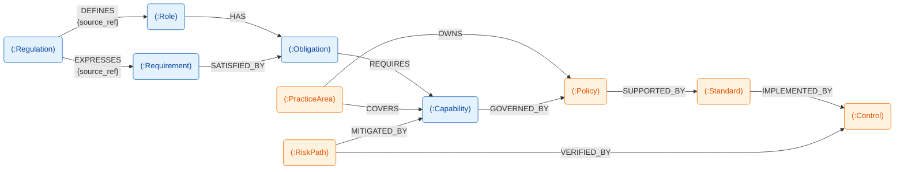
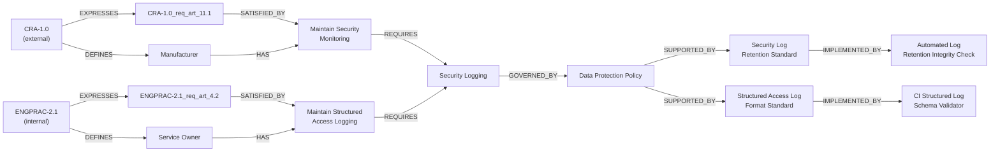

<!-- © 2026 Cartman ApS. All rights reserved. -->
# Policy System Domain Concepts

**Status:** Draft

---

## Table of Contents

1. [Document Purpose](#document-purpose)
2. [Domain Concept Diagram](#domain-concept-diagram)
3. [Provenance Placement Rule](#provenance-placement-rule)
4. [Edge Catalog](#edge-catalog)
5. [Domain Concepts](#domain-concepts)
   - [Regulation](#regulation)
   - [Role](#role)
   - [Requirement](#requirement)
   - [Obligation](#obligation)
   - [PracticeArea](#practicearea)
   - [RiskPath](#riskpath)
   - [Capability](#capability)
   - [Policy](#policy)
   - [Standard](#standard)
   - [Control](#control)
6. [Worked Examples](#worked-examples)

---

## Document Purpose

This document models the Policy System domain as a **property graph**; a semantic knowledge graph.

**A fact belongs on the node or the edge, whichever it's actually about.** Properties that describe one specific relationship instance (a provenance reference for example) live on the edge, not on the node — otherwise a reused/canonical node ends up with a single property value that can't be true for all of its relationships at once.

The model has two layers:
- A **compliance spine** (`Regulation → Role/Requirement → Obligation → Capability → Policy → Standard → Control`) that carries regulatory provenance and implementation traceability.
- A **classification layer** (`PracticeArea`, `RiskPath`) that organizes and analyzes the spine without changing its compliance semantics.

**Orthogonal to that layering is a second axis: where a node's data actually originates.**
- **Regulatory** (`Regulation`, `Role`, `Requirement`, `Obligation`, `Capability`) — every property on these nodes is either lifted directly from regulatory text or derived transitively from it (see [Provenance Placement Rule](#provenance-placement-rule)). Nothing here is authored by a consumer of the model.
- **Governance** (`Policy`, `Standard`, `Control`, `PracticeArea`, `RiskPath`) — authored by the organization consuming the compliance spine: policy managers, engineering teams, risk owners. None of these nodes carries a `source_ref`; their provenance is organizational (`owner_id`, `status`, `evidence_ref`), not regulatory.

The two axes don't coincide. `Policy`/`Standard`/`Control` are Governance nodes that stay on the compliance spine — audit traceability from `Regulation` to `Control` is unbroken even though the data on the last three hops is organizationally authored, not regulatory. `PracticeArea`/`RiskPath` are Governance nodes that sit outside the spine entirely.

| Node | Layer | Origin |
|------|-------|--------|
| Regulation | Spine | Regulatory |
| Role | Spine | Regulatory |
| Requirement | Spine | Regulatory |
| Obligation | Spine | Regulatory |
| Capability | Spine | Regulatory |
| Policy | Spine | Governance |
| Standard | Spine | Governance |
| Control | Spine | Governance |
| PracticeArea | Classification | Governance |
| RiskPath | Classification | Governance |

No node is both Classification and Regulatory — everything regulation-derived stays on the spine; only spine-adjacent, consumer-authored nodes are ever classification-only.

---

## Domain Concept Diagram

**Legend:**
- Rounded nodes are labeled `(:Label)`, matching Cypher node syntax.
- Edge labels are relationship types in `SCREAMING_SNAKE_CASE`, matching Cypher relationship syntax.
- `{property}` under an edge label denotes an edge property — a fact about that specific relationship instance, not about either endpoint node.
- Node fill color is the [Origin axis](#document-purpose), not the compliance-spine/classification-layer axis: blue = Regulatory, orange = Governance. `Policy`/`Standard`/`Control` are orange (Governance) despite remaining on the compliance spine — color here tracks who authored the data, not chain membership.

---

## Provenance Placement Rule

Every edge's property set — whether it carries `source_ref`, or anything
else — is decided by one rule, applied identically to every edge in the
[Edge Catalog](#edge-catalog) below. No edge's properties are a local
judgment call made inside that edge's endpoint node sections; those
sections describe what an edge means, the catalog is the single place
that says what it *carries* and why.

1. **Edge-owned** — the edge is the *only* place the fact is true, and
   the fact isn't a fixed structural feature of the source text (so it
   can't safely be folded into either endpoint's identity instead).
   `DEFINES` and `EXPRESSES` are the only edges that qualify: a Role's or
   Requirement's defining/expressing location is an extraction decision,
   not a structural constant, so it has to live somewhere mutable and
   edge-scoped — correcting it later must not mint a new node.
2. **Deliberately absent — recoverable transitively** — the fact is real
   but already captured exactly once, one or more hops away; repeating
   it here would duplicate the source of truth and risk drift between
   the copies. `SATISFIED_BY` and `REQUIRES` fall here: an Obligation's
   or Capability's regulatory provenance is always reachable by walking
   `SATISFIED_BY`→`EXPRESSES` back to the originating Regulation article,
   so neither edge repeats it.
3. **Not applicable — no regulatory fact to place** — the edge doesn't
   sit on the Regulation-provenance chain at all. Classification-layer
   edges (`COVERS`, `OWNS`, `MITIGATED_BY`, `VERIFIED_BY`) and
   consumer-governance edges below Capability (`GOVERNED_BY`,
   `SUPPORTED_BY`, `IMPLEMENTED_BY`) qualify: Policy/Standard/Control are
   authored by the consumer of the compliance spine, not derived from
   regulatory text, so there is no `source_ref` to omit in the first
   place. Their provenance is a different kind of fact — who owns it,
   what evidence backs it — carried on node properties (`owner_id`,
   `evidence_ref`) where it actually belongs, not forced into this rule.

---

## Edge Catalog

Single source of truth for every edge type in the model. Node sections
under [Domain Concepts](#domain-concepts) describe each edge's meaning
from that node's perspective; this table is the one place to see the
full cross-model shape and provenance rationale at once.

| Edge | Source → Target | Cardinality | Properties | Rule case ([above](#provenance-placement-rule)) |
|------|------------------|-------------|------------|------|
| `DEFINES` | Regulation → Role | 1 : 0..* | `source_ref` (required) | 1 — edge-owned |
| `EXPRESSES` | Regulation → Requirement | 1 : 0..* | `source_ref` (required) | 1 — edge-owned; also structurally fixed enough to double as Requirement's own identity, unlike Role's |
| `SUPERSEDED_BY` | Regulation → Regulation | 0..1 : 0..1 | — | n/a — version succession, not a provenance fact |
| `HAS` | Role → Obligation | 1 : 0..* | — | n/a — structural assignment, no location fact involved |
| `SATISFIED_BY` | Requirement → Obligation | 1..* : 0..* | — | 2 — recoverable via this Requirement's own `EXPRESSES` edge |
| `REQUIRES` | Obligation → Capability | 1..* : 0..* | — | 2 — recoverable transitively, one hop further than `SATISFIED_BY` |
| `COVERS` | PracticeArea → Capability | 1 : 0..* | — | 3 — classification layer |
| `OWNS` | PracticeArea → Policy | 1 : 0..* | — | 3 — classification layer |
| `MITIGATED_BY` | RiskPath → Capability | 1 : 0..* | — | 3 — classification layer |
| `VERIFIED_BY` | RiskPath → Control | 1 : 0..* | — | 3 — classification layer |
| `GOVERNED_BY` | Capability → Policy | 1 : 0..* | — | 3 — consumer-governance, not regulation-derived |
| `SUPPORTED_BY` | Policy → Standard | 1 : 1..* | — | 3 — consumer-governance |
| `IMPLEMENTED_BY` | Standard → Control | 1 : 0..* | — | 3 — consumer-governance |

---

## Domain Concepts

### Regulation

**Description:** A regulation source, identified by an official identifier, title, effective date, version, and status. Regulation is the root of the domain model: it is the authoritative source Role and Requirement are derived from, and the point every other concept's provenance ultimately traces back to. `source_type` distinguishes two kinds of source that both fit this shape:
- **`external`** — EU legislation (GDPR, CRA, NIS2), an international standard, or national law, ingested from an official regulatory source.
- **`internal`** — an organizationally-authored "Business Regulation," e.g. an Engineering Practices standard, governed through normal internal engineering governance rather than official-source ingestion.

Both source types flow through the same `DEFINES` / `EXPRESSES` / Role / Requirement chain unchanged, so an internal standard's Requirements converge onto the same canonical Obligation and Capability nodes as external regulations — e.g. an internal "Security Logging Practice" can land on the same `Capability` node that CRA and GDPR already converge on (see [Obligation](#obligation) and [Capability](#capability)).

**Lifecycle:** Ingested from official sources and retained permanently for historical analysis. Regulations are read-only once created — never modified in place. A new version doesn't overwrite the old one; it supersedes it via `SUPERSEDED_BY`, and updates are delta-only (the new version replaces the old, not a full re-ingestion), preserving a complete version history for traceability.

**Node label:** `Regulation`
**Identity:** `{SHORT}-{VERSION}` (e.g. `CRA-1.0`) — natural key. Regulation is a root concept with no parent, so no weak-entity concern applies here.

#### Properties

| Property | Type | Required | Notes |
|----------|------|----------|-------|
| `id` | string | Yes | Same value as Identity above |
| `title` | string | Yes | |
| `source_type` | enum: `external` \| `internal` | Yes | `external` = EU legislation, international standard, or national law. `internal` = organizationally-authored Business Regulation (e.g. Engineering Practices standard). |
| `jurisdiction` | string | No | Required in practice for `external` sources. Optional because `internal` sources may have no jurisdiction, or may use this field for org-unit scope instead — different business units can carry different values here. |
| `effective_date` | date (ISO 8601) | Yes | |
| `version` | string | Yes | |
| `status` | enum: `active` \| `superseded` \| `vacated` | Yes | |

#### Relationships

| Edge | Target | Cardinality | Edge Properties | Note |
|------|--------|-------------|------------------|------|
| `DEFINES` | Role | 1 : 0..* | `source_ref` (string, required) | The article/section where this Regulation defines this Role. Lives on the edge, not on Role, because the defining act is specific to this Regulation–Role pair. |
| `EXPRESSES` | Requirement | 1 : 0..* | `source_ref` (string, required) | The article/section where this Regulation expresses this Requirement. Lives on the edge, not on Requirement, for the same reason as `DEFINES` above — the expressing act is specific to this Regulation–Requirement pair. |
| `SUPERSEDED_BY` | Regulation | 0..1 : 0..1 | — | Self-relationship tracking regulatory version succession. |

---

### Role

**Description:** An actor type defined by a regulation that carries duties and responsibilities — e.g. "Manufacturer" (CRA), "Data Controller" (GDPR), "Operator of Essential Services" (NIS2). Role answers "who must do what" under a given regulation. Because Role's identity is tied to its defining Regulation (see Identity below), roles that are semantically similar across different regulations remain distinct nodes rather than converging onto one — that convergence happens one layer down, at Obligation, which is exactly why Obligation (not Role) is designed to be regulation-independent. Without the structured source reference carried on the `DEFINES` edge, a Role's definition would be an unverifiable assertion — the reference is what lets "Manufacturer" be checked against the regulation that actually defines it, rather than merely claimed.

**Lifecycle:** Extracted when a regulation is loaded, or sourced from official regulatory glossaries/definitions. Immutable reference data once created — a stable point that Obligations attach to via `HAS`.

**Node label:** `Role`
**Identity:** `role_{slug}_{hash}` (e.g. `role_manufacturer_a1b2c3`) — content-derived from `name` + defining Regulation, opaque hash suffix. The defining-Regulation relationship is expressed only via the inbound `DEFINES` edge, never re-encoded into the ID string.

#### Properties

| Property | Type | Required | Notes |
|----------|------|----------|-------|
| `name` | string | Yes | |
| `description` | string | No | |
| `confidence` | float, 0.0–1.0 | Yes | The extracting LLM's own certainty that this candidate is genuinely a duty-bearing actor category the regulation names or creates — not conditioned on how the Role was minted; always recorded, since it's a fact about the extraction event itself and is unrecoverable once dropped. |

#### Relationships

| Edge | Target | Cardinality | Edge Properties | Note |
|------|--------|-------------|------------------|------|
| `DEFINES` (inbound) | Regulation | 0..* : 1 | `source_ref` (string, required) | See [Regulation → DEFINES](#regulation). |
| `HAS` | Obligation | 1 : 0..* | — | A Role has zero or more canonical Obligations assigned to it. |

---

### Requirement

**Description:** A condition expressed by a regulation specifying what must, must not, or should be true — focused on what must be true, independent of who is responsible for making it true (that's Role's job). Requirement is the terminal node of the provenance chain: every other concept's auditability ultimately traces back to a Requirement's source reference being a real, verifiable regulatory location rather than an unvalidated extraction claim.

**Lifecycle:** Ingested from regulatory text via LLM-driven extraction when a regulation is loaded. Read-only once created — never modified directly, only deprecated when superseded by a new regulation version.

**Node label:** `Requirement`
**Identity:** `{REG}_req_art_{ARTICLE}.{PARAGRAPH}[LETTER]` (e.g. `CRA-1.0_req_art_13.8c`) — generated from the regulatory source reference (regulation + article + paragraph/sub-point). Paragraph-level, not article-level: a single article routinely bundles several independent "shall"/"shall not"/"should" duties in different numbered paragraphs, and a single paragraph is occasionally split further (the trailing letter) when it visibly bundles more than one independent duty of its own. Unlike Role and Obligation, this identity is deliberately non-opaque: a Requirement is expressed by exactly one paragraph/sub-point of one Regulation article, so encoding that location directly in the ID is safe — there's no reuse across regulations to protect against.

#### Properties

| Property | Type | Required | Notes |
|----------|------|----------|-------|
| `text` | string | Yes | |
| `type` | enum: `requirement` \| `prohibition` \| `recommendation` | Yes | |
| `status` | enum: `active` \| `deprecated` | No | |
| `confidence` | float, 0.0–1.0 | Yes | The extracting LLM's own certainty that this paragraph/sub-point genuinely states an operative requirement, prohibition, or recommendation (vs. a borderline case — ambiguous modal strength, an embedded conditional, disputed granularity). Always recorded, unconditionally. |

#### Relationships

| Edge | Target | Cardinality | Edge Properties | Note |
|------|--------|-------------|------------------|------|
| `EXPRESSES` (inbound) | Regulation | 0..* : 1 | `source_ref` (string, required) | See [Regulation → EXPRESSES](#regulation). `source_ref` lives on this edge, not on Requirement, following the same rule applied to Role's `DEFINES` edge. |
| `SATISFIED_BY` | Obligation | 1..* : 0..* | — | Bridges this regulation-specific condition to one or more canonical Obligations. Many-to-many: a single Requirement may need several Obligations to be fully satisfied, and a single Obligation commonly satisfies Requirements from several different regulations — that reuse is the entire point of Obligation being canonical (see [Obligation](#obligation)). |

---

### Obligation

**Description:** A canonical, reusable duty assigned to exactly one Role — e.g. "Conduct Cybersecurity Risk Assessment" or "Report Security Incidents." Obligation is the semantic anchor that enables cross-regulation normalization: GDPR's 72-hour breach notice requirement for Data Controllers and NIS2's 24-hour early warning requirement for Operators of Essential Services both instantiate the same "Report Security Incidents" Obligation, assigned to different Roles — this is exactly why Obligation's identity (see below) is kept regulation-independent. Obligation defines the generic duty only; accountability for actually fulfilling it attaches at Policy (not yet in this document), where the duty is assigned to a concrete organizational owner.

**Lifecycle:** Either pre-populated as part of a canonical taxonomy, or minted the first time a Requirement doesn't match any existing Obligation. Rarely modified once created — stable reference data reused across many Requirements and regulations.

**Node label:** `Obligation`
**Identity:** `obl_{slug}_{hash}` (e.g. `obl_risk_management_a8f3b1`) — content-derived from the obligation's duty statement, deliberately **regulation-independent** (no `{REG}` prefix, unlike Role and Requirement). This is what makes Obligation canonical: the same node is reused as the `SATISFIED_BY` target for Requirements originating from different regulations, rather than a fresh Obligation being minted per regulation.

#### Properties

| Property | Type | Required | Notes |
|----------|------|----------|-------|
| `text` | string | Yes | The canonical duty statement, e.g. "Conduct Cybersecurity Risk Assessment" |
| `confidence` | float, 0.0–1.0 | Yes | The extracting LLM's own certainty in this decision — whether minting a new Obligation from an unmatched Requirement, or matching a Requirement to an existing canonical Obligation. Always recorded, unconditionally; not limited to the minted case. |

Deliberately **excluded**: a `source_ref` property, on the node or on any of its edges — see [Provenance Placement Rule, case 2](#provenance-placement-rule). An Obligation with no live `SATISFIED_BY` edge is unprovenanced.

#### Relationships

| Edge | Target | Cardinality | Edge Properties | Note |
|------|--------|-------------|------------------|------|
| `HAS` (inbound) | Role | 0..* : 1 | — | See [Role → HAS](#role). Each Obligation is assigned to exactly one Role. |
| `SATISFIED_BY` (inbound) | Requirement | 0..* : 1..* | — | See [Requirement → SATISFIED_BY](#requirement). |
| `REQUIRES` (outbound) | Capability | 1..* : 0..* | — | See [Capability](#capability). |

---

### PracticeArea

**Description:** A stable engineering taxonomy used to group related capabilities and govern ownership of policies — e.g. "Secure Development Lifecycle" or "Reliability and Service Operations." PracticeArea is organizational classification, not compliance provenance: it improves assignment, scoping, and reporting without altering the `Regulation`-anchored traceability chain.

**Lifecycle:** Curated by engineering governance and updated infrequently as operating models change. Usually long-lived reference data with occasional renames, merges, or deprecations.

**Node label:** `PracticeArea`
**Identity:** `pa_{slug}_{hash}` (e.g. `pa_secure_sdlc_4a7c1d`) — content-derived from `name` alone, regulation-independent.

#### Properties

| Property | Type | Required | Notes |
|----------|------|----------|-------|
| `name` | string | Yes | |
| `description` | string | No | |
| `status` | enum: `active` \| `deprecated` | Yes | |
| `version` | string | No | |
| `owner_id` | string | No | Optional organizational owner for this taxonomy area. |

#### Relationships

| Edge | Target | Cardinality | Edge Properties | Note |
|------|--------|-------------|------------------|------|
| `COVERS` | Capability | 1 : 0..* | — | Classifies which reusable Capabilities belong to this practice area. |
| `OWNS` | Policy | 1 : 0..* | — | Assigns governance ownership of Policies by area. |

---

### RiskPath

**Description:** A cross-cutting risk lens used to reason about completeness and gaps — e.g. "Secure Build and Release" or "Incident and Recovery Readiness." RiskPath is analytical metadata, not a replacement for Requirement or Obligation semantics.

**Lifecycle:** Seeded from the organization's baseline risk model and refined as incidents, audits, and threat modeling evolve.

**Node label:** `RiskPath`
**Identity:** `rp_{slug}_{hash}` (e.g. `rp_secure_build_release_d93f8a`) — content-derived from `name` alone, canonical across regulations and business units.

#### Properties

| Property | Type | Required | Notes |
|----------|------|----------|-------|
| `name` | string | Yes | |
| `description` | string | No | |
| `status` | enum: `active` \| `deprecated` | Yes | |
| `risk_type` | enum: `security` \| `reliability` \| `privacy` \| `compliance` \| `safety` \| `supply_chain` | No | Optional categorization for reporting slices. |
| `version` | string | No | |

#### Relationships

| Edge | Target | Cardinality | Edge Properties | Note |
|------|--------|-------------|------------------|------|
| `MITIGATED_BY` | Capability | 1 : 0..* | — | Connects abstract risk exposure to reusable technical/organizational capacity. |
| `VERIFIED_BY` | Control | 1 : 0..* | — | Connects risk exposure to concrete verification evidence paths. |

---

### Capability

**Description:** A technical or organizational capacity that must exist to fulfill Obligations — e.g. "Data Encryption," "Access Control System," "Security Logging." Capability is the "how" to Obligation's "what": it lets an organization see commonalities across obligations that look different on paper, e.g. recognizing that both "Maintain Security Monitoring" (CRA) and "Ensure Logging of Access" (GDPR) require the same "Security Logging" capability. This is exactly the cross-regulation convergence the identity design below protects — hashing on `name` alone is what lets one Capability be required by many Obligations instead of fragmenting.

**Lifecycle:** Either pre-populated as part of a canonical capability taxonomy, or minted when an Obligation requires a capability type that doesn't yet exist. Stable reference data once created — governed by Policy (not yet in this document), potentially across many business contexts.

**Node label:** `Capability`
**Identity:** `cap_{slug}_{hash}` (e.g. `cap_data_encryption_a8f3b1`) — content-derived from `name` alone, deliberately excluding any specific requiring Obligation. `ps-domain-concepts.md` describes this ID as derived from "capability name and related obligation content," but that would work against its own stated goal: Capability is required by 0..* Obligations (many-to-many, same reuse shape as Obligation itself), so baking one Obligation's content into the hash would fragment equivalent capabilities pulled in under different Obligations instead of collapsing them onto the same node. Deriving from `name` alone is what actually delivers cross-regulation convergence.

#### Properties

| Property | Type | Required | Notes |
|----------|------|----------|-------|
| `name` | string | Yes | |
| `description` | string | No | |
| `type` | string | No | e.g. `technical`, `organizational` |
| `status` | enum: `active` \| `deprecated` | No | |
| `confidence` | float, 0.0–1.0 | Yes | The extracting LLM's own certainty in this decision — whether reusing an existing Capability for an Obligation, or minting a new one because none of the existing candidates fit. Always recorded, unconditionally. |

#### Relationships

| Edge | Target | Cardinality | Edge Properties | Note |
|------|--------|-------------|------------------|------|
| `REQUIRES` (inbound) | Obligation | 0..* : 1..* | — | See [Obligation → REQUIRES](#obligation). |
| `COVERS` (inbound) | PracticeArea | 0..* : 1..* | — | See [PracticeArea → COVERS](#practicearea). |
| `MITIGATED_BY` (inbound) | RiskPath | 0..* : 1..* | — | See [RiskPath → MITIGATED_BY](#riskpath). |
| `GOVERNED_BY` (outbound) | Policy | 1 : 0..* | — | See [Policy → GOVERNED_BY](#policy). |

---

### Policy

**Description:** An organizational commitment governing how one or more Capabilities must be achieved. Policy is where accountability actually attaches to the generic model: the "what capacity must exist" of a Capability becomes "who owns making it happen and how it's reviewed" (owner, review cycle, approval status) once it reaches Policy. A single Policy commonly governs several Capabilities at once — e.g. one "Data Protection Policy" governing encryption, logging, and access-control capabilities together — rather than each Capability answering to its own policy; different business contexts or risk tolerances are handled by minting a distinct Capability, not by a Capability answering to more than one Policy.

**Lifecycle:** Created by policy managers through governance workflows; revised when regulations or the business change; archived (not deleted) when superseded, since audit history requires the full approval trail to remain intact. Moves through a `draft` → `approved` → `deprecated` status workflow.

**Node label:** `Policy`
**Identity:** `pol_{slug}_{hash}` (e.g. `pol_data_protection_a8f3b1`) — content-derived from the Policy's own `title`, deliberately **not** derived from a governed Capability. `ps-domain-concepts.md` originally specified `pol_{capability_slug}_{capability_type}`, but that formula only encodes a single Capability — incoherent the moment a Policy governs more than one, which is exactly its own worked example above. Deriving from the Policy's own title instead avoids that, the same fix already applied to Obligation and Capability: identity comes from what the node itself is, never from what it happens to be connected to.

#### Properties

| Property | Type | Required | Notes |
|----------|------|----------|-------|
| `title` | string | Yes | |
| `description` | string | No | |
| `owner_id` | string | No | |
| `status` | enum: `draft` \| `approved` \| `deprecated` | Yes | |
| `version` | string | No | |

#### Relationships

| Edge | Target | Cardinality | Edge Properties | Note |
|------|--------|-------------|------------------|------|
| `OWNS` (inbound) | PracticeArea | 0..* : 1 | — | See [PracticeArea → OWNS](#practicearea). Starter baseline should enforce exactly one owning PracticeArea per active Policy. |
| `GOVERNED_BY` (inbound) | Capability | 1 : 0..* | — | See [Capability → GOVERNED_BY](#capability). Many Capabilities may point to the same Policy — the reason this Policy's identity above can't be derived from any one of them. |
| `SUPPORTED_BY` (outbound) | Standard | 1 : 1..* | — | See [Standard → SUPPORTED_BY](#standard). Every Policy requires at least one Standard defining how its commitment is actually implemented. |

---

### Standard

**Description:** Implementation guidance for how a Policy is actually to be achieved — procedures, technical specifications, and testing expectations that turn a Policy's organizational commitment into something concrete enough to build and verify. Standard is the "how" beneath Policy's "what," the same relationship Capability has to Obligation one layer up. Unlike Obligation, Capability, and Policy, a Standard is **not** a canonical, cross-context concept: it supports exactly one Policy, so a distinct Standard is minted per Policy rather than one Standard answering to several Policies — which is exactly why its identity (see below) can safely be derived from the Policy it supports.

**Lifecycle:** Developed by policy managers or technical teams once a Policy exists; revised when that Policy changes or the underlying technology evolves. Moves through a `draft` → `implemented` → `reviewed` → `deprecated` status workflow, mirroring Policy's own governance cadence.

**Node label:** `Standard`
**Identity:** `std_{POLICY}_{VERSION}` (e.g. `std_pol_data_protection_a8f3b1_v1`) — derived from the Policy it supports plus version. This is the same weak-entity pattern used for Requirement's identity (not the canonical-hash pattern used for Obligation/Capability/Policy): a Standard exists only in the context of exactly one Policy, so encoding that ownership in the ID is safe — there's no cross-Policy reuse to protect against.

#### Properties

| Property | Type | Required | Notes |
|----------|------|----------|-------|
| `title` | string | Yes | |
| `description` | string | No | |
| `implementation_status` | enum: `draft` \| `implemented` \| `reviewed` \| `deprecated` | Yes | |
| `version` | string | No | |

#### Relationships

| Edge | Target | Cardinality | Edge Properties | Note |
|------|--------|-------------|------------------|------|
| `SUPPORTED_BY` (inbound) | Policy | 1..* : 1 | — | See [Policy → SUPPORTED_BY](#policy). |
| `IMPLEMENTED_BY` (outbound) | Control | 1 : 0..* | — | See [Control](#control). |

---

### Control

**Description:** A concrete, testable verification mechanism confirming that a Standard's procedure is actually being followed — automated (e.g. a CI/CD policy-as-code check) or manual (e.g. a periodic audit review). Control is where the domain model becomes operationally checkable: it carries execution frequency, test dates, and pass/fail evidence, turning "we have a Standard for this" into "we can prove it, on a schedule." Like Standard, Control is not canonical — it verifies exactly one Standard, so a distinct Control is minted per Standard rather than reused across Standards.

**Lifecycle:** Implemented by engineering teams once a Standard exists; tested and revalidated on `execution_frequency`; updated when the Standard changes or the underlying technology evolves. Moves through a `planned` → `implemented` → `reviewed` → `deprecated` status workflow. Execution evidence is retained permanently for audit purposes; the evidence store itself is out of scope for this document — `evidence_ref` is an opaque pointer into it, not a modeled relationship.

**Node label:** `Control`
**Identity:** `ctrl_{STANDARD}_{TYPE}` (e.g. `ctrl_std_pol_data_protection_a8f3b1_v1_automated`) — derived from the Standard it verifies plus control type, the same weak-entity pattern as Standard's own identity: a Control exists only to verify exactly one Standard, so there's no cross-Standard reuse to protect against.

#### Properties

| Property | Type | Required | Notes |
|----------|------|----------|-------|
| `type` | enum: `automated` \| `manual` | Yes | |
| `title` | string | Yes | |
| `description` | string | No | |
| `implementation_status` | enum: `planned` \| `implemented` \| `reviewed` \| `deprecated` | Yes | |
| `execution_frequency` | string | No | |
| `last_test_date` | date (ISO 8601) | No | |
| `next_review_date` | date (ISO 8601) | No | |
| `evidence_ref` | string | No | Opaque pointer into an external evidence/audit store; that store is out of scope for this document. |

#### Relationships

| Edge | Target | Cardinality | Edge Properties | Note |
|------|--------|-------------|------------------|------|
| `IMPLEMENTED_BY` (inbound) | Standard | 0..* : 1 | — | See [Standard → IMPLEMENTED_BY](#standard). Each Control verifies exactly one Standard. |
| `VERIFIED_BY` (inbound) | RiskPath | 0..* : 1..* | — | See [RiskPath → VERIFIED_BY](#riskpath). Enables completeness checks that each active RiskPath has concrete verification evidence. |

---

## Worked Examples

*Illustrative instance data — not normative. IDs reuse the identity examples given throughout this document, so the two chains below double as a consistency check on the model itself. Both chains are constructed to converge on the same `Capability` and `Policy` nodes, to make the cross-regulation convergence claimed throughout this document concrete rather than asserted.*

### Example 1 — CRA (`source_type: external`)

| Node | Identity | Key Properties |
|------|----------|-----------------|
| `Regulation` | `CRA-1.0` | `source_type`: `external`, `title`: "Cyber Resilience Act", `jurisdiction`: "EU", `effective_date`: `2027-12-11`, `version`: `1.0`, `status`: `active` |
| `Role` | `role_manufacturer_a1b2c3` | `name`: "Manufacturer" — `DEFINES` edge from `CRA-1.0`, `source_ref`: "Art. 13" |
| `Requirement` | `CRA-1.0_req_art_11.1` | `text`: "Manufacturers shall ensure products with digital elements log relevant internal activity, including access to data", `type`: `requirement` — `EXPRESSES` edge from `CRA-1.0`, `source_ref`: "Art. 11(1)" |
| `Obligation` | `obl_security_monitoring_5e1f2a` | `text`: "Maintain Security Monitoring" — `HAS` from `Manufacturer`, `SATISFIED_BY` from `CRA-1.0_req_art_11.1` |
| `Capability` | `cap_security_logging_c4d9e2` | `name`: "Security Logging" — `REQUIRES` from the Obligation above |
| `Policy` | `pol_data_protection_a8f3b1` | `title`: "Data Protection Policy", `status`: `approved` — `GOVERNED_BY` from the Capability above |
| `Standard` | `std_pol_data_protection_a8f3b1_v1` | `title`: "Security Log Retention Standard", `implementation_status`: `implemented` — `SUPPORTED_BY` from the Policy above |
| `Control` | `ctrl_std_pol_data_protection_a8f3b1_v1_automated` | `type`: `automated`, `title`: "Automated Log Retention Integrity Check" — `IMPLEMENTED_BY` from the Standard above |

Path: CRA Art. 11 obliges Manufacturers to "Maintain Security Monitoring" → that requires the "Security Logging" Capability → governed by the "Data Protection Policy" → implemented via the "Security Log Retention Standard" → verified by an automated Control.

### Example 2 — Internal Engineering Practice (`source_type: internal`)

| Node | Identity | Key Properties |
|------|----------|-----------------|
| `Regulation` | `ENGPRAC-2.1` | `source_type`: `internal`, `title`: "Engineering Practices Standard", `jurisdiction`: *(not set — org-wide, no jurisdiction applies)*, `effective_date`: `2026-01-15`, `version`: `2.1`, `status`: `active` |
| `Role` | `role_service_owner_9f2e4d` | `name`: "Service Owner" — `DEFINES` edge from `ENGPRAC-2.1`, `source_ref`: "Sec. 4.1" |
| `Requirement` | `ENGPRAC-2.1_req_art_4.2` | `text`: "Service owners shall ensure all production services emit structured access logs, retained for 90 days", `type`: `requirement` — `EXPRESSES` edge from `ENGPRAC-2.1`, `source_ref`: "Sec. 4.2" |
| `Obligation` | `obl_structured_access_logging_7b3c9d` | `text`: "Maintain Structured Access Logging" — `HAS` from `Service Owner`, `SATISFIED_BY` from `ENGPRAC-2.1_req_art_4.2` |
| `Capability` | `cap_security_logging_c4d9e2` | **Same node as Example 1** — `REQUIRES` from the Obligation above |
| `Policy` | `pol_data_protection_a8f3b1` | **Same node as Example 1** — `GOVERNED_BY` from the Capability above |
| `Standard` | `std_pol_data_protection_a8f3b1_v2` | `title`: "Structured Access Log Format Standard", `implementation_status`: `implemented` — `SUPPORTED_BY` from the Policy above (a second Standard under the same Policy) |
| `Control` | `ctrl_std_pol_data_protection_a8f3b1_v2_automated` | `type`: `automated`, `title`: "CI Structured Log Schema Validator" — `IMPLEMENTED_BY` from the Standard above |

Path: internal Engineering Practices Sec. 4.2 obliges Service Owners to "Maintain Structured Access Logging" → that requires the *same* "Security Logging" Capability CRA already required → governed by the *same* "Data Protection Policy" → implemented via its own "Structured Access Log Format Standard" → verified by its own Control.

### Convergence

Both chains are independent above `Capability`: different Regulations, different Roles, different Requirements, different Obligation text. They merge at `cap_security_logging_c4d9e2` and stay merged through `Policy`, then diverge again at `Standard`/`Control` because CRA's retention concern and the internal format concern are implemented and verified differently. This is the shape the model is designed to produce — regulation-specific duties converging onto shared, reusable capacity and governance, without forcing a single implementation or verification path.

---

*End of Document*
