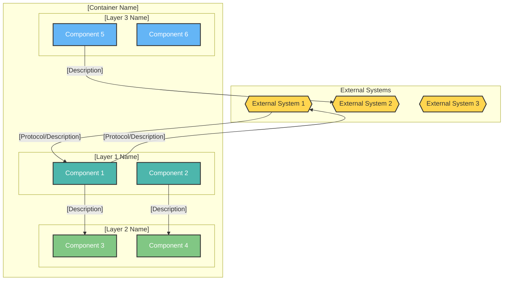
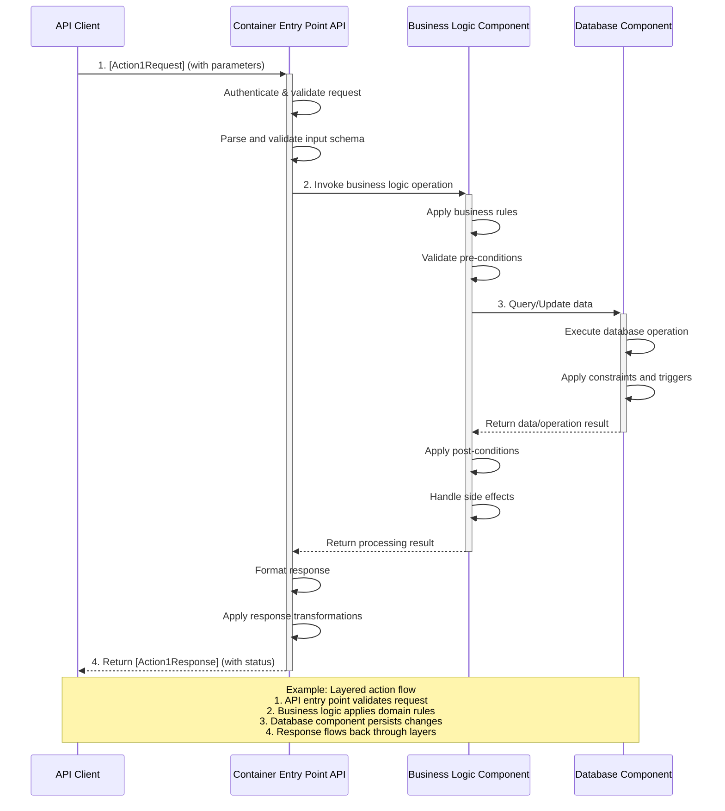

<!-- © 2026 Cartman ApS. All rights reserved. -->
# Header: [Project Name] - Container - [Container Name] Architecture

**Status:** Draft  
**Container:** [Container Name]

---

## Table of Contents:

1. [Overview](#overview)
2. [C4 Component Level](#c4-component-level)
   - [C4 Component Diagram](#c4-component-diagram)
   - [C4 Component Descriptions](#c4-component-descriptions)
   - [Domain Concepts to Component Mapping](#domain-concepts-to-component-mapping)
3. [Domain Concepts](#domain-concepts)
4. [Use Case Coverage Mapping](#use-case-coverage-mapping)
5. [NFR Implementation](#nfr-implementation)
6. [Implementation Guide](#implementation-guide)
   - [Solution & Project Structure](#solution--project-structure)
   - [Project Configuration Standards](#project-configuration-standards)
   - [Dependency Injection Setup](#dependency-injection-setup)
   - [Configuration Management](#configuration-management)
   - [Testing Infrastructure](#testing-infrastructure)

---

## Section: Overview

[Provide a high-level description of the container, its purpose within the system, and its role in the overall architecture.]

### Sub-section: Container Purpose
- [Purpose point 1]
- [Purpose point 2]
- [Purpose point 3]
- [Purpose point 4]
- [Purpose point 5]

### Sub-section: Container Architectural Pattern
[Describe the architectural pattern used in this container, e.g., layered architecture, microservices, etc.]
- **[Layer/Pattern 1]**: [Description]
- **[Layer/Pattern 2]**: [Description]
- **[Layer/Pattern 3]**: [Description]


**Domain Path:** `[system.container]`

---

## Section: C4 Container Diagram



**Diagram Legend:**
- **Hexagon shapes (Yellow):** External systems and actors
- **Rectangle shapes ([Color 1]):** [Layer 1] components
- **Rectangle shapes ([Color 2]):** [Layer 2] components
- **Rectangle shapes ([Color 3]):** [Layer 3] components
- **Arrows:** Component interactions and data flow


## Section: C4 Component overview
| Component name | Domain Path | Key responsibilities |
|----------------|-------------|----------------------|
| [Component Name] | [system.container.component] | [Precise description of the component's key responsibilities] |

### Domain Concepts to Component Mapping

This section maps domain concepts (from `[ProductName]-domain-concepts.md`) to the components within this container that implement them.

| Domain Concept | Component Name | Domain Path | Implementation Notes |
|----------------|----------------|-------------|---------------------|
| [Domain Concept 1] | [Component name 1] | [system.container.component] | [How the concept is implemented within this component] |
| [Domain Concept 2] | [Component name 2] | [system.container.component] | [How the concept is implemented within this component] |
| [Domain Concept 3] | [Component name 3] | [system.container.component] | [How the concept is implemented within this component] |

## Section: [Component name]

### Sub-section: Domain Concepts
This section documents the domain concepts that are implemented within the [Component name], including their constraints and attributes.

#### [Domain Concept 1]

##### Constraints

| Constraint | Description |
|------------|-------------|
| [Constraint Name 1] | [Constraint description] |
| [Constraint Name 2] | [Constraint description] |
| [Constraint Name 3] | [Constraint description] |

##### Attributes

| Attribute | Description | Type | Min | Max | Rules |
|-----------|-------------|------|-----|-----|-------|
| [attributeName1] | [Attribute description] | [Type] | [Min] | [Max] | [Validation rules and constraints] |
| [attributeName2] | [Attribute description] | [Type] | [Min] | [Max] | [Validation rules and constraints] |
| [attributeName3] | [Attribute description] | [Type] | [Min] | [Max] | [Validation rules and constraints] |

### Sub-section: Kind

> Populate Framework and Language from the **Tech Stack** artifact. Project/Namespace patterns follow the project's L2 coding standards.

| Kind | Framework | Language | Project Pattern | Namespace Pattern |
|------|-----------|----------|-----------------|-------------------|
| [kind] | [from Tech Stack] | [from Tech Stack] | `[per L2 conventions]` | `[per L2 conventions]` |

**Implementation Guidance:**
[Specific guidance for this component type, e.g., "Implement as stateless service", "Follow repository pattern for data access"]

### Sub-section: Implementation Registration

> Track which source files implement this component. This enables automated health checks
> to detect orphaned code when requirements change. Keep paths current as code evolves.

| Path | Purpose | Implements |
|------|---------|------------|
| `src/[layer]/[ComponentName].ts` | Main component implementation | [UC-XXX-001, UC-XXX-002] |
| `src/[layer]/[ComponentName].test.ts` | Unit tests | — |
| `src/[layer]/types/[ComponentName]Types.ts` | Type definitions | — |

**Registration rules:**
- List all source files that implement this component's responsibilities
- `Implements` column links to URS use case IDs that this file realizes
- Test files and type definitions use `—` for Implements (no direct UC link)
- When deleting files, remove their registration here
- Unregistered files are flagged for manual review during health checks

### Sub-section: Actions

| Action | Purpose | Authentication Required | Authorization Scope | Pre-conditions | Post-conditions | Side Effects | External Dependencies | Processing Time (SLA) | Idempotent | Error Handling Strategy |
|--------|---------|------------------------|--------------------|--------------|--------------------|--------------|----------------------|----------------------|-----------|------------------------|
| [Action1Name] | [Brief description of what this action does and why it exists] | [Yes/No] | [scope:read / scope:write] | [Entity must exist / User must be authenticated] | [Entity state updated / Resource created] | [Sends notification / Updates cache / Publishes event] | [External System 1 / Database / Message Queue] | [< 500ms / < 2s] | [Yes/No] | [Retry with exponential backoff / Return detailed error / Rollback transaction] |
| [Action2Name] | [Brief description of what this action does and why it exists] | [Yes/No] | [scope:read / scope:write] | [Entity must exist / User must be authenticated] | [Entity state updated / Resource created] | [Sends notification / Updates cache / Publishes event] | [External System 1 / Database / Message Queue] | [< 500ms / < 2s] | [Yes/No] | [Retry with exponential backoff / Return detailed error / Rollback transaction] |
| [Action3Name] | [Brief description of what this action does and why it exists] | [Yes/No] | [scope:read / scope:write] | [Entity must exist / User must be authenticated] | [Entity state updated / Resource created] | [Sends notification / Updates cache / Publishes event] | [External System 1 / Database / Message Queue] | [< 500ms / < 2s] | [Yes/No] | [Retry with exponential backoff / Return detailed error / Rollback transaction] |


### Subsection: Action Sequence Diagram




---

## Section: NFR Implementation

This section maps non-functional requirements (from URS, via SA realization decisions) to
component-level strategies within this container.

| NFR ID | SA Decision | Component | Strategy | Acceptance Verification |
|--------|------------|-----------|----------|------------------------|
| [NFR-PERF-001] | [e.g., Redis caching layer] | [e.g., CacheManager] | [e.g., Cache-aside pattern with 60s TTL for read endpoints] | [e.g., Load test P95 < 200ms at 1000 RPS] |

**Guidelines:**
- Only include NFRs that are relevant to this container
- Strategy describes the concrete component-level approach (patterns, configurations, thresholds)
- Acceptance Verification describes how to prove the strategy meets the NFR criterion
- Multiple components may collaborate to satisfy a single NFR

---

## Section: Implementation Guide

> Implementation details (packages, middleware, configuration, testing infrastructure) belong
> in the project's **L2 coding standards** document, not in the Container Architecture.
> The CA records WHAT components exist and HOW they interact; the L2 records HOW to build them.

---

**End of Template**

## Notes

**Template Purpose:** This template defines the structure for Container Architecture documents. All detailed generation instructions are in `${InstructionsDir}generate-artifacts/container-architecture-generation-instructions.md`.

**Document Focus:** Component-level architecture and interactions within a container (not implementation code details).
- Authentication and authorization clearly specified

### Example: Bad Component Documentation

```markdown
### Processor

**Domain Path:** `system.service.processor`

**Key Responsibilities:**
- Processes things
- Handles requests
- Does work

#### Actions

| Action | Purpose |
|--------|---------|
| Process | Processes stuff |
| Handle | Handles things |
```

**Why This is Bad:**
- Vague domain path (what system? what service?)
- Responsibilities too generic ("processes things" - what things?)
- Incomplete Actions table (missing authentication, authorization, SLAs, error handling)
- No specificity about what the component actually does
- Missing Kind subsection with implementation details
- Actions don't explain business value ("so that...")

---

**End of Notes**