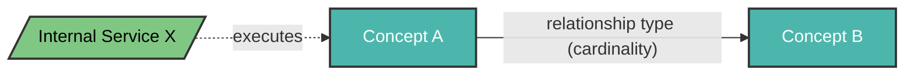

<!-- © 2026 Cartman ApS. All rights reserved. -->
# [Product Name] Ontology Concepts

**Status:** Draft

---

## Table of Contents

1. [Document Purpose](#document-purpose)
2. [Domain Concept Diagrams](#domain-concept-diagrams)
   - [[Context 1 Name]](#context-1-name)
   - [[Context 2 Name]](#context-2-name)
   - [Complete Domain Model](#complete-domain-model)
3. [Domain Concepts](#domain-concepts)
4. [Concept Details](#concept-details)
   - [[Concept 1]](#concept-1)
   - [[Concept 2]](#concept-2)
   - [[Concept 3]](#concept-3)
5. [Analysis Notes](#analysis-notes)
6. [Relationship Summary](#relationship-summary)
7. [Domain Concept to Architecture Traceability](#domain-concept-to-architecture-traceability)
8. [Domain Model Summary](#domain-model-summary)

---

## Document Purpose

This document defines the Domain Concepts (entities with identity, lifecycle, and relationships) and their conceptual relationships within the [Product Name] system. Domain Concepts represent the core business entities that have:

1. **Identity** - Unique identifiers that distinguish instances
2. **Lifecycle** - State transitions and existence boundaries
3. **Relationships** - Associations with other concepts

This ontology serves as the foundation for understanding the domain model and guides the design of [describe implementation contexts, e.g., "both the legacy implementation and the modern API"].

---

## Domain Concept Diagrams

### [Context 1 Name]

This context covers [describe the scope and purpose of this bounded context]. Mention which internal services implement this context and which external services are consumed.

```mermaid
graph LR
    Concept1[Concept 1]
    Concept2[Concept 2]
    Concept3[Concept 3]
    InternalService[/Internal Service/]
    ExternalService{{External Service}}
    
    Concept1 -->|"relationship type (cardinality)"| Concept2
    Concept2 -->|"relationship type (cardinality)"| Concept3
    Concept3 -.->|"stored in"| ExternalService
    InternalService -.->|"manages"| Concept1
    
    style Concept1 fill:#4DB6AC,stroke:#333,stroke-width:2px,color:#FFFFFF
    style Concept2 fill:#4DB6AC,stroke:#333,stroke-width:2px,color:#FFFFFF
    style Concept3 fill:#4DB6AC,stroke:#333,stroke-width:2px,color:#FFFFFF
    style InternalService fill:#81C784,stroke:#333,stroke-width:2px,color:#000000
    style ExternalService fill:#FFB74D,stroke:#333,stroke-width:2px,color:#000000
```



### [Context 2 Name]

This context handles [describe the scope and purpose of this bounded context]. Mention which internal services implement this context and which external services are consumed.


, along with the internal services that implement them and external services they consume.

```mermaid
graph TB
    Concept1[Concept 1]
    Concept2[Concept 2]
    Concept3[Concept 3]
    ConceptA[Concept A]
    ConceptB[Concept B]
    InternalService[/Internal Service/]
    InternalServiceX[/Internal Service X/]
    ExternalService{{External Service}}
    
    %% [Context 1 Name]
    Concept1 -->|"relationship type (cardinality)"| Concept2
    Concept2 -->|"relationship type (cardinality)"| Concept3
    
    %% [Optional: Legacy Pattern if applicable]
    Concept1 -.->|"relationship type (cardinality)<br/>[Legacy]"| ConceptA
    
    %% [Context 2 Name]
    ConceptA -->|"relationship type (cardinality)"| ConceptB
    
    %% Service Interactions (not domain relationships)
    InternalService -.->|"manages"| Concept1
    InternalServiceX -.->|"executes"| ConceptA
    Concept3 -.->|"stored in"| ExternalService
    
    style Concept1 fill:#4DBdomain concept relationships (Association/Aggregation/Composition)
- Dotted lines (-.→) represent service interactions, legacy patterns, or external system integrations (not domain relationships)
- Cardinality notation: (source:target) indicates the multiplicity from source to target concept
- Rectangle shapes `[Name]` represent Domain Concepts (entities with identity and lifecycle)
- Parallelogram shapes `/Name/` represent Internal Services (services within the system boundary)
- Hexagon shapes `{{Name}}` represent External Services/Systems (outside the domain boundary)
- Teal fill `#4DB6AC` indicates Domain Concepts
- Light green fill `#81C784` indicates Internal Services/Components
- Orange fill `#FFB74D` indicates External Services/System3,stroke-width:2px,color:#FFFFFF
    style InternalService fill:#81C784,stroke:#333,stroke-width:2px,color:#000000
    style InternalServiceX fill:#81C784,stroke:#333,stroke-width:2px,color:#000000
    style ExternalService fill:#FFB74D,stroke:#333,stroke-width:2px,color:#000000
    style Concept3 fill:#4DB6AC,stroke:#333,stroke-width:2px,color:#FFFFFF
    style ConceptA fill:#4DB6AC,stroke:#333,stroke-width:2px,color:#FFFFFF
    style ConceptB fill:#4DB6AC,stroke:#333,stroke-width:2px,color:#FFFFFF
```

**Diagram Legend:**
- Solid lines (→) represent unidirectional relationships
- Dotted lines (-.→) represent legacy or optional relationships
- Cardinality notation: (source:target) indicates the multiplicity from source to target concept
- Rectangle shapes represent Domain Concepts
- Teal fill indicates process/concept nodes

---

## Domain Concepts

This section identifies the core Domain Concepts (entities with identity, lifecycle, and relationships) in the [Product Name] system.

## Concept Details

### [Concept 1]

| Description | Global / Local | Justification | Bounded Context | Comment |
|-------------|----------------|---------------|-----------------|---------|
| [Provide a comprehensive description of the concept, including: (1) What it represents, (2) Its purpose/role in the system, (3) Key properties or characteristics, (4) Any unique identifiers.] | [Global/Local] | [Explain whether the concept's lifecycle is managed internally (Local) or externally (Global). Describe who/what manages the lifecycle and when the concept exists.] | [Specify which bounded context this concept belongs to, e.g., "Job Management", "[Entity] Storage", "Tenant Administration"] | [Add contextual notes about implementation patterns, architectural decisions, or important clarifications about the concept's nature. Reference related documentation as needed.] |

**Good Example:**
| Description | Global / Local | Justification | Bounded Context | Comment |
|-------------|----------------|---------------|-----------------|---------||
| [Operation] Job | Local | A work unit representing the transformation of one or more [entities] from a source format to a target format. Created by API clients via submission endpoints, processed asynchronously by worker services. Properties: JobId (GUID), Status (enum), SubmittedTimestamp, CompletedTimestamp, Source/Target formats. | Job Management | Lifecycle managed within the system. Created on submission, transitions through states (Pending → Processing → Completed/Failed), deleted per retention policy. Related to [Entity] concept (1 Job : N [Entities]). See ${SystemName}-iud.md for workflow details. |

**Bad Example (Do NOT follow):**
| Description | Global / Local | Justification | Bounded Context | Comment |
|-------------|----------------|---------------|-----------------|---------|  
| Job | Local | A job in the system. | Processing | Handles jobs. | <!-- ❌ Too vague, no clear identity/properties, missing purpose, no lifecycle explanation, no relationships, missing bounded context clarity, lacks justification -->

**[Optional: Architectural Note:]**
[If the concept has different relationship patterns in legacy vs. modern implementations, explain both patterns and their evolution.]

---

### [Concept 2]

| Description | Global / Local | Justification | Bounded Context | Comment |
|-------------|----------------|---------------|-----------------|---------|
| [Comprehensive description] | [Global/Local] | [Lifecycle management justification] | [Bounded context name] | [Contextual notes] |

#### Relationships

**UML Relationship Overview:**

[Either include a relationship table as shown above, OR if the concept has no outgoing relationships:]

[Concept Name] has no outgoing relationships. It is [invoked by/aggregated by/composed by] [Other Concepts] as a [passive capability/aggregated entity/etc.] (see [Other Concept] concept for the relationship definition).

---

## Analysis Notes

### Terms Identified as Domain Concepts ([N] total)

1. **[Concept Name]** - [Brief justification: Has identity (identifier), lifecycle (states), and relationships]
2. **[Concept Name]** - [Brief justification]
3. **[Concept Name]** - [Brief justification]

### Terms Identified as NON-Concepts

The following terms are **not** Domain Concepts because they lack identity, independent lifecycle, or represent values/attributes rather than entities:

- **[Term]** - [Reason: e.g., External actor/system, not a domain entity]
- **[Term]** - [Reason: e.g., Value object/enumeration, not an entity with lifecycle]
- **[Term]** - [Reason: e.g., Implementation pattern, not a domain entity]
- **[Term]** - [Reason: e.g., Human stakeholder, not a system entity]

---

## Relationship Summary

### Overview of All Conceptual Relationships

This section provides a consolidated view of all relationships defined in the domain model.

**Total Relationships: [N]**

| Source Concept | Relationship Type | Target Concept | Cardinality (Source:Target) | Key Purpose |
|----------------|-------------------|----------------|----------------------------|-------------|
| [Concept A] | [Association/Aggregation/Composition] | [Concept B] | [e.g., 1 : 1..*] | [Brief description of relationship purpose] |

### Relationship Patterns Observed

The following architectural patterns emerge from the domain model:

#### 1. [Pattern Name] ([Relationship Types])
**Structure:** [Concept A] → [Concept B] → [Concept C]

**Characteristics:**
- **[Concept A] [relationship verb] [Concept B]** ([cardinality]): [Relationship type] because [justification]
- **[Concept B] [relationship verb] [Concept C]** ([cardinality]): [Relationship type] because [justification]

**Design Rationale:** 
- [Rationale point 1: Why this pattern exists]
- [Rationale point 2: What design goals it achieves]
- [Rationale point 3: How it enables specific capabilities]

**Implementation Pattern:** [e.g., Strategy pattern, Plugin pattern, Aggregate pattern]

---

#### 2. [Pattern Name] ([Relationship Types])
**Structure:** [Concept pattern description]

**Characteristics:**
- [Key characteristic 1 with justification]
- [Key characteristic 2 with justification]

**Design Rationale:**
- [Rationale for this pattern]
- [Benefits this pattern provides]

**Implementation Pattern:** [Implementation approach]

---

#### 3. [Pattern Name]
**Observed In:** [Concept A] → [Concept B]

**Characteristics:**
- **[Role 1] ([Concept Name])**: [Description of behavior and responsibilities]
- **[Role 2] ([Concept Name])**: [Description of behavior and responsibilities]

**Design Rationale:**
- [Reason for this pattern]
- [Benefits of this approach]
- [What this enables]

**Implementation Pattern:** [How this is typically implemented]

---

**Note**: [Add notes about directionality of relationships, platform integration patterns, or external system boundaries. Clarify which concepts are internal domain concepts vs. external platform/infrastructure concerns.]

---

## Domain Concept to Architecture Traceability

### [Concept 3]

| Description | Global / Local | Justification | Bounded Context | Comment |
|-------------|----------------|---------------|-----------------|---------|
| [Comprehensive description] | [Global/Local] | [Lifecycle management justification] | [Bounded context name] | [Contextual notes] |

#### Relationships

**UML Relationship Overview:**

| Concept A | Relationship Type | Cardinality A | Concept B | Cardinality B | Explanation | Consequence if Missing |
|-----------|------------------|---------------|-----------|---------------|-------------|------------------------|
| [Source Concept] | [Association/Aggregation/Composition] | [cardinality] | [Target Concept] | [cardinality] | [Detailed explanation] | [Business impact if missing] |

**[Optional: External System Interactions (not domain relationships):]**
- [Concept] may [action] with [External System] for [purpose]
- [Additional external interactions]

---

## Domain Concept to Architecture Traceability

This section maps domain concepts to their architectural realizations in the Solution Architecture (see `[ProductName]-solution-architecture.md`).

### Concept-to-Component Mapping

| Domain Concept | Component(s) | Domain Path | Implementation Notes |
|----------------|--------------|-------------|---------------------|
| **[Concept 1]** | [Component Name(s)] | [system.container.component] | [Brief description of how the concept is realized architecturally, including key implementation details] |
| **[Concept 2]** | [Component Name(s)] | [system.container.component] | [Implementation notes] |
| **[Concept 3]** | [Component Name(s)] | [system.container.component] | [Implementation notes] |

### Architectural Pattern Alignment

**[Legacy/Current Architecture Name]:**
- [Pattern description 1]
- [Pattern description 2]
- [Pattern description 3]

**[Modern/Alternative Architecture Name]:**
- [Pattern description 1]
- [Pattern description 2]
- [Pattern description 3]
- [Benefits of architectural evolution]

**Cross-Reference:** See Solution Architecture [Section Name] (Section [Number]) for detailed component descriptions and relationships.

---

## Domain Model Summary

This section provides a quick reference summary of the complete [Product Name] domain model.

### Core Concepts ([N] total)

| Concept | Type | Identity | Key Responsibility |
|---------|------|----------|-------------------|
| **[Concept 1]** | [Global/Local] | [Identifier] | [Brief description of primary responsibility] |
| **[Concept 2]** | [Global/Local] | [Identifier] | [Brief description of primary responsibility] |
| **[Concept 3]** | [Global/Local] | [Identifier] | [Brief description of primary responsibility] |

### Relationships ([N] total)

| From | Relationship | To | Cardinality | Pattern |
|------|--------------|-----|-------------|---------|
| [Concept A] | [Type] | [Concept B] | [e.g., 1 : 1..*] | [Pattern name/description] |
| [Concept C] | [Type] | [Concept D] | [cardinality] | [Pattern name/description] |

### Key Characteristics

- **[Characteristic 1]**: [e.g., "All relationships are unidirectional"]
- **[N] Local concepts** ([List]): [Description of what makes them local]
- **[N] Global concepts** ([List]): [Description of what makes them global]
- **[Pattern Name]**: [Brief description of key architectural pattern]
- **[Another Pattern]**: [Brief description]

### External Platform Integration

The [Product Name] service integrates with [Platform/System Name] for:
- **[Integration Area 1]**: [Description]
- **[Integration Area 2]**: [Description]
- **[Integration Area 3]**: [Description]

**Note:** [Clarify which external concerns are not domain concepts but are consumed by the service]

---

**End of Document**

