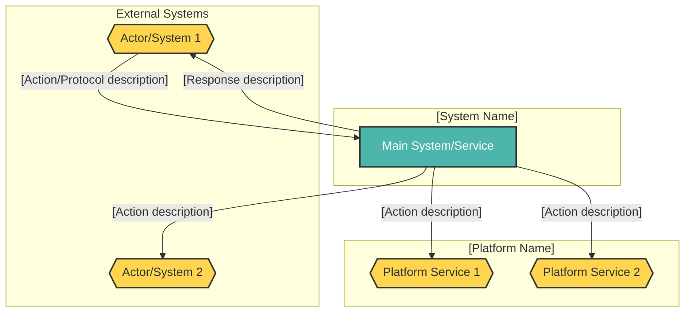
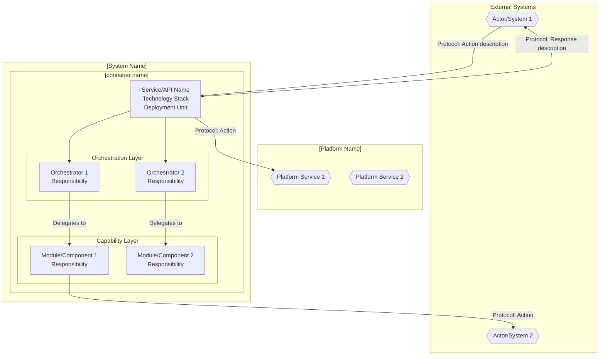

<!-- © 2026 Cartman ApS. All rights reserved. -->
# [Product Name] Solution Architecture

**Status:** Draft  
**Project Name:** [Project Name]  
**Document Version:** [Version Number]  
**Last Updated:** [Date]

---

## Table of Contents

1. [Overview](#overview)
2. [C4 System Context Level](#c4-system-context-level)
   - [Diagram Legend & Conventions](#diagram-legend--conventions)
   - [C4 System Context Diagram](#c4-system-context-diagram)
   - [System Context Breakdown](#system-context-breakdown)
3. [C4 Container Level](#c4-container-level)
   - [C4 Container Diagram](#c4-container-diagram)
   - [Container Breakdown](#container-breakdown)
   - [User Role Mapping](#user-role-mapping)
4. [C4 Component Level](#c4-component-level)
   - [Component Breakdown](#component-breakdown)
5. [Use Case Coverage Mapping](#use-case-coverage-mapping)
   - [[User Role 1] Use Cases](#user-role-1-use-cases)
   - [[User Role 2] Use Cases](#user-role-2-use-cases)

---

## Overview

[Provide a comprehensive overview of the system in 2-4 paragraphs covering:]

**System Purpose & Scope**
[Describe what the system does, its primary purpose, and the business domain it serves. Include the types of users or systems it serves (B2B, B2C, internal, etc.).]

**Key Capabilities**
[List 4-8 major capabilities using bullet points:]
- **[Capability 1]:** [Brief description]
- **[Capability 2]:** [Brief description]
- **[Capability 3]:** [Brief description]

**Deployment Architecture**
[Describe how the system is deployed, including:]
- **[Current/Modern Implementation]:** [Technology stack, platform, deployment model]
- **[Architecture Pattern]:** [e.g., Multi-tenancy, Microservices, Monolith] - [Brief explanation of how it works]

**Regulatory Compliance (if applicable)**
[List applicable regulations and standards:]
- [Regulation Name] ([Identifier]) - [Focus area]
- [Standard Name] - [Focus area]

---

## C4 System Context Level

### Diagram Legend & Conventions

**Shape Conventions:**
- **Hexagon shapes:** [What hexagons represent - e.g., External systems and actors]
- **Rectangle shapes:** [What rectangles represent - e.g., Internal systems, containers, and components]

**Color Coding:**
- **[Color 1] fill:** [What this color represents - e.g., External/platform systems]
- **[Color 2] fill:** [What this color represents - e.g., Core service/API]
- **[Color 3] fill:** [What this color represents - e.g., Orchestration layer]
- **[Color 4] fill:** [What this color represents - e.g., Capability layer]

**Architectural Significance:**
[Explain the architectural meaning of different visual elements - 2-4 bullet points:]
- [Significance point 1 - e.g., "External system interactions represent integration boundaries"]
- [Significance point 2 - e.g., "Layer separation enables modularity"]
- [Significance point 3 - e.g., "Platform systems provide infrastructure services"]

### C4 System Context Diagram

*(See Diagram Legend & Conventions above for shape and color interpretations)*

### System Context Breakdown

| Actor | Interaction | System | Actor/System Type | Objective |
| :--- | :--- | :--- | :--- | :--- |
| [Actor/System Name] | [Description of interaction: what is sent/received] | [System Name] | [Type: e.g., External software component, External service, Platform service] | [Business objective: why this interaction exists and what value it provides] |
| [Actor/System Name] | [Interaction description] | [System Name] | [Type] | [Objective] |

**Guidelines for System Context Breakdown:**
- **Actor:** Name of the external system, actor, or platform service
- **Interaction:** Describe bidirectional interactions (sends/receives) in a single row
- **System:** The system being documented (usually the same for all rows at context level)
- **Actor/System Type:** Classify the type (External application, External storage, Platform service, PKI infrastructure, etc.)
- **Objective:** Explain the business purpose or capability enabled by this interaction

**Objective Examples:**

✅ **GOOD:** "Enable citizens to digitally sign documents using qualified certificates, meeting eIDAS compliance requirements"

❌ **BAD:** "Send HTTPS requests to signing service"

✅ **GOOD:** "Store document metadata and enable multi-tenant data isolation for secure document tracking"

❌ **BAD:** "Save data to database"

---

## C4 Container Level

### C4 Container Diagram

*(See Diagram Legend & Conventions above for shape and color interpretations)*

### Container Breakdown

**Important:** Diagrams must accurately reflect the containers listed in this table. The table is the source of truth; diagrams are visual representations of this data.

| Container/Service | Description | Key Responsibilities | Domain path |
|-----|---|---|---|
| [Container/Component Name] | [1-2 sentence description of what this container is, including technology stack and deployment model] | • [Responsibility 1] • [Responsibility 2] • [Responsibility 3] • [Responsibility 4] • [Responsibility 5] | [domain.path.notation] |

**Guidelines for Container Breakdown:**
- **Container/Service:** Name of the container or major component
- **Description:** Brief description including technology (from Tech Stack artifact) and deployment unit (e.g., "REST API service", "SPA frontend", "background worker")
- **Key Responsibilities:** 4-8 bullet points describing what this container does. Use action verbs (Expose, Route, Authenticate, Manage, Orchestrate, Delegate, Apply, Handle, etc.)
- **Domain path:** Namespace-style path using lowercase dot notation (e.g., "system.container.subcomponent")

**Responsibility Writing Guidelines:**
- Start with action verbs (Expose, Manage, Route, Handle, Provide, Coordinate, Delegate, Apply, Validate, etc.)
- Be specific about what is managed/handled (not just "handle requests")
- Include technical details when relevant (protocols, standards, technologies)
- Explain interactions with other layers or external systems
- Focus on "what" not "how"

**Examples:**

✅ **GOOD:** "Expose REST API endpoints for document conversion requests (POST /convert, GET /status)"

❌ **BAD:** "Handle requests"

✅ **GOOD:** "Orchestrate document conversion workflow by validating input, enqueueing jobs to RabbitMQ, and tracking conversion status"

❌ **BAD:** "Manage documents"

✅ **GOOD:** "Authenticate API requests using OAuth 2.0 bearer tokens validated against the identity platform"

❌ **BAD:** "Do authentication"

### User Role Mapping

| User Role | Accessible Containers/Services |
|-----------|-------------------------------|
| [User Role 1] | [Container/Service Name] ([accessible endpoints or features]) |
| [User Role 2] | [Container/Service Name] ([accessible endpoints or features]) |

**Purpose:** Maps user roles (from IUD) to the containers/services they can access, clarifying access control boundaries.

---

## C4 Component Level

### Component Breakdown

| Component | Description | Key Responsibilities | Domain path |
| :--- | :--- | :--- | :--- |
| [Component Name] | [1-2 sentence description of the component's purpose and how it fits into the architecture] | [Brief description of primary responsibility in business terms] | [system.container.component] |

**Guidelines for Component Breakdown:**
- **Component:** Name of the component (PascalCase recommended)
- **Description:** Explain what the component is, its architectural role, and how it collaborates with other components
- **Key Responsibilities:** Single sentence or 2-3 bullet points describing primary responsibilities. More concise than Container Breakdown.
- **Domain path:** Full namespace path using lowercase dot notation (e.g., "system.container.component")

**Component vs Container Responsibility Examples:**

**Container Level (4-8 detailed bullets):**
- Expose REST API endpoints for document conversion (POST /convert, GET /jobs/{id})
- Authenticate and authorize incoming requests using OAuth 2.0
- Orchestrate document processing workflow across multiple services
- Manage job state transitions and persistence to PostgreSQL

**Component Level (1 sentence or 2-3 concise bullets):**
- Routes HTTP requests to appropriate handlers based on endpoint and HTTP method

OR

- Validates document format and size constraints
- Transforms request DTOs to domain models

**Domain Path Convention:
- **Pattern:** `system.container.component`
- **system:** The system/product name (e.g., "[systemname]")
- **container:** The deployable unit (e.g., "api", "worker", "database")
- **component:** The internal component (e.g., "conversionhandler", "queuemanager")
- Always use lowercase, no spaces or special characters

**Domain Path Examples:**

✅ **GOOD:** "[systemname].api.conversionhandler"

✅ **GOOD:** "[systemname].worker.pdfconverter"

❌ **BAD:** "[SystemName].API.ConversionHandler" (uses PascalCase)

❌ **BAD:** "[system-name].api.conversion handler" (uses hyphens and spaces)

❌ **BAD:** "api.handler" (missing system name)

**Note on Domain Concepts:**  
[If applicable, add notes explaining the relationship between domain concepts (from Ontology Concepts document) and architectural components. Clarify when domain concepts are NOT separate components but rather internal constructs within other components.]

---

## Use Case Coverage Mapping

### [User Role 1] Use Cases

| Use Case | API Entry Point | Implementing Container/Component | URS Requirement |
| :--- | :--- | :--- | :--- |
| [Use case description] | [Entry point name/path] | [Container/Component Name] + [Additional Components] | UC-[ROLE]-### |

**Guidelines for Use Case Coverage Mapping:**
- **Use Case:** Brief description of the use case (can be shortened from full URS description)
- **API Entry Point:** The service/API endpoint or interface that serves as the entry point
- **Implementing Container/Component:** List the primary component(s) that implement this use case. Use "+" to show collaborating components
- **URS Requirement:** Reference the Use Case ID from the User Requirements Specification

**Implementing Container/Component Examples:**

✅ **GOOD (Single):** "OrderProcessor API"

✅ **GOOD (Multiple):** "OrderProcessor API + OrderWorker + Inventory API Client"

❌ **BAD:** "Multiple services" (too vague)

❌ **BAD:** "API, Worker, Database, Queue, etc." (listing implementation details rather than architectural components)

**Purpose:** Provides traceability from user requirements (URS) to architectural implementation, ensuring all use cases are covered by the architecture.

### [User Role 2] Use Cases

| Use Case | API Entry Point | Implementing Container/Component | URS Requirement |
| :--- | :--- | :--- | :--- |
| [Use case description] | [Entry point name/path] | [Container/Component Name] | UC-[ROLE]-### |

---

## NFR Realization

This section maps non-functional requirements (from URS) to architectural decisions that satisfy them.

| NFR ID | Requirement Summary | Architectural Decision | Containers Affected | Rationale |
|--------|--------------------|-----------------------|---------------------|-----------|
| [NFR-PERF-001] | [e.g., P95 latency < 200ms] | [e.g., Redis caching layer for read-heavy endpoints] | [e.g., API, Cache] | [Why this decision satisfies the NFR] |

**Guidelines:**
- Every NFR from the URS should appear here — if an NFR has no architectural decision, document why (e.g., "deferred to component-level implementation")
- Multiple NFRs may share an architectural decision
- Decisions here drive Container Architecture strategies (CA documents the component-level details)

---

## Architectural Considerations

### Risks & Concerns

| Risk Category | Description | Mitigation Strategy |
|---------------|-------------|---------------------|
| [Scalability/Security/Integration/etc.] | [Description of risk or concern] | [How it's addressed or should be addressed] |

**Common Risk Categories:**
- **Single Points of Failure:** Components or systems whose failure would cause system-wide issues
- **Scalability Bottlenecks:** Areas that may not scale under increased load
- **Security Considerations:** Authentication, authorization, data protection, and compliance concerns
- **Integration Complexity:** Challenges with external system dependencies and data synchronization
- **Technical Debt:** Known limitations, legacy patterns, or areas requiring future refactoring

---

**End of Document**

---

